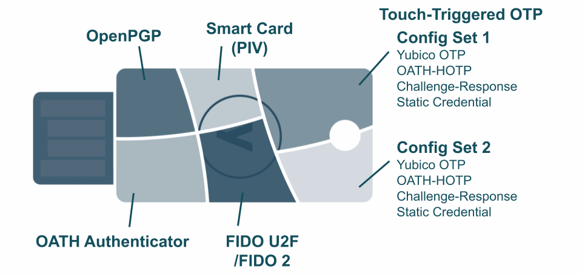
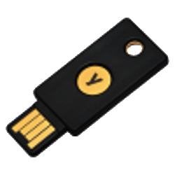
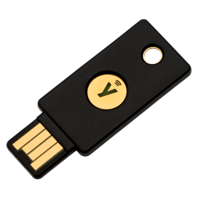
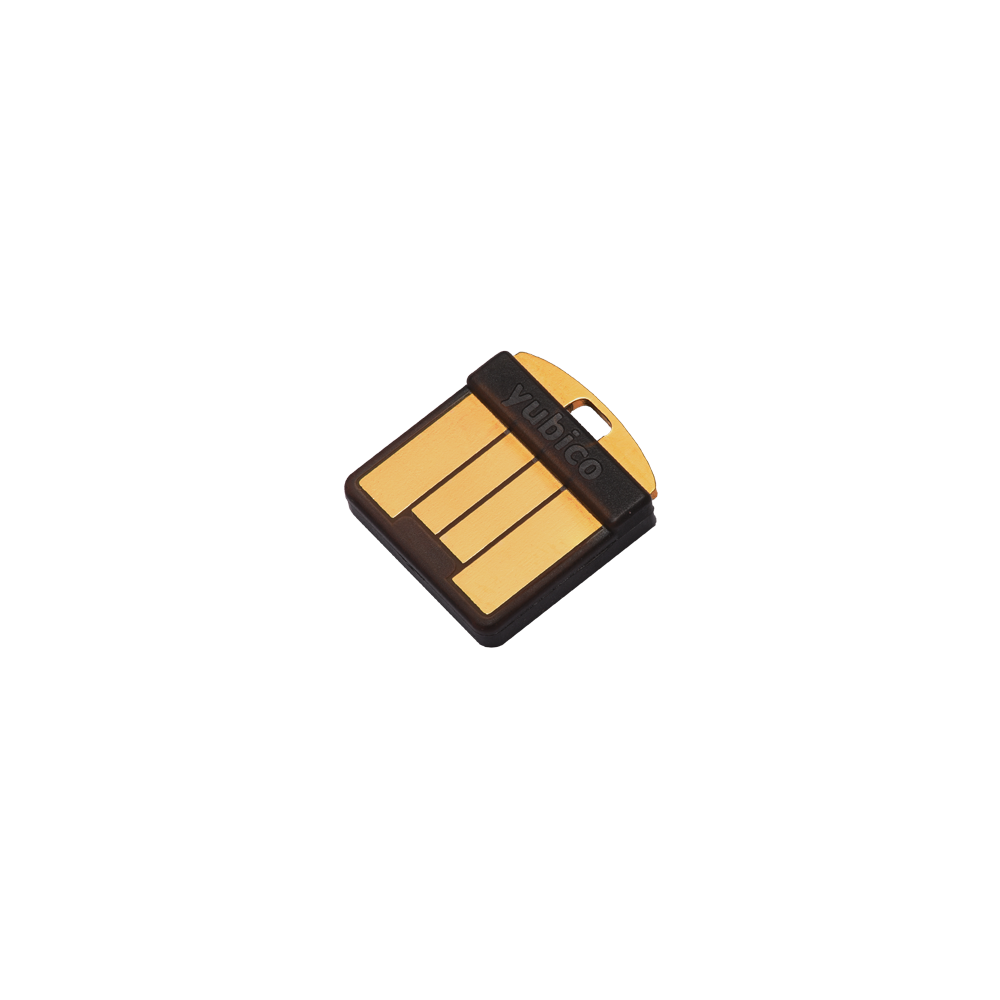
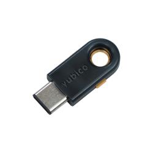
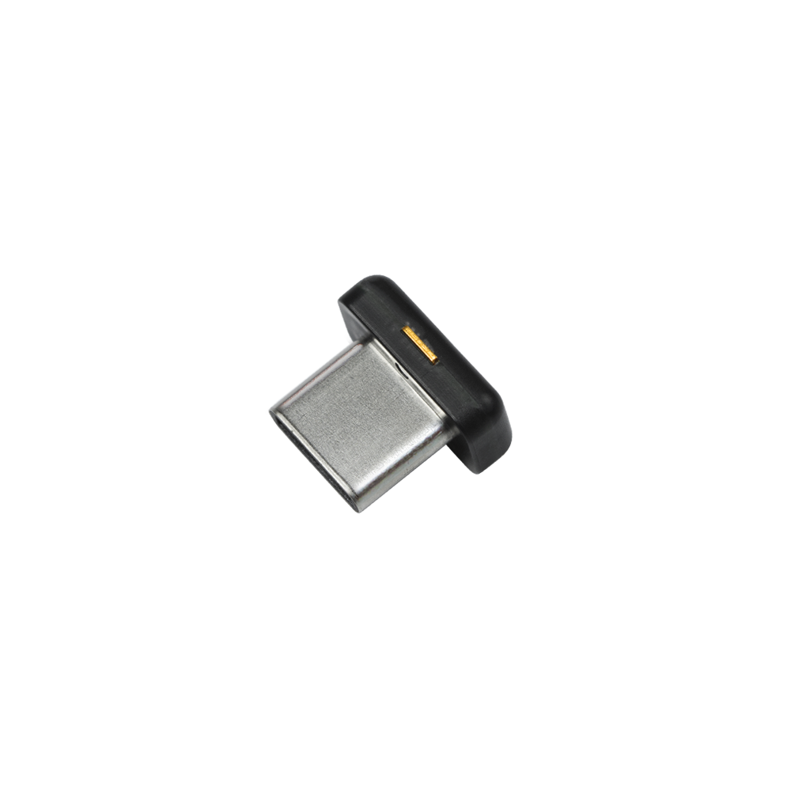
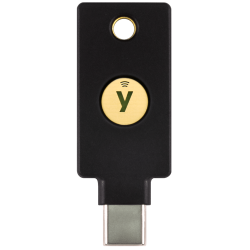
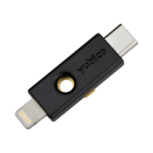

= The YubiKey

== What is a YubiKey?
A YubiKey is a multi-protocol, multi-factor hardware authenticator, providing strong authentication to a wide range of services and situations. While YubiKeys come in a number of different form factors, each is built around the same core chipset and firmware, ensuring a uniform experience regardless of the model used.

== YubiKey Form Factors
|===
|YubiKey 5 USB-A |YubiKey 5 NFC |YubiKey 5 Nano |YubiKey 5C|YubiKey 5C Nano|YubiKey 5C NFC|YubiKey 5Ci
a|
 a|
 a|
 a|
 a|
 a|
 a|
 a|
USB-A a|
USB-A / NFC a|
USB-A a|
USB-C a|
USB-C a|
USB-C / NFC a|
Lightning / USB-C
|- a|YubiKey Lite NFC |YubiKey Lite Nano |- a|YubiKey Lite C Nano| YubiKey Lite C NFC| YubiKey Lite Ci
a|
- a|
image::yklnfcusba.png[YubiKey Lite NFC] a|
image::yklnanousba.png[YubiKey Lite Nano] a|
- a|
image::yklnanousbc.png[YubiKey Lite C Nano] a|
image::yklcnfc.png[YubiKey Lite C NFC] a|
image::yklci.png[YubiKey Lite Ci] a|
- a|
USB-A / NFC a|
USB-A a|
- a|
USB-C / NFC a|
USB-C a|
Lightning / USB-C
|===

YubiKeys can connect to computers and mobile platforms via a direct physical connection (USB-A, USB-C or the Apple Lightning port) or, for some models, via Near Field Communication (NFC). Regardless of how the YubiKey is connected to a computer or other device, the interactions of all of the functions remain the same.

For details specific to each device series, refer to the YubiKey Technical Manuals for each device.

- https://support.yubico.com/support/solutions/articles/15000014219-yubikey-5-series-technical-manual[YubiKey 5 Technical Manual]
- https://support.yubico.com/support/solutions/articles/15000011059-yubikey-fips-series-technical-manual[YubiKey FIPS Technical Manual]
-

Each YubiKey not in the Lite Series has a unique serial number identifying the specific device. The serial number is printed on the YubiKey’s body (both as a number and as a 2D barcode for some models). In addition, the serial number can be accessed by a connected device via a number of different functions. Regardless of how the serial number is read, it enables a uniform method of inventory tracking in both the physical and cyber spaces.

== How Does a YubiKey Work?
When connected to a computer or mobile platform, the YubiKey identifies itself as a composite USB device, depending on the number of functions active. When connected physically, the YubiKey will have a different identifier depending on its current state. These Product ID and iProduct values are listed in the document, https://support.yubico.com/support/solutions/articles/15000028104-yubikey-usb-id-values[YubiKey USB ID Values guide].

When communicating with a computer or mobile platform, the YubiKey will identify itself as three devices: either a https://www.usb.org/hid[USB HID Keyboard] (direct physical connection) or passive http://www.ecma-international.org/publications/standards/Ecma-340.htm[NFC NDEF Tag] (NFC only); a https://www.usb.org/document-library/smart-card-ccid-version-11[CCID reader] with a smart card inserted; or an https://fidoalliance.org/specs/fido-v2.0-ps-20190130/fido-client-to-authenticator-protocol-v2.0-ps-20190130.html[HID FIDO Authenticator]. Communication for various functions on the YubiKey will use one of the three channels.

The HID Keyboard interface passes output from the YubiKey to the host system as keystrokes from a virtual keyboard, and can use the HID Keyboard channel to communicate back to the YubiKey. For NFC interactions, this is replaced using the NFC Data Exchange Format (NDEF) tag to pass data to the host device. The CCID interface uses the standard smart card transport and Application Protocol Data Units (APDUs) to interact with the YubiKey. Finally, the HID FIDO communication allows for link:https://fidoalliance.org/specifications/[FIDO Client to Authenticator Protocols (CTAP1/2)] to communicate with the YubiKey for U2F or WebAuthn Authentication.

Every YubiKey has a gold contact which allows for a physical touch to be utilized. This allows functions on the YubiKey to require an actual human to trigger them, protecting against software attacks attempting to hijack the functions of the YubiKey remotely. When using NFC, the act of tapping a YubiKey against an NFC reader provides the same function.

To provide direct feedback to users, every YubiKey has one or more LEDs which will light up when the YubiKey is being communicated with, and/or will flash when the YubiKey requires user action.

== What Can a YubiKey Do?
Except in the Lite Series, the YubiKey has five functions which support all of the authentication protocols supported by the YubiKey, with an internal management function for managing the YubiKey itself. These functions are referred to as Applications, and include:

- link:https://developers.yubico.com/OTP/[OTP (Touch triggered One Time Passwords)]
- link:https://developers.yubico.com/OATH/[OATH OTPs (6/8 digit OTPs, like as seen with Google Authenticator)]
- link:https://developers.yubico.com/PGP/[OpenPGP Smart Card]
- link:https://developers.yubico.com/PIV/[PIV Smart Card]
- link:https://developers.yubico.com/WebAuthn/[FIDO U2F/WebAuthn Authenticator]

The YubiKeys in the Lite Series have just the light Application, FIDO U2F. On the YubiKey, each Application has a dedicated memory space within the secure cryptographic element, and no Application can access data stored in any of the others. For more details on what data can be stored in the YubiKey, refer to link:https://developers.yubico.com/Developer_Program/Guides/User_Loaded_Data.html[YubiKey User-Loaded Data].

Except for the Lite Series, the YubiKey Management Application provides the serial number and YubiKey firmware version to the other Applications, as well as being able to turn on or off access to the other functions over the physical port or NFC communication channels. Further, the YubiKey Management Application can be secured with a 16 byte lock code, preventing unauthorized modification to the YubiKey.
