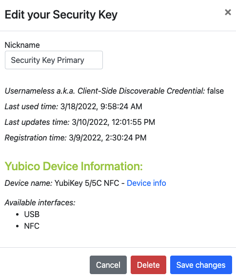
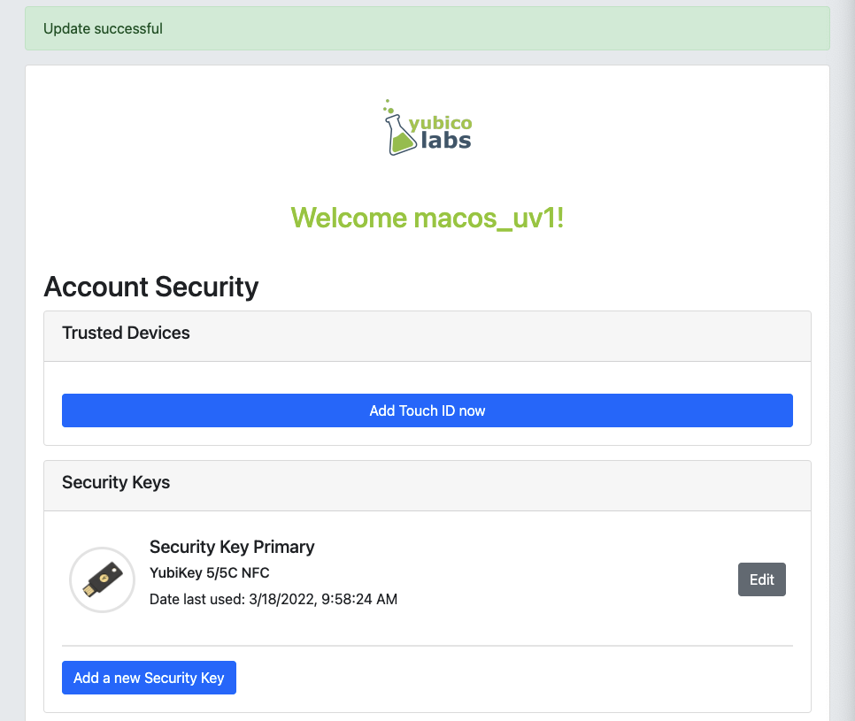
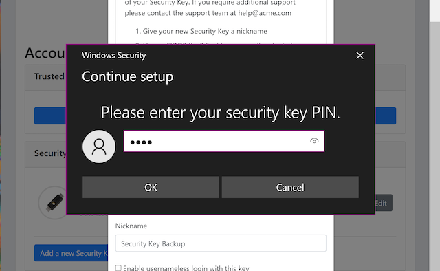
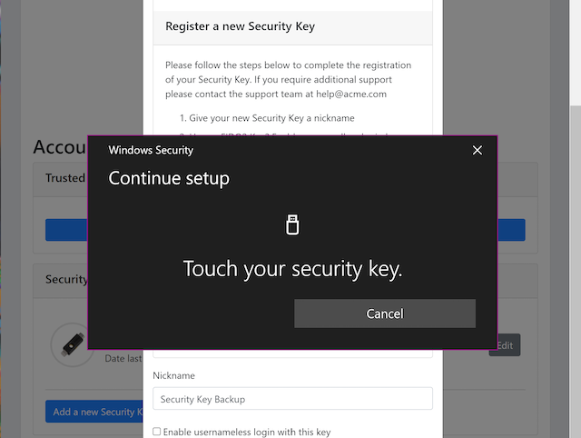
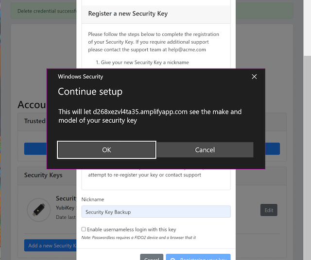
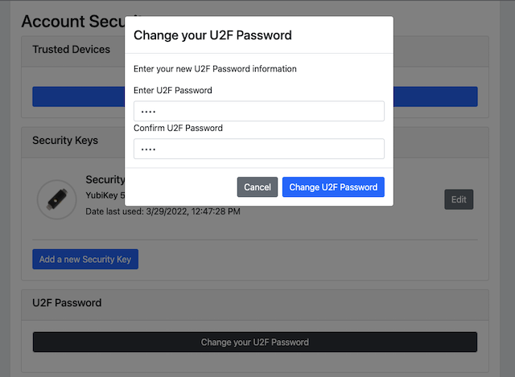
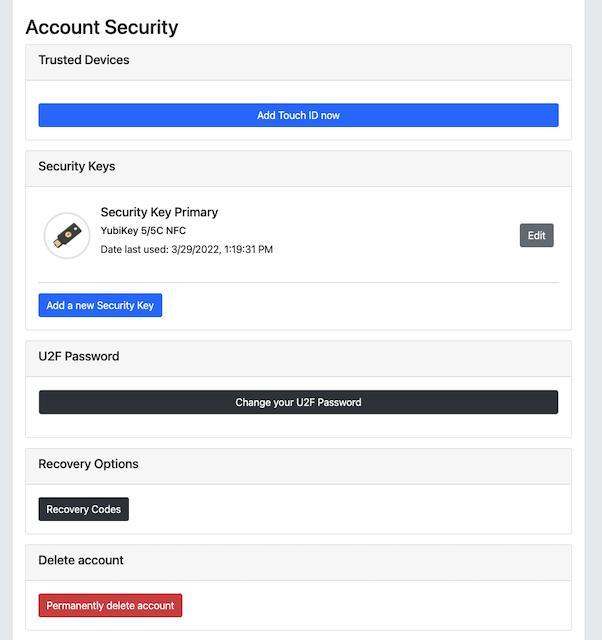
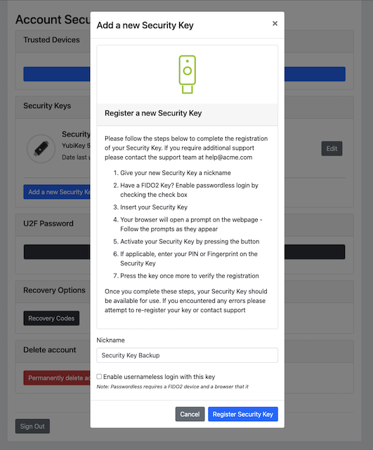
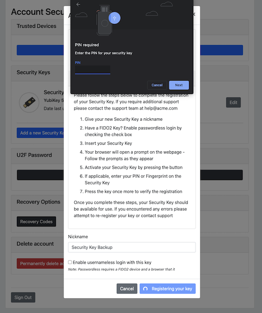
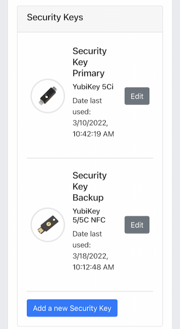

== Account and lifecycle management

=== Introduction to account and lifecycle management

==== Overview Pre-requisites

Once the user has enrolled for the FIDO credentials to FIDO authenticator, it can be used for FIDO authentication to the WebAuthn Relying Party. However, there are a couple of considerations to be made as regards to account and lifecycle management of the FIDO authenticator and its FIDO credentials. The account management functions are illustrated in the Adaptive Multi-Factor Authentication flowchart. The account management functions implemented for the WebAuthn Starter Kit are on a high level:

 * *List FIDO authenticators:* This feature lists all FIDO authenticators that are associated with a specific user at the WebAuthn Relying Party. Based on this list, the FIDO authenticators can be edited or deleted from the account.

 * *Add FIDO authenticator:* This feature can be used for adding a FIDO authenticator to a specific user account. In order to make sure that the user does not get locked out from the account, it is recommended to add a backup FIDO authenticator to each user’s account.

 * *Edit FIDO authenticator:* By using this feature, the FIDO authenticator’s nickname at the Relying Party can be modified. This feature is useful to name the FIDO authenticators with meaningful names, in particular to distinguish between the primary and secondary (backup) FIDO authenticator.

 * *Remove FIDO authenticator:* With this feature, a FIDO authenticator can be removed from a user account at the Relying Party. This is equivalent to revoking a FIDO authenticator. It should be noted that the FIDO authenticator is only deleted from the Relying Party, so the FIDO credentials are still present at the FIDO authenticator.

 * *Change U2F Password:* This feature can be used for changing the U2F Password for the user's account at the Relying Party, which is used as first factor authentication when using the FIDO authenticator for the U2F with Password flow. The U2F Password should be set to a complex password, while the FIDO authenticator PIN may have a lower complexity. The reason for this difference is that the U2F Password is more exposed to the Internet and can be subject to attacks, while the FIDO authenticator is in the user’s possession and will get blocked after too many failed PIN attempts.

 * *Show recovery codes:* This feature shows the recovery codes to the user, who should make a note of the recovery codes. The recovery codes should be stored securely, for example with a password manager.

 * *Generate recovery codes:* With this feature the user can generate new recovery codes. This should be done when the user has ran out of recovery codes or if there is a risk that the recovery codes could have been compromised.

 * *Delete account:* This feature can be used for deleting the entire user’s accounts. Needless to say, it should be used with great care.

By using the features listed above, various lifecycle management processes can be designed. In particular, it is possible to implement a procedure for replacing a FIDO authenticator that may have been lost or stolen. In such a scenario, the administrator should remove the user’s FIDO authenticator from the Relying Party, allow the user to login temporarily with backup codes, and instruct the user to add a new FIDO authenticator to the account.

==== Pre-requisites

The account and lifecycle management features described in this section are based on the account management and account recovery overview outlined in the Adaptive Multi-Factor Authentication Flow in conjunction with the specification in the link:https://www.w3.org/TR/webauthn/[W3C WebAuthn standard].

It is recommended to study the documents mentioned above as a pre-requisite.

Furthermore, a user account and corresponding FIDO authenticator must be registered, as described in the page High Level WebAuthn Registration Flow.

==== Purpose of this section

This section describes account and lifecycle management by using Microsoft Windows, an Apple iOS smartphone with the Safari browser, and an Apple iOS smartphone with an app that implements WebAuthn.

=== Account management using Microsoft Windows

==== Client configuration for Windows

The client configuration for Windows is described in this section.

==== FIDO authenticators

The FIDO2 authenticators used in this section is the following:

 * One YubiKey 5Ci is used as the primary FIDO2 authenticator. This YubiKey has been enrolled as described in the High Level Registration document.

 * One YubiKey 5C Nano s used as the backup FIDO2 authenticator. The YubiKey 5 is reset, so there are no FIDO2 credentials or PIN-codes set.

==== Account management web page for Windows
The web page for account management is shown in the picture below. This account management page is displayed when the user has logged in with FIDO2 to https://localhost:8080/. In the sub-sections below it is assumed that the user is logged in with FIDO2 to this web page.

*Figure 1 - Account management web page*

In the account management web page, there are the following features:

 * *Edit the FIDO authenticator (security key) name:* This feature allows the user to change the name(s) of the registered FIDO authenticator(s) (security keys).

 * *Add new FIDO authenticator (security key):* With this feature, the user can add a new (backup) FIDO authenticator to the account.

 * *Delete a FIDO authenticator (security key):* With this feature, the user can delete a FIDO authenticator associated with the account.

 * *Change U2F Password:* If there is a U2F Password associated with the account, the user can change the U2F Password by using this feature.

 * *Show Recovery Codes:* This feature allows the user to show the recovery codes and optionally generate new ones.

 * *Delete your account:* This feature can be used for deleting the entire user’s accounts. Needless to say, it should be used with great care.

Details on how to perform those operations, and the related UX, are described in the sub-sections below.

==== Editing the FIDO authenticator name for Windows

In order to edit the nickname of a registered FIDO authenticator, the user follows the steps below.

*Step 1.1:* The user clicks on the link “Edit” next to the security key name (see Figure 1).

*Step 1.2:* A dialog box is displayed, in which the FIDO authenticator’s nickname can be edited. In the example below, the user changes the nickname to “Security Key Primary" and presses the button “Save changes”.

*Figure 2 - Edit the security key nickname*

*Step 1.3:* The changed nickname appears in the account management web page, as shown in the picture below.

*Figure 3 - Changed security key nickname*

==== Adding a FIDO authenticator for Windows

===== Adding a FIDO authenticator for the User-Verified flow using Windows

In order to add a backup FIDO authenticator for the User-Verified flow to the user’s account when using Windows as the client, the user follows the steps below.

*Step 2.1:* The user will click "Add a new Security Key" on the home screen. The user then enters the nickname of the new FIDO authenticator in the field labeled as “Nickname”. In the example shown below, the user enters the new nickname “Security Key Backup”. Next, the user presses the button “Add new security key”.

image::Images/acct4-enter-nickname-new-security-key-v2.png[]
*Figure 4 - Entering the nickname of a new security key*

*Step 2.2:* The user inserts a new YubiKey. Windows displays a security dialog box, in which the user enters the PIN-code for the new YubiKey. (If a YubiKey is used with PIN-code that is not set for the FIDO application, there will be a dialog box with a field for the user to set a new PIN-code.)

*Figure 5 - Create PIN for the YubiKey’s FIDO2 application*

*Step 2.3:* Windows displays a security dialog box with instructions for the user to touch the security key. The user touches the sensor on the YubiKey.

*Figure 6 - Touch the YubiKey for FIDO2 registration*

*Step 2.4:* Windows displays a security dialog box with a request for the user to allow this site to see the security key.

*Figure 7 - Allow the site to see the security key*

*Step 2.5:* The new YubiKey is added to the user’s account, which is shown in the picture below.

*Figure 8 - An additional YubiKey is added to the user’s account*

At this stage, both FIDO authenticators can be used for logging in to the same account.

===== Adding a FIDO authenticator for the U2F with Password flow for Windows

In order to add a backup FIDO authenticator to the user’s account when using Windows as the client for the U2F with Password flow, the user follows the steps below.

*Step 3.1:* The user enters the nickname of the new FIDO authenticator in the field labeled as “Nickname”. In the example shown below, the user enters the new nickname “Security Key (backup)”. Next, the user presses the button “Add new security key”.

image::Images/acct4-enter-nickname-new-security-key-v2.png[]
*Figure 9 - Entering the nickname of a new security key*

*Step 3.2:* The user inserts a new YubiKey. Windows displays a security dialog box with instructions for the user to touch the security key. The user touches the sensor on the YubiKey.

*Figure 10 - Touch the YubiKey for FIDO2 registration*

*Step 3.3:* Windows displays a security dialog box with a request for the user to allow this site to see the security key.

*Figure 11 - The user allows the security key to be seen by the site*

*Step 3.4:* The user is prompted to enter the U2F Password.

*Figure 12 - The user enters the U2F Password*

*Step 3.5:* The new YubiKey is added to the user’s account, which is shown in the picture below.

*Figure 13 - An additional YubiKey is added to the user’s account*

At this stage, both FIDO authenticators can be used for logging in to the same account.

==== Deleting a FIDO authenticator for Windows

In order to delete a FIDO authenticator from the user’s account when using Windows as the client, the user follows the steps below.

*Note:* The FIDO authenticator is only deleted from the user’s account at the server.

*Figure 14 - Selecting a FIDO authenticator to be deleted*

*Step 4.1:* The user clicks on the link “Edit” next to the security key nickname (see Figure 14) that shall be deleted. In this example, the user selects to delete the FIDO authenticator with nickname “Secret Key Backup.

Figure 15 - Deleting a FIDO authenticator

*Step 4.2:* The user presses the button “Delete” in order to remove the selected FIDO authenticator from the account.

*Step 4.3:* The FIDO authenticator is removed from the account, which is shown in the picture below.

*Figure 16 - The result of the deleted FIDO authenticator*

*Note:* The backup FIDO authenticator is still configured with the credentials. In order to delete the credentials, the FIDO application on the YubiKey needs to be reset, which can be done by using the link:https://www.yubico.com/products/services-software/download/yubikey-manager/[YubiKey Manager].

==== Changing the U2F Password for Windows

If there is a U2F Password created for the account, it can be changed as follows.

*Step 5.1:* The user presses the button “Change your U2F Password in the account management web page (see Figure 17).

*Step 5.2:* A dialog box where the U2F Password can be changed is displayed. The user sets the new value of the U2F Password, confirms the new value, and presses the button “Save Changes”.

*Figure 17 - Changing the U2F Password*

The U2F Password has been changed to a new value, which should be used the next time the user logs in using the U2F Password flow.

==== Showing and generating recovery codes for Windows

In order to show the recovery codes when using Windows as the client, the user follows the steps below.

*Step 6.1:* The user presses the button "Recovery Codes” in the account management web page below.

*Figure 18 - Account management page*

*Step 6.2:* A dialog box with the recovery codes is shown. The user should make a note of the recovery codes. The recovery codes should be stored securely, for example with a password manager.

*Figure 19 - Show recovery codes*

*Step 6.3:* If needed, the user can generate new recovery codes by pressing the button “Generate”.

*Figure 20 - Generated recovery codes*

==== Deleting an account at Windows

In order to delete an account at Windows, the user should press the button “Permanently delete account” as shown in the picture below.

*Figure 21 - Management page*

*Warning:* This action should obviously be performed with great care.

=== Account management using Apple MacOS

==== Client configuration for MacOS
The client configuration for MacOS is described in this section.

==== FIDO authenticators

The FIDO2 authenticators used in this section is the following:

* One YubiKey 5 NFC is used as the Primary FIDO2 authenticator. This YubiKey has been enrolled as described in the registration for MacOS section.

* One YubiKey 5Ci is used as the backup FIDO2 authenticator. The YubiKey 5 is reset, so there are no FIDO2 credentials or PIN-codes set.

==== Account management web page for MacOS

The account management web page is identical for MacOS as for Windows. For more information see section "Account Management Web for Windows".

==== Editing the FIDO authenticator name for MacOS

Editing the FIDO authenticator name for MacOS is identical as for Windows. For more information see section "Editing the FIDO authenticator name for Windows".

==== Adding a FIDO authenticator for MacOS

The only account management process that differs from Windows to MacOS is how to add FIDO authenticators to an existing account. The reason for the difference is that Google Chrome on MacOS is interacting with the FIDO authenticator in a slightly different way than on Windows.

===== Adding a FIDO authenticator for the User-Verified flow using MacOS

In order to add a backup FIDO authenticator to the user’s account when using MacOS as the client for the User-Verified flow, the user follows the steps below.

*Step 7.1:* The user enters the nickname of the new FIDO authenticator in the field labeled as “Nickname”. In the example shown below, the user enters the new nickname “Security Key (backup)”. Next, the user presses the button “Add new security key”.

*Figure 22 - Entering the nickname of a new security key*

*Step 7.2:* The user selects USB security key as the authenticator.

*Step 7.3:* The user inserts a new YubiKey. Google Chrome on MacOS displays a security dialog box, and the user touches the YubiKey.

*Figure 24 - Insert the security key into the MacBook*

*Step 7.4:* Google Chrome on MacOS displays a security dialog box, in which the user enters a new PIN-code for the new YubiKey.

*Figure 25 - Enter PIN for the security key*

*Step 7.5:* Google Chrome on MacOS displays a security dialog box, and the user touches the YubiKey again.

*Figure 26 - Touch the security key again*

*Step 7.6:* The user gets a request to allow the site see the security key. The user presses the button “Allow”.

*Figure 27 - Allow the site to see the security key*

*Step 7.7:* The new YubiKey is added to the user’s account, which is shown in the picture below.

*Figure 28 - Registration of the security key succeeded*

At this stage, both FIDO authenticators can be used for logging in to the same account.

===== Adding a FIDO authenticator for the U2F with Password flow using MacOS

In order to add a backup FIDO authenticator to the user’s account when using MacOS as the client for the U2F with Password flow, the user follows the steps below.

*Step 8.1:* The user enters the nickname of the new FIDO authenticator in the field labeled as “Nickname”. In the example shown below, the user enters the new nickname “Security Key (backup)”. Next, the user presses the button “Add new security key”.

*Figure 29 - Entering the nickname of a new security key*

*Step 8.2:* The user selects USB security key as the authenticator.

*Step 8.3:* Google Chrome on MacOS displays a security dialog box, and the user touches the YubiKey.

*Figure 31 - Touch the security key for FIDO2 registration*

*Step 8.4:* The user gets a request to allow the site see the security key. The user presses the button “Allow”.

Figure 32 - Allow the site to see the security key

*Step 8.5:* The user is prompted to enter the U2F Password.

*Figure 33 - The user enters the U2F Password*

*Step 8.6:* The new YubiKey is added to the user’s account, which is shown in the picture below.

*Figure 34 - An additional YubiKey is added to the user’s account*

At this stage, both FIDO authenticators can be used for logging in to the same account.

==== Deleting a FIDO authenticator for MacOS

Deleting a FIDO authenticator name for MacOS is identical as for Windows. For more information see section "Deleting a FIDO authenticator for Windows" name for Windows.

==== Changing the U2F Password for MacOS

Changing the U2F Password for MacOS is identical as for Windows. For more information see section "Changing the U2F Password for Windows".

==== Showing and generating recovery codes for MacOS

Changing and generating recovery codes for MacOS is identical as for Windows. For more information see section "Changing and generating recovery codes for Windows".

==== Deleting an account at MacOS

Deleting an account at MacOS is identical as for Windows. For more information see section "Deleting an account at Windows".

=== Account management using Apple iOS Safari

==== Client configuration for Apple iOS Safari

The client configuration for Apple iOS Safari is described in this section.

==== FIDO authenticators

The FIDO authenticators used in this section are the following:

 * One YubiKey 5 NFC  is used as the primary FIDO2 authenticator. This YubiKey has been enrolled as described in the registration for Apple iOS Safari section.

 * A second YubiKey 5Ci or YubiKey 5 NFC is used as the backup FIDO2 authenticator. The YubiKey 5 is reset, so there are no FIDO2 credentials or PIN-codes set.

==== Account management web page for Apple iOS Safari

The account management web page is identical for Apple iOS Safari as for Windows. For more information see section "Account Management Web for Windows".

==== Editing the FIDO authenticator name for Apple iOS Safari

Editing the FIDO authenticator name for Apple iOS Safari is identical as for Windows. For more information see section "Editing the FIDO authenticator name for Windows".

==== Adding a FIDO authenticator for Apple iOS Safari

The only account management process that differs from Windows to Apple iOS Safari is how to add FIDO authenticators to an existing account. The reason for the difference is that Safari on Apple iOS is interacting with the FIDO authenticator in a slightly different way than on Windows.

===== Adding a FIDO authenticator for the User-Verified flow using Apple iOS Safari

In order to add a backup FIDO authenticator to the user’s account when using Apple iOS Safari as the client for the User-Verified flow, the user follows the steps below.

*Step 9.1:* The user enters the nickname of the new FIDO authenticator in the field labeled as “Nickname”. In the example shown below, the user enters the new nickname “Security Key (backup)”. Next, the user presses the button “Register security key”.

*Figure 35 - Entering the nickname of a new security key*

*Step 9.2:* The user inserts a new YubiKey. Safari on Apple iOS displays a security dialog box, and the user touches the YubiKey.

*Figure 37 - Insert the security key into the iPhone*

*Step 9.3.* Safari on Apple iOS displays a security dialog box, in which the user enters a new PIN-code for the new YubiKey.

*Figure 38 - Enter PIN for the security key*

*Step 9.4:* Safari on Apple iOS displays a security dialog box, and the user touches the YubiKey again.

*Figure 39 - Touch the security key again*

*Step 9.5:* The new YubiKey is added to the user’s account, which is shown in the picture below.

*Figure 40 - Registration of the security key succeeded*

At this stage, both FIDO authenticators can be used for logging in to the same account.

===== Adding a FIDO authenticator for the U2F with Password flow using Apple iOS Safari

In order to add a backup FIDO authenticator to the user’s account when using Apple iOS with Safari as the client for the U2F with Password flow, the user follows the steps below.

*Step 10.1:* The user enters the nickname of the new FIDO authenticator in the field labeled as “Nickname”. In the example shown below, the user enters the new nickname “Security Key (backup)”. Next, the user presses the button “Register Security Key”.

*Figure 41 - Entering the nickname of a new security key*

*Step 10.2:* Safari on Apple iOS with Safari displays a security dialog box, and the user selects to use the security key.

*Step 10.3:* The user inserts or a taps a new YubiKey. Safari on Apple iOS displays a security dialog box, and the user touches the YubiKey.

*Figure 43 - Insert the security key into the iPhone*

*Step 10.4:* The user enters the U2F Password.

*Figure 44 - The user enters the U2F Password*

*Step 10.5:* The new YubiKey is added to the user’s account, which is shown in the picture below.

*Figure 45 - An additional YubiKey is added to the user’s account*

At this stage, both FIDO authenticators can be used for logging in to the same account.

==== Deleting a FIDO authenticator for Apple iOS Safari

Deleting a FIDO authenticator name for Apple iOS Safari is identical as for Windows. For more information see section "Deleting the FIDO authenticator name for Windows".

==== Changing the U2F Password for Apple iOS Safari

Changing the U2F Password for Apple iOS Safari is identical as for Windows. For more information see section "Changing the U2F Password for Windows".

==== Showing and generating recovery codes for Apple iOS Safari

Changing and generating recovery codes for Apple iOS Safari is identical as for Windows. For more information see section "Changing and generating recovery codes for Windows".

==== Deleting an account at Apple iOS Safari

Deleting an account at Apple iOS Safari is identical as for Windows. For more information see section "Deleting an account at Windows".

=== Account recovery

If the user has lost its FIDO authenticator, the account must be recovered. There are essentially two scenarios:

 * The user has already registered a backup FIDO authenticator for the account.

 * The user had only one FIDO authenticator registered for its account.

These scenarios are discussed in the sections below. Microsoft Windows is used for describing account recovery, but the principles are the same for the other clients.

==== A backup FIDO authenticator exists

In this scenario, the user has already registered a backup FIDO authenticator for its account by following the process in the section "Adding a FIDO authenticator for Windows".

To recover the account with a backup FIDO authenticator, the user should take the following actions:

*Step 11.1.* Login to the account by using WebAuthn with the backup FIDO authenticator. See section "WebAuthn authentication using Microsoft Windows" for more information.

*Step 11.2.* When logged in, the user should *remove* the lost FIDO authenticator from the account. See section "Deleting a FIDO authenticator for Windows" for more information. When doing so, the lost FIDO authenticator is “revoked” at the WebAuthn Relying Party, and cannot be used for logging in anymore.

*Step 11.3.* The user should *add* a new backup FIDO authenticator to its account. See section "Adding a FIDO authenticator for Windows" for more information.

After performing these steps, the user has recovered the account with a new backup FIDO authenticator.

==== A new FIDO authenticator must be registered

In this scenario, the user had only one FIDO authenticator registered for its account. This means that the user must use the recovery codes for logging into the account. The recovery codes must be used only temporarily in an emergency situation or for account recovery.

To recover the account with recovery codes, the user should make sure to have the recovery codes at hand. Then the user should take the following actions.

*Step 12.1:* The user enters their username then selects the option to “Forgot Your Security Key”.

image::Images/acct46-login-another-way-v2.png[]
*Figure 46 - Login another way*

*Step 12.2:* The user enters a valid recovery code in the list and presses the button “Continue”. (The recovery codes need not be entered in chronological order, but the one that is entered has to be an active “non-used” recovery code.)

*Figure 47 - Enter recovery code*

*Step 12.3:* The user is logged in and can access the administration page (see Figure 18). If the user hits the button “Recovery Codes”, the Recovery Codes menu will appear and show that there are only 4 Recovery Codes remaining (from the original 5 that were generated). If all recovery codes have been used, the user can generate new ones by pressing the button “Generate”.

*Figure 48 - List of recovery codes*

*Step 12.4:* When logged in, the user should *remove* the lost FIDO authenticator from the account. See section "Deleting a FIDO authenticator for Windows" for more information. When doing so, the lost FIDO authenticator is “revoked” at the WebAuthn Relying Party, and cannot be used for logging in anymore.

*Step 12.5:* The user should *add* a new backup FIDO authenticator to its account. See section "Adding a FIDO authenticator for Windows" for more information.

After performing these steps, the user has recovered the account with a new backup FIDO authenticator.
