== Account and Lifecycle Management

=== Introduction to account and lifecycle management

==== Overview

Once the user has enrolled for the FIDO credentials to FIDO authenticator, it can be used for FIDO authentication to the WebAuthn Relying Party. However, there are a couple of considerations to be made as regards to account and lifecycle management of the FIDO authenticator and its FIDO credentials. The account management functions are illustrated in the identifier first flowchart. The account management functions implemented for the WebAuthn Starter Kit are on a high level:

* *List FIDO authenticators:* This feature lists all FIDO authenticators that are associated with a specific user at the WebAuthn Relying Party. Based on this list, the FIDO authenticators can be edited or deleted from the account.

* *Add FIDO authenticator:* This feature can be used for adding a FIDO authenticator to a specific user account. In order to make sure that the user does not get locked out from the account, it is recommended to add a backup FIDO authenticator to each user’s account.

* *Edit FIDO authenticator:* By using this feature, the FIDO authenticator’s nickname at the Relying Party can be modified. This feature is useful to name the FIDO authenticators with meaningful names, in particular to distinguish between the primary and secondary (backup) FIDO authenticator.

* *Remove FIDO authenticator:* With this feature, a FIDO authenticator can be removed from a user account at the Relying Party. This is equivalent to revoking a FIDO authenticator. It should be noted that the FIDO authenticator is only deleted from the Relying Party, so the FIDO credentials are still present at the FIDO authenticator.

* *Change Network PIN:* This feature can be used for changing the Network PIN for the user's account at the Relying Party, which is used as first factor authentication when using the FIDO authenticator with UV=0. The Network PIN should be set to a complex password, while the FIDO authenticator PIN may have a lower complexity. The reason for this difference is that the Network PIN is more exposed to the Internet and can be subject to attacks, while the FIDO authenticator is in the user’s possession and will get blocked after too many failed PIN attempts.

* *List all registered user accounts:* All users registered at the Relying Party will be listed by using this feature.

* *Delete user account:* With this feature a user account can be deleted at the Relying Party.

By using the features listed above, various lifecycle management processes can be designed. In particular, it is possible to implement a procedure for replacing a FIDO authenticator that may have been lost or stolen. In such a scenario, the administrator should remove the user’s FIDO authenticator from the Relying Party, allow the user to login temporarily with backup codes, and instruct the user to add a new FIDO authenticator to the account.

==== Pre-requisites

The account and lifecycle management features described in this section are based on the account management and account recovery overview outlined in the Identifier First Flow in conjunction with the specification in the W3C WebAuthn standard.

It is recommended to study the documents mentioned above as a pre-requisite.

Furthermore, a user account and corresponding FIDO authenticator must be registered, as described in the page High Level WebAuthn Registration Flow.

==== Purpose of this section

This section describes account and lifecycle management by using Microsoft Windows, an Apple iOS smartphone with the Safari browser, and an Apple iOS smartphone with an app that implements WebAuthn.

=== Account management using Microsoft Windows

==== Client configuration for Windows

The client configuration used in this section is the following:

* Operating system: Microsoft Windows 10 Pro (edition 2004)

* Web browser: Google Chrome (version 84.0.4147.105)

* FIDO2 implementation: Microsoft’s link:https://docs.microsoft.com/en-us/microsoft-edge/dev-guide/windows-integration/web-authentication[Web Authentication API], which is a Win32 API that exposes the link:https://www.w3.org/TR/webauthn/[W3C WebAuthn] functions to Windows 10 applications (including Google Chrome), and Microsoft’s CTAP2 stack

==== FIDO authenticators

The FIDO2 authenticators used in this section is the following:

* One YubiKey 5 NFC (version 5.2.6) is used as the master FIDO2 authenticator. This YubiKey has been enrolled as described in the registration for Windows section.

* A second YubiKey 5 NFC (version 5.2.6) is used as the backup FIDO2 authenticator. The YubiKey 5 is reset, so there are no FIDO2 credentials or PIN-codes set.

==== Account management web page for Windows

The web page for account management is shown in the picture below. This account management page is displayed when the user has logged in with FIDO2 to https://localhost:8080/. In the sub-sections below it is assumed that the user is logged in with FIDO2 to this web page.

*Figure 1 - account management web page*

In the account management web page, there are the following features:

* *Edit the FIDO authenticator (security key) name:* This feature allows the user to change the name(s) of the registered FIDO authenticator(s) (security keys).

* *Add new FIDO authenticator (security key):* With this feature, the user can add a new (backup) FIDO authenticator to the account.

* *Delete a FIDO authenticator (security key):* With this feature, the user can delete a FIDO authenticator associated with the account.

* *Change Network PIN:* If there is a Network PIN associated with the account, the user can change the Network PIN by using this feature.

* *List all registered user accounts:* All registered users are listed under this section in the web page.

* *Delete user accounts:* This feature can be used for deleting user accounts.

Details on how to perform those operations, and the related UX, are described in the sub-sections below.

==== Editing the FIDO authenticator name for Windows

In order to edit the nickname of a registered FIDO authenticator, the user follows the steps below.

*Step 1.1:* The user clicks on the link “Edit” next to the security key name (see figure 1).

*Step 1.2:* A dialog box is displayed, in which the FIDO authenticator’s nickname can be edited. In the example below, the user changes the nickname to “Security Key (master)” and presses the button “Save Changes”.

image::acct2-edit-security-key-nickname.png[]
*Figure 2 - edit the security key nickname*

*Step 1.3:* The changed nickname appears in the account management web page, as shown in the picture below.

image::acct3-changed-security-key-nickname.png[]
*Figure 3 - changed security key nickname*

==== Adding a FIDO authenticator for Windows

===== Adding a FIDO authenticator with UV=1 using Windows

In order to add a backup FIDO authenticator with UV=1 to the user’s account when using Windows as the client, the user follows the steps below.

*Step 2.1:* The user enters the nickname of the new FIDO authenticator in the field labeled as “Nickname”. In the example shown below, the user enters the new nickname “Security Key (backup)”. Next, the user presses the button “Add new security key”.

image::acct4-enter-nickname-new-security-key.png[]
*Figure 4 - Entering the nickname of a new security key*

*Step 2.2:* The user inserts a new YubiKey. Windows displays a security dialog box, in which the user enters a new PIN-code for the new YubiKey. (If a YubiKey is used with PIN-code already set for the FIDO application, there will be a dialog box with a field for the user to a enter the PIN-code.)

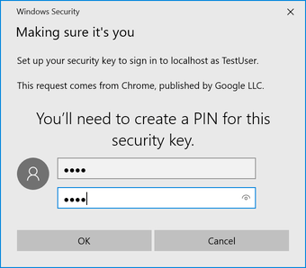
*Figure 5 - Create PIN for the YubiKey’s FIDO2 application*

*Step 2.3:* Windows displays a security dialog box with instructions for the user to touch the security key. The user touches the sensor on the YubiKey.

image::acct6-touch-yubikey-fido2-registration.png[]
*Figure 6 - Touch the YubiKey for FIDO2 registration*

*Step 2.4:* The new YubiKey is added to the user’s account, which is shown in the picture below.

image::acct7-add-yubiky-user-account.png[]
*Figure 7 - An additional YubiKey is added to the user’s account*

At this stage, both FIDO authenticators can be used for logging in to the same account.

===== Adding a FIDO authenticator with UV=0 for Windows

In order to add a backup FIDO authenticator with UV=0 to the user’s account when using Windows as the client, the user follows the steps below.

*Step 3.1:* The user enters the nickname of the new FIDO authenticator in the field labeled as “Nickname”. In the example shown below, the user enters the new nickname “Security Key (backup)”. Next, the user presses the button “Add new security key”.

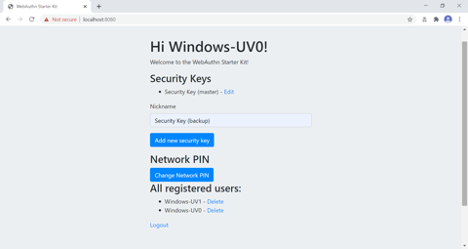
*Figure 8 - entering the nickname of a new security key*

*Step 3.2:* The user inserts a new YubiKey. Windows displays a security dialog box with instructions for the user to touch the security key. The user touches the sensor on the YubiKey.

image::acct9-touch-yuibkey-fido2-registration.png[]
*Figure 9 - Touch the YubiKey for FIDO2 registration*

*Step 3.3:* The new YubiKey is added to the user’s account, which is shown in the picture below.

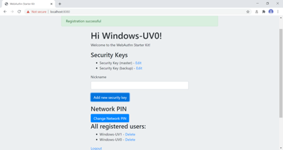
*Figure 10 - An additional YubiKey is added to the user’s account*

At this stage, both FIDO authenticators can be used for logging in to the same account.

==== Deleting a FIDO authenticator for Windows

In order to delete a FIDO authenticator from the user’s account when using Windows as the client, the user follows the steps below.

*Note:* The FIDO authenticator is only deleted from the user’s account at the server.

image::acct11-select-fido-authenticator-delete.png[]
*Figure 11 - Selecting a FIDO authenticator to be deleted*

*Step 4.1:* The user clicks on the link “Edit” next to the security key nickname (see figure 7) that shall be deleted. In this example, the user selects to delete the FIDO authenticator with nickname “Secret Key (backup).

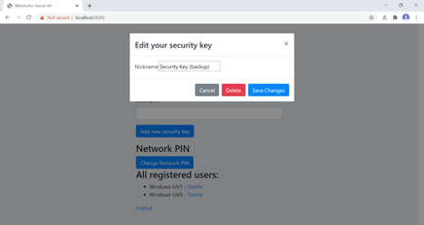
*Figure 12 - Deleting a FIDO authenticator*

*Step 4.2:* The user presses the button “Delete” in order to remove the selected FIDO authenticator from the account.

S*tep 4.3:* The FIDO authenticator is removed from the account, which is shown in the picture below.

image::acct13-deleted-fido-authenticator.png[]
*Figure 13 - The result of the deleted FIDO authenticator*

*Note:* The backup FIDO authenticator is still configured with the credentials. In order to delete the credentials, the FIDO application on the YubiKey needs to be reset, which can be done by using the YubiKey Manager.

===== Changing the Network PIN for Windows

If there is a Network PIN created for the account, it can be changed as follows.

*Step 5.1:* The user presses the button “Change Network PIN” in the account management web page (see figure 9).

*Step 5.2:* A dialog box where the Network PIN can be changed is displayed. The user changes the value of the Network PIN and presses the button “Save Changes”.

image::acct14-change-network-pin.png[]
*Figure 14 - Changing the Network PIN*

The Network PIN has been changed to a new value, which should be used the next time the user logs in with an authentication flow for which UV=0 is used.

===== Deleting a user account for Windows

In order to a delete a user account, the user should take the steps in this section.

*Step 6.1:* The user selects the account to be deleted from the list of users, as shown in the picture below. For the selected account, the link “Delete” is pressed.

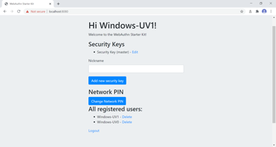
*Figure 15 - Selecting an account to be deleted*

*Step 6.2:* The selected account is immediately deleted and removed from the list, as shown in the picture below.

image::acct16-account-deleted.png[]
*Figure 16 - The account has been deleted*

=== Account management using Apple MacOS

==== Client configuration for MacOS

The client configuration used in this section is the following:

* *Operating system:* Apple MacOS Catalina 10.15.6

* *Web browser:* Google Chrome (version 84.0.4147.125)

* *FIDO2 implementation:* Google Chrome’s Web Authentication API, which is an API that exposes the W3C WebAuthn functions to MacOS applications (including Google Chrome), and Google’s CTAP2 stack

==== FIDO authenticators

The FIDO2 authenticators used in this section is the following:

*One YubiKey 5 NFC (version 5.2.6) is used as the master FIDO2 authenticator. This YubiKey has been enrolled as described in the registration for MacOS section.

*A second YubiKey 5 NFC (version 5.2.6) is used as the backup FIDO2 authenticator. The YubiKey 5 is reset, so there are no FIDO2 credentials or PIN-codes set.

==== Account management web page for MacOS

The account management web page is identical for MacOS as for Windows. For more information see section Account Management Web for Windows.

==== Editing the FIDO authenticator name for MacOS

Editing the FIDO authenticator name for MacOS is identical as for Windows. For more information see section Editing the FIDO authenticator name for Windows.

==== Adding a FIDO authenticator for MacOS

The only account management process that differs from Windows to MacOS is how to add FIDO authenticators to an existing account. The reason for the difference is that Google Chrome on MacOS is interacting with the FIDO authenticator in a slightly different way than on Windows.

==== Adding a FIDO authenticator with UV=1 using MacOS

In order to add a backup FIDO authenticator with UV=1 to the user’s account when using MacOS as the client, the user follows the steps below.

*Step 7.1:* The user enters the nickname of the new FIDO authenticator in the field labeled as “Nickname”. In the example shown below, the user enters the new nickname “Security Key (backup)”. Next, the user presses the button “Add new security key”.

image::acct17-enter-nickname-new-security-key.png[]
*Figure 17 - Entering the nickname of a new security key*

*Step 7.2:* The user selects USB security key as the authenticator.

image::acct18-select-security-key-authenticator.png[]
*Figure 18 - Select security key as the authenticator*

*Step 7.3:* The user inserts a new YubiKey. Google Chrome on MacOS displays a security dialog box, and the user touches the YubiKey.

image::account-19-insert-security-key-mac.png[]
*Figure 19 - Insert the security key into the MacBook*

*Step 7.4:* Google Chrome on MacOS displays a security dialog box, in which the user enters a new PIN-code for the new YubiKey.

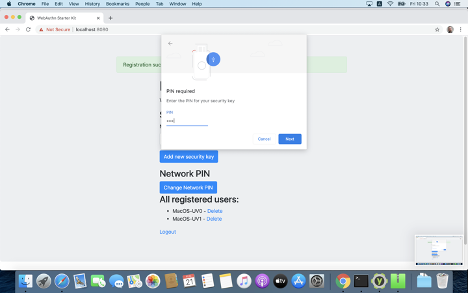
*Figure 20 - Enter PIN for the security key*

*Step 7.5:* Google Chrome on MacOS displays a security dialog box, and the user touches the YubiKey again.

image::acct21-touch-security-key-again.png[]
*Figure 21 - Touch the security key again*

*Step 7.6:* The new YubiKey is added to the user’s account, which is shown in the picture below.

image::acct22-register-security-key-succeeded.png[]
*Figure 22 - Registration of the security key succeeded*

At this stage, both FIDO authenticators can be used for logging in to the same account.

==== Adding a FIDO authenticator with UV=0 using MacOS

In order to add a backup FIDO authenticator with UV=0 to the user’s account when using MacOS as the client, the user follows the steps below.

*Step 8.1:* The user enters the nickname of the new FIDO authenticator in the field labeled as “Nickname”. In the example shown below, the user enters the new nickname “Security Key (backup)”. Next, the user presses the button “Add new security key”.

image::acct23-enter-nickname-new-security-key.png[]
*Figure 23 - Entering the nickname of a new security key*

*Step 8.2:v The user selects USB security key as the authenticator.

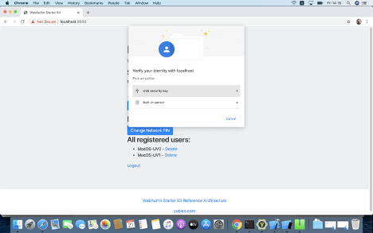
*Figure 24 - Selecting USB security key as authenticator*

*Step 8.3:* Google Chrome on MacOS displays a security dialog box, and the user touches the YubiKey.

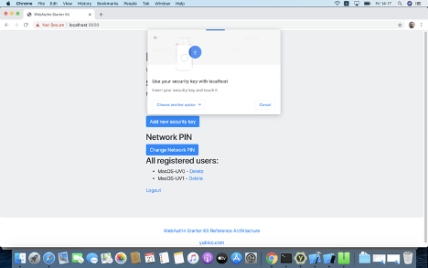
*Figure 25 - Touch the security key for FIDO2 registration*

*Step 8.4:* The new YubiKey is added to the user’s account, which is shown in the picture below.

image::acct26-add-yubikey-user-account.png[]
*Figure 26 - An additional YubiKey is added to the user’s account*

At this stage, both FIDO authenticators can be used for logging in to the same account.

==== Deleting a FIDO authenticator for MacOS

Deleting a FIDO authenticator name for MacOS is identical as for Windows. For more information see section Deleting the FIDO authenticator name for Windows.

==== Changing the Network PIN for MacOS

Changing the Network PIN for MacOS is identical as for Windows. For more information see section Changing the Network PIN for Windows.

==== Deleting a user account for MacOS

Deleting a user account for MacOS is identical as for Windows. For more information see section Deleting a user account for Windows.

=== Account management using Apple iOS Safari

==== Client configuration for Apple iOS Safari

The client configuration used in this section is the following:

* *Operating system:* Apple iPhone iOS 14 developer beta 6

* *Web browser:* Apple iPhone Safari 14 developer beta 6

* *FIDO2 implementation:* Apple iPhone iOS 14 developer beta 6, which is an API that exposes the W3C WebAuthn functions to iOS applications (including Safari)

==== FIDO authenticators

The FIDO authenticators used in this section are the following:

* One YubiKey 5 NFC (version 5.2.6) is used as the master FIDO2 authenticator. This YubiKey has been enrolled as described in the registration for Apple iOS Safari section.

*A second YubiKey 5Ci (version 5.2.7) or YubiKey 5 NFC (version 5.2.6) is used as the backup FIDO2 authenticator. The YubiKey 5 is reset, so there are no FIDO2 credentials or PIN-codes set.

==== Account management web page for Apple iOS Safari

The account management web page is identical for Apple iOS Safari as for Windows. For more information see section Account Management Web for Windows.

==== Editing the FIDO authenticator name for Apple iOS Safari

Editing the FIDO authenticator name for Apple iOS Safari is identical as for Windows. For more information see section Editing the FIDO authenticator name for Windows.

==== Adding a FIDO authenticator for Apple iOS Safari

The only account management process that differs from Windows to Apple iOS Safari is how to add FIDO authenticators to an existing account. The reason for the difference is that Safari on Apple iOS is interacting with the FIDO authenticator in a slightly different way than on Windows.

==== Adding a FIDO authenticator with UV=1 using Apple iOS Safari

In order to add a backup FIDO authenticator with UV=1 to the user’s account when using Apple iOS Safari as the client, the user follows the steps below.

*Step 9.1:* The user enters the nickname of the new FIDO authenticator in the field labeled as “Nickname”. In the example shown below, the user enters the new nickname “Security Key (backup)”. Next, the user presses the button “Add new security key”.

image::acct27-enter-nickname-new-security-key.png[]
*Figure 27 - Entering the nickname of a new security key*

*Step 9.2:* Safari on Apple iOS displays a security dialog box, and the user selects to use a security key.

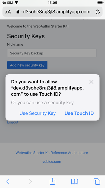
*Figure 28 - The user selects the security key*

*Step 9.3:* The user inserts a new YubiKey. Safari on Apple iOS displays a security dialog box, and the user touches the YubiKey.

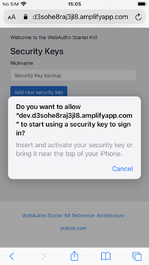
*Figure 29 - Insert the security key into the iPhone*

*Step 9.4:* Safari on Apple iOS displays a security dialog box, in which the user enters a new PIN-code for the new YubiKey.

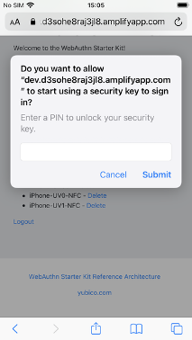
*Figure 30 - Enter PIN for the security key*

*Step 9.5:* Safari on Apple iOS displays a security dialog box, and the user touches the YubiKey again.

image::acct31-touch-security-key-again.png[]
*Figure 31 - Touch the security key again*

*Step 9.6:* The new YubiKey is added to the user’s account, which is shown in the picture below.

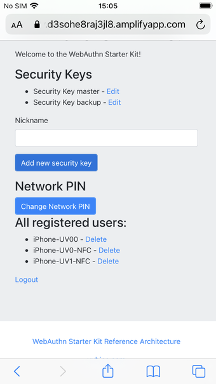
*Figure 32 - Registration of the security key succeeded*

At this stage, both FIDO authenticators can be used for logging in to the same account.

==== Adding a FIDO authenticator with UV=0 using Apple iOS Safari

In order to add a backup FIDO authenticator with UV=0 to the user’s account when using Apple iOS with Safari as the client, the user follows the steps below.

*Step 10.1:* The user enters the nickname of the new FIDO authenticator in the field labeled as “Nickname”. In the example shown below, the user enters the new nickname “Security Key (backup)”. Next, the user presses the button “Add new security key”.

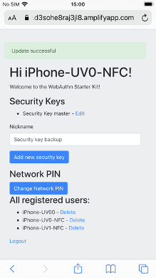
*Figure 33 - Entering the nickname of a new security key*

*Step 10.2:* Safari on Apple iOS with Safari displays a security dialog box, and the user selects to use the security key.

image::acct34-select-security-key-fido2-registration.png[]
*Figure 34 - Select the security key for FIDO2 registration*

*Step 10.3:* The user inserts or a taps a new YubiKey. Safari on Apple iOS displays a security dialog box, and the user touches the YubiKey.

image::acct35-insert-security-key-iphone.png[]
*Figure 35 - Insert the security key into the iPhone*

*Step 10.4:* The new YubiKey is added to the user’s account, which is shown in the picture below.

image::acct36-add-yubikey-user-account.png[]
*Figure 36 - An additional YubiKey is added to the user’s account*

At this stage, both FIDO authenticators can be used for logging in to the same account.

==== Deleting a FIDO authenticator for Apple iOS Safari

Deleting a FIDO authenticator name for Apple iOS Safari is identical as for Windows. For more information see section Deleting the FIDO authenticator name for Windows.

==== Changing the Network PIN for Apple iOS Safari

Changing the Network PIN for Apple iOS Safari is identical as for Windows. For more information see section Changing the Network PIN for Windows.

==== Deleting a user account for Apple iOS Safari

Deleting a user account for Apple iOS Safari is identical as for Windows. For more information see section Deleting a user account for Windows.

=== Account management using an Apple iOS app

##Notes for this section:##
##Document the following processes in this page:##
##List authenticators.##
##Add new security key.##
##Delete security key.##
##Change Network PIN.##
