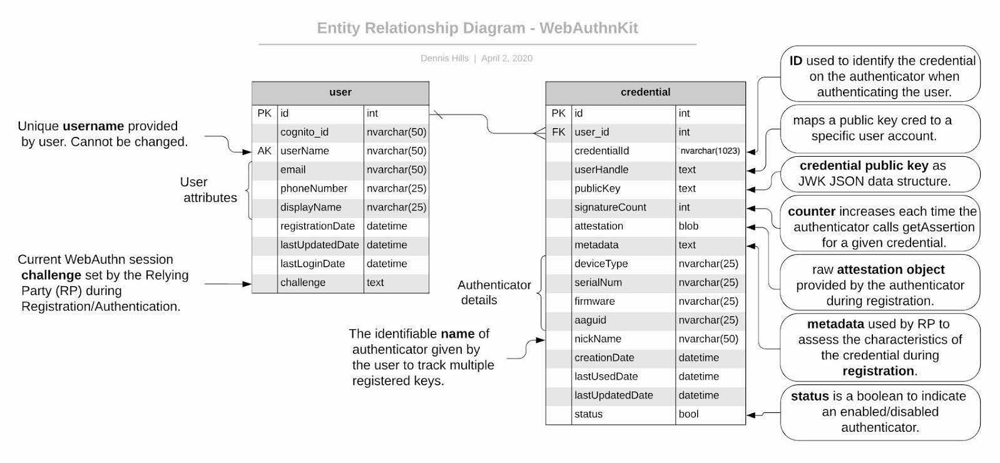
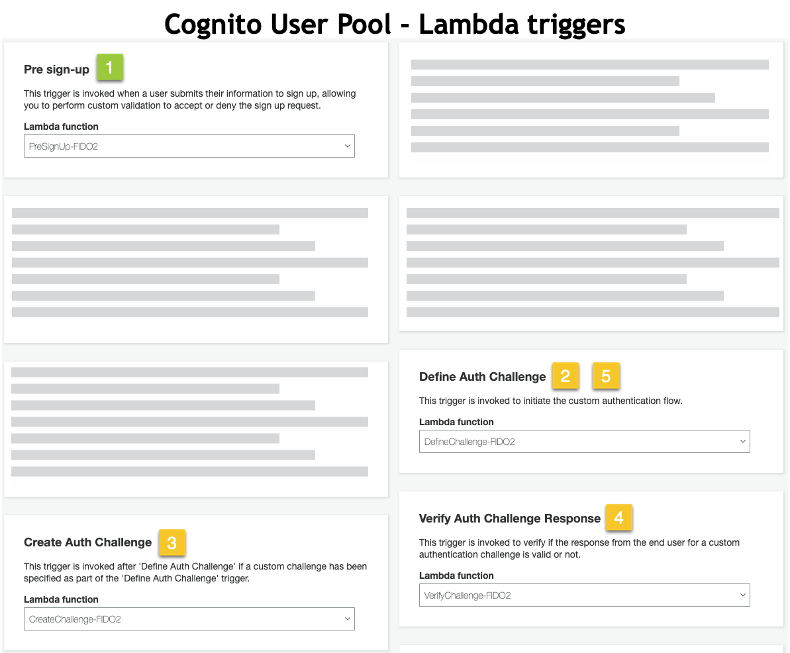
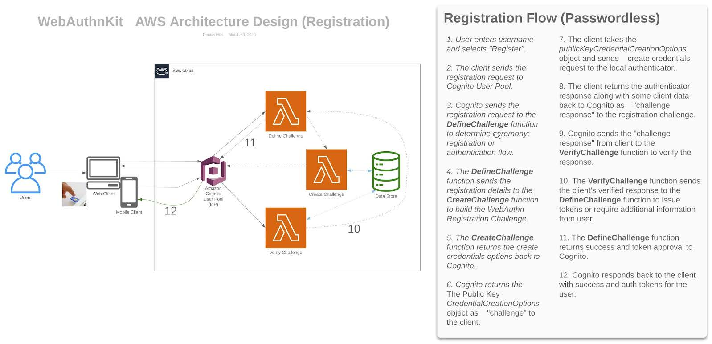
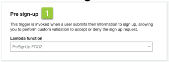
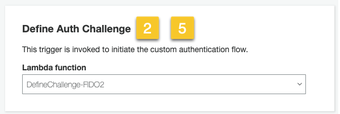
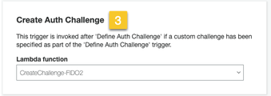
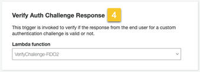
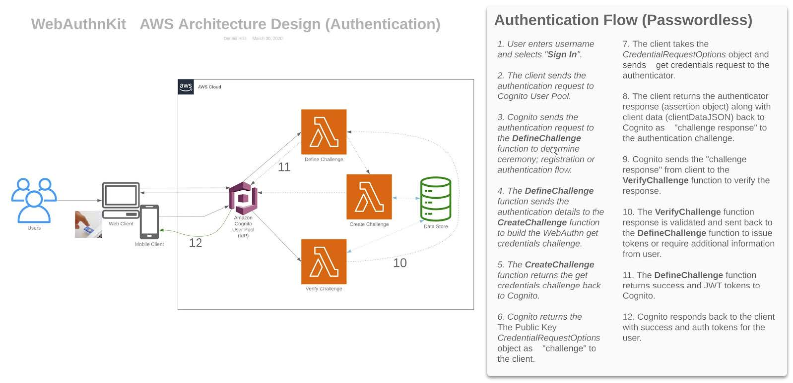

== Detailed Back-End System Design

=== Detailed Back-End System Design Introduction

The WebAuthn Server manages the creation, update, and deletion of WebAuthn credentials associated with Amazon Cognito User Pool Identities. The Server is comprised of Amazon Congito User Pool to provide the identity framework, a MySQL compatible serverless
link:https://aws.amazon.com/rds/aurora/serverless/[Amazon Aurora Database] to store user and credential information, and 3 Lambda functions to support the Cognito Custom Authentication flow.

==== Cognito User Pool

link:https://aws.amazon.com/cognito/[Amazon Cognito] is used by the WebAuthn Stater kit as the user identity provider, with custom triggers to provide the WebAuthn Authentication functionality. The WebAuthn Starter Kit includes scripts to automatically configure Cognito on installation. For more details, refer to the links below:

link:https://aws.amazon.com/blogs/mobile/customizing-your-user-pool-authentication-flow/[Blog] |
link:https://docs.aws.amazon.com/cognito/latest/developerguide/user-pool-lambda-challenge.html[Docs] |
link:https://docs.aws.amazon.com/cognito/latest/developerguide/cognito-user-identity-pools-working-with-aws-lambda-triggers.html[Using Lambda triggers with Cognito User Pools]

==== Database Component

The database is the credential repository and stores the mapping between users and their credentials. The implementation is a relational database MySQL compatible serverless
link:https://aws.amazon.com/rds/aurora/serverless/[Amazon Aurora Database] via Amazon RDS. The database credentials are stored in
link:https://aws.amazon.com/secrets-manager/[AWS Secrets Manager] with limited IAM Role access to retrieve the database credentials from Secrets Manager via specific AWS Lambda functions.

==== Database Entity Relationship

*Figure 1 -  Database entity relationship detail*

The [credential].[pubicKey] will be stored as a JSON Web Key (JWK). The authenticator returns the PublicKey to the RP as an ArrayBuffer (binary). The WebAuthn Starter kit uses the
link:https://github.com/apowers313/cose-to-jwk[cose-to-jwk] library from GitHub in the node.js Lambda function to convert from COSE (
link:https://tools.ietf.org/html/rfc8152[RFC 8152]) data format to JWK (
link:https://tools.ietf.org/html/rfc7517[RFC 7517]) JSON data structure before saving to the database. When validating the assertion during authentication ceremony, the Relying Party uses the jwk-to-pem library to convert the stored JWK public key to PEM format for use by the
link:https://nodejs.org/api/crypto.html[Node.js crypto library] or OpenSSL.

==== Amazon Aurora (MySQL-Compatible) Database Schema/Table Creation Script(s)

Aurora Serverless database supports encryption at rest which is required by default and cannot be disabled.

Database creation scripts available via GitHub (Source).

*[user Table]*

    CREATE TABLE user (
     id INT NOT NULL AUTO_INCREMENT,
     cognito_id NVARCHAR(50) NOT NULL UNIQUE,
     userName NVARCHAR(50) NOT NULL UNIQUE,
     email NVARCHAR(50),
     phoneNumber NVARCHAR(25),
     displayName NVARCHAR(25),
     registrationDate DATETIME DEFAULT CURRENT_TIMESTAMP,
     lastUpdatedDate DATETIME DEFAULT CURRENT_TIMESTAMP ON UPDATE CURRENT_TIMESTAMP,
     lastLoginDate DATETIME,
     challenge TEXT,
     PRIMARY KEY (id)
     );

*[credential Table]*

    CREATE TABLE credential (
      id INT NOT NULL AUTO_INCREMENT,
      user_id INT NOT NULL,
      credentialId NVARCHAR(1023),
      userHandle TEXT,
      publicKey TEXT,
      signatureCount INT,
      attestation BLOB,
      metadata TEXT,
      deviceType NVARCHAR(25),
      serialNum NVARCHAR(25),
      firmware NVARCHAR(25),
      creationDate DATETIME DEFAULT CURRENT_TIMESTAMP,
      lastUsedDate DATETIME,
      lastUpdatedDate DATETIME DEFAULT CURRENT_TIMESTAMP ON UPDATE CURRENT_TIMESTAMP,
      nickName NVARCHAR(50) UNIQUE,
      type NVARCHAR(25),
      status BOOL DEFAULT TRUE,
      INDEX par_ind (user_id),
      PRIMARY KEY (id),
      FOREIGN KEY (user_id)
      REFERENCES user(id)
      ON DELETE CASCADE
    );

==== Lambda Functions

The WebAuthn Starter Kit is includes 3 Lambda functions used as triggers by the Amazon Cognito Custom Authentication flow. Note that each Lambda service has a unique role, allowing it to only communicate with the other Lambda services related to the WebAuthn Authentication flow, and prohibiting communication with others.

*Figure 2 - Cognito User Pool Lamba Triggers*

*Define Challenge:* Defines the type of challenge based on the user behavior (Add new Authenticator or Login).

*Create Challenge:* Creates the challenge (register or authentication).

*Verify Challenge:* Parses, validates, and verifies both registration and authentication ceremony responses.

=== Registration

*Figure 3 - Registration flow*

The registration & authentication operations are serverless functions which integrate with the AWS Cognito custom authentication flow hooks. The functions either add a credential to the authenticated user’s list of WebAuthn credentials stored in the database or authenticate an existing credential depending on the user flow. With a custom authentication flow, the challenges and verification of the responses are controlled via three AWS Lambda triggers. The *DefineAuthChallenge* Lambda trigger takes as input a session array of previous challenges and responses and outputs the next challenge name and booleans indicating if the user is authenticated (and should be granted tokens) or if the authentication has failed. This Lambda trigger is a state machine that controls the user’s path through the challenges.

==== Example Registration for a New Account

New user “fred” launches the app for the first time, types “Fred” into the username field then clicks Next. The username “fred” does not exist in the user store. The user account “fred” is created and prompted to register a new authenticator.

===== Pre Sign-up

*Figure 4 - Pre sign-up*

A one-task function to verify the account. This function allows for the custom challenges to be sent from Cognito.

===== DefineChallenge: ***Received*** from Client via Cognito

*Figure 5 - Define Auth Challenge Received from Client*

Cognito, after receiving the registration request from the client, triggers the DefineChallenge Lambda function to determine which flow to use - as the user is prompted to register a new WebAuthn Authenticator, it selects the Registration flow.

    { 
      "version": "1", 
      "region": "us-west-2", 
      "userPoolId": "us-west-2_GqV3Smaw8", 
      "userName": "fred", "callerContext": {
         "awsSdkVersion": "aws-sdk-ios-2.13.0",
         "clientId": "6ftfcihr71p8mhg9jehge2pvu7" 
       }, 
       "triggerSource": "DefineAuthChallenge_Authentication", 
       "request": {
         "userAttributes": { 
            "sub": "1650c848-09a9-4515-a388-ec2168231d2f", 
            "cognito:user_status": "CONFIRMED"
         }, 
         "session": [
            { 
                "challengeName": "SRP_A", 
                "challengeResult": true, 
                "challengeMetadata": null
            }
         ] 
      }, 
      "response": {
         "challengeName": null, 
         "issueTokens": null, 
         "failAuthentication": null
      }
    }

===== DefineChallenge: ***Returned*** from DefineChallenge

*Figure 6 - Define Auth Challenge Returned*

The DefineChallenge Lambda function sends the details to the CreateChallenge function, prompting the creation of a WebAuthn Registration event.

    ...
        "session": []
      },
      "response": {
       "challengeName": "CUSTOM_CHALLENGE",
       "issueTokens": false,
       "failAuthentication": false
      }
    }

===== CreateChallenge: ***Received*** from DefineChallenge

*Figure 7 - Create Auth Challenge Received*

The CreateChallenge Lambda function receives the details from the DefineChallenge function and proceeds to creating the WebAuthn Registration event.

    ... 
       "challengeName": "CUSTOM_CHALLENGE", 
       "session": [] 
      }, 
      "response": {
        "publicChallengeParameters": null, 
        "privateChallengeParameters": null, 
        "challengeMetadata": null
      }
    }

===== CreateChallenge: ***Response*** from CreateChallenge to Client

*Figure 8 - Create Auth Challenge Response from Client*

CreateChallenge returns to Cognito the challenge with the WebAuthn Registration credential, as well as a default PIN code should User Verification not be supported by the client authenticator.

    ... 
        "challengeName": "CUSTOM_CHALLENGE", 
        "session": [] 
        }, 
        "response": {
          "publicChallengeParameters": { 
             "type": "webauthn.create", 
             "publicKeyCredentialCreationOptions": "{\"challenge\":\"
qmVpdqI5GsDu0XDiywboePGZPh7BGt0V\",\"rp\":{\"id\":\"fido2kit.com\",\"
name\":\"WebAuthn Starter Kit\"},\"user\":{\"id\":\"
MTY1MGM4NDgtMDlhOS00NTE1LWEzODgtZWMyMTY4MjMxZDJm\"},\"attestation\":\"
direct\",\"pubKeyCredParams\":[{\"type\":\"public-key\",\"alg\":7},{\"
type\":\"public-key\",\"alg\":-257}],\"authenticatorSelection\":{\"
authenticatorAttachment\":\"cross-platform\",\"requireResidentKey\":
false,\"userVerification\":\"preferred\"}}",
             "pinCode": 4011 
        }, 
        "privateChallengeParameters": {
             "type": "webauthn.create" 
        }, 
        "challengeMetadata": null
      }
    }

This challenge is then sent by Cognito to the client’s WebAuthn supporting browser or application. Refer to the WebAuthn Browser Support Matrix for a list of supported platforms. The WebAuthn Client browser or application will interface with the Authenticator (either the host system, called a platform authenticator, or a connected device such as a YubiKey, called a roaming authenticator), perform the registration event, and return the response to Cognito.

===== VerifyChallenge: ***Received*** from Client

*Figure 9 - Verify Auth Challenge Received from Client*

Once Cognito receives the Registration response from the Client as a challenge response, which is then passed to the VerifyChallange Lambda function. Note that the “challengeAnswer” is ALL provided from the client.

    { 
        "version": "1", 
        "region": "us-west-2", 
        "userPoolId": "us-west-2_GqV3Smaw8", 
        "userName": "fred", 
        "callerContext": {
          "awsSdkVersion": "aws-sdk-ios-2.13.0",
          "clientId": "6ftfcihr71p8mhg9jehge2pvu7" 
        }, 
        "triggerSource": "VerifyAuthChallengeResponse_Authentication", 
        "request": {
          "userAttributes": { 
             "sub": "1650c848-09a9-4515-a388-ec2168231d2f",
             "cognito:user_status": "CONFIRMED"
          },
          "privateChallengeParameters": { 
             "type": "webauthn.create"
          },
          "challengeAnswer": "{\n  \"rawId\" : \"
XVLCsZZzbOsjqLclpOFQcICd6NEjYEtxbDTC\\
/m1VmxgL9qyFKLUIchFQ72wuhJNMTdhjducDUBy3E0UeLtpYRg==\",\n  \"id\" : \"
XVLCsZZzbOsjqLclpOFQcICd6NEjYEtxbDTC\\
/m1VmxgL9qyFKLUIchFQ72wuhJNMTdhjducDUBy3E0UeLtpYRg==\",\n  \"
clientDataJSON\" : \"
eyJ0eXBlIjoid2ViYXV0aG4uY3JlYXRlIiwiY2hhbGxlbmdlIjoicW1WcGRxSTVHc0R1MFhE
aXl3Ym9lUEdaUGg3Qkd0MFYiLCJvcmlnaW4iOiJmaWRvMmtpdC5jb20ifQ==\",\n \"
attestationObject\" : \"
o2NmbXRmcGFja2VkZ2F0dFN0bXSjY2FsZyZjc2lnWEYwRAIgV5Sf7rTv+CjCtE\\/pt0\\
/1mlK9LsCOpE7Za5CObyrfOQkCIDgs+N7b814JmXgXM1hAg0nIhY5+jayJNLN3IFwb\\/\\
/AtY3g1Y4FZAsEwggK9MIIBpaADAgECAgQr8Xx4MA0GCSqGSIb3DQEBCwUAMC4xLDAqBgNVB
AMTI1l1YmljbyBVMkYgUm9vdCBDQSBTZXJpYWwgNDU3MjAwNjMxMCAXDTE0MDgwMTAwMDAwM
FoYDzIwNTAwOTA0MDAwMDAwWjBuMQswCQYDVQQGEwJTRTESMBAGA1UECgwJWXViaWNvIEFCM
SIwIAYDVQQLDBlBdXRoZW50aWNhdG9yIEF0dGVzdGF0aW9uMScwJQYDVQQDDB5ZdWJpY28gV
TJGIEVFIFNlcmlhbCA3MzcyNDYzMjgwWTATBgcqhkjOPQIBBggqhkjOPQMBBwNCAAR0wseEI
8hxLptI8llYZvxwQK5M3wfXd9WFrwSTme36kjy+tJ+XFvn1WnhsNCUfyPNePehbVnBQOMcLo
ScZYHmLo2wwajAiBgkrBgEEAYLECgIEFTEuMy42LjEuNC4xLjQxNDgyLjEuNzATBgsrBgEEA
YLlHAIBAQQEAwICJDAhBgsrBgEEAYLlHAEBBAQSBBDF71X\\
/rZpLn7WAreuv4CbQMAwGA1UdEwEB\\
/wQCMAAwDQYJKoZIhvcNAQELBQADggEBAItuk3adeE1u6dkA0nECf8J35Lgm5mw5udSIucst
LQU9ZrTVNjwXugnxsT5oVriRN7o1BB+Lz7KJmtDw34kvh\\
/uA11A9Ksf6veIV3hK+ugN7WNok7gn0t6IWOZF1xVr7lyo0XgbV88Kh+\\
/D1biUqc5u49qSvTH+Jx1WrUxeFh1S1CTpmvmYGdzgWE32qLsNeoscPkbtkVSYbB8hwPb7Sb V\\
/WbBBLzJEPn79oMJ\\/e+63B12iLdyu2K\\ /PKuibBsqSVHioe6cnvksZktkDykn+ZedRDpNOyBGo+89eBA9tLIYx\\
/bP8Mg9tCoIP8GZzh2P2joujOF4F0O1xkICNI9MB3+6JoYXV0aERhdGFYxFkRe\\
/mjiILe6+KL8A6yqwHU3CExq8pwIy8MkGuqfJDFQQAAAATF71X\\
/rZpLn7WAreuv4CbQAEBdUsKxlnNs6yOotyWk4VBwgJ3o0SNgS3FsNML+bVWbGAv2rIUotQh
yEVDvbC6Ek0xN2GN25wNQHLcTRR4u2lhGpQECAyYgASFYIFwcNYZoJJp5BbhXO1DgFFDkHwC
wCVK\\/M184r+9gW2HPIlggl9V1rsYi6KXenVDxLvejpxb7tR+1PCdzISGhPqgWfD8=\",
\n  \"type\" : \"public-key\"\n}"
       },
       "response": {
          "answerCorrect": null
       }
     }

===== VerifyChallenge: ***Returned*** to DefineAuthChallenge

*Figure 10 - Verify Auth Challenge Returned*

The VerifyChallenge will proceed to verify the WebAuthn Registration. If User Verification is not supported by the client or authenticator, it will also define the U2F Password as required, enforcing the user to provide a network password for each authentication event with the authenticator. This response is then passed to the DefineCredential function.

    ...
        "privateChallengeParameters": {
          "type": "webauthn.create"
         },
         "challengeAnswer": "{\n  \"rawId\" : \"
XVLCsZZzbOsjqLclpOFQcICd6NEjYEtxbDTC\\
/m1VmxgL9qyFKLUIchFQ72wuhJNMTdhjducDUBy3E0UeLtpYRg==\",\n  \"id\" : \"
XVLCsZZzbOsjqLclpOFQcICd6NEjYEtxbDTC\\
/m1VmxgL9qyFKLUIchFQ72wuhJNMTdhjducDUBy3E0UeLtpYRg==\",\n  \"
clientDataJSON\" : \"
eyJ0eXBlIjoid2ViYXV0aG4uY3JlYXRlIiwiY2hhbGxlbmdlIjoicW1WcGRxSTVHc0R1MFhE
aXl3Ym9lUEdaUGg3Qkd0MFYiLCJvcmlnaW4iOiJmaWRvMmtpdC5jb20ifQ==\",\n \" attestationObject\" : \"
o2NmbXRmcGFja2VkZ2F0dFN0bXSjY2FsZyZjc2lnWEYwRAIgV5Sf7rTv+CjCtE\\/pt0\\
/1mlK9LsCOpE7Za5CObyrfOQkCIDgs+N7b814JmXgXM1hAg0nIhY5+jayJNLN3IFwb\\/\\
/AtY3g1Y4FZAsEwggK9MIIBpaADAgECAgQr8Xx4MA0GCSqGSIb3DQEBCwUAMC4xLDAqBgNVB
AMTI1l1YmljbyBVMkYgUm9vdCBDQSBTZXJpYWwgNDU3MjAwNjMxMCAXDTE0MDgwMTAwMDAwM
FoYDzIwNTAwOTA0MDAwMDAwWjBuMQswCQYDVQQGEwJTRTESMBAGA1UECgwJWXViaWNvIEFCM
SIwIAYDVQQLDBlBdXRoZW50aWNhdG9yIEF0dGVzdGF0aW9uMScwJQYDVQQDDB5ZdWJpY28gV
TJGIEVFIFNlcmlhbCA3MzcyNDYzMjgwWTATBgcqhkjOPQIBBggqhkjOPQMBBwNCAAR0wseEI
8hxLptI8llYZvxwQK5M3wfXd9WFrwSTme36kjy+tJ+XFvn1WnhsNCUfyPNePehbVnBQOMcLo
ScZYHmLo2wwajAiBgkrBgEEAYLECgIEFTEuMy42LjEuNC4xLjQxNDgyLjEuNzATBgsrBgEEA
YLlHAIBAQQEAwICJDAhBgsrBgEEAYLlHAEBBAQSBBDF71X\\
/rZpLn7WAreuv4CbQMAwGA1UdEwEB\\
/wQCMAAwDQYJKoZIhvcNAQELBQADggEBAItuk3adeE1u6dkA0nECf8J35Lgm5mw5udSIucst LQU9ZrTVNjwXugnxsT5oVriRN7o1BB+Lz7KJmtDw34kvh\\
/uA11A9Ksf6veIV3hK+ugN7WNok7gn0t6IWOZF1xVr7lyo0XgbV88Kh+\\
/D1biUqc5u49qSvTH+Jx1WrUxeFh1S1CTpmvmYGdzgWE32qLsNeoscPkbtkVSYbB8hwPb7Sb V\\
/WbBBLzJEPn79oMJ\\
/e+63B12iLdyu2K\\ /PKuibBsqSVHioe6cnvksZktkDykn+ZedRDpNOyBGo+89eBA9tLIYx\\
/bP8Mg9tCoIP8GZzh2P2joujOF4F0O1xkICNI9MB3+6JoYXV0aERhdGFYxFkRe\\
/mjiILe6+KL8A6yqwHU3CExq8pwIy8MkGuqfJDFQQAAAATF71X\\
/rZpLn7WAreuv4CbQAEBdUsKxlnNs6yOotyWk4VBwgJ3o0SNgS3FsNML+bVWbGAv2rIUotQh
yEVDvbC6Ek0xN2GN25wNQHLcTRR4u2lhGpQECAyYgASFYIFwcNYZoJJp5BbhXO1DgFFDkHwC
wCVK\\/M184r+9gW2HPIlggl9V1rsYi6KXenVDxLvejpxb7tR+1PCdzISGhPqgWfD8=\",
\n \"type\" : \"public-key\"\n, \"pinCode\" : 3632}"
         }, 
        "response": { 
          "answerCorrect": true,
          "publicChallengeParameters": { 
            "pinCode": "REQUIRED" 
          } 
        }
    }

===== DefineChallenge: ***Received*** from VerifyAuthChallenge

*Figure 11 - Define Auth Challenge Received from Verify Challenge*

The DefineChallenge, upon receiving the response from the VerifyAuthChallenge, will then either require the user’s network PIN to be provided, or proceed if User Verification is supported on the WebAuthn registration.

    ...
        "session": [
          {
            "challengeName": "CUSTOM_CHALLENGE",
            "challengeResult": true,
            "challengeMetadata": null
          }
        ]
      },
      "response": {
        "challengeName": null,
        "issueTokens": null,
        "failAuthentication": null
      }
    }

===== DefineChallenge: ***Returned*** from DefineAuthChallenge to User

*Figure 12 - Define Auth Challenge Returned to User*

Finally, DefineChallenge returns a success response and token approval to Cognito. Cognito passes on the success status and auth token to the client.

    ... 
          "session": [
             { 
                "challengeName": "CUSTOM_CHALLENGE", 
                "challengeResult": true, 
                "challengeMetadata": null
             }
          ] 
        }, 
        "response": {
            "challengeName": null, 
            "issueTokens": true, 
            "failAuthentication": false
        }
    }

=== Authentication

*Figure 13 - Authentication flow*

==== Example Authentication for an Existing Account

User “fred” launches the app for the after initial creation, types “Fred” into the username field then clicks Next. The user is confirmed, and prompted for their authenticator credentials.

===== DefineChallenge: ***Received*** from Client via Cognito

*Figure 14 - Define Auth Challenge Received from Client*

Cognito, after receiving the authentication request from the client, triggers the DefineChallenge Lambda function to determine which flow to use -as the user is prompted to authenticate with a register WebAuthn Authenticator, it selects the Authenticate flow.

    { 
       "version": "1", 
       "region": "us-west-2", 
       "userPoolId": "us-west-2_GqV3Smaw8", 
       "userName": "fred", 
       "callerContext": {
         "awsSdkVersion": "aws-sdk-ios-2.13.0",
         "clientId": "6ftfcihr71p8mhg9jehge2pvu7" 
       }, 
       "triggerSource": "DefineAuthChallenge_Authentication", 
       "request": {
         "userAttributes": { 
            "sub": "1650c848-09a9-4515-a388-ec2168231d2f", 
            "cognito:user_status": "CONFIRMED"
         }, 
         "session": [
              { 
                "challengeName": "SRP_A", 
                "challengeResult": true, 
                "challengeMetadata": null
              }
         ] 
       }, 
       "response": {
         "challengeName": null, 
         "issueTokens": null, 
         "failAuthentication": null
      }
    }

===== DefineChallenge: ***Returned*** from DefineChallenge

*Figure 15 - Define Auth Challenge Returned*

The DefineChallenge Lambda function sends the details to the CreateChallenge function, prompting the creation of a WebAuthn Authentication event.

    ...
            "session": [] 
      }, 
      "response": {
          "challengeName": "CUSTOM_CHALLENGE", 
          "issueTokens": false, 
          "failAuthentication": false
      }
    }

===== CreateChallenge: ***Received*** from DefineChallenge

*Figure 16 - Create Auth Challenge Received*

The CreateChallenge Lambda function receives the details from the DefineChallenge function and proceeds to creating the WebAuthn Authentication event.

    ... 
        "challengeName": "CUSTOM_CHALLENGE", 
        "session": [] 
        }, 
        "response": {
               "publicChallengeParameters": null, 
               "privateChallengeParameters": null, 
               "challengeMetadata": null
        }
      }

===== CreateChallenge: ***Response*** from CreateChallenge to Client

*Figure 17 - Create Auth Challenge Response to Client*

CreateChallenge returns to Cognito the challenge with the WebAuthn Authentication challenge.

    ... 
         "challengeName": "CUSTOM_CHALLENGE", 
         "session": [] 
      }, 
      "response": {
         "publicChallengeParameters": { 
            "type": "webauthn.get", 
            "publicKeyCredentialRequestOptions": "{\"publicKey\":{\"
challenge\":\"ajVK32daMKfccQPcSLiwIq4gVVYbqj1Z\",\"rpId\":\"fido2kit.
com\",\"timeout\":60000,\"userVerification\":\"preferred\",\"
allowCredentials\":[{\"id\":\"XVLCsZZzbOsjqLclpOFQcICd6NEjYEtxbDTC
/m1VmxgL9qyFKLUIchFQ72wuhJNMTdhjducDUBy3E0UeLtpYRg==\",\"type\":\"
public-key\"}]}}"
         }, 
        "privateChallengeParameters": {
             "type": "webauthn.get" 
        }, 
        "challengeMetadata": null
      }
    }

This challenge is then sent by Cognito to the client’s WebAuthn supporting browser or application. Refer to the WebAuthn Browser Support Matrix for a list of supported platforms. The WebAuthn Client browser or application will interface with the Authenticator (either the host system, called a platform authenticator, or a connected device such as a YubiKey, called a roaming authenticator), perform the authentication event, and return the response to Cognito.

===== VerifyChallenge: ***Received*** from Client

*Figure 18 - Verify Auth Challenge Received from Client*

Once Cognito receives the Authentication response, containing the authenticator response and client data, from the Client as a challenge response, which is then passed to the VerifyChallange Lambda function. Note that the “challengeAnswer” is ALL provided from the client.

    { 
        "version": "1", 
        "region": "us-west-2", 
        "userPoolId": "us-west-2_GqV3Smaw8", 
        "userName": "fred", 
        "callerContext": {
           "awsSdkVersion": "aws-sdk-ios-2.13.0", 
           "clientId": "6ftfcihr71p8mhg9jehge2pvu7" 
        }, 
        "triggerSource": "VerifyAuthChallengeResponse_Authentication", 
        "request": {
           "userAttributes": { 
              "sub": "1650c848-09a9-4515-a388-ec2168231d2f", 
              "cognito:user_status": "CONFIRMED"
           }, 
          "privateChallengeParameters": {
              "type": "webauthn.get" 
          }, 
          "challengeAnswer": "{\n \"id\" : \"
XVLCsZZzbOsjqLclpOFQcICd6NEjYEtxbDTC\\
/m1VmxgL9qyFKLUIchFQ72wuhJNMTdhjducDUBy3E0UeLtpYRg==\",\n \"
clientDataJSON\" : \"
eyJ0eXBlIjoid2ViYXV0aG4uZ2V0IiwiY2hhbGxlbmdlIjoiYWpWSzMyZGFNS2ZjY1FQY1NM
aXdJcTRnVlZZYnFqMVoiLCJvcmlnaW4iOiJmaWRvMmtpdC5jb20ifQ==\",\n \"
authenticatorData\" : \"
WRF7+aOIgt7r4ovwDrKrAdTcITGrynAjLwyQa6p8kMUBAAAACA==\",\n \"
signature\" : \"MEQCICOiVRdbKHuSJwHN6qf5I8TroBhxqeHWtRhgtW+kg\\
/iLAiAmfP+YP14PxbTHuf+cpUNnQ5H9yp2RBXcyDiiZaxc4Eg==\",\n \"pinCode\" :
0\n}"
        }, 
        "response": { 
            "answerCorrect": null 
        }
    }

===== VerifyChallenge: ***Returned*** to DefineAuthChallenge

*Figure 19 - Verify Auth Challenge Returned*

The VerifyChallenge will proceed to verify the WebAuthn Authentication.

    ...
        },
        "privateChallengeParameters": {
            "type": "webauthn.get"
        },
        "challengeAnswer": "{\n \"id\" : \"
XVLCsZZzbOsjqLclpOFQcICd6NEjYEtxbDTC\\
/m1VmxgL9qyFKLUIchFQ72wuhJNMTdhjducDUBy3E0UeLtpYRg==\",\n \"
clientDataJSON\" : \"
eyJ0eXBlIjoid2ViYXV0aG4uZ2V0IiwiY2hhbGxlbmdlIjoiYWpWSzMyZGFNS2ZjY1FQY1NM
aXdJcTRnVlZZYnFqMVoiLCJvcmlnaW4iOiJmaWRvMmtpdC5jb20ifQ==\",\n \" authenticatorData\" : \"
WRF7+aOIgt7r4ovwDrKrAdTcITGrynAjLwyQa6p8kMUBAAAACA==\",\n \"
signature\" : \"MEQCICOiVRdbKHuSJwHN6qf5I8TroBhxqeHWtRhgtW+kg\\
/iLAiAmfP+YP14PxbTHuf+cpUNnQ5H9yp2RBXcyDiiZaxc4Eg==\",\n \"pinCode\" :
0\n}"
        },
        "response": {
            "answerCorrect": true
        }
    }

===== DefineChallenge: ***Received*** from VerifyAuthChallenge

*Figure 20 - Define Auth Challenge Received*

The DefineChallenge, upon receiving the response from the VerifyAuthChallenge, will then either require the user’s network PIN to be provided, or proceed if User Verification is supported on the WebAuthn registration.

    ...
        "session": [
             { 
                "challengeName": "CUSTOM_CHALLENGE", 
                "challengeResult": true, 
                "challengeMetadata": null
             }
          ] 
        }, 
        "response": {
            "challengeName": null, 
            "issueTokens": null, 
            "failAuthentication": null
        }
    }

===== DefineChallenge: ***Returned*** from DefineAuthChallenge to User

*Figure 21 - Define Auth Challenge Returned to User*

Finally, DefineChallenge returns a success response and token approval to Cognito. Cognito passes on the success status and auth token to the client.

    ... 
        "session": [
             { 
                "challengeName": "CUSTOM_CHALLENGE", 
                "challengeResult": true, 
                "challengeMetadata": null
             }
         ] 
       }, 
       "response": {
         "challengeName": null, 
         "issueTokens": true, 
         "failAuthentication": false
       }
    }

===== Usernameless flow

If an account has already been created, a user may add a FIDO2 Authenticator using a usernameless flow - that is, the user does not need to enter their username at login. The logic for registration and authentication are identical to the Adaptive Multi-Factor Authentication flow discussed above - the primary change is that the `username` field is replaced with `preferred_username`. During authentication, the `preferred_username` is passed from the WebAuthn authentication data sent by the authenticator, and passed to Cognito.

Note that while Cognito does allow for the `preferred_username` to be modified, doing so will break any authenticators registered with a usernameless flow, as the value sent by the authenticator will not match the Cognitio user pool data. While the Yubico WebAuthn Starter kit does not allow for the `preferred_username` to be changed, other implementations may have this functionality.

==== API Gateway Component

The AWS API Gateway service is used for the system’s RESTful APIs. API Gateway handles all the tasks involved in accepting and processing up to hundreds of thousands of concurrent API calls, including traffic management, authorization and access control, monitoring, and API version management. API Gateway acts as a "front door" for applications to access data, business logic, or functionality from your backend services. A
link:https://docs.aws.amazon.com/apigateway/latest/developerguide/how-to-custom-domains.html[custom domain] will be configured for any WebAuthn operations.
