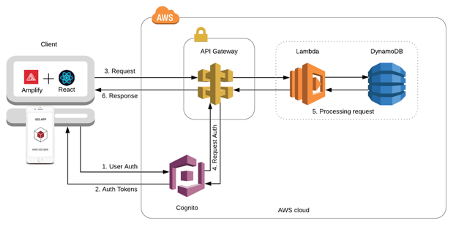
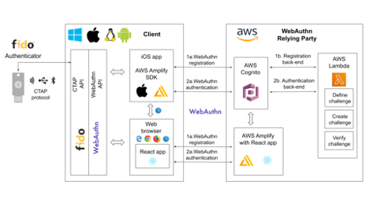

== Detailed Front-End System Design

=== Front-end and client components

The AWS front-end, used for the WebAuthn Starter Kit, is constituted of the AWS cloud components AWS Cognito, AWS Amplify, and AWS API Gateway. At the iOS device, the AWS iOS SDK can be used as framework for building iOS apps that connects to the AWS cloud-based front-end.

An overview of the AWS front-end, SDK and client components is illustrated in the picture below.

*Figure 1 -Front-end and client components. Copyright: Amazon AWS.*

The different AWS front-end cloud components are described in more detail in the sections below.

=== AWS Amplify

AWS Amplify is a set of tools and services that enables mobile and front-end web developers to build secure, scalable full stack applications, powered by AWS.

In particular, AWS Amplify can be used for AWS cloud-based hosting of React web apps, which can be executed in web browsers. More specifically, the WebAuthn Starter Kit contains such a React web app, which is described in the section React web app development.

Furthermore, AWS Amplify contains the
link:https://docs.amplify.aws[AWS Amplify Framework], which in turn includes the
link:https://aws-amplify.github.io/aws-sdk-ios/[AWS Mobile SDK for iOS]. By using the AWS Mobile SDK for iOS, it is possible to develop iOS apps that can be integrated with AWS Cognito.

==== AWS Cognito

link:https://aws.amazon.com/cognito/[Amazon Cognito] consists of two components:
link:https://docs.aws.amazon.com/cognito/latest/developerguide/cognito-user-identity-pools.html[AWS Cognito User Pool] and
link:https://docs.aws.amazon.com/cognito/latest/developerguide/cognito-identity.html[AWS Cognito Identity Pool] (aka Identity Provider). The User Pool acts as the user directory and the Identity Pool (IdP) for handling user sign-up (registration), sign-in (authentication), and authorization.

The AWS Cognito authentication and authorization process is illustrated in the picture below.

image::Images/front2-aws-cognito-auth-processes.png[]
*Figure 2 -AWS Cognito authentication and authorization processes. Copyright: Amazon AWS.*

The authentication and authorization process follows the steps below:

1. The user authenticates to the User Pool by using the app. The app can be a mobile iOS app or a React web app that is executed in a web browser. The AWS custom authentication flow is the mechanism by which passwordless WebAuthn authentication will be achieved. After successful authentication, Amazon Cognito User Pool returns
link:https://openid.net/connect/[OpenID Connect (OIDC)] standard tokens to the app.

2. These OIDC tokens are exchanged at the Identity Provider to AWS specific credentials.

3. The AWS credentials are used to grant users access to the AWS back-end resources. In this context, the three AWS Lambda functions for the WebAuthn Starter Kit will be accessed in the back-end.

A description of how to use Lambda triggers for custom authentication challenges is available at this
link:https://docs.aws.amazon.com/cognito/latest/developerguide/user-pool-lambda-challenge.html[AWS developer web page]; that process explains how the WebAuthn authentication process is designed.

==== AWS API Gateway

link:https://aws.amazon.com/api-gateway/[AWS API Gateway] is a cloud-based service that allows developers to create, publish, maintain, monitor, and secure APIs at any scale. Using AWS API Gateway, it is possible create RESTful APIs and WebSocket APIs that enable real-time two-way communication applications. The set of APIs act as the "front door" for applications to access data, business logic, or functionality from the back-end services. In the case of WebAuthn Starter Kit, it is three WebAuthn Lambda functions that serve as the AWS back-end.

The app is authorized to access the AWS API Gateway based on the previous authentication to AWS Cognito. In other words, the AWS API Gateway receives the user’s credentials from the AWS Cognito Identity Pool, and use them for authorization to the Lambda functions in the AWS back-end.

=== WebAuthn and FIDO2 client integration

==== System overview

This section describes how to use AWS for implementing the front-end of a WebAuthn Relying Party and develop the clients that will use WebAuthn registration and authentication. Since this section is focused on the front-end authentication, the AWS components AWS Amplify, AWS Cognito and AWS Lambda are in scope. It is also described how the FIDO authenticator, the client’s WebAuthn API and the WebAuthn protocol interact with the AWS for the WebAuthn registration and authentication. An overview of how AWS can be used for integrating WebAuthn into a Relying Party and client is shown in the picture below.

*Figure 3 -AWS used to implement FIDO2*

==== Client components

A
link:https://www.w3.org/TR/webauthn/#client[client] according to the WebAuthn/FIDO2 syntax is the user’s device that supports WebAuthn/FIDO2. In practice, this is a hardware device (smartphone, tablet, laptop, etc), an operating system (Microsoft Windows, Apple MacOS, Apple iOS, Android, Linux, etc) and a web browser (Google Chrome, Apple Safari, Microsoft Edge, Mozilla Firefox, etc).

The different entities used at the client are briefly described in the following sections.

===== FIDO authenticator

The
link:https://www.w3.org/TR/webauthn/#authenticator[FIDO authenticator] is a cryptographic device used by a WebAuthn client to (i) generate a public key credential and register it with a Relying Party, and (ii) authenticate by potentially verifying the user. The FIDO authenticator can either be a roaming FIDO authenticator, which is connected to the client over CTAP, or a platform authenticator.

In general, FIDO authenticators protect public key credentials, and interact with user agents to implement the Web Authentication API. It is possible to implement FIDO authenticators either in software on a general-purpose computing device, on a device secure environment such as a Trusted Platform Module (TPM) or a Secure Element (SE), or as a detached roaming FIDO authenticator. FIDO authenticators that are implemented on a device are called platform FIDO authenticators. FIDO authenticators that are roaming authenticators can be accessed over a communication protocol such as Universal Serial Bus (USB), Bluetooth Low Energy (BLE), or Near Field Communications (NFC).

When the User-Verified flow is used, the user be must identified to the FIDO authenticator. This is typically performed by the user entering a PIN-code (which is in scope of the WebAuthn Starter Kit). Another option is that the user is identified to the FIDO authenticator by using biometrics, for example by a fingerprint. Such biometric FIDO authenticators stores the user’s fingerprint template securely in the device, and when the user touches the biometric sensor, the user’s fingerprint is matches against the stored fingerprint template. If there is a match, the user is identified and can access the private credentials at the FIDO authenticator.

In the context of the WebAuthn Starter Kit,
link:https://www.yubico.com/products/yubikey-5-overview/[YubiKey 5] with PIN-support is used as roaming FIDO authenticator.

===== CTAP protocol

The FIDO authenticator communicates with the client/platform over the
link:https://fidoalliance.org/specs/fido-v2.0-id-20180227/fido-client-to-authenticator-protocol-v2.0-id-20180227.html[CTAP protocol]. The CTAP protocol comes in two versions: CTAP1/U2F protocol that supports the U2F with Password flow (without authenticator PIN), and CTAP2 protocol that supports the User-Verified flow (with authenticator PIN). Both CTAP1 and CTAP2 share the same underlying transports: USB Human Interface Device (USB HID), Near Field Communication (NFC), and Bluetooth Smart / Bluetooth Low Energy Technology (BLE).

===== WebAuthn API

The WebAuthn API is specified by W3C in the
link:https://www.w3.org/TR/webauthn/#api[WebAuthn standard]. The Web Authentication API exposes two basic methods that correspond to register and authenticate:

 * `navigator.credentials.create()` - creates new WebAuthn credentials, either for registering a new account or for associating a new asymmetric key pair credentials with an existing account.

 * `navigator.credentials.get()` - uses an existing set of WebAuthn credentials to authenticate to a Relying Party, either logging a user in or as a form of second-factor authentication.

The WebAuthn API is invoked by JavaScript applications, that can be executed in web browsers or be implemented in custom applications or mobile apps.

The WebAuthn API has been implemented across a wide range of operating systems and web browsers. A compatibility matrix of the FIDO2 /WebAuthn implementations on different web browsers and operating systems is available at the
link:https://fidoalliance.org/fido2/fido2-web-authentication-webauthn/[FIDO Alliance website].

For the WebAuthn Starter Kit, the Chrome/Windows, Chrome/MacOS and Safari/iOS WebAuthn APIs are used for building WebAuthn clients.

===== React web app

link:https://reactjs.org[React] is an open-source JavaScript library for building user interfaces or UI components. The WebAuthn Starter Kit includes a React web app that calls the WebAuthn registration and authentication functions on Chrome/Windows and Chrome/MacOS. The React JavaScript code is hosted at AWS Amplify, but it is downloaded to and executed in the aforementioned web browsers at the client.

More information on how to implement React web apps with support for WebAuthn is available in the section WebAuthn implementations in OS and web browsers.

===== Mobile iOS app

Mobile iOS apps can be implemented in Apple’s coding language
link:https://developer.apple.com/swift/[Swift]. The iOS app can also implemented on top of the
link:https://aws-amplify.github.io/aws-sdk-ios/[AWS Mobile SDK for iOS], which is part of the
link:https://docs.amplify.aws[AWS Amplify Framework], which in turn provides for the network connections to AWS Cognito.

There is no mobile iOS app implemented for this version of the WebAuthn Starter Kit, but it may be supported for future releases.

=== WebAuthn protocol

The WebAuthn protocol is specified by W3C in the
link:https://www.w3.org/TR/webauthn/[WebAuthn standard]. The protocol is based on JSON objects that are tunneled over HTTPS.

In the context of the WebAuthn Starter Kit, the WebAuthn protocol is used for integrating the React web app with the WebAuthn Relying Party that is deployed on AWS.

The details of the WebAuthn standard goes beyond the scope of this document. It is recommended to study the
link:https://www.w3.org/TR/webauthn/[W3C WebAuthn standard] and the
link:https://developers.yubico.com/WebAuthn/WebAuthn_Developer_Guide/[Yubico WebAuthn developer’s guide] as background to the WebAuthn standard.

=== WebAuthn Relying Party

The WebAuthn Relying Party is the server component for WebAuthn registration and authentication. In the WebAuthn Starter Kit context, it is deployed on AWS with the AWS components that are described in the sections below.

==== AWS Amplify

Within the context of the WebAuthn Starter Kit project,
AWS Amplify is used for hosting the WebAuthn React web app, which can be executed in web browsers and thereby authenticate the client’s application with the WebAuthn protocol. More information on this is available in the section Re act web app development.

==== AWS Cognito

AWS Cognito operates the User Pool, which supports the WebAuthn protocol as a custom authentication flow. Within the scope of the WebAuth Starter Kit, AWS Cognito is invoked from AWS Amplify that hosts the React app; both these apps authenticates to the AWS Cognito User Pool using WebAuthn.

AWS Cognito is also integrated with the AWS Lambda functions in the back-end. More information on the back-end integration is available in the section Lambda functions.

==== AWS Lambda

There are three Lambda functions deployed for the WebAuthn Starter Kit: Define Challenge, Create Challenge, and Verify Challenge. Those Lambda functions implement the back-end calls used for the WebAuthn registration and authentication processes. More information on these back-end calls is available in the section Lambda functions.

=== React web app development

==== Overview

link:https://reactjs.org[React] is an open-source JavaScript library for building user interfaces or UI components. Typically, React is used as the base in the development of single-page web applications or mobile apps. React uses the virtual
link:https://developer.mozilla.org/en-US/docs/Web/API/Document_Object_Model[Document Object Model], or virtual DOM, so it creates in-memory data-structure cache, computes the resulting differences, and then updates the browser's displayed DOM efficiently. The React components are usually written using
link:https://reactjs.org/docs/introducing-jsx.html[JSX], JavaScriptXML, although they may also be written in pure JavaScript.

When it comes to the architecture of the WebAuthn React web app, it is essentially developed by using four SDKs:

 * The
 link:https://reactjs.org[React] open-source library, which supports JavaScript XML and DOM.

 * The WebAuthn client implementations, more specifically Google Chrome on Microsoft Windows 10, Google Chrome on MacOS and Safar i on Apple iOS.

 * The WebAuthn-Json library, which is an open source code project for parsing WebAuthn calls.

 * WebAuthnKit React web app, which is the web app that is launched in the web browsers.

More information on these SDKs is available in the sub-sections below.

==== WebAuthn client implementations

The following WebAuthn implementations are used on each desktop client:

 * *Google Chrome on Microsoft Windows 10*

 * *Google Chrome on Apple MacOS*

 * *Apple Safari on Apple iOS*

The JavaScript APIs `navigator.credentials.create()` and `navigator.credentials.get()` are exposed by each WebAuthn SDK.

===== Google Chrome with Microsoft Windows 10

When Google Chrome is used as web browser on Microsoft Windows 10, it is Microsoft’s WebAuthn/CTAP2 stack that is used for the FIDO2 registration and authentication procedures.

Microsoft’s
link:https://docs.microsoft.com/en-us/microsoft-edge/dev-guide/windows-integration/web-authentication[Web Authentication API] is a Win32 API that exposes the
link:https://www.w3.org/TR/webauthn/[W3C WebAuthn] functions to Windows 10 applications. Microsoft’s Web Authentication API is called by the web browsers Microsoft Edge, Mozilla Firefox and Google Chrome. Furthermore, Microsoft’s Web Authentication API can be invoked when developing native C++ applications for Windows 10.

In addition to exposing the Web Authentication API, Windows 10 also supports the
link:https://fidoalliance.org/specs/fido-v2.0-ps-20190130/fido-client-to-authenticator-protocol-v2.0-ps-20190130.html[CTAP2] protocol, which thereby caters for a full stack
link:https://fidoalliance.org/fido2/[FIDO2] implementation. The CTAP2 stack is not accessible for a developer, but the CTAP2 commands are traced in the Event Viewer under the path `\Event Viewer (Local)\Applications and Services Logs\Microsoft\Windows\WebAuthn\Operational\`.

The Yubico WebAuthnKit React web app is executed in Google Chrome, which invokes Microsoft’s
link:https://docs.microsoft.com/en-us/microsoft-edge/dev-guide/windows-integration/web-authentication[Web Authentication API]. The user experience for using WebAuthn with Google Chrome on Windows 10 is described in the sections WebAuthn registration using Microsoft Windows and WebAu thn authentication using Microsoft Windows.

===== Google Chrome with Apple MacOS

When Google Chrome is used as web browser on Apple MacOS, it is Google Chrome’s WebAuthn/CTAP2 stack that is used for the FIDO2 registration and authentication procedures.

link:https://developers.google.com/web/updates/2018/05/webauthn[Google introduced support for WebAuthn/CTAP2] on Windows 10 with Google Chrome version 67. A description of how to integrate applications with Google Chrome’s WebAuthn API is available on
link:https://codelabs.developers.google.com/codelabs/webauthn-reauth/#[Google’s developer website].

The Yubico WebAuthnKit React web app is executed in Google Chrome, which invokes Google Chrome’s WebAuthn API. The user experience for using WebAuthn with Google Chrome on MacOS is described in the sections WebAuthn registration using MacOS and WebAuthn authentication using MacOS.

===== Apple Safari with Apple iOS

When Apple Safari is used as web browser on Apple iPhone with iOS, it is Apple’s WebAuthn/CTAP2 stack that is used for the FIDO2 registration and authentication procedures.

Apple
link:https://developer.apple.com/videos/play/wwdc2020/10670/[introduced support for WebAuthn/CTAP2] on iPhone and iPad with Apple iOS 14. The Safari View Controller exposes the WebAuthn API, which can be invoked by JavaScript enabled apps that are executed in the Safari web browser on iOS.

The Yubico WebAuthnKit React web app is executed in Safari, which invokes Apple’s WebAuthn API. The user experience for using WebAuthn with Safari on Apple iOS is described in the sections WebAuthn registration using the Apple iOS Safari browser and WebAuthn authentication using the Apple iOS Safari browser.

==== WebAuthn-Json library

The
link:https://github.com/github/webauthn-json[WebAuthn-Json GitHub project] is a client-side Javascript library that serves as a wrapper for the the WebAuthn API by encoding binary data using base64url.

This library replaces the WebAuthn calls to `navigator.credentials.create()` with `create()` and `navigator.credentials.get()` with `get()`.

WebAuthn-Json allows for the binary WebAuthn data to be sent from/to the Relying Party as normal JSON without client-side processing.

==== Yubico WebAuthnKit React web app

The Yubico WebAuthnKit React web app code is published at the Yubico WebAuthnKit GitHub repo. The React code, with the JavaScripts, JSX-scripts and HTML pages, are available as part of this package.

The WebAuthnKit React web app renders a HTML page in the web browser that implicitly exposes the basic
link:https://www.w3.org/TR/webauthn/[WebAuthn] methods for registration (MakeCredentials) and authentication (GetAssertion). The WebAuthn-Json library wraps the functions `navigator.credentials.create()` into `create()` and `navigator.credentials.get()` into `get()`.

The WebAuthnKit React web app is integrated with the AWS back-end component AWS Cognito, which is the
link:https://docs.amplify.aws/lib/auth/getting-started/q/platform/js[main authentication provider] that manages WebAuthn as a custom authentication flow.

The FIDO authenticator can be connected to Windows 10 by USB-A or USB-C, to the MacBook with USB-C, and to the iPhone by the lightning port or over NFC.

===== WebAuthnKit React web app code examples

The entry points in the React web application code are LoginWithSecurityKeyPage.jsx for WebAuthn authentication and RegisterPage.jsx for WebAuthn registration. In both JSX-files there are functions called `handleWebAuthn()`, which implements the respective WebAuthn calls. In this section, the `LoginWithSecurityKeyPage.handleWebAuthn()` will be examined in the code example below.

    async function handleWebAuthn(e) {
       e.preventDefault();
       setSubmitted(true);
       try {
          let cognitoUser = await Auth.signIn(username);
          setCognitoUser(cognitoUser);
          if(cognitoUser.challengeName === 'CUSTOM_CHALLENGE' &&
          cognitoUser.challengeParam.type === 'webauthn.create'){
            history.push('/login');
            return;
            }
          if (cognitoUser.challengeName === 'CUSTOM_CHALLENGE' &&
          cognitoUser.challengeParam.type === 'webauthn.get') {
            const request = JSON.parse(cognitoUser.challengeParam.
            publicKeyCredentialRequestOptions);
            const publicKey = {"publicKey": request.
            publicKeyCredentialRequestOptions};
            let assertionResponse = await get(publicKey);
            let uv = getUV(assertionResponse.response.authenticatorData);
            let challengeResponse = {};
            challengeResponse.credential = assertionResponse;
            challengeResponse.requestId = request.requestId;
            challengeResponse.pinCode = -1;
          if(uv == false) {
            dispatch(credentialActions.getUV(challengeResponse));
          } else {
            // Send the answer of the custom challenge
            Auth.sendCustomChallengeAnswer(cognitoUser,
            JSON.stringify(challengeResponse))
            .then(user => {
              console.log("Signed In!");
              console.log(user);
              }
              // Add error handling...
            }
          }
        } catch (error) {
          // Add error handling...
        }
      }

The
link:https://aws-amplify.github.io/amplify-js/api/classes/authclass.html[Auth class], which exposes the SignIn and SignUp functions, is imported from the aws-amplify package.

Hence, the `Auth.SignIn()` function is exposed by the AWS Amplify Framework, and can be integrated with React web applications as described in this
link:https://docs.amplify.aws/lib/auth/getting-started/q/platform/js#create-authentication-service[AWS Amplify tutorial]. Furthermore, the AWS Amplify `Auth.SignIn()` function invokes the Cognito User Pool, which in turn triggers the three La mbda functions in the AWS back-end for the custom WebAuthn authentication flow.

The `Auth.SignIn()` function takes a non-empty username as input parameter. This principle is in line with the design for the User-Verified and U2F with Password authentication flows, since the username is provided by the user in the web GUI as described in the Adaptive Multi-Factor Authentication Flow and the High Level WebAuthn Authentication flow. However, as regards to the Usernameless flow, the username is part of the FIDO credentials and is therefor not provided in the web GUI. The Usernameless flow is therefor initiated with a call to a public method at the API Gateway, which triggers the WebAuthn authentication process such that the username is retrieved from the FIDO credentials and can be used for the `Auth. SignIn()` function. See the _High Level Architecture_ for more information on this subject.

*Note:* The AWS Amplify Framework function `Auth.SignIn()` is equivalent to the
link:https://aws-amplify.github.io/aws-sdk-ios/docs/reference/AWSMobileClient/Classes/AWSMobileClient.html[AWSMobileClient] function `SignIn()`, so the React web application and iOS mobile apps share the same identity framework.

As regards to the WebAuthn calls at the client, the WebAuthn-Json library is used as a wrapper to the native WebAuthn functions. In the source code above, the function `get()` is exposed by the
link:https://github.com/github/webauthn-json[WebAuthn-Json library], which in turn calls the underlying WebAuthn function `navigator. credentials.get()` that is implemented at each client (such as Google Chrome on Windows 10).
