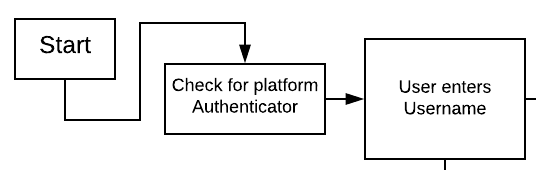
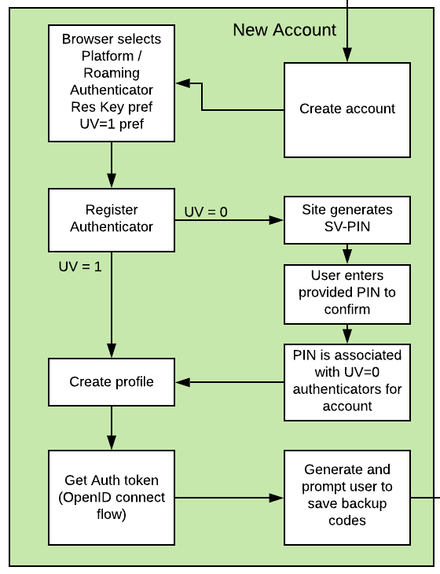
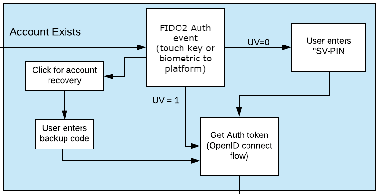
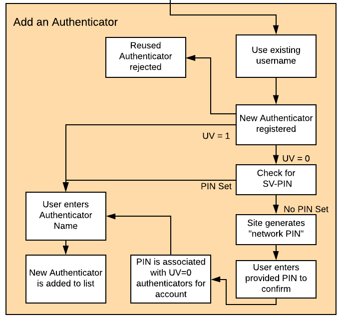
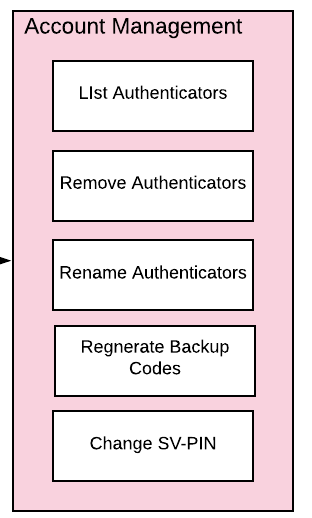

== Identifier First Flow

=== Leading with an Identifier

The username and password combination has long been entrenched as the primary form of authentication for better or for worse, and it has placed strict limits on the flexibility of user authentication flows. With the advent of WebAuthn, and as its adoption gains momentum as an authentication scheme, an opportunity to remove user friction without compromising security or being dependent on a federated identity arise. An identifier first flow should be considered both for new apps and services, or even when transitioning from a legacy username and password to a modern WebAuthn passwordless experience.

In the identifier first flow, a user is only prompted to enter their username, after which they are directed to a single path for authentication using the WebAuthn authenticators associated with their account, creating a smooth user experience which removes the confusion of choice which may occur when moving directly beyond username and password. The user experience is the same, regardless of client or between a platform or roaming authenticator, further removing potential points of friction. The Yubico WebAuthn Starter Kit has implemented an identifier first flow which can be used as a reference architecture, for the aforementioned services.

=== WebAuthn User Verification

One of the potential avenues of attack against WebAuthn is the theft or misuse of a hardware authenticator. To secure against these physical attacks, WebAuthn has the option to require *User Verification (UV)*, namely having the user demonstrate that they are the authorized user for the WebAuthn Authenticator via an authenticator PIN or biometric identifier like a fingerprint. Various WebAuthn authenticators can support different levels of UV, depending on the web browser and host Operating System (OS). The documentation will refer to the case where UV is supported on the authenticator (UV=1) as *User-Verified* authentication or registration.

In order to support all authenticators without compromising security, the environments and authenticators where UV actions are not supported must be taken into account. These cases are referred to as *Server Verified (SV)* authentication and registration. In an SV interaction, the user must still prove that they are the authorized user of the authentication device by supplying a *Server Verified PIN (SV-PIN)*. Unlike a password, the SV-PIN is not directly used to authenticate the user but instead is used only to verify that a user is a legitimate user of the authenticator. This creates an identical user experience to a WebAuthn authenticator secured with an onboard authenticator PIN, and prevents theft of a hardware authenticator from directly compromising an account.

=== Overview

When implementing an identifier first flow via WebAuthn, there are impacts on everything from new account creation to login to credential management. Many of these changes will reduce user friction, and allow for strong authentication to be offered along side increased ease of use. For clarity, each element will be discussed in the sections below.

=== Identifier first flow Start

*Figure 1 - Start Identifier first flow*

As the user accesses the WebAuthn Starter kit, the first event is checking for the existence of a platform authenticator. In general, there are a few logical decisions which can be made with this information. An app may want to list the platform authenticator as an option at registration or authentication, or default to preferring the platform authenticator, while allowing the user to supply roaming authenticators if needed.

Following that, the user is prompted for their username, which represents a unique identifier for the user’s account. The username can be defined by the user, or based off a user’s email or phone number. For the WebAuthn Starter Kit, the username is separate from the user’s email or phone number to demonstrate a basic flow and provide code focused on the WebAuthn implementation. Note that using an identifier such as username or telephone number may reduce privacy, as users can enter known values to see if an account is associated with them - it is up to the architect to decide if this is a concern for their service.

It is important to keep in mind if the username changes, existing authenticators will no longer be able to log into a registered account. This can impact deployments where a user may change their username, or their username is linked to something like a personal email or phone number which may also change.

Optionally, the username can be stored on a local client or via a cookie or token for a web app to remove this requirement after the user has logged in once. If this method is implemented, options should be provided in the login page to allow a user to enter a new username.

Once a username is submitted to the app, a decision point is reached. If the username already exists in the user store, the user is directed to the user login flow. If the username does not exist, the user is directed to the new account creation flow.

=== New Account Creation

*Figure 2 - Create new account flow*

If a username does not already exist, the user is directed to the new account creation flow. The first step is to start the create account process - displaying the username and offering the user an opportunity to return to the previous dialog if they entered the name incorrectly.

Once the user affirms the username is correct, they click on a link to start the WebAuthn Make Credential / Registration event. The WebAuthn Starter kit is configured to prefer Discoverable Credentials and User Verification. The user is allowed to select which authenticator (platform or roaming, if available) to register. If no WebAuthn authenticators are available, the user cannot proceed.

If the WebAuthn Authenticator supports both Discoverable Credentials and User Verification, the process proceeds as normal down a User-Verified registration flow; the WebAuthn framework will prompt the user for the WebAuthn Authenticator PIN or biometric, and upon successful authentication, create the profile for the user account.

If the WebAuthn Authenticator does not support Discoverable Credentials or User Verification, then the secondary path is used, and the user is directed down the Server-Verified registration flow. The WebAuthn framework will follow the standard flow, but not prompt for a user verification. However, the WebAuthn Starter kit will prompt the user to enter a Server-Verified PIN for the user account. The user will then be prompted to enter the provided SV-PIN again to confirm. Note that the user will need to provide the SV-PIN every time that authenticator is used to access their account. The SV-PIN is then saved, and will be used with all Server-Verified authenticators for that account. Upon the successful authentication and confirmation of the SV-PIN, the user’s profile is created.

Once the user’s profile is created, the WebAuthn Starter kit will direct the user back to the first dialog. Upon entering the username, the user will be able to log into their account - the WebAuthn Starter kit will issue their client (browser or client app) an Auth token, as defined in the OpenID connect flow. Finally, on first login, the user will be presented with a list of recovery codes generated by the WebAuthn Starter Kit, used for regaining access to their account in the event they loose their WebAuthn Authenticator. Following that dialog, the user will be passed to the main profile page, and be logged in to the application proper.

=== User Login

*Figure 3 - Existing user login flow*

If a username does exist, the user is directed to the login flow. The entry dialog is a simple page directing them to plug in their authenticator (if using a roaming authenticator), before proceeding. This page also has a link to the account recovery login flow.

Once the user proceeds to the authentication, the WebAuthn Authentication flow proceeds as normal. If the authentication event returns a User-Verified authentication by entering a PIN or biometric, the user is allowed to proceed directly. If the Authentication event returns a Server-Verified authentication, the user is then directed to a new dialog prompting them to enter their SV-PIN. If the SV-PIN is entered incorrectly, the user is returned to the start of the login flow, and prompted to authenticate with their WebAuthn Authenticator again. Entering a correct SV-PIN will allow the user to proceed.

As with the New Account, once the user is authenticated, they will be issued an Auth token as defined by the OpenID connect flow and be directed to the profile page.

=== Account Recovery

Should the user select the Account recovery option, they will be taken to a dialog allowing them to provide a Recovery code. Upon entering the Recovery Code, the user will be issued an Auth Token and be directed to the profile page. Each Recovery code may only be used once - after which, it is flagged as “used” in the database. While not implemented in the WebAuthn Starter kit, it is recommend to log as much information about the session where a Recovery Code is used as possible, in order to identify fraudulent attempts to access a protected account.

=== Adding an Authenticator

*Figure 4 - Adding authenticator to user profile flow*

When adding a new authenticator to the user profile, the username associated with the account will automatically be used, without prompting the user to enter it again. When the authenticator registration begins, the WebAuthn Starter kit will first check to ensure the authenticator has not already been associated with the user account. Reused authenticators will have the registration rejected.

As with the new account creation flow, if the authenticator supports both Discoverable Credentials and User Verification, the registration will proceed as normal down a User-Verified registration flow, with the user entering their PIN or biometric. If the authenticator does not support either Discoverable Credentials or User Verification, but a Server-Verified PIN has already been set for the user’s account, the registration will proceed, and the SV-PIN will be associated with the authenticator. In the event a SV-PIN has not already been provided, the user will be requested to provide one.

Once the registration has completed, the user will be allowed to name the authenticator. Once the authenticator has been named, it will be associated with the user’s account, be able to authenticate the user during login, and be listed in the user’s profile.

=== Account Management

*Figure 5 - User authenticator management flow*

When a User is logged and can access their profile page, they should be able to manage features for accessing their account, including adding, renaming or removing Authenticators, allowing users to manage their devices without requiring admin oversight. It is recommended that logic is included to prevent a user from removing all of their authenticators, leaving them unable to access their account. Further, for higher security, implementations should consider requiring an authentication event from a valid authenticator prior to adding new devices or removing existing ones.

In addition, the user may change their Server-Verified PIN. It is not recommended to enforce a rotation of the SV-PIN as it leads to unnecessary user friction, and unlike a password, the SV-PIN cannot grant access to a user’s account without a registered authenticator.

Finally, users are also given the option to view and regenerate their backup codes. For higher security, consider requiring an authentication event prior to viewing or regenerating the recovery codes.
