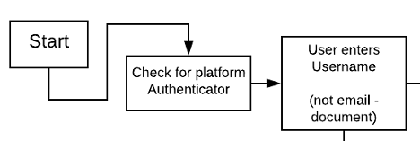
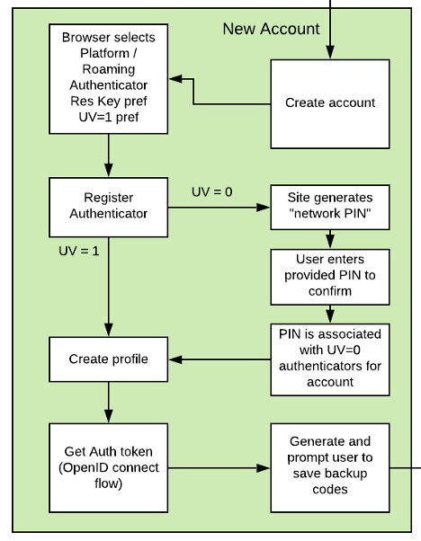
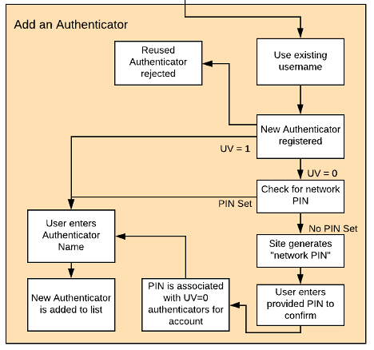

== Identifier First Flow

The username and password combination has been long been entrenched as the primary form of authentication, and placed strict limits on the flexibility of user authentication flows. By transitioning to WebAuthn authentication, many opportunities to remove user friction without compromising security or being dependent on a federated identity arise.

In the identifier first flow, a user is only prompted to enter their username, after which they are directed to a single path for authentication using the WebAuthn Authenticators associated with their account. The user experience is the same regardless of client or between a platform or roaming authenticator. The Yubico WebAuthn Starter Kit has implemented an identifier first flow which can be used as a reference for other services.

==== WebAuthn User Verification

WebAuthn has the option to require User Verification - having the user demonstrate they are the authorized user for the WebAuthn Authenticator via an Authenticator PIN or Biometric like a fingerprint. Various WebAuthn Authenticators can support different levels of User Verification (UV). UV=0 means the authenticator does not support native user verification, while UV=1 supports at least one form of User Verification.

In order to support all authenticators without compromising security, the UV=0 case must be taken into account. To meet this, the WebAuthn Starter kit uses a Network PIN; a value that the user must supply when using a UV=0 Authenticator. Unlike a password, the Network PIN is not directly used to authenticate the user, but instead is used to verify a user owns the authenticator. This creates an identical user experience to a WebAuthn authenticator secured with an on-board PIN.

==== Transitioning from Passwords to Passwordless

An Identity first flow should also be considered a path to transition between the traditional username and password to a more secure passwordless deployment using modern authentication options.

Assuming a traditional authentication flow using username and password, the first step can be to add support for WebAuthn as a second factor authenticator. Many solutions offer this as an optional security step today. As the user is required to provide their identifier in the form of their username at the start of the process, the framework for transitioning to an identifier first flow is already in place.

Once support for WebAuthn is in place as a second factor authentication solution, the next step is to move it from an optional component to a required one in the authentication flow. With the introduction of support for WebAuthn platform authentication on desktop and mobile devices, this becomes less of a burden on the end user. For a successful transition, there are three important changes which must be made to the User flow:

* Existing users must be required to register a WebAuthn Authenticator to their account as part of the login flow.

* New users must be required to register a WebAuthn Authenticator on account creation.
* All users must have the option to add or remove additional authenticators in their account.

At this point, the User Verification capabilities for the WebAuthn Authenticator do not matter, as the password is always provided.

The next step is to transition to only requiring the password when the user is not allowed to provide a PIN or Biometric to their authenticator. The Identifier first flow below describes this process.

==== Passwords vs PINs and Network PINs

Moving from always requiring a password to only requesting a PIN if the user is not required to provide one to an authenticator may feel like moving to a less secure security model. In actuality, by implementing such a flow the major vulnerability of a password is removed. Instead of relying on a password to verify the identity of a user, the authenticator is. The password is only used to verify the authenticator is being used by an authorized party. The threat plane transitions from anyone who can connect to the service to just those who can physically take control of the authenticator device. This is the same model as used with debit cards at ATMs.

Likewise, since a password is no longer used to access an account, the traditional complexity requirements for a PIN can be relaxed. PINs should still be random, but can be shorter, not changed as often, if at all, and not have the same character complexity requirements. Overall, this provides a better user experience with a higher level of user security.

=== Overview

image::identify1-overview.png[]

When implementing an identifier first flow via WebAuthn, there are impacts on everything from new account creation to login to credential management. Many of these changes will reduce user friction, and allow for strong authentication to be offered along side increased ease of use. For clarity, each element will be discussed in the sections below.

==== Identifier first flow Start

As the user accesses the WebAuthn Starter kit, the first event is checking for the existence of a platform authenticator. In general, there are a few logical decisions which can be made with this information. An app may want to list the platform authenticator as an option at registration or authentication, or default to preferring the platform authenticator, while allowing the user to supply roaming authenticators if needed.

Following that, the user is prompted for their username, which represents a unique identifier for the user’s account. The username can be defined by the user, or based off a user’s email or phone number. For the WebAuthn Starter Kit, the username is separate from the user’s email or phone number to demonstrate a basic flow and provide code focused on the WebAuthn implementation.

Optionally, the username can be stored on a local client or via a cookie or token for a web app to remove this requirement after the user has logged in once. If this method is implemented, options should be provided in the login page to allow a user to enter a new username.

Once a username is submitted to the app, a decision point is reached. If the username already exists in the user store, the user is directed to the user login flow. If the username does not exist, the user is directed to the new account creation flow.

==== New Account Creation

If a username does not already exist, the user is directed to the new account creation flow. The first step is to start the create account process - displaying the username and offering the user an opportunity to return to the previous dialog if they entered the name incorrectly.

Once the user affirms the username is correct, they click on a link to start the WebAuthn Make Credential / Registration event. The WebAuthn Starter kit is configured to prefer Discoverable Credentials and User Verification. The user is allowed to select which authenticator (platform or roaming, if available) to register. If no WebAuthn authenticators are available, the user cannot proceed.

If the WebAuthn Authenticator supports both Discoverable Credentials and User Verification, the process proceeds as normal; the WebAuthn framework will prompt the user for the WebAuthn Authenticator PIN or biometric, and upon successful authentication, create the profile for the user account. The Authenticator used will be automatically named “Primary Authenticator”.

If the WebAuthn Authenticator does not support Discoverable Credentials or User Verification, then the secondary path is used. The WebAuthn framework will follow the standard flow, but not prompt for a user verification. However, the WebAuthn Starter kit will generate a “Network PIN” for the user account. The user will then be prompted to enter the provided Network PIN again to confirm, along with a dialog informing the user that the Network PIN will be required every time that authenticator is used to  uthenticate to their account. The Network PIN is then saved, and will be used with all UV=0 authenticators for that account. Upon the successful authentication and confirmation of the Network PIN, the user’s profile is created. The Authenticator used will be automatically named “Primary Authenticator”.

Once the user’s profile is created, the WebAuthn Starter kit will issue their client (browser or client app) an Auth token, as defined in the OpenID connect flow. Finally, the user will be presented with a list of backup codes generated by the WebAuthn Starter Kit, used for regaining access to their account in the event they loose their WebAuthn Authenticator. Following that dialog, the user will be passed to the main profile page, and be logged in to the application proper.

==== User Login

image::identify4-user-login.png[]

If a username does exist, the user is directed to the login flow. The entry dialog is a simple page directing them to plug in their authenticator (if using a roaming authenticator), before proceeding. This page also has a link to the account recovery login flow.

Once the user proceeds to the authentication, the WebAuthn Authentication flow proceeds as normal. If the authentication event returns a UV=1 authentication by entering a PIN or biometric, the user is allowed to proceed directly. If the Authentication event returns a UV=0 authentication, the user is then directed to a new dialog prompting them to enter their Network PIN. If the PIN is entered incorrectly, the user is returned to the start of the login flow, and prompted to authenticate with their WebAuthn Authenticator again. Entering a correct Network PIN will allow the user to proceed.

As with the New Account, once the user is authenticated, they will be issued an Auth token as defined by the OpenID connect flow and be directed to the profile page.

===== Account Recovery

Should the user select the Account recovery option, they will be taken to a dialog listing their available options. Backup codes will always be available, but OTP over SMS or other options will only work if the user has enabled them in their profile page. Upon entering the backup code, or OTP provided, the user will be issued an Auth Token and be directed to the profile page. Each backup code or OTP will only be able to be used once.

==== Adding an Authenticator

When adding a new authenticator to the user profile, the username associated with the account will automatically be used, without prompting the user to enter it again. When the authenticator registration begins, the WebAuthn Starter kit will first check to ensure the authenticator has not already been associated with the user account. Reused authenticators will have the registration rejected.

As with the new account creation flow, if the authenticator supports both Discoverable Credentials and User Verification, the registration will proceed as normal, with the user entering their PIN or biometric. If the authenticator does not support either Discoverable Credentials or User Verification, but a Network PIN has already been set for the user’s account, the registration will proceed, and the Network PIN will be associated with the authenticator. In the event a Network PIN has not been provided, one will be generated for the user to enter to confirm.

Once the registration has completed, the user will be allowed to name the authenticator. Once the authenticator has been named, it will be associated with the user’s account, be able to authenticate the user during login, and be listed in the user’s profile.
