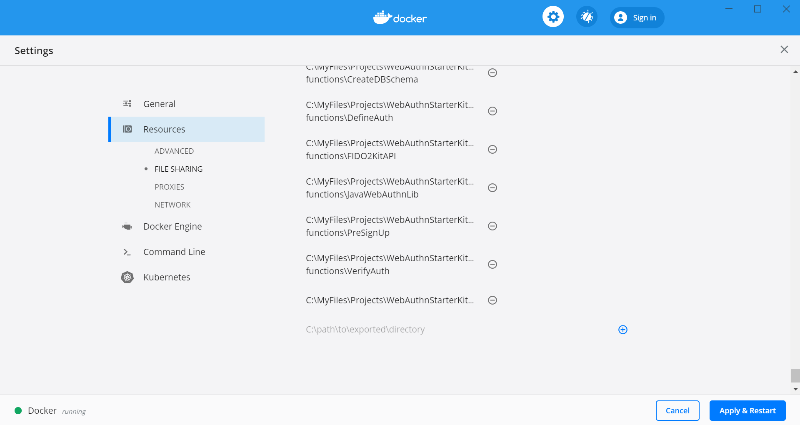
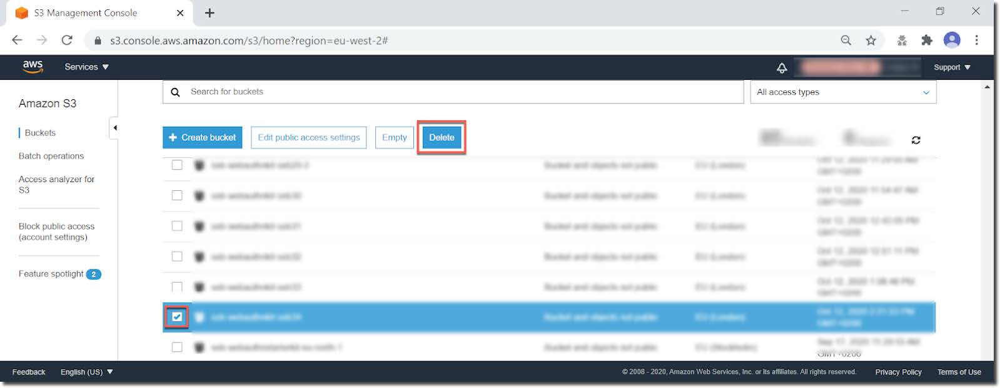
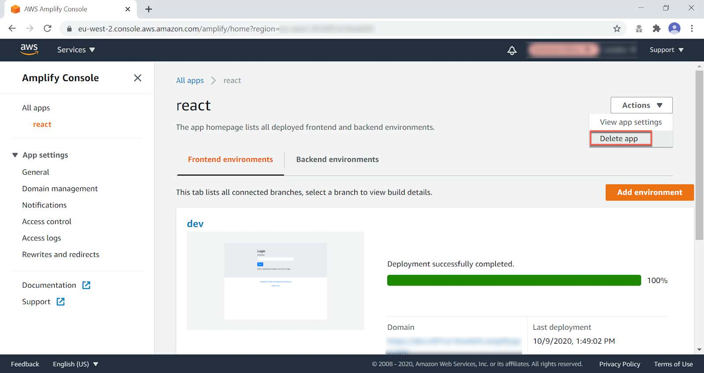

== Automated WebAuthnKit deployment at AWS

=== Introduction

This tutorial describes the complete and automated deployment of the WebAuthn Starter Kit at the AWS backend and frontend. The automated deployment is based on Docker, and the deployment commands are executed by using a shell script: a PowerShell script for Windows and a Bash script for MacOS/Linux.

The source code used to build the Yubico WebAuthn Starter Kit solution is available in the included repository.

The complete deployment of the WebAuthn Starter Kit at AWS includes build, upload, deployment and configuration of the following AWS services:

*AWS backend:*

 * AWS S3:

  - One S3 bucket for hosting the WebAuthn Starter Kit binaries and configuration files

 * AWS RDS database:

  - Aurora Serverless MySQL compatible database with tables used to store the user credential attributes

 * AWS Cognito:

  - One Amazon Cognito User Pool

 * AWS Lambda:

    - Four AWS Lambda Functions used as custom triggers with Cognito User Pool

    - One AWS Lambda Function (Java) as the WebAuthn Relying Party library

 * AWS API Gateway

  - One RESTful API regional endpoint for the WebAuthn Starter Kit

*AWS frontend:*

 * AWS Amplify:

  - Configured with the React web app for the browser interaction with the WebAuthn functions

*AWS deployment and configuration:*

 * AWS CloudFormation

  - Configured with the stack for the WebAuthn Starter Kit

The WebAuthn Starter Kit backend utilizes the AWS Serverless Application Model (AWS SAM) open-source framework for building serverless applications on AWS. Hence, the WebAuthn Starter Kit will be using the SAM template specification that defines this application's APIs, database, Lambda functions, and event source mappings. This single SAM template file operates as a one-click deployment, repeatable extension of AWS CloudFormation.

Once you have deployed the WebAuthn Starter Kit backend at AWS via SAM, the provided React web client can be used to demonstrate the WebAuthn flows.

=== Pre-requisites

==== Client operating systems

The client workstation can be one of the following:

 * Microsoft Windows 10 (to be used with the PowerShell script)

 * Apple MacOS Catalina 10.15 or higher (to be used with the Bash script)

 * Linux Ubuntu v18.04 or higher (to be used with the Bash script)

==== Software and tools

Make sure that the following software tools are configured at your local machine:

 1. Install the
 link:https://docs.aws.amazon.com/cli/latest/userguide/install-cliv2.html[AWS CLI v2]

 2. Install
 link:https://docs.docker.com/get-docker/[Docker]

3. If Installing via Windows PowerShell, install the link:https://docs.aws.amazon.com/powershell/latest/userguide/pstools-getting-set-up-windows.html[AWS Tools for PowerShell]

==== AWS accounts and credentials

Make sure to have the following AWS accounts and credentials configured:

 * link:https://github.com/awsdocs/aws-sam-developer-guide/blob/master/doc_source/serverless-getting-started-set-up-credentials.md[Setup the AWS Credentials] at your local machine.

* Configure the AWS IAM credentials at your local machine by following the steps in link:https://docs.amplify.aws/start/getting-started/installation/q/integration/react#install-and-configure-the-amplify-cli[this tutorial]

 * The Starter Kit will be executing deployment commands using your credentials configured within the AWS CLI.

=== Download or Clone the WebAuthn Starter Kit Repository

First, at the workstation, create a folder for the WebAuthnKit project.

It is possible to either clone the WebAuthnKit GitHub repo, or download the contents as a zip-file. Both options will provide the complete set of source code, scripts and tools.

Developers who are used to Git may continue using that option for cloning the WebAuthnKit GitHub repo. For users who may not use Git that often, the zip-file download may be a more convenient option.

==== Download the WebAuthn GitHub repo
It is possible to download the contents as a zip-file provided by Yubico. Download the WebAuthnKit to the local project folder and extract the zip-file. The root of the local WebAuthnKit folder is denoted as `~\WebAuthnKit\`.

The zip files for the release to the WebAuthn Starter Kit can be downloaded link:https://github.com/YubicoLabs/WebAuthnKit/releases/[here.]

==== Clone the WebAuthn GitHub repo
*Prerequisites*

* Install link:https://git-scm.com/[Git] at the workstation.
* Configure Git at the local machine for SSH access to the link:https://github.com/Yubico/WebAuthnKit[YubicoLabs WebAuthnKit GitHub Repository].

===== Cloning the repository
Clone the link:https://github.com/Yubico/WebAuthnKit[WebAuthnKit GitHub Repository] to the local workstation as follows.

*Step 1.1.* At the workstation, start a PowerShell or Terminal prompt and navigate to the WebAuthnKit project folder.

*Step 1.2.* Clone the link:https://github.com/Yubico/WebAuthnKit.git[Yubico WebAuthn Starter Kit Repository] to your local project folder by running the following command:
----
$ git clone https://github.com/Yubico/WebAuthnKit.git
----
When the WebAuthnKit GitHub repo has been cloned to the local workstation, the root folder is labeled “WebAuthnKit”.

*Step 1.3.* Navigate to the WebAuthnKit folder and switch to the Dockerized branch:

----
cd .\WebAuthnKit\
git switch dockerized
----

=== Windows PowerShell script

This section explains how to use the Windows PowerShell script, which manages the complete build and deployment of WebAuthnKit at the AWS backend, the AWS frontend, and the additional steps.

*Note:* The Windows PowerShell script can only be used on Windows 10 workstations. If using Windows Powershell, ensure the link:https://docs.aws.amazon.com/powershell/latest/userguide/pstools-getting-set-up-windows.html[AWS Tools for PowerShell] are installed.

==== Set execution policy

*Step 2.1* In order to allow the PowerShell script to execute properly, run the Windows PowerShell as Administrator.

image::auto2-run-powershell-as-administrator-v1.jpg[]
*Figure 1 - Run PowerShell as Administrator*

*Step 2.2* In the PowerShell prompt, execute the following command:

    > Set-ExecutionPolicy -ExecutionPolicy Unrestricted

This gives the PowerShell app the necessary privileges to execute the WebAuthnKit deployment PowerShell script.

*Step2.3* Finally, close the PowerShell app.

==== Configuring Docker for Windows

Docker is used for building and deploying several WebAuthnKit components at AWS.

===== Configure Docker to use Linux containers

When Docker is used for building the WebAuthnKit, also on a Windows machine, it needs to be configured to use Linux containers. This is the default setting, but it is recommended to verify this. Right-click on the Docker Desktop icon in the tracemenu to ensure that Linux containers are used. (This can be checked by Docker displaying “Switch to Windows containers”, which means that Linux containers are active.)

image::auto2-docker-desktop-tray-icon-v1.png[]
*Figure 2 -Docker Desktop tray icon*

==== Configure Docker’s file sharing permissions

In order to give the Docker container permissions to access the WebAuthnKit folders at the Windows machine, it is necessary to configure Docker as follows.

*Step 3.1* If Docker is used without the WSL 2 based engine (which is the default setting for Windows 10) it is necessary to configure the file sharing permissions for Docker.

image::auto4-using-docker-without-wsl-2-engine.jpg[]
*Figure 3 - Using Docker without the WSL 2 based engine*

*Step 3.2.* Right-click on the Docker Desktop icon in the tracemenu and select Settings.

*Step 3.3.* In the Docker Settings GUI, select Resources and File Sharing.

image::auto3-config-docker-desktop-file-sharing-v1.png[]
*Figure 4 - Configuring Docker Desktop file sharing*

*Step 3.4.* Press the “+” button in the Docker Desktop GUI, and the Select Folder GUI appears.

image::auto4-add-folder-docker-desktop-sharing-v1.png[]
*Figure 5 - Adding folder for Docker Desktop file sharing*

*Step 3.5.* Select your folder for the WebAuthnKit project, or a folder higher up, to give Docker file sharing permissions to all files and subfolders under the selected folder.

*Hint:* If you are planning to do multiple WebAuthnKit deployments, it makes sense to give Docker file sharing permissions to the folder with all WebAuthnKit deployments.

*Step 3.6.* Finally, press the button “Apply & Restart” in the Docker Desktop.

*Figure 6 - Finalizing Docker Desktop file sharing*

*Warning:* If the Docker Desktop is not configured for file sharing, then Docker will launch several pop-up GUIs with notifications to
link:https://docs.docker.com/docker-for-windows/#file-sharing[allow file sharing on demand] for each deployment.

==== Alternative solution: Configure Docker to use the WSL 2 based engine

An alternative solution to the file sharing settings is to configure Docker to use the WSL 2 based engine.

*Step 4.1.* Right-click on the Docker Desktop icon in the tracemenu and select Settings.

*Step 4.2.* In the Docker Settings GUI, select General.

*Step 4.3.* Mark the checkbox “Use the WSL 2 based engine”.

image::auto8-configure-docker-use-wsl-2-engine-v1.jpg[]
*Figure 7 - Configure Docker to use the WSL 2 based engine*

Docker will provide instructions to install the WSL 2 based engine at the computer. It may be necessary to restart the computer.

The file sharing network option will disappear when the WSL 2 based engine is configured.

==== Editing the PowerShell script configuration file
The PowerShell script configuration file, `~\WebAuthnKit\scripts\PowerShell\deployStarterKitPs.json`, should be reviewed and, if needed, edited.

    {
    "AwsCliProfile": "",
    "AwsRegion":"",
    "S3BucketName":"",
    "CfStackName":"",
    "Suffix":"",
    "UserPoolName":"",
    "DatabaseName":"",
    "DatabaseMasterUsername":"",
    "DatabaseMasterPassword":"",
    "DefineAuthChallengeFuncName":"",
    "CreateAuthChallengeFuncName":"",
    "VerifyAuthChallengeFuncName":"",
    "WebAuthnKitApiName":"",
    "WebAuthnKitApiFuncName":"",
    "PreSignUpFuncName":"",
    "JavaWebAuthnLibFuncName":"",
    "CreateDatabaseSchemaFuncName":"",
    "CreateDatabaseSchemaCallerFuncName":"",
    "AmplifyHostingAppName":"",
    "AmplifyBranchName":""
    }

In particular, the `AwsRegion` parameter must be set to a valid AWS region for your AWS Cognito deployment. See the guide for manually deploying the WebAuthn backend for information on AWS regions that are supported for AWS Cognito if the AwsRegion parameter is not set, the PowerShell script will prompt the user to enter it.

The `Suffix` parameter must be set to an alphanumeric string of maximum five lower-case characters. If the `Suffix` parameter is not set, the PowerShell script will set this to a random alphanumeric string of five lower-case characters.

If the `DatabaseMasterPassword` parameter is not set, the PowerShell script will set this to a random sixteen character string.

All other parameters that are not specified in the configuration file will be set to default values, and the `Suffix` will be appended to these default values.

If a parameter is declared in the configuration file, it will be used by the PowerShell script exactly as declared, without appending any suffix.

==== Running the PowerShell script

The Windows PowerShell script for deploying the WebAuthn Starter Kit is included in the zip file of the repository.

*Step 5.1.* In order to run the PowerShell script, open a PowerShell prompt and navigate to the folder `~\WebAuthnKit\scripts\PowerShell\`.

*Step 5.2.* Execute the command `.\deployStarterKit.ps1`.

    cd ~\WebAuthnKit\scripts\PowerShell\
    .\deployStarterKit.ps1

This will execute the PowerShell script that builds and deploys WebAuthnKit at AWS, launching a Docker instance to build and deploy the WebAuthn Starter Kit back-end server and front-end client components The events of the deployment should be displayed through the command line interface. The deployment at AWS takes approximately 10 minutes to create all resources.

=== Linux/MacOS Bash script

This section explains how to use the Linux/MacOS Bash script, which manages the complete build and deployment of WebAuthnKit to AWS.

*Note:* The Bash script can only be used on Linux/MacOS workstations.

==== Editing the Linux/MacOS Bash script configuration file

The Linux/MacOS Bash script configuration file, can be found under `~/ WebAuthnKit/scripts/Mac-Linux`.

    {
      "AWS_CLI_PROFILE": "",
      "AWS_REGION":"",
      "S3_BUCKET_NAME":"",
      "CF_STACK_NAME":"",
      "SUFFIX":"",
      "USER_POOL_NAME":"",
      "DATABASE_NAME":"",
      "DATABASE_MASTER_USERNAME":"",
      "DATABASE_MASTER_PASSWORD":"",
      "DEFINE_AUTH_CHALLENGE_FUNC_NAME":"",
      "CREATE_AUTH_CHALLENGE_FUNC_NAME":"",
      "VERIFY_AUTH_CHALLENGE_FUNC_NAME":"",
      "WEBAUTHN_KIT_API_NAME":"",
      "WEBAUTHN_KIT_API_FUNC_NAME":"",
      "PRE_SIGNUP_FUNC_NAME":"",
      "JAVA_WEBAUTHN_LIB_FUNC_NAME":"",
      "CREATE_DATABASE_SCHEMA_FUNC_NAME":"",
      "CREATE_DATABASE_SCHEMA_CALLER_FUNC_NAME":"",
      "AMPLIFY_HOSTING_APP_NAME":""
    }

The script can execute without any modification to the configuration file, however, there’s some defaults that you may want to override. Some notes about the configuration:

The `SUFFIX` parameter must be set to an alphanumeric string of maximum five lower-case characters. If the `SUFFIX` parameter is not set, the Bash script automatically sets a random value for you.

If the `DATABASE_MASTER_PASSWORD` parameter is not set, the Bash script will set this to a random sixteen character string.

All other parameters that are not specified in the configuration file will be set to default values, and the `SUFFIX` will be appended to these default values.

If a parameter is declared in the configuration file, it will be used by the Bash script exactly as declared, without appending any suffix.

==== Running the Bash script

The MacOS/Linux Bash script for deploying the WebAuthn Starter Kit is included in the provided download or repository `~ /WebAuthnKit/scripts/Mac-Linux/deployStarterKit.sh`.

*Step 6.1.* Open a Terminal window and navigate to the script folder `~\WebAuthnKit\scripts\Mac-Linux\`.

*Step 6.2.* Execute the command `.\deployStarterKit.sh`.

    cd ~\WebAuthnKit\scripts\Mac-Linux\
    .\deployStarterKit.sh

This will execute the Bash script that builds and deploys WebAuthnKit at AWS, launching a Docker instance to build and deploy the WebAuthn Starter Kit back-end server and front-end client components. The events of the deployment should be displayed through the command line interface. The deployment at AWS takes approximately 10 minutes to create all resources.

=== Deployment Failures and Rollbacks

If the deployment fails and is rolled back by AWS CloudFormation, the CloudFormation Stack, S3 bucket, and potentially, the AWS Amplify app must be deleted before it can be deployed again, particularly if the same `SUFFIX` is used for subsequent deployments.

=== Teardown

The CloudFormation stack that is created during deployment defines all the resources deployed to your AWS account.

*Step 7.1* If you are done building and testing, nearly all the resources just created can be deleted by simply removing the CloudFormation stack. Remove the stack within the AWS Management Console > Services > CloudFormation (specific region) > Stacks.

image::auto9-listing-cloudformation-stacks-v1.jpg[]
*Figure 8 - Listing the CloudFormation Stacks*

*Step 7.2* Select the stack to be deleted, and it will be displayed in a new window (as shown below).

image::auto10-delete-cloudformation-stacks-v1.jpg[]
*Figure 9 - Deleting a CloudFormation Stack*

*Step 7.3* Press the Delete button to delete the CloudFormation stack.

==== Delete the AWS S3 bucket

*Step 8.1* The S3 bucket can be found in the AWS Console under Services > Amazon S3.

*Figure 10 - Deleting an S3 Bucket*

*Step 8.2* Select the S3 bucket to be deleted and press the Delete button.

==== Delete the AWS Amplify apps

Also make sure that the AWS Amplify apps have been deleted.

*Step 9.1* The AWS Amplify apps can be found in the AWS Console under Services > AWS Amplify.

*Step 9.2* Select the app to be deleted, which shows the app information below.

*Figure 11 - Deleting an Amplify web app*

*Step 9.3* Select Actions and press the option Delete app in the dropdown Actions list.

=== Getting started with the clients

Once the deployment is completed, a web browser with the React web client is launched and you can begin testing user registration and authentication connected to your AWS backend. The client source code for the React app hosted on AWS Amplify is available in the provided repository.
