== Tutorial: Manually deploy and troubleshoot WebAuthnKit backend at AWS

=== Introduction

The complete and automated deployment of the WebAuthn Starter Kit backend at AWS is described in the tutorial Automated WebAuthnKit deployment at AWS, which describes the pre-requisites, installation packages, source code and scripts needed for the deployment of the WebAuthn Starter Kit at AWS.

This guide, however, describes how to *manually* deploy the WebAuthn Starter Kit backend at AWS. Furthermore, it contains a troubleshooting section for identifying and fixing issues that may occur at the AWS backend.

=== Prerequisites

See the prerequisites section in the tutorial Automated WebAuthnKit deployment at AWS.

=== Clone or download the GitHub project

See the section on how to Clone or download the GitHub project in the tutorial Automated WebAuthnKit deployment at AWS.

=== Create an S3 bucket in AWS

Before the WebAuthn Starter Kit can be deployed a designated S3 bucket must be created in the AWS account. Also, the S3 bucket should be created in the same AWS Region in which the WebAuthn Starter Kit will be deployed. Furthermore, make sure that AWS Cognito is available for the S3 bucket’s region. For example, Cognito is available for the region `eu-west-2`, but not for `eu-north-1`. The regions where Cognito is currently available are displayed with white text in the drop-down menu under the region button.

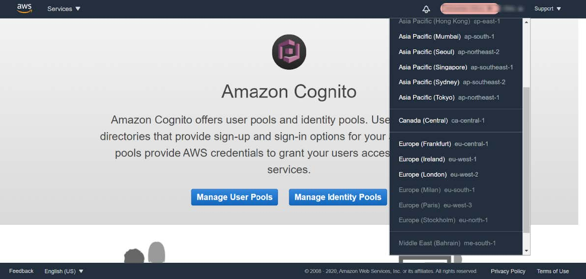
*Figure 1 - Check the AWS Cognito regions*

There are two ways to create an S3 bucket at AWS:

 * Create an S3 bucket manually with the AWS console

 * Create an S3 bucket with a script using the AWS tools at the workstation

==== Create an S3 bucket manually with the AWS console

The S3 buckets can be found in the AWS console by selecting Services followed by S3.

Create an S3 bucket by using the AWS console according to the instructions in the
link:https://docs.aws.amazon.com/AmazonS3/latest/user-guide/create-bucket.html[AWS guide]. Use the default settings when creating the S3 bucket.

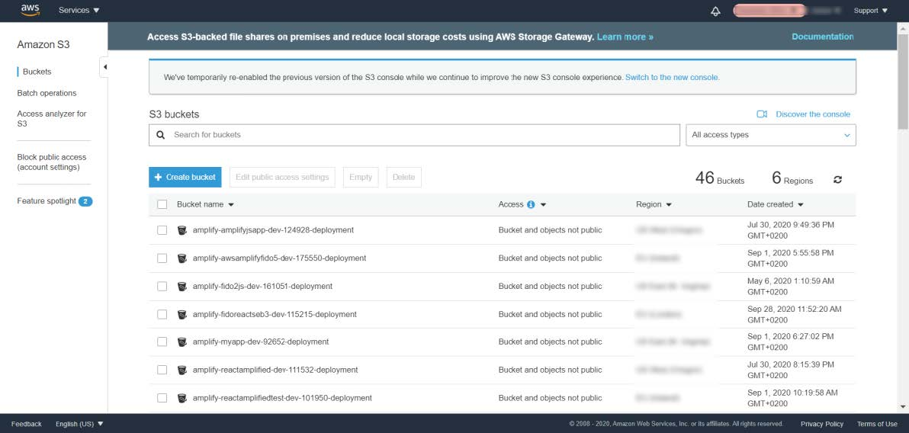
*Figure 2 - Create an S3 bucket in the AWS Console*

==== Create an S3 bucket with a script using the AWS tools

Another option is to create the S3 bucket by using a script with the
link:https://awscli.amazonaws.com/v2/documentation/api/latest/reference/s3api/create-bucket.html[AWS tools] at the workstation. A PowerShell prompt or Terminal could be used for this purpose.

Syntax of the AWS command for creating an S3 bucket in AWS:

    aws s3api create-bucket
    --bucket <bucket-name>
    --region <region-value>
    --create-bucket-configuration
    LocationConstraint=<region-value>

=== Build the SAM package

*Step 1.1:* At your workstation, use a Terminal or Command Prompt to run the WebAuthnKit SAM build and package script from the same directory where the SAM template `template.yaml` is located. By default, the path is `~/WebAuthnKit/backend`. This build is automated with the SAM template.

The SAM build and package command will process the SAM template, application code, and build dependencies. Built artifacts will be written to `. aws-sam/build` folder in the local project folder and uploaded to the designated S3 bucket.

*Step 1.2:* Change the `--profile` to match what you have in `~<user-home>/.aws/credentials` for running the AWS CLI and SAM commands. Then execute the command in a MacOS or Linux Terminal or Windows Command Prompt:

    sam build --use-container
    --skip-pull-image && sam package
    --s3-bucket <s3BucketName>
    --profile <wsCliProfile>

*Step 1.3:* When using Windows PowerShell, the separator `&&` must be changed to `;`.

    sam build --use-container
    --skip-pull-image ; sam package
    --s3-bucket <s3BucketName>
    --profile <awsCliProfile>

*Step 1.4:* As part of this SAM command, the built artifacts will be uploaded to the S3 bucket. The upload to the S3 bucket takes a few minutes. It is worthwhile to check in the AWS S3 bucket that the packages have been properly uploaded.

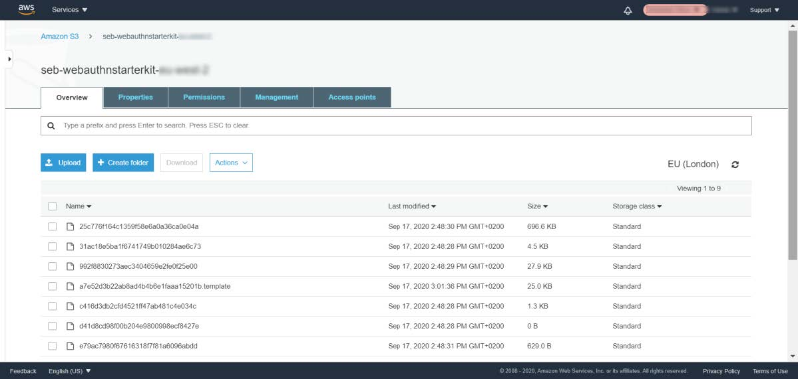
*Figure 3 - Checking the S3 bucket*

Next, the WebAuthnKit package will be deployed in the AWS environment using the SAM deploy command below.

=== Deploy the SAM package at AWS

The SAM deploy script below will take the SAM package and artifacts (already uploaded to S3 in the previous section) and deploy them to the AWS environment via CloudFormation. This deployment is automated with the SAM template.

*Note:* All variables marked with `$` should be replaced with the values to match your deployment.

    sam deploy --s3-bucket <s3BucketName>
      --stack-name <cfStackName>
      --profile <awsCliProfile>
      --region <awsRegion>
      --capabilities <capabilityIam>
      --parameter-overrides
      UserPoolName=<userPoolName>
      DatabaseName=<databaseName>
      MasterUserName=<databaseMasterUsername>
      MasterUserPassword=<databaseMasterPassword>
      DefineAuthChallengeFuncName=
      <defineAuthChallengeFuncName>
      CreateAuthChallengeFuncName=
      <createAuthChallengeFuncName>
      VerifyAuthChallengeFuncName=
      <verifyAuthChallengeFuncName>
      WebAuthnKitAPIFuncName=
      <webAuthnKitApiFuncName>
      PreSignUpFuncName=<preSignUpFuncName>
      JavaWebAuthnFuncName=
      <javaWebAuthnLibFuncName>
      WebAuthnKitAPIName=<webAuthnKitApiName>
      CreateDBSchemaFuncName=
      <createDatabaseSchemaFuncName>
      CreateDBSchemaCallerFuncName=
      <createDatabaseSchemaCallerFuncName>
      AmplifyHostingAppName=<amplifyHostingAppName>

The events of the deployment should be displayed through the command line interface.

The SAM deployment at AWS takes approximately 5 minutes to create all resources and 5 minutes to delete all resources.

=== Troubleshooting

If the deployment at the AWS backend is not properly configured, it can be verified and debugged according the guidelines in this troubleshooting section.

==== Update the environment variables for AWS Lambda

*Note:* Before checking the environment environments according to this section, make sure to deploy the React component at AWS Amplify before.

*Step 2.1:* Login to the AWS console, and select the Service called Lambda.

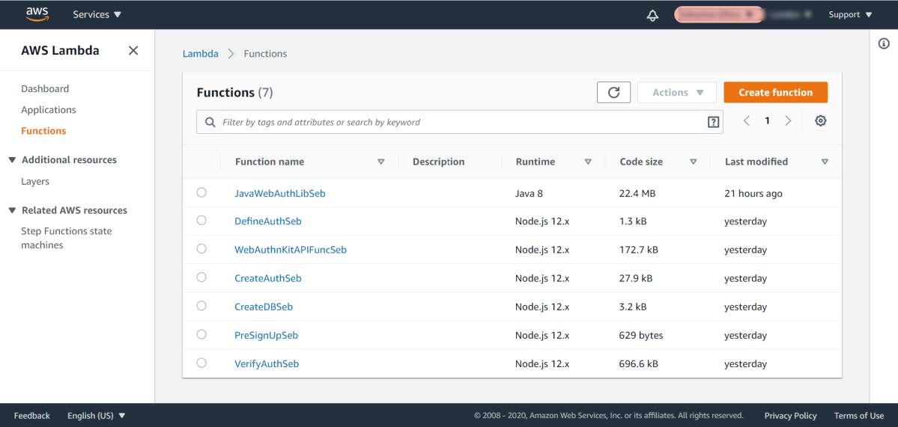
*Figure 4 - Listing the Lambda Functions*

*Step 2.2:* In the list of Function names, select the Function called `JavaWebAuthLib<suffix>`. In this example, the Function is called `JavaWebAuthLibSeb`.

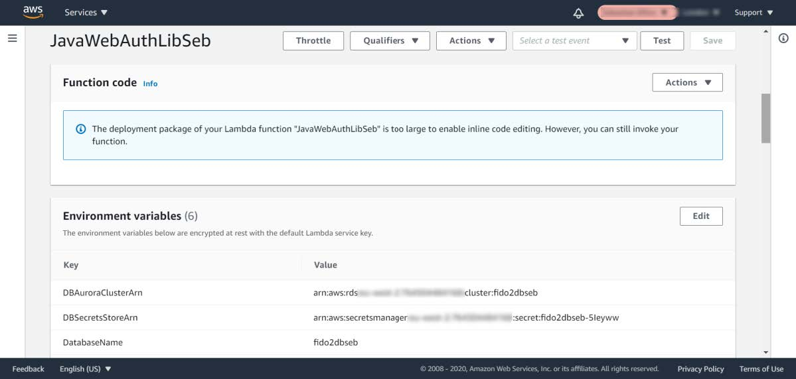
*Figure 5 - Checking the Lambda Function’s environment variables*

*Step 2.3:* Scroll down to the environment variables and press the *Edit* button.

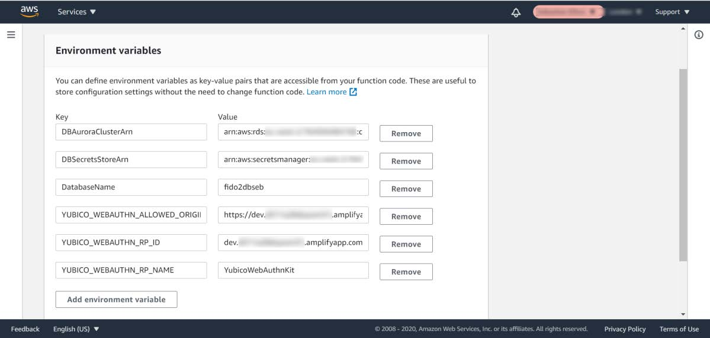
*Figure 6 - Editing the Lambda Function’s environment variables*

*Step 2.4:* Press the button *Add environment variable* in order to add three environment variables that are declared in the `JavaWebAuthnLib Config.java` file:

 * `YUBICO_WEBAUTHN_ALLOWED_ORIGINS`: This environment variable should be set to the complete URL that is configured for the A WS Amplify React front-end. For example: `https://dev.d311a28dcpwm31.amplifyapp.com`.

 * `YUBICO_WEBAUTHN_RP_ID`: This environment variable should be set to the host name that is configured for the AWS Amplify React front-end. For example: `dev.d311a28dcpwm31.amplifyapp.com`.

 * `YUBICO_WEBAUTHN_RP_NAME`: This environment variable could be set to any description. Example: `YubicoWebAuthnKit`.

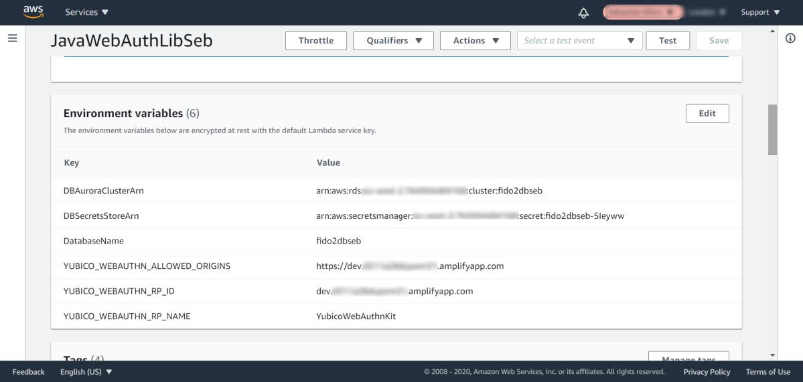
*Figure 7 - Saving the Lambda Function’s environment variables*

*Step 2.5:* Press the *Save* button to save the changes.

==== Verifying the RDS database tables

In order to verify that the Aurora RDS database tables have been properly created by the SAM deploy script, take the following actions.

*Step 3.1:* Login to the AWS console, and select the *Service* called `Amazon RDS`.

*Step 3.2:* Connect to the RDS database according to the parameters that were set in the SAM deploy script.

*Hint:* The Secrets manager ARN value can be found in the SAM deploy script output.

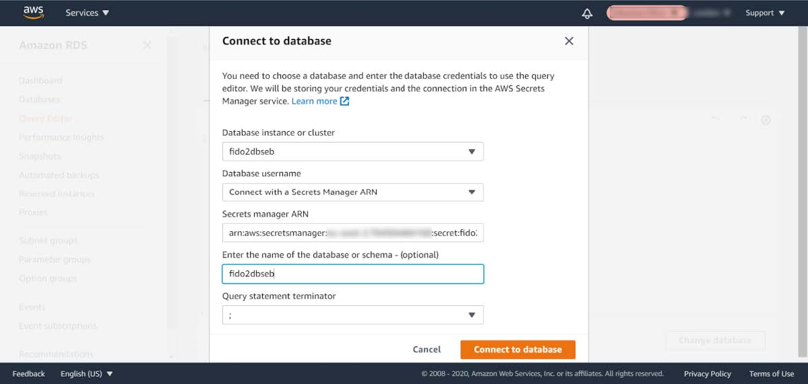
*Figure 8 - Connecting to the RDS database*

*Step 3.3:* When you are logged in to the RDS database, select *Query Editor* in the left-hand pane.

*Step 3.4:* In the Query Editor window, enter the SQL statement:

    show tables;

*Step 3.5:* Check the returned rows in the output:

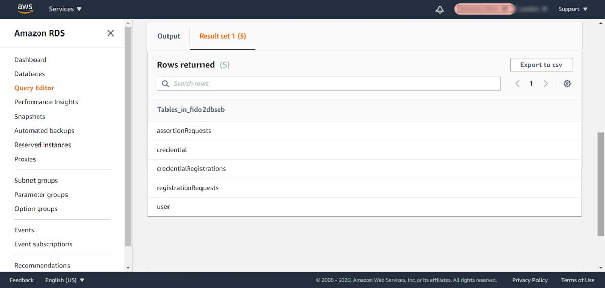
*Figure 9 - Checking the database tables*

*Step 3.6:* Then visit the WebAuthnKit GitHub repo and view the file `database.md`.

*Step 3.7:* Compare the tables in the AWS RDS database with the tables in the GitHub file `database.md`. If there are any tables missing in the AWS RDS database, they need to be manually added.

In the screenshot example above, the database table `networkPin` is missing in the AWS RDS database.

*Step 3.8:* In order to add the database table `networkPin`, copy the entire SQL transaction `CREATE TABLE networkPin (…)` from the GitHub file `database.md`.

*Step 3.9:* Then paste the `CREATE TABLE networkPin (…)` in the AWS RDS query editor.

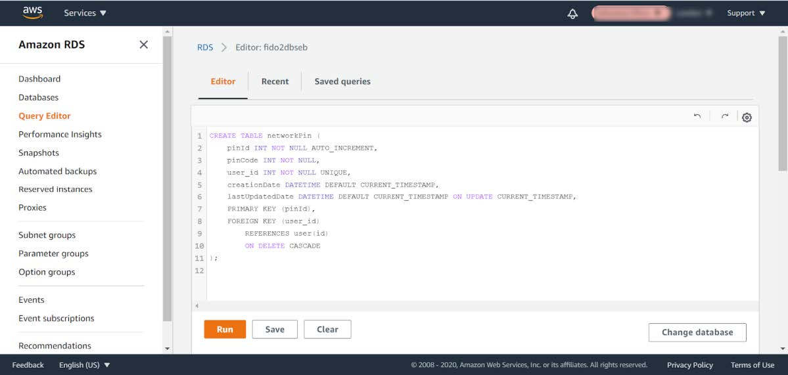
*Figure 10 - Creating a database table*

*Step 3.10:* Press the *Run* button to execute the SQL transaction.

*Step 3.11:* Then execute the SQL statement `show tables;` again in the Query Editor and verify in the output section that all database tables have been created.

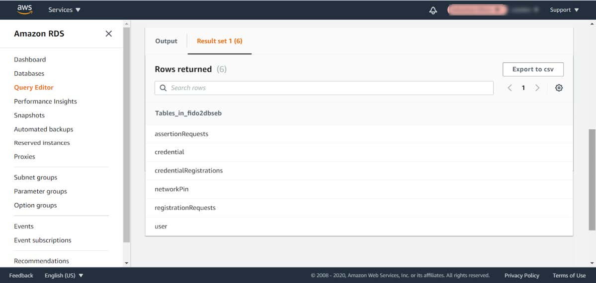
*Figure 11 - Verifying the database tables*

==== AWS database charge
The AWS RDS database engine used by the WebAuthn Starter Kit supports Amazon Aurora Serverless and only supports a minimum of db.t2.small, which is not part of the AWS Free Tier. Hence, the WebAuthn Starter Kit does incur a small charge for using Amazon RDS Aurora Serverless outside of the AWS Free Tier.

To reduce the charges, the scaling capacity is reduced to one (1) and the AWS RDS database is set to pause after two (2) hours of inactivity.

After the AWS RDS database has been paused after two hours of inactivity, there could be a cold start that may result in a failed WebAuthn registration and possibly also failed WebAuthn authentication. A simple retry will resolve the issue.

If there is any concern with AWS RDS database charges after the deployment, it is possible to delete the CloudFormation Stack and S3 bucket which will delete any of those AWS resources being used by the WebAuthn Starter Kit.

==== Re-build and re-deploy JavaWebAuthnLib.jar

If the `JavaWebAuthnLib.jar` file was not properly built and deployed by the SAM build command, it can be re-built by using Apache Maven and uploaded manually to AWS.

===== Install Java JDK and Apache Maven

If such build is required, install the Java SDK and Apache Maven as described below:

*Step 4.1:* Install
link:https://www.oracle.com/java/technologies/javase/javase-jdk8-downloads.html[Java JDK] (to be used for Apache Maven). Set
link:https://www.java.com/en/download/manual.jsp[JAVA_HOME] as environment variable and in the path.

*Step 4.1:* Install
link:http://maven.apache.org/install.html[Apache Maven] and set the environment variables
link:https://howtodoinjava.com/maven/how-to-install-maven-on-windows/[MAVEN_HOME, M2_HOME] and in the Path.

Example of Maven and Java environment variables on Windows 10:

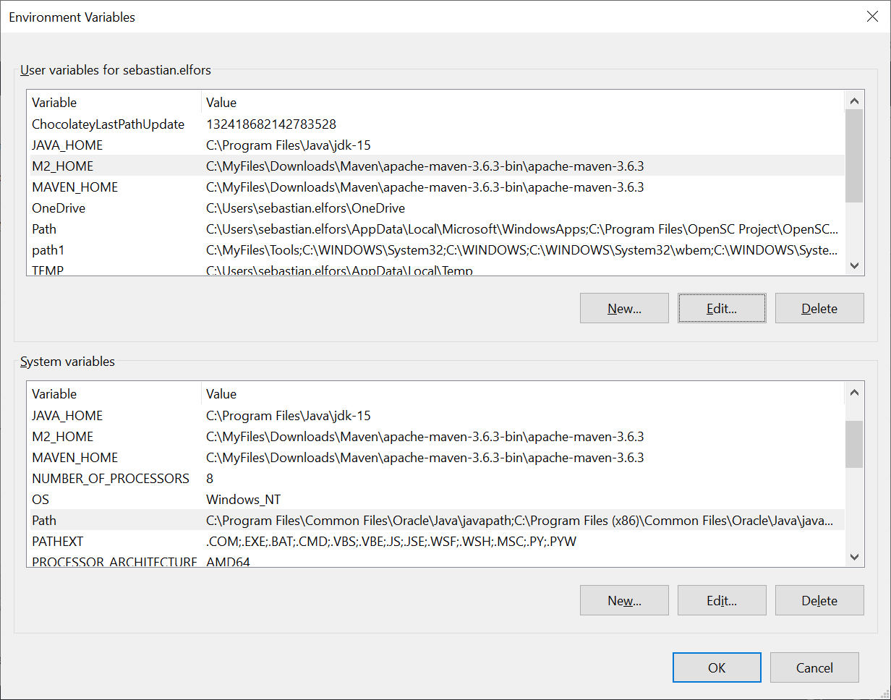
*Figure 12 - Windows environment variables for Apache Maven and Java*

===== Re-build the JavaWebAuthnLib.jar

At the workstation, start a Terminal, Command Prompt, or PowerShell. Then navigate to the folder `~/WebAuthnKit/backend/lambda-functions /JavaWebAuthnLib/`. Then execute the command:

    mvn clean install

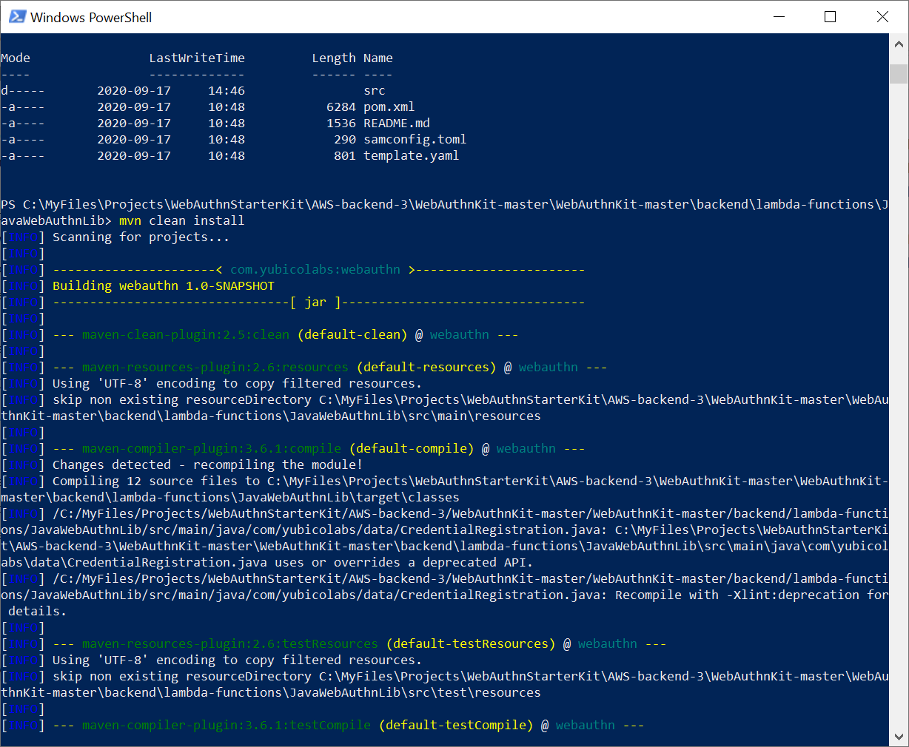
*Figure 13 - Re-building the webauthnlib.jar*

This command will build the JAR-file `~/WebAuthnKit/backend/lambda-functions/JavaWebAuthnLib/target/webauthn.jar`.

===== Re-deploy JavaWebAuthnLib.jar

There are two ways to re-deploy the JavaWebAuthnLib.jar file:

 * Manual deployment at the AWS console

 * Using  the AWS CLI for scripted deployment

==== Manual deployment of JavaWebAuthnLib.jar at the AWS console

*Step 5.1:* Login to the AWS console, and select the *Service* called `Lambda`.

*Figure 14 - Listing the Lambda Functions*

*Step 5.2:* In the list of Function names, select the *Function* called `JavaWebAuthLib<suffix>`. In this example, the Function is called `JavaWebAuthLibSeb`

image::Images/mback15-check-lambda-function-env-variables-v1.jpg[]
*Figure 15 - Checking the Lambda Function's environment variables*

*Step 5.3:* Press the *Actions* button, and select the option *Upload a .zip or .jar file*.

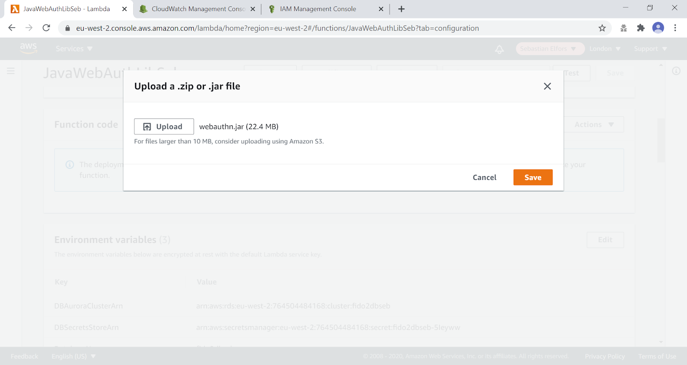
*Figure 16 - Uploading the webauthn.jar file to AWS*

*Step 5.4:* Select the JAR-file `~/WebAuthnKit/backend/lambda-functions/JavaWebAuthnLib/target/webauthn.jar` at the workstation, and press the *Save* button. This completes the upload of the `webauthn.jar` file to AWS.

==== AWS CLI for scripted deployment of JavaWebAuthnLib.jar

It is also possible to use the AWS CLI for scripting the upload of the `JavaWebAuthnLib.jar` to the AWS S3 bucket and deploying it at the AWS Lambda function. See the
link:https://docs.aws.amazon.com/lambda/latest/dg/java-package.html#java-package-cli[AWS documentation] for details on how to perform the upload and deployment using AWS CLI.

Below are examples of the AWS CLI commands needed for uploading and deploying `JavaWebAuthnLib.jar` to AWS S3 and AWS Lambda.

    aws s3 cp ~\WebAuthnKit-master
    \WebAuthnKit-master
    \backend
    \lambda-functions
    \JavaWebAuthnLib
    \target
    \webauthn.jar
    s3://<bucket-name>
    aws lambda update-function-code
    --function-name JavaWebAuthLib$suffix
    --s3-bucket $s3BucketName
    --s3-key webauthn.jar

===== Attach the AWSLambdaRole policy

If the AWS Lambda Role policy is not properly attached, take the following actions to attach the
link:https://aws.amazon.com/premiumsupport/knowledge-center/lambda-execution-role-s3-bucket/[AWS Lambda Role] policy to the `RDSLambdaExecutionRole`.

*Step 6.1:* Login to the AWS console, and select the *Service* called `Lambda`.

*Figure 17 - Listing the Lambda Functions*

*Step 6.2:* In the list of Function names, select the *Function* called `CreateAuth<suffix>`. In this example, the Function is called `CreateAuthSeb`.

*Step 6.3:* In the next window, select the *Permissions* tab to display the *Execution role*. Press on the link under the *Execution Role > Role Name*.

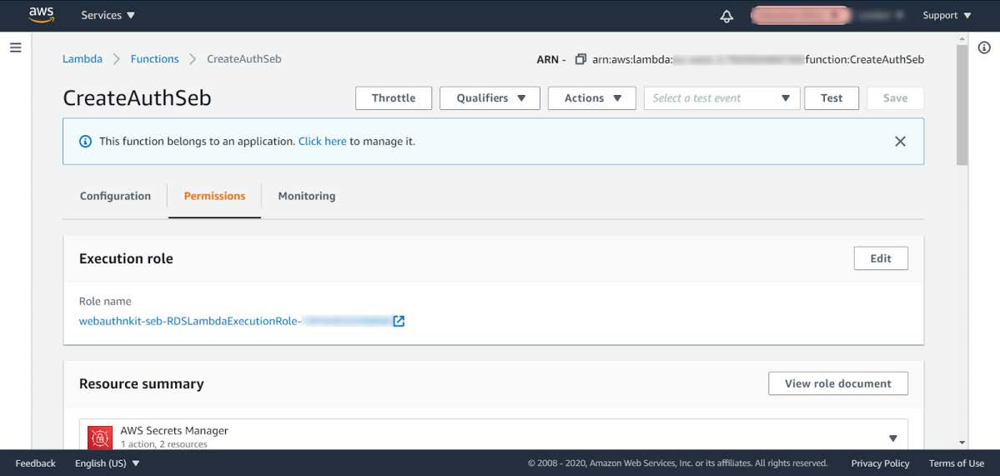
*Figure 18 - Changing the execution role of a Lambda Function*

*Step 6.4:* Click the link under the *Role* name and the following window appears:

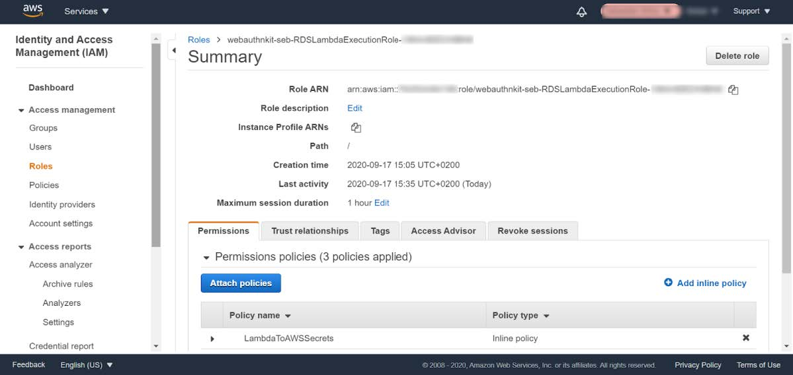
*Figure 19 - Changing the execution role of a Lambda Function*

*Step 6.5:* In the window above, click the button *Attach policies*, and the following window appears:

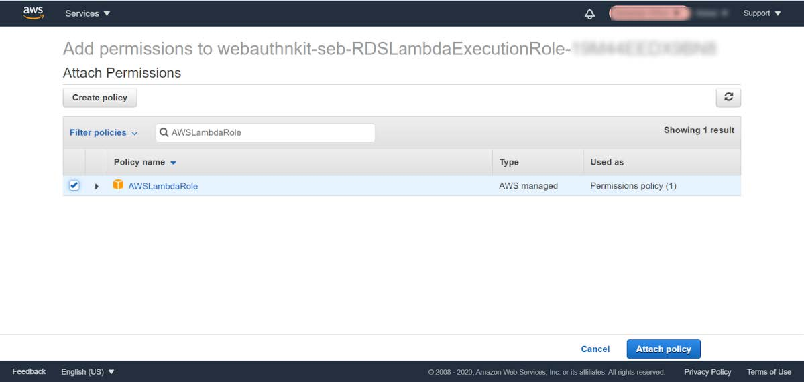
*Figure 20 - Attaching the policy to a Lambda Function option*

*Step 6.6:* Mark the checkbox next the `AWSLambdaRole` and press the button *Attach policy*. The following window appears:

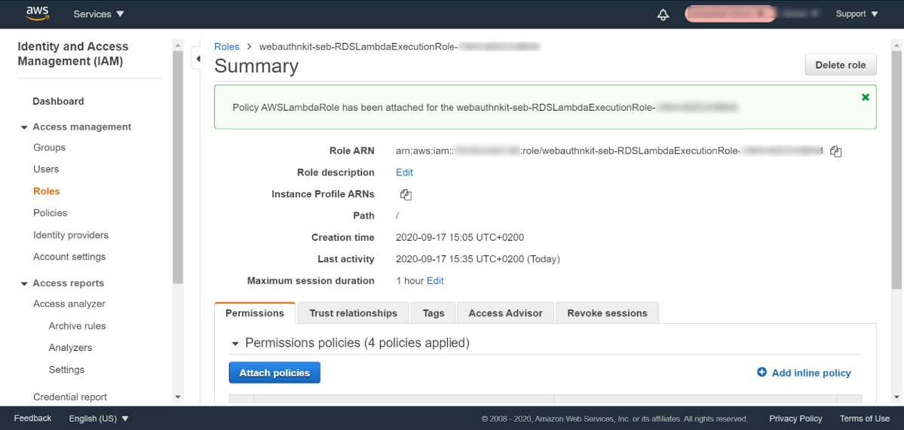[]
*Figure 21 - Attaching the policy to a Lambda Function panel*

Assigning the policy to one Lambda execution role will update all Lambda roles, so it’s sufficient to perform this step once.

==== Enable the CORS policy at API Gateway

If the CORS policy is not properly enabled at the API Gateway, take the following actions to enable the CORS policy.

*Step 7.1:* Login to the AWS console, and select the *Service* called `API Gateway`.

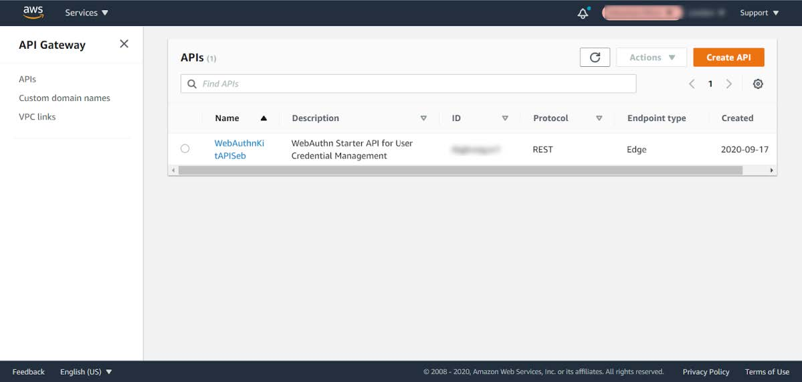
*Figure 22 - Enabling the CORS policy at API Gateway - Select Service*

*Step 7.2:* In the list under APIs, select the API named `WebAuthnKitAPI<suffix>`. In this example, the API is called `WebAuthnKitAPISeb`. The following window appears:

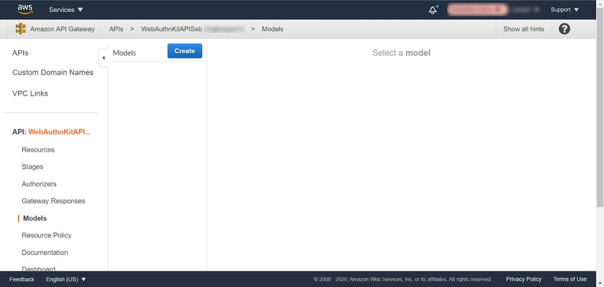
*Figure 23 - Enabling the CORS policy at API Gateway - Select API*

*Step 7.3:* In this window, press the *Create* button.

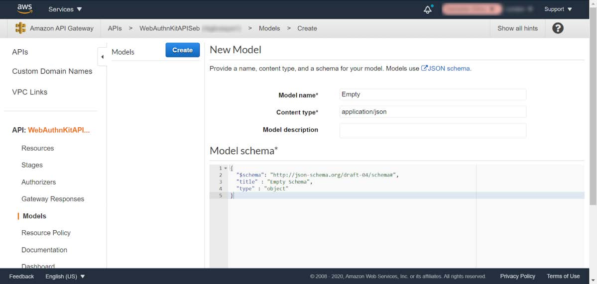
*Figure 24 - Enabling the CORS policy at API Gateway - New model*

*Step 7.4:* In the *New Model* pane, enter the following information:

 * Model name: Can be set to anything, for example `Empty`.

 * Content type: Must be set to `application/json`.

 * Model description: Can be left blank.

 * In the Model schema, insert the following schema:

    {
      "$schema": "http://json-schema.org/draft-04/schema#",
      "title" : "Empty Schema",
      "type" : "object"
    }

*Step 7.5:* Then press the *Create* button to create the model.

*Step 7.6:* In the AWS console, go back to *Services* called `API Gateway`, and select *Resources* in the left-hand pane.

*Step 7.7:* The credentials methods will be listed, as shown in the screenshot below.

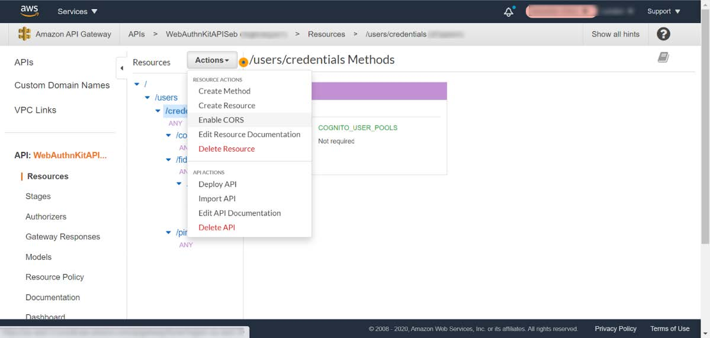
*Figure 25 - Enabling the CORS policy at API Gateway - On Resources*

*Step 7.8:* For each object called `/credentials`, `/codes`, `/fido2`, `/register`, `/pin` do the following:

a) Highlight the object.

b) Press the *Actions* button, and select the option `Enable CORS` in the drop-down menu.

*Step 7.9:* When all objects have been updated, select press the *Actions* button and select the option `Deploy API`:

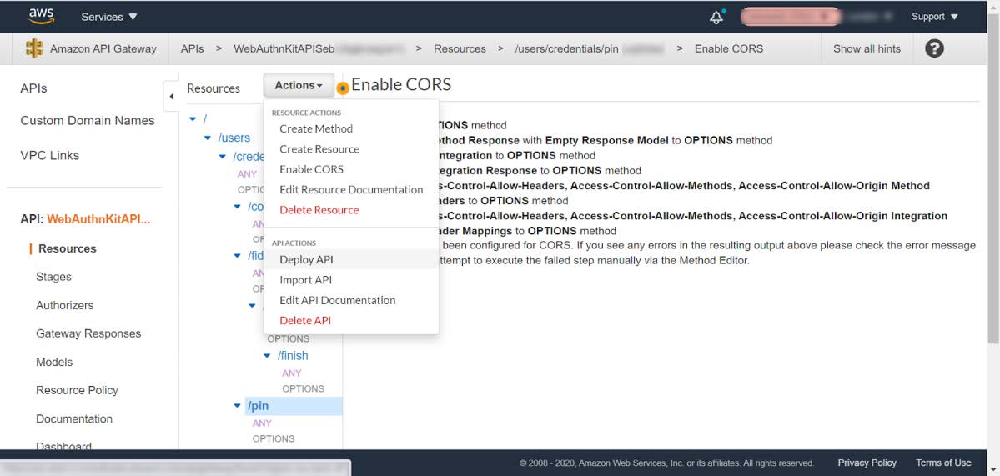
*Figure 26 - Enabling the CORS policy at API Gateway - Select Deploy API*

*Step 7.10:* In the *Deploy API* window, select *Deployment* stage `dev` and insert a deployment description. Press the *Deploy* button.

image::Images/mback27-enable-cors-policy-api-gateway-select-deploy-api-v1.jpg[]
*Figure 27 - Enabling the CORS policy at API Gateway - Deploy API*

*Step 7.11:* When the API has been deployed, the following window appears with the `dev` stage deployed.

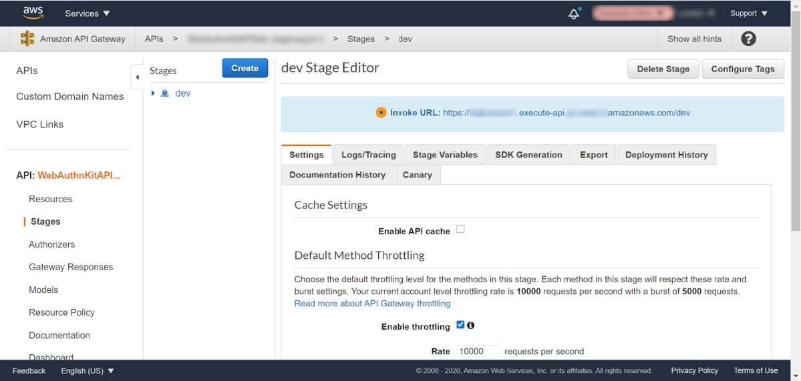
*Figure 28 - Enabling the CORS policy at API Gateway - Complete*

This completes the CORS deployment checks.

==== Delete stack, S3 bucket, and Amplify apps after roll back

If the deployment fails and is rolled back by AWS CloudFormation, the AWS CloudFormation stack, AWS S3 bucket and potentially AWS Amplify app must be deleted before it is deployed again, particularly if the same suffix is used.
