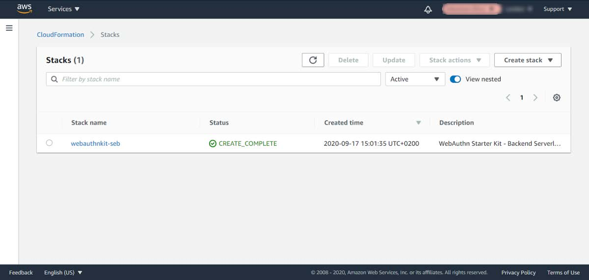
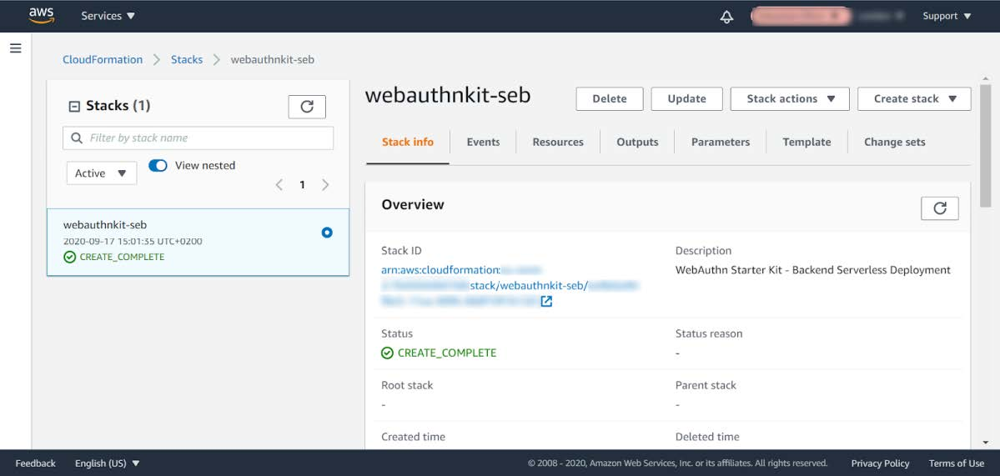
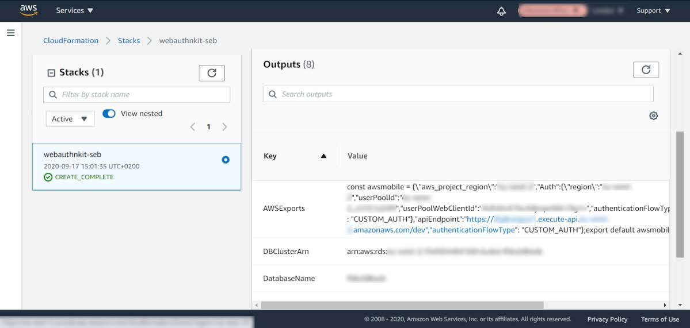
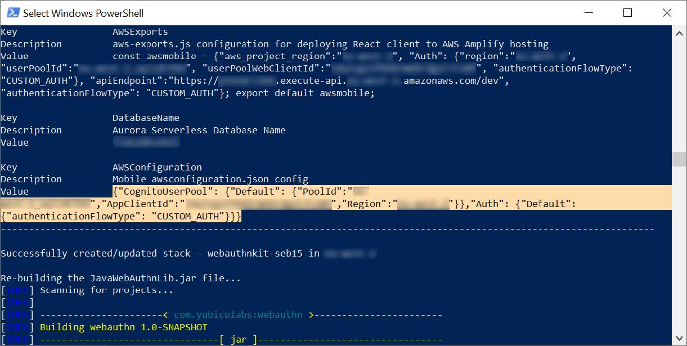
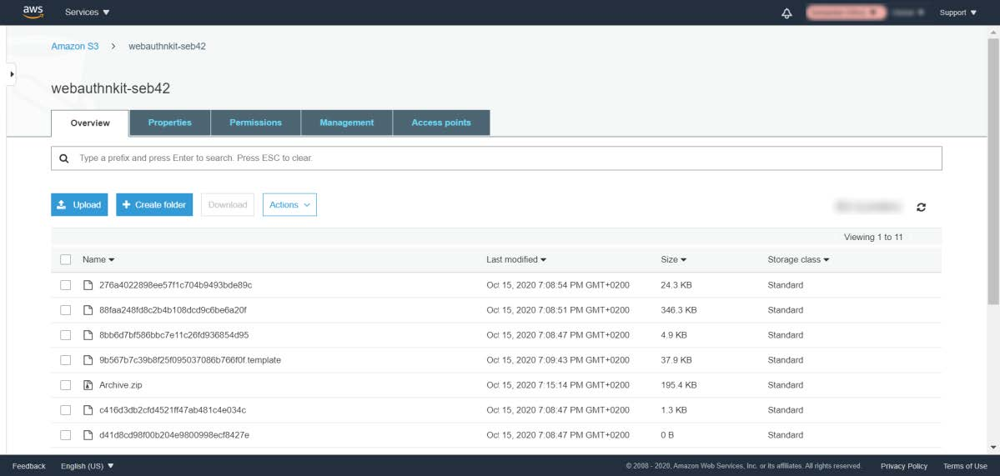
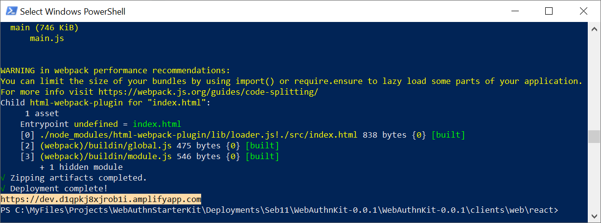
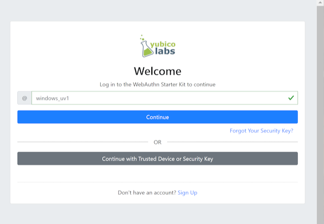
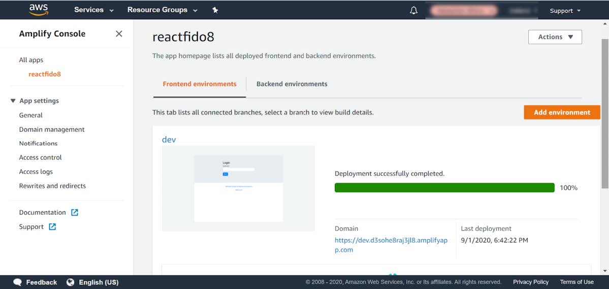
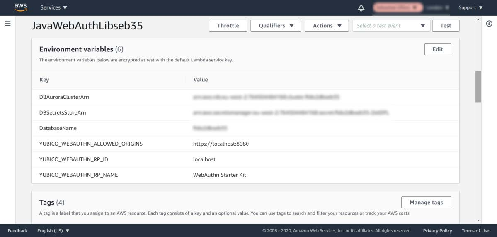

== Tutorial: Manually deploy and troubleshoot WebAuthnKit frontend at AWS

=== Introduction

The complete and automated deployment of the WebAuthn Starter Kit backend at AWS is described in the tutorial Automated WebAuthnKit deployment at AWS, which describes the pre-requisites, installation packages, source code and scripts needed for the deployment of the WebAuthn Starter Kit at AWS.

This guide, however, describes how to *manually* deploy the WebAuthn Starter Kit frontend at AWS. Furthermore, it contains a troubleshooting section for identifying and fixing issues that may occur at the AWS frontend.

=== Prerequisites

See the prerequisities section in the tutorial Automated WebAuthnKit deployment at AWS.

Before proceeding with deploying the WebAuthnKit frontend, make sure to perform the steps in the tutorial Manually deploy and troubleshoot WebAuthnKit backend at AWS.

=== Download the GitHub project

See the section on how to Clone or download the GitHub project in the tutorial Automated WebAuthnKit deployment at AWS.

=== Creating the aws-exports.js file

This section describes the manual steps that are needed for creating the `aws-exports.js` file for the React web app configuration.

The file aws-exports.js must be created at the workstation in the folder `~\WebAuthnKit\clients\web\react\src\`. In order to do this manually, follow the steps below.

*Step 1.1.* Login to the AWS console, select the *Service CloudFormation*, and view *Stacks*.

*Figure 1 - Select CloudFormation Stack*

*Step 1.2.* Click on the *Stack Name* in the screen above. In this example, it is called `webauthnkit-seb`.

*Figure 2 - View CloudFormation Stack details*

*Step 1.3.* Select the option `Outputs`.

*Figure 3 - CloudFormation Stack Output in the AWS Console*

*Step 1.4.* Scroll down in the list of outputs and copy the text next to `AWSExports` from the AWS console.

Another option is to copy the same information from the output in the PowerShell prompt when building and deploying the AWS backend:

*Figure 4 - CloudFormation Stack Output in the AWS CLI*

*Step 1.5.* At the workstation, navigate to the folder `~/WebAuthnKit/clients/web/react/src/` and create a new file called `aws-exports.js`.

*Step 1.6.* Paste the text from `AWSExports` in the AWS console to the file `aws-exports.js`. Remove the backslashes (if any) in the `aws-exports.js`.

*Step 1.7.* Finally, save the file `aws-exports.js` in the folder `~/WebAuthnKit/clients/web/react/src/`.

Also, make a note of the *AppClientId*, since that will be used in the section *Deploy WebAuthnKit React web app* at AWS Amplify.

=== Install and build the WebAuthnKit React web app

*Step 2.1.* Start a Windows PowerShell prompt, or a MacOS/Linux Terminal, and navigate to the React project folder `~\WebAuthnKit\clients\web\react\`. This will be the default folder of the PowerShell prompt throughout the rest of this document.

*Step 2.2.* In the PowerShell command prompt, run the following commands to install and build the React web application binaries and dependencies:

   npm install
   npm run build

=== Zip and upload the React web app files

*Step 3.1.* Navigate to the React distribution folder `~\WebAuthnKit\clients\web\react\dist\` and zip all files in this directory. Call the `zip-file Archive.zip`, for example.

*Step 3.2.* Use the PowerShell or Terminal command prompt to upload the zip-file to the AWS S3 bucket (which is designated for the WebAuthnKit deployment):

    aws s3 cp Archive.zip s3://<s3BucketName> --profile <awsCliProfile>

It is also possible to upload the zip-file manually in the AWS console by navigating to Services Amazon S3 and pressing the button *Upload*.

*Figure 5 - Amazon S3 bucket in the AWS Console*

=== Deploy WebAuthnKit React web app at AWS Amplify

In this section the WebAuthn Starter Kit React web application will be deployed at AWS Amplify.

*Step 4.1.* In the PowerShell command prompt, navigate to the folder `~/WebAuthnKit/clients/web/react/`.

*Step 4.2.* In the PowerShell command prompt, run the following command to deploy the WebAuthnKit React client web app:

    aws amplify start-deployment
    --app-id <amplifyAppId>
    --branch-name <amplifyBranchName>
    --source-url s3://<s3BucketName>/Archive.zip
    --profile <awsCliProfile>

If the React app is successfully published to AWS Amplify, the public URL to the app will be displayed at the bottom of the PowerShell prompt and in the AWS Amplify console. For example: `https://dev.d3sohe8raj3jl8.amplifyapp.com`.

*Figure 6 - AWS Amplify URL in the AWS CLI*

*Step 4.3.* Copy the URL at the bottom of the output and paste into a web browser to ensure that the React app can be accessed at AWS Amplify.

*Figure 7 - Accessing the WebAuthnKit React web app running at AWS Amplify*

This completes the deployment of the WebAuthn Starter Kit React web app at AWS Amplify.

=== Checking the React web app at AWS Amplify

In order to check the React web app in the AWS Amplify Console, run the following command in the PowerShell command prompt:

    amplify console

This will launch the AWS Amplify Console, which allows the user to check the React app settings and status. It is also possible to access the AWS Amplify Console by using the AWS console, and navigating to Services AWS Amplify and selecting the created AWS Amplify web app.

*Figure 8 - Checking the React web app at the AWS Amplify console*

=== Run the WebAuthnKit React web app locally

It is possible to run the WebAuthnKit React web app locally at the workstation.

*Step 5.1.* First, update the environment variables in the AWS Console for the Lambda function `JavaWebAuthnLib<suffix>` as described in this section. The environment variables should be changed to the following values:

    YUBICO_WEBAUTHN_ALLOWED_ORIGINS: https://localhost:8080
    YUBICO_WEBAUTHN_RP_ID: localhost

*Figure 9 - Changing the environment variables at the AWS console*

*Step 5.2.* In the PowerShell command prompt at the workstation, navigate to the folder `~/WebAuthnKit/clients/web/react/`. Then run the following command to install the React web app at the local machine:

    npm install

*Step 5.3.* In the PowerShell command prompt at the workstation, run the following command to run the React web app at the local machine:

    npm start

*Step 5.4.* If this is successful, a web browser should be launched with the WebAuthn Starter Kit login page. The URL for this locally running instance of the WebAuthnKit React web app is `https://localhost:8080`.

*Figure 10 - Accessing the WebAuthnKit React web app running locally*

=== Delete stack, S3 bucket and Amplify apps after roll back

If the deployment fails and is rolled back by AWS CloudFormation, the AWS CloudFormation stack, AWS S3 bucket and potentially AWS Amplify app must be deleted before it is deployed again, particularly if the same suffix is used.
