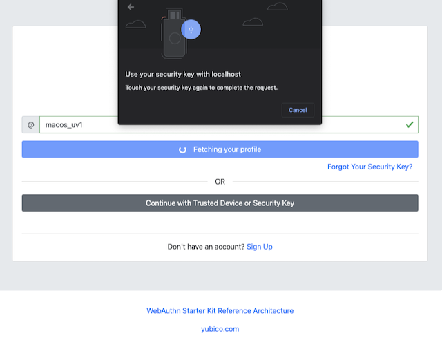

== High Level WebAuthn Authentication flow

=== WebAuthn authentication process overview

==== Pre-requisites

The WebAuthn authentication process described in this section is first and foremost based on the authentication specification in the link:https://www.w3.org/TR/webauthn/[W3C WebAuthn standard]. The WebAuthn authentication process is equivalent to the WebAuthn Get Assertion procedure. All WebAuthn authentication parameters, JSON objects, and generic WebAuthn flows are based on the W3C WebAuthn standard.

In addition to the W3C WebAuthn standard, the specific authentication flow described in this section adheres to the User Login section of the Identifier First Flow document. The Identifier First Flow user login description explains the WebAuthn authentication process as well as Account Recovery.

Furthermore, the Custom Authentication Flow in the High Level Architecture document describes the technical environment in more depth. This document describes the AWS architecture, Lambda components and the SQL database that need to be deployed for hosting a WebAuthn Relying Party for the WebAuthn Starter Kit.

It is recommended to study the documents mentioned above as a pre-requisite.

The WebAuthn Starter Kit must have been deployed at AWS as described in the tutorial Automated WebAuthnKit deployment at AWS. The URL that is deployed for the WebAuthn Starter Kit React web app at the AWS frontend is considered as the WebAuthnKit Login page throughout the remainder of this document.

Finally, a user account and corresponding FIDO authenticator must be registered before, as described in the page High Level WebAuthn Registration Flow.

==== Purpose of this section

Now, this section describes how to perform the WebAuthn authentication process by using Microsoft Windows, an Apple iOS smartphone with the Safari browser, and an Apple iOS smartphone with an app that implements WebAuthn.

As described in the Identifier First Flow page, there are a number of routes the authentication flow can take, depending of what clients, parameters and selections that are used during the authentication process. For each section, the client’s configuration is described, as well as the authentication scenario.

=== WebAuthn authentication using Microsoft Windows

==== Client configuration for Microsoft Windows

The client configuration for Windows is described in this section.

==== Authentication with User-Verified flow on Windows

===== Authentication selections for the User-Verified flow on Windows

The FIDO2 authenticator used in this section is the following:

 * A YubiKey 5 NFC (version 5.4.3) is used as FIDO2 authenticator. The YubiKey 5 is configured with FIDO2 credentials and a PIN-code according to section "High Level WebAuthn Registration flow".

The authentication route described in this section is derived from the following parameters and selections according to the Identifier First Flow page:

 * The WebAuthn GetAssertion parameter UserVerification is set to 'Preferred', which resolves to the CTAP2 parameter UV=1 for Google Chrome used on Windows 10.

 * A U2F Password is not set for this account as part of the registration process (since the CTAP2 parameter UV=1 is set).

===== Authentication process and UX design for the User-Verified flow on Windows

The selections for the authentication process, described in the pre-requisites above, result in the authentication flow and UX described in this section.

*Step 1.1:* The YubiKey 5 is selected as authenticator. (In other words, a platform authenticator is not used.)

*Step 1.2:* The user visits the WebAuthnKit Login page. The user enters the username that was created in the registration section for Windows.

*Figure 1 - Login page for WebAuthn authentication*

*Step 1.3:* The user presses “Next” in the window above, and the user gets the option to login with a security key. The WebAuthn parameter UserVerification is set to 'Preferred' (CTAP2 UV=1) for this authentication process. The user inserts the YubiKey 5 into the computer and presses the button “Login with Security Key”.

*Figure 2 - Login page for WebAuthn authentication with a security key*

*Step 1.4:* Windows displays a security dialog box, in which the user enters the PIN-code for the YubiKey.

*Figure 3 - Enter PIN-code for the YubiKey’s FIDO application*

*Step 1.5:* Windows displays a security dialog box with instructions for the user to touch the security key. The user touches the sensor on the YubiKey.

*Figure 4 - Touch the YubiKey for FIDO2 authentication*

*Step 1.6:* The user is logged in, and is presented with the options presented in the dialog box shown below.

*Figure 5 - Successful login*

*Step 1.7:* The user should press the button “Show Recovery Codes” to generate and display the recovery codes GUI.

==== Authentication with the Server-Verified flow on Windows

===== Authentication selections for Server-Verified flow on Windows

The FIDO authenticator used in this section is the following:

 * A YubiKey 4 or YubiKey 5 NFC is used as FIDO authenticator. The FIDO2 application on the YubiKey 5 is *deactivated*. The YubiKey is configured with FIDO U2F credentials and no PIN-code according to section "High Level WebAuthn Registration flow".

The authentication route described in this section is derived from the following parameters and selections according to the Identifier First Flow page:

 * The WebAuthn GetAssertion parameter UserVerification is set to 'Preferred', which resolves to the CTAP2 parameter UV=0 for a FIDO2 disabled YubiKey used with Google Chrome on Windows 10. The backward compatible FIDO U2F flow of WebAuthn is therefore used. This behaviour is equivalent to setting the WebAuthn GetAssertion parameter UserVerification to 'Discouraged'.

 * A U2F Password is set for this account as part of the registration process (since the CTAP2 parameter UV=0 is set).

===== Authentication process and UX design for the Server-Verified flow on Windows

The authentication process for the Server-Verified flow is identical to the authentication process for the User-Verified flow with one notable exception:

The FIDO authenticator will not require a PIN-code (as shown in Figure 1.3); the FIDO authenticator will only require the user to touch the FIDO authenticator. Instead, a the user must enter a U2F Password when accessing the account. The U2F Password is used as first factor authentication to protect the account.

An example of how to enter a U2F Password is shown in the screenshot below.

*Figure 6 - The user enters a U2F Password*

==== Authentication with Usernameless flow on Windows

===== Authentication selections for the Usernameless flow on Windows

The FIDO2 authenticator used in this section is the following:

 * A YubiKey 5 NFC (version 5.2.6) is used as FIDO2 authenticator. The YubiKey 5 is configured with FIDO2 resident credentials and a PIN-code according to section "High Level WebAuthn Registration flow".

The authentication route described in this section is derived from the following parameters and selections according to the Identifier First Flow page:

 * The WebAuthn GetAssertion parameter UserVerification is set to 'Preferred', which resolves to the CTAP2 parameter UV=1 for Google Chrome used on Windows 10.

 * A U2F Password is not set for this account as part of the registration process (since the CTAP2 parameter UV=1 is set).

===== Authentication process and UX design for the Usernameless flow on Windows

The selections for the authentication process, described in the pre-requisites above, result in the authentication flow and UX described in this section.

*Step 2.1:* The YubiKey 5 is selected as authenticator. (In other words, a platform authenticator is not used.)

*Step 2.2:* The user visits the WebAuthnKit Login page. The user presses the link "Continue with Trusted Device or Security Key". There is no need to enter a username, since the user information will be gathered from the resident credentials on the FIDO authenticator.

*Figure 7 - Login page for WebAuthn Usernameless authentication*

The security key is inserted, and is automatically detected by Google Chrome as a Usernameless security key. The WebAuthn authentication flow continues according to Step 1.3-1.7 in User-Verified flow on Windows.

=== WebAuthn authentication using Apple MacOS

==== Authentication with the User-Verified flow on MacOS

===== Authentication selections for the User-Verified flow on MacOS

The FIDO authenticator used in this section is the following:

 * A YubiKey 5 NFC (version 5.4.3) is used as FIDO authenticator. The FIDO2 application on the YubiKey is *activated*. The YubiKey 5 has a PIN-code set and FIDO2 credentials enrolled according to section "High Level WebAuthn Registration flow".

The authentication route described in this section is derived from the following parameters and selections according to the Identifier First Flow page:

 * The WebAuthn GetAssertion parameter UserVerification is set to 'Preferred', which resolves to the CTAP2 parameter UV=1 for a FIDO2 enabled YubiKey with PIN used with Google Chrome on MacOS. This behaviour is equivalent to setting the WebAuthn GetAssertion parameter UserVerification to 'Required'.

 * A U2F Password is not set for this account as part of the registration process (since the CTAP2 parameter UV=1 is set).

===== Authentication process and UX design for the User-Verified flow on MacOS

The selections for the authentication process, described in the pre-requisites above, result in the authentication flow and UX described in this section.

*Step 3.1:* The YubiKey 5 is selected as authenticator. (In other words, a platform authenticator is not used.)

*Step 3.2:* The user visits the WebAuthnKit Login page. The user enters the username that was created in the registration section for MacOS.

*Figure 8 - Login page for WebAuthn authentication*

*Step 3.3:* The user presses Continue in the window above, and the user gets the option to login with a security key. The WebAuthn parameter UserVerification is set to 'Preferred' (CTAP2 UV=1) for this authentication process. The user inserts the YubiKey 5 into the computer and presses the button "USB security key".

*Figure 9 - Login page for WebAuthn authentication with a security key*

*Step 3.4:* Google Chrome on MacOS displays a security dialog box, and the user selects the security key and touches it.

*Figure 10 - Select security key for authentication*

*Step 3.5:* Google Chrome on MacOS displays a security dialog box, in which the user enters the PIN-code for the YubiKey.

*Figure 11 - Enter PIN to the security key*

*Step 3.6:* Google Chrome on MacOS displays a security dialog box with instructions for the user to touch the security key again. The user touches the sensor on the YubiKey once more.

*Figure 12 - Touch the YubiKey for FIDO2 authentication*

*Step 3.7:* The user is logged in, and is presented with the options presented in the dialog box shown below.

*Figure 13 - Successful login*

*Step 3.8:* The user should press the button “Show Recovery Codes” to generate and display the recovery codes GUI.

==== Authentication with the Server-Verified flow on MacOS

===== Authentication selections for the Server-Verified flow on MacOS

The FIDO authenticator used in this section is the following:

 * A YubiKey 4 or YubiKey 5 NFC is used as FIDO authenticator. The FIDO2 application on the YubiKey 5 is *deactivated*, which triggers the the Server-Verified behavior on MacOS. Also a YubiKey with the FIDO2 application activated, but with no PIN-code set, will trigger the the Server-Verified flow on MacOS (which is a significant difference from Windows that will prompt the user for setting a PIN and activate the User-Verified process).

The authentication route described in this section is derived from the following parameters and selections according to the Identifier First Flow page:

 * The WebAuthn GetAssertion parameter UserVerification is set to 'Preferred', which resolves to the CTAP2 parameter UV=0 for a FIDO2 disabled YubiKey used with Google Chrome on MacOS. The backward compatible FIDO U2F flow of WebAuthn is therefore used. This behavior is equivalent to setting the WebAuthn GetAssertion parameter UserVerification to 'Discouraged'.

 * A U2F Password is set for this account as part of the registration process (since the CTAP2 parameter UV=0 is set).

===== Authentication process and UX design for the Server-Verified flow on MacOS

The authentication process for the Server-Verified flow is identical to the authentication process for the User-Verified flow with one notable exception:

The FIDO authenticator will not require a PIN-code (as shown in Figure 11); the FIDO authenticator will only require the user to touch the FIDO authenticator. Instead, a the user must set a U2F Password when creating the account. The U2F Password is used as first factor authentication to protect the account.

An example of how to set a U2F Password is shown in the screenshot below.

*Figure 14 - The user enters a U2F Password*

==== Authentication with Usernameless flow on MacOS

===== Authentication selections for the Usernameless flow on MacOS

The FIDO2 authenticator used in this section is the following:

 * A YubiKey 5 NFC (version 5.2.6) is used as FIDO2 authenticator. The YubiKey 5 is configured with FIDO2 resident credentials and a PIN-code according to section "High Level WebAuthn Registration flow".

The authentication route described in this section is derived from the following parameters and selections according to the Identifier First Flow page:

 * The WebAuthn GetAssertion parameter UserVerification is set to 'Preferred', which resolves to the CTAP2 parameter UV=1 for Google Chrome used on Windows 10.

 * A U2F Password is not set for this account as part of the registration process (since the CTAP2 parameter UV=1 is set).

===== Authentication process and UX design for the Usernameless flow on MacOS

The selections for the authentication process, described in the pre-requisites above, result in the authentication flow and UX described in this section.

*Step 4.1:* The YubiKey 5 is selected as authenticator. (In other words, a platform authenticator is not used.)

*Step 4.2:* The user visits the WebAuthnKit Login page. The user presses the link "Continue with Trusted Device or Security Key". There is no need to enter a username, since the user information will be gathered from the resident credentials on the FIDO authenticator.

*Figure 15 - Login page for WebAuthn Usernameless authentication*

The security key is inserted, and is automatically detected by Google Chrome as a Usernameless security key. The WebAuthn authentication flow continues according to Step 3.3-3.7 in User-Verified flow on MacOS.

=== WebAuthn authentication using the Apple iOS Safari browser

===== Authentication selections for the User-Verified flow on Apple iOS Safari

The FIDO authenticators used in this section is the following:

 * A YubiKey 5Ci (version 5.4.3) is used as FIDO authenticator, which is plugged into the iPhone’s lightning port. The FIDO2 application on the YubiKey is *activated*. The YubiKey 5Ci has a PIN-code set and FIDO2 credentials enrolled according to section "High Level WebAuthn Registration flow".

 * A YubiKey 5 NFC (version 5.4.3) is also used as FIDO authenticator, which is tapped to the iPhone’s NFC receiver. The FIDO2 application on the YubiKey is *activated*. The YubiKey 5 has a PIN-code set and FIDO2 credentials enrolled according to section "High Level WebAuthn Registration flow". The Yubico OTP application over NFC is deactivated, to avoid the NFC tag pop-up window.

The WebAuthn authentication results are identical when using both YubiKeys.

The authentication route described in this section is derived from the following parameters and selections according to the Identifier First Flow page:

 * The WebAuthn GetAssertion parameter UserVerification is set to 'Preferred', which resolves to the CTAP2 parameter UV=1 for a FIDO2 enabled YubiKey with PIN used with Safari on Apple iOS. This behaviour is equivalent to setting the WebAuthn GetAssertion parameter UserVerification to 'Required'.

 * A U2F Password is not set for this account as part of the registration process (since the CTAP2 parameter UV=1 is set).

===== Authentication process and UX design for the User-Verified flow on Apple iOS with Safari

The selections for the authentication process, described in the pre-requisites above, result in the authentication flow and UX described in this section.

*Step 5.1:* The YubiKey is selected as authenticator. (In other words, a platform authenticator is not used.

*Step 5.2:* The user visits the WebAuthnKit Login page. The user enters the username that was created in the registration section for Apple iOS with Safari.

*Figure 16 - Login page for WebAuthn authentication*

*Step 5.3:* The user presses “Continue” in the window above, and the user gets the option to login with a security key. The WebAuthn parameter UserVerification is set to 'Preferred' (CTAP2 UV=1) for this authentication process. The user inserts or taps the YubiKey to the iPhone.

*Figure 17 - Login page for WebAuthn authentication with a security key*

*Step 5.4:* Safari on Apple iOS displays a security dialog box, in which the user enters the PIN-code for the YubiKey.

*Figure 18 - Enter PIN to the security key*

*Step 5.5:* Safari on Apple iOS displays a security dialog box with instructions for the user to touch the security key again. The user touches the sensor on the YubiKey once more.

*Figure 19 - Touch the YubiKey for FIDO2 authentication*

*Step 5.6:* The user is logged in, and is presented with the options presented in the dialog box shown below.

*Figure 20 - Successful login*

==== Authentication with the Server-Verified flow on Apple iOS with Safari

===== Authentication selections for the Server-Verified flow on Apple iOS with Safari
The FIDO authenticators used in this section are the following:

 * A YubiKey 5Ci (version 5.4.3) is used as FIDO authenticator, which is plugged into the iPhone’s lightning port. The FIDO2 application on the YubiKey is *deactivated*, which triggers the the Server-Verified behaviour on iOS. Also a YubiKey with the FIDO2 application activated, but with no PIN-code set, will trigger the the Server-Verified flow on MacOS (which is a significant difference from Windows that will prompt the user for setting a PIN and activate the User-Verified process). The YubiKey 5Ci has no PIN-code set and FIDO2 credentials enrolled according to section "High Level WebAuthn Registration flow".

 * A YubiKey 5 NFC (version 5.4.3) is also used as FIDO authenticator, which is tapped to the iPhone’s NFC receiver. The FIDO2 application on the YubiKey is *deactivated*, which triggers the the Server-Verified behaviour on iOS (which is a significant difference from Windows that will prompt the user for setting a PIN and activate the User-Verified process). The YubiKey 5 has no PIN-code set and FIDO2 credentials enrolled according to section "High Level WebAuthn Registration flow". The Yubico OTP application over NFC is deactivated, to avoid the NFC tag pop-up window.

The WebAuthn authentication results are identical when using both YubiKeys.

The authentication route described in this section is derived from the following parameters and selections according to the Identifier First Flow page:

 * The WebAuthn GetAssertion parameter UserVerification is set to 'Preferred', which resolves to the CTAP2 parameter UV=0 for a FIDO2 disabled YubiKey used with Safari on Apple iOS. The backward compatible FIDO U2F flow of WebAuthn is therefore used. This behaviour is equivalent to setting the WebAuthn GetAssertion parameter UserVerification to 'Discouraged'.

 * A U2F Password is set for this account as part of the registration process (since the CTAP2 parameter UV=0 is set).

===== Authentication process and UX design for the Server-Verified flow on Apple iOS with Safari

The authentication process for the Server-Verified flow is identical to the authentication process for the User-Verified flow with one notable exception:

The FIDO authenticator will not require a PIN-code (as shown in Figure 16); the FIDO authenticator will only require the user to touch the FIDO authenticator. Instead, a the user must set a U2F Password when creating the account. The U2F Password is used as first factor authentication to protect the account.

An example of how to set a U2F Password is shown in the screenshot below.

*Figure 21 - The user enters a U2F Password*

==== Authentication with Usernameless flow on Apple iOS with Safari

===== Authentication selections for the Usernameless flow on Apple iOS with Safari

The FIDO authenticators used in this section is the following:

 * A YubiKey 5Ci (version 5.2.7) is used as FIDO authenticator, which is plugged into the iPhone’s lightning port. The FIDO2 application on the YubiKey is *activated*. The YubiKey 5Ci has a PIN-code set and FIDO2 credentials enrolled according to section "High Level WebAuthn Registration flow".

 * A YubiKey 5 NFC (version 5.2.6) is also used as FIDO authenticator, which is tapped to the iPhone’s NFC receiver. The FIDO2 application on the YubiKey is *activated*. The YubiKey 5 has a PIN-code set and FIDO2 credentials enrolled according to section "High Level WebAuthn Registration flow". The Yubico OTP application over NFC is deactivated, to avoid the NFC tag pop-up window.

The WebAuthn authentication results are identical when using both YubiKeys.

The authentication route described in this section is derived from the following parameters and selections according to the Identifier First Flow page:

 * The WebAuthn GetAssertion parameter UserVerification is set to 'Preferred', which resolves to the CTAP2 parameter UV=1 for a FIDO2 enabled YubiKey with PIN used with Safari on Apple iOS. This behaviour is equivalent to setting the WebAuthn GetAssertion parameter UserVerification to 'Required'.

 * A U2F Password is not set for this account as part of the registration process (since the CTAP2 parameter UV=1 is set).

===== Authentication process and UX design for the Usernameless flow on Apple iOS with Safari

The selections for the authentication process, described in the pre-requisites above, result in the authentication flow and UX described in this section.

*Step 6.1:* The YubiKey 5 is selected as authenticator. (In other words, a platform authenticator is not used.)

*Step 6.2:* The user visits the WebAuthnKit Login page. The user presses the link “Continue with Trusted Device or Security Key”. There is no need to enter a username, since the user information will be gathered from the resident credentials on the FIDO authenticator.

*Figure 22 - Login page for WebAuthn Usernameless authentication*

The security key is inserted, and is automatically detected by Google Chrome as a Usernameless security key. The WebAuthn authentication flow continues according to Step 4.3-4.6 in User-Verified flow on Apple iOS with Safari.
