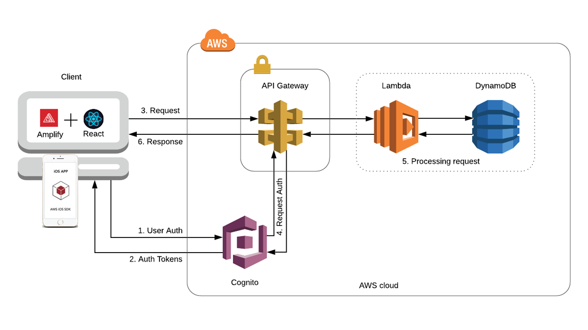
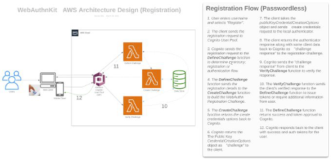
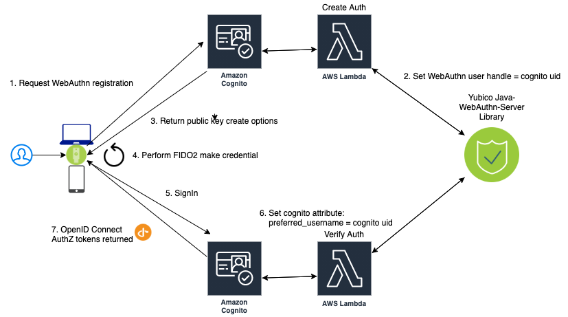
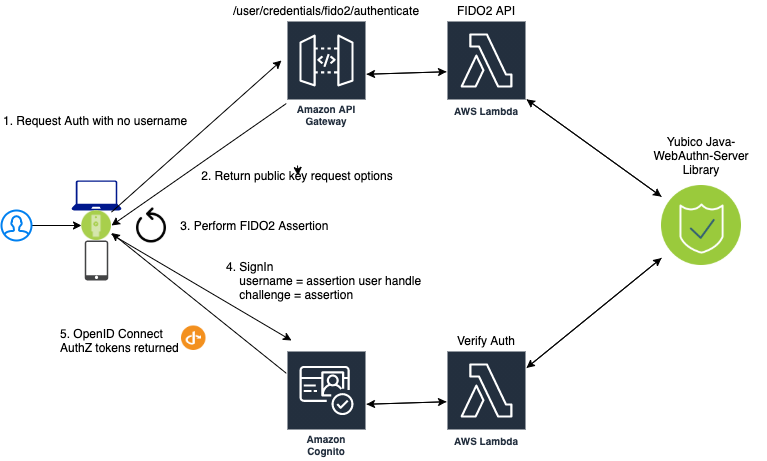

== WebAuthn Starter Kit - High Level Architecture

=== Back-end System Architecture

As with many new technologies, WebAuthn can be difficult to understand and implement without concrete examples. The Yubico WebAuthn Starter kit was created to meet this need, by providing guidance and best practices for those seeking to implement strong hardware-backed authentication into their identity management systems. The goals of the WebAuthn Stater kit are to demonstrate:

 * *UX principles and best practice for designers and frontend developers*

 * *Best practices for implementing a WebAuthn server functionality for backend engineers*

 * *Best practices for managing the lifecycle of YubiKeys for administrators*

 * *Migration guidance to go passwordless for architects*

The WebAuthn Starter Kit enables anyone to deploy a functioning WebAuthn system that implements these best practices to their personal or organization’s Amazon Web Services (AWS) account. This system will showcase how a YubiKey can be ubiquitous across desktop browsers, mobile browsers and mobile apps. The demo application demonstrates what is possible and inspire adoption of passwordless authentication in an identifier first flow. The backend will shows how WebAuthn server functionality can be integrated into a stand-alone or existing OpenID Connect compatible IAM service. The administrator control plane provides a platform on how to properly manage the YubiKey lifecycle.

*Identity and Access Management* -The WebAuthn login is tied to an OpenID Connect identity provider (OP), which in turn provides identity tokens to web and mobile apps. By using OAuth2 to provide authorization tokens to access resources as a framework, custom user authentication flows can easily be constructed to meet a site or service’s unique challenges. The WebAuthn Starter Kit leverages AWS’s Cognito service for identity management, utilizing AWS Lambda to provide a custom authentication flow.

=== Design Considerations

WebAuthn was designed and optimized for providing strong authentication for consumer-facing web and mobile applications, and the WebAuthn Starter Kit was designed to highlight that support. Many off-the-shelf identity and access management products already support WebAuthn, such as Okta, Microsoft Azure, Ping and more. However, there are consumer-facing use cases where these solutions are not feasible nor scale, such as consumer-facing accounts. The WebAuthn Starter Kit demonstrates how to natively add WebAuthn to a service, providing customers with the same ease of use and strong authentication as the premier enterprise identity solutions.

=== System Architecture

The WebAuthn Starter Kit includes both the backend server and frontend user clients.

The backend is primarily comprised of three layers - User Management and Identity built on AWS Cognito, a Compute Layer built on AWS Lambda serverless applications, and a Data layer structure around the Amazon Aurora Amazon Aurora Serverless MySQL compatible database engine.

The Clients include web-service clients built using React native, supported across modern browsers and desktop OS environments, and an Apple iOS app using the SFViewController in a native app.

*Figure 1 - System architecture components and flow*

==== User Management and Identity Layer

The user management and identity layer provides identity, authentication, and authorization for users and administrators.

*Amazon Cognito (User Pools)* acts as the _user directory_ and _identity provider_ (IdP) for handling user sign-up (registration), sign-in (authentication), and authorization.

==== Compute layer

The compute layer manages requests directly from external clients, controlling access, and ensuring requests are appropriately authorized. It contains the runtime environment that the business logic will be deployed and executed by. The solution is offered as *infrastructure as code* for the developer to deploy into their own cloud environment. The infrastructure utilizes serverless cloud components or AWS managed services. No hardware, VM’s, nodes, containers, or docker images to manage.

*AWS Lambda* is the compute layer and will provide stateless serverless WebAuthn server operations as event triggers in conjunction with Amazon Cognito for managing registration and authentication backend services.

==== Data Layer

The data layer manages the system's persistent storage. It provides a secure mechanism to store the user attributes and associated credentials within the WebAuthn Starter Kit.

The system will be designed to access the data through a generic data provider so that we only need to switch out the data engine, leaving the interface as-is. The WebAuthn Starter Kit utilizes Amazon Aurora Serverless (MySQL compatible database engine) for storing user data and roam ing authenticator details.

*Amazon Aurora Serverless* is an on-demand, auto-scaling configuration for link:https://aws.amazon.com/rds/aurora/[Amazon Aurora] (MySQL-compatible and PostgreSQL-compatible editions).

==== System Deployment and Monitoring

The deployment layer is a SAM-based application that provides an execution environment which allows developers build, test, and debug applications defined by SAM templates. SAM is an infrastructure-as-code solutions that provides shorthand syntax to express functions, APIs, databases, and event source mappings. During deployment, monitoring resources will also be created to monitor the state of the serverless application.

*AWS Serverless Application Model (SAM) [Deployment]* is an extension of AWS CloudFormation that is used to package, test, and deploy serverless applications. link:https://aws.amazon.com/serverless/sam/[SAM deployment] instructions have started [to be provided].

*Amazon CloudWatch [Monitoring]* provides the default logging of the AWS Cognito and AWS Lamda serverless components, with permission to log events and issues.

==== Clients

There are two clients that are used for this architecture: a React component that is used for the desktop browsers, and an Apple iOS app that is installed on the Apple iOS smartphone.

*The React component* implements the WebAuthn registration flow and authentication flow for use with desktop web browsers. More specifically, Microsoft Windows 10 with Google Chrome, Apple MacOS with Safari, and Linux Ubuntu with Google Chrome are supported by the React component. React Hooks is used for getting access to the WebAuthn APIs. The React component is deployed at the AWS backend, where it is integrated with Amazon Cognito for managing the registration and authentication backend services. The React component source code is available in the zip file of the repository.

=== Reference Architecture Diagram

 * *Mobile & Desktop users* interact with the backend by using the AWS SDK for mobile and web operations against Amazon Cognito. Cognito manages the interaction with AWS Lambda, Database, and other AWS Service APIs.

 * *Amazon Cognito* is used for user management and as an identity provider for the application. After successful authentication, Amazon Cognito User Pool returns OIDC standard tokens to the app. These tokens are used to grant users access to resources. The custom authentication flow is the mechanism by which passwordless authentication will be achieved.

 * *AWS Lambda* functions handle interactions with AWS Cognito custom authentication flows and provide the WebAuthn server operations.

 * *Amazon Aurora Serverless (MySQL)* provides persistent storage for the application.

==== Custom Registration Flow Component Diagram

*Note:* The same Lambda functions handle both registration and authentication

image::arch2-registration-flow-v1.png[]
*Figure 2 - Registration Component Flow*

==== Custom Authentication Flow Component Diagram

*Note:* The same Lambda functions handle both registration and authentication

The difference in this diagram is the numbered Authentication Flow details on the right.

*Figure 3 - Registration Component Flow*

==== Usernameless Registration Diagram

*Figure 4 - Usernameless Registration Flow*

AWS Cogntio only allows sign in via four attributes:

 * username

 * phone number

 * email address

 * preferred_username

The WebAuthn Starter Kit utilizes the username and preferred_username attributes. The username is set when a user enters an identifier in the register flow. The AWS Cognito UID is used as the id attribute of the public key credential creation options. This id attribute becomes the user handle if the user selected to create a client-side discoverable credential.

==== Usernameless Authentication Diagram

*Figure 5 - Usernameless Authentication Flow*

The web app performs a GET operation on the `/user/credential/fido2/authenticate` method. This is public method and returns the public key credential request options with an empty allow list. Once we have the WebAuthn assertion we initiate the Cognito sign in operation and pass the assertion’s user handle as our username. Then we pass the assertion as the answer to the Cognito Custom Auth challenge. The Java WebAuthn Server Library looks up the user by the user handle and validates the assertion to authenticate the user.
