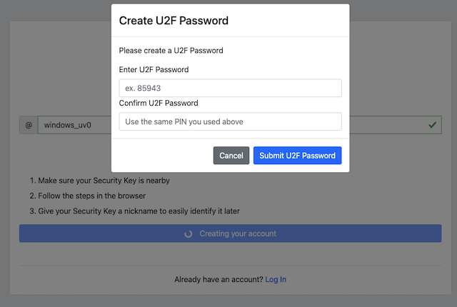
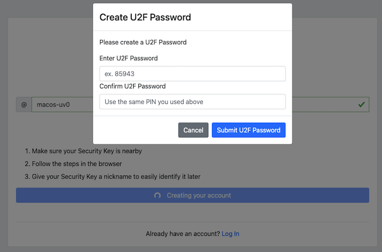
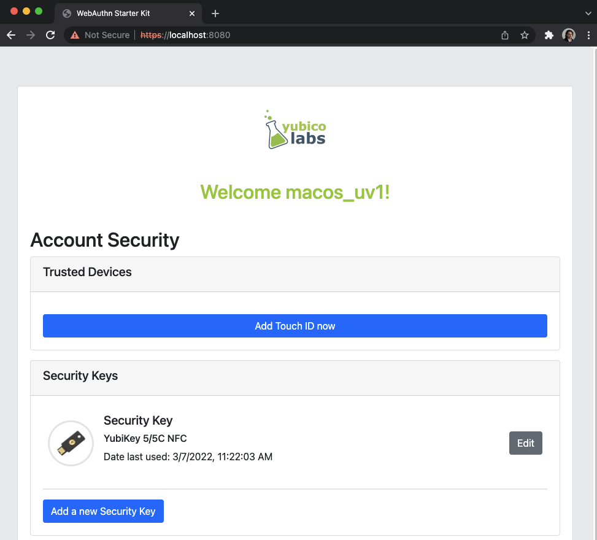
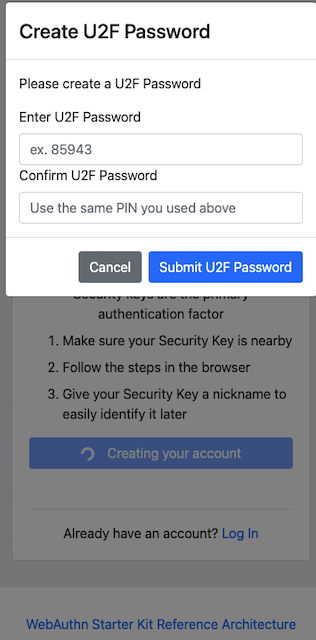
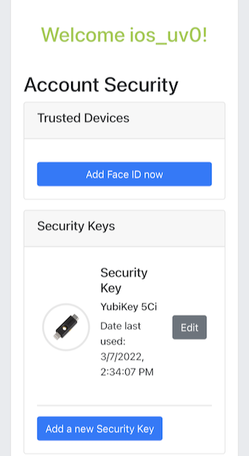

== WebAuthn registration process overview

=== Prerequisites

The WebAuthn registration process described in this section is first and foremost based on the registration specification in the
link:https://www.w3.org/TR/webauthn/[W3C WebAuthn standard]. The WebAuthn registration process is equivalent to the WebAuthn Make Credentials procedure. All WebAuthn registration parameters, JSON objects, and generic WebAuthn flows are based on the W3C WebAuthn standard.

In addition to the W3C WebAuthn standard, the specific registration flow described in this section adheres to the New Account Creation section of the Adaptive Multi-Factor Authentication Flow document. The Adaptive Multi-Factor Authentication Flow description explains the creation of an account as well as the WebAuthn registration process.

Furthermore, the Custom Registration Flow in the High Level Architecture document describes the technical environment in more depth. This document describes the AWS architecture, Lambda components and the SQL database that need to be deployed for hosting a WebAuthn Relying Party for the WebAuthn Starter Kit.

It is recommended to study the documents mentioned above as a pre-requisite before continuing reading this section.

Finally, the WebAuthn Starter Kit must have been deployed at AWS as described in the tutorial Automated WebAuthnKit deployment at AWS. The URL that is deployed for the WebAuthn Starter Kit React web app at the AWS frontend is considered as the WebAuthnKit URL throughout the remainder of this document.

=== Purpose of this section

Now, this section describes how to perform the WebAuthn registration process by using Microsoft Windows, an Apple iOS smartphone with the Safari browser, and an Apple iOS smartphone with an app that implements WebAuthn.

As described in the Adaptive Multi-Factor Authentication Flow page, there are a number of routes the registration flow can take, depending of what clients, parameters and selections that are used during the registration process. For each section, the client’s configuration is described, as well as the registration scenario.

=== WebAuthn registration using Microsoft Windows

Client configuration for Microsoft Windows

The client configuration used in this section is the following:

 * Operating system: Microsoft Windows 10 Pro

 * Web browser: Google Chrome (version 98.0.4758.102)

 * FIDO2 implementation: Microsoft’s
 link:https://docs.microsoft.com/en-us/microsoft-edge/dev-guide/windows-integration/web-authentication[Web Authentication API], which is a Win32 API that exposes the
 link:https://www.w3.org/TR/webauthn/[WebAuthn] functions to Windows 10 applications (including Google Chrome), and Microsoft’s CTAP2 stack

=== Registration for User-Verified flow on Windows

==== Registration selections for User-Verified flow on Windows

The FIDO authenticator used in this section is the following:

 * A YubiKey 5Ci (version 5.4.3) is used as FIDO authenticator. The FIDO2 application on the YubiKey is *activated*. The YubiKey 5 has not been registered with this service, so there are no FIDO2 credentials or PIN-codes set.

The registration route described in this section is derived from the following parameters and selections according to the Adaptive Multi-Factor Authentication Flow page:

 * The WebAuthn MakeCredentials parameter `UserVerification` is set to *Preferred*, which resolves to the CTAP2 parameter `UV=1` for a FIDO2 enabled YubiKey used with Google Chrome on Windows 10. This behaviour is equivalent to setting the WebAuthn MakeCredentials parameter `UserVerification` to *Required*.

 * A U2F Password is not set for this account as part of the registration process (since the CTAP2 parameter `UV=1` is set).

==== Registration process and UX design for User-Verified flow on Windows

The selections for the registration process result in the registration flow and UX described in this section.

*Step 1.1:* The YubiKey 5 with the FIDO2 application is selected as authenticator. (In other words, a platform authenticator is not used.)

*Step 1.2:* The user visits the WebAuthnKit URL. The site redirects the user to the Login page. Since a new user account shall be created, the user clicks "Sign Up".

image::Images/reg1-login-windows-webauthn-registration.v2.png[]
*Figure 1 - Login page on Windows for WebAuthn registration*

*Step 1.3:* Next, the registration page is shown. The user enters in their desired Username, then presses *Continue* in the window below, and a new account is created for the user.

*Figure 2 - Registration page for security key*

*Step 1.4:* The WebAuthn parameter `UserVerification` is set to *Preferred* (CTAP2 `UV=1`) for this registration process. The user inserts the YubiKey 5 into the computer and presses the button *Register Security Key*.

*Step 1.5:* Windows displays a security dialog box, with a sec of instructions. First the user will be prompted to select the type of Authenticator to use. Select External Security Key (Figure 3.A). Next the user will select "Ok" to allow the key to sign in to the site using the given account (Figure 3.B) 

*Figure 3.A - Select Authenticator Type*

*Figure 3.B - Set-up Key to Sign in to Account on Site*

*Step 1.6:* Windows displays a security dialog box with a request to use the security key for this site. The user approves this by pressing the *Ok* button.

image::Images/reg3-C-create-pin-yubikey-fido2-app-v2.png[]
*Figure 4 - Allow the YubiKey to be used for this site*

*Step 1.7:* Windows displays a security dialog box, in which the user enters a new PIN-code for the YubiKey. (If a YubiKey is used with PIN-code already set for the FIDO application, there will be a dialog box with a field for the user to a enter the PIN-code.)

*Figure 5 - Touch the YubiKey for FIDO2 registration*

*Step 1.6:* Windows displays a security dialog box with instructions for the user to touch the security key. The user touches the sensor on the YubiKey.

*Figure 6 - Touch the YubiKey for FIDO2 registration*

*Step 1.7:* This completes the registration process. The user’s account is created and an OpenID Connect token is returned to the browser.

==== Registration for the U2F with Password flow on Windows

===== Registration selections for the U2F with Password flow on Windows

The FIDO authenticator used in this section is the following:

 * A YubiKey 5 NFC or YubiKey 4 is used as FIDO authenticator. The FIDO2 application on the YubiKey 5 is *deactivated*. The YubiKey has not been registered with this service, so there are no FIDO2 credentials or PIN-codes set.

The registration route described in this section is derived from the following parameters and selections according to the Adaptive Multi-Factor Authentication Flow page:

 * The WebAuthn MakeCredentials parameter `UserVerification` is set to *Preferred*, which resolves to the CTAP2 parameter `UV=0` for a FIDO2 disabled YubiKey used with Google Chrome on Windows 10. The backward compatible FIDO U2F flow of WebAuthn is therefore used. This behaviour is equivalent to setting the WebAuthn MakeCredentials parameter `UserVerification` to *Discouraged*.

 * A U2F Password is set for this account as part of the registration process (since the CTAP2 parameter `UV=0` is set).

===== Registration flow and UX design for the U2F with Password flow on Windows

The registration process for the U2F with Password flow is identical to the User-Verified registration process with one notable exception:

The FIDO authenticator will not require a PIN-code (as shown in Figure 5). The FIDO authenticator will only require the user to touch the FIDO authenticator. Instead, a the user must set a U2F Password when creating the account. The U2F Password is used as first factor authentication to protect the account.

An example of how to set a U2F Password is shown in the screenshot below.

*Figure 7 - The user sets a U2F Password*

==== Registration for Usernameless flow on Windows

===== Registration selections for Usernameless flow on Windows

The FIDO2 authenticator used in this section is the following:

 * A YubiKey 5Ci (version 5.4.3) is used as FIDO2 authenticator. The YubiKey 5 is configured with FIDO2 credentials and a PIN-code according to section High Level WebAuthn Registration flow.

The registration route described in this section is derived from the following parameters and selections according to the Adaptive Multi-Factor Authentication Flow page:

 * The WebAuthn MakeCredentials parameter `UserVerification` is set to *Preferred*, which resolves to the CTAP2 parameter `UV=1` for a FIDO2 enabled YubiKey used with Google Chrome on Windows 10. This behaviour is equivalent to setting the WebAuthn MakeCredentials parameter `UserVerification` to *Required*.

 * The WebAuthn MakeCredentials parameter `authenticatorSelection.requireResidentKey` is set to *True*.

 * A U2F Password is not set for this account as part of the registration process (since the CTAP2 parameter `UV=1` is set).

===== Registration process and UX design for Usernameless flow on Windows

The WebAuthn Usernameless registration process requires that the user already has enrolled for FIDO credentials to a FIDO authenticator, and that the user has authenticated to the WebAuthn Starter Kit website.

*Step 2.1:* The user uses the FIDO authenticator to log on to the WebAuthn Starter Kit website as shown in the picture below.

*Figure 8 - WebAuthn Starter Kit administration website*

*Step 2.2:* The user presses the button *Add a new security key*. In the GUI that appears, the user enters a nickname for the usernameless FIDO authenticator, and marks the checkbox to *Enable usernameless login with this key*. The user presses the button *Register security key* to complete the operation.

*Figure 9 - Entering the nickname of a new security key*

The user adds the security key according to the instructions in the section Adding a FIDO authenticator for Windows. When this process is completed, the new YubiKey is added to the user’s account, which is shown in the picture below.

*Figure 10 - An additional YubiKey is added to the user’s account*

At this stage, the security key with resident credentials for can be used for Usernameless authentication in to the same account.

If the user needs to re-use the same security key for the Usernameless flow, it is necessary to first delete the originally registered security key. Then only one security key is registered for the Usernameless flow.

*Figure 11 - Only one security key is configured for the Usernameless flow*

=== WebAuthn registration using Apple MacOS

==== Client configuration for Apple MacOS

The client configuration used in this section is the following:

 * Operating system: Apple MacOS Monterey 12.0.1

 * Web browser: Google Chrome (version 98.0.4758.109)

 * FIDO2 implementation: Google
 link:https://developers.google.com/web/updates/2018/05/webauthn[Chrome’s Web Authentication API], which is an API that exposes the
 link:https://www.w3.org/TR/webauthn/[W3C WebAuthn] functions to MacOS applications (including Google Chrome), and Google’s CTAP2 stack

==== Registration for the User-Verified flow on MacOS

===== Registration selections for the User-Verified flow on MacOS

The FIDO authenticator used in this section is the following:

 * A YubiKey 5 NFC (version 5.4.3) is used as FIDO authenticator. The FIDO2 application on the YubiKey is *activated*. The YubiKey 5 has a PIN-code set, but there are no FIDO2 credentials enrolled.

The registration route described in this section is derived from the following parameters and selections according to the Adaptive Multi-Factor Authentication Flow page:

 * The WebAuthn MakeCredentials parameter `UserVerification` is set to *Preferred*, which resolves to the CTAP2 parameter `UV=1` for a FIDO2 enabled YubiKey with PIN used with Google Chrome on MacOS. This behaviour is equivalent to setting the WebAuthn MakeCredentials parameter `UserVerification` to *Required*.

 * A U2F Password is not set for this account as part of the registration process (since the CTAP2 parameter `UV=1` is set).

===== Registration process and UX design for the User-Verified flow on MacOS

The selections for the registration process result in the registration flow and UX described in this section.

*Step 3.1:* The YubiKey 5 with the FIDO2 application is selected as authenticator. (In other words, a platform authenticator is not used.)

*Step 3.2:* The user visits the WebAuthnKit URL. The site redirects the user to the Login page. Since a new user account shall be created, the user enters clicks "Sign Up".

*Figure 12 - Login page on MacOS for WebAuthn registration*

*Step 3.3:* Next, the registration page is shown. The user enters in their desired Username, then presses *Continue* in the window below, and a new account is created for the user.

*Figure 13 - Registration page for security key*

*Step 3.4:* The WebAuthn parameter `UserVerification` is set to *Preferred* (CTAP2 `UV=1`) for this registration process. The user inserts the YubiKey 5 into the computer and presses the button *Register Security Key*.

*Step 3.5:* Google Chrome displays a security dialog box, in which the user can select the authentication mechanism. The user selects *USB security key*.

*Figure 14 - Select authentication mechanism*

*Step 3.6:* Google Chrome displays a security dialog box, which requests the user to insert the security key and touch it. The user inserts the YubiKey and presses the sensor.

*Figure 15 - Insert the FIDO authenticator and touch it*

*Step 3.7:* Google Chrome displays a security dialog box, in which the user enters the PIN-code for the YubiKey.

*Figure 16 - Enter the PIN for the FIDO authenticator*

*Step 3.8:* Google Chrome displays a security dialog box, which requests the user to touch the security key one more time. The user inserts the YubiKey and presses the sensor again.

*Figure 17 - Touch the FIDO authenticator one more time*

*Step 3.9:* This completes the registration process. The user’s account is created and an OpenID Connect token is returned to the browser.

==== Registration for the U2F with Password flow on MacOS

===== Registration selections for the U2F with Password flow on MacOS

The FIDO authenticator used in this section is the following:

 * A YubiKey 4 or YubiKey 5 NFC is used as FIDO authenticator. The FIDO2 application on the YubiKey 5 is *deactivated*, which triggers the the U2F with Password behavior on MacOS. Also a YubiKey with the FIDO2 application activated, but with no PIN-code set, will trigger the the U2F with Password flow on MacOS (which is a significant difference from Windows that will prompt the user for setting a PIN and activate the User-Verified process).

The registration route described in this section is derived from the following parameters and selections according to the Adaptive Multi-Factor Authentication Flow page:

 * The  WebAuthn MakeCredentials parameter `UserVerification` is set to *Preferred*, which resolves to the CTAP2 parameter `UV=0` for a FIDO2 disabled YubiKey used with Google Chrome on MacOS. The backward compatible FIDO U2F flow of WebAuthn is therefore used. This behavior is equivalent to setting the WebAuthn MakeCredentials parameter `UserVerification` to *Discouraged*.

 * A U2F Password is set for this account as part of the registration process (since the CTAP2 parameter `UV=0` is set).

===== Registration process and UX design for the U2F with Password flow on MacOS

The registration process for the U2F with Password flow is identical to the User-Verified registration process with one notable exception:

The FIDO authenticator will not require a PIN-code (as shown in Figure 16). The FIDO authenticator will only require the user to touch the FIDO authenticator. Instead, a the user must set a U2F Password when creating the account. The U2F Password is used as first factor authentication to protect the account.

An example of how to set a U2F Password is shown in the screenshot below.

*Figure 18 - The user sets a U2F Password*

==== Registration for Usernameless flow on MacOS

===== Registration selections for Usernameless flow on MacOS

The FIDO2 authenticator used in this section is the following:

 * A YubiKey 5 NFC (version 5.4.3) is used as FIDO2 authenticator. The YubiKey 5 is configured with FIDO2 credentials and a PIN-code according to section High Level WebAuthn Registration flow.

The registration route described in this section is derived from the following parameters and selections according to the Adaptive Multi-Factor Authentication Flow page:

 * The  WebAuthn MakeCredentials parameter `UserVerification` is set to *Preferred*, which resolves to the CTAP2 parameter `UV=1` for a FIDO2 enabled YubiKey used with Google Chrome on MacOS. This behaviour is equivalent to setting the WebAuthn MakeCredentials parameter `UserVerification` to *Required*.

 * The WebAuthn MakeCredentials parameter `authenticatorSelection.requireResidentKey` is set to *True*.

 * A U2F Password is not set for this account as part of the registration process (since the CTAP2 parameter `UV=1` is set).

===== Registration process and UX design for Usernameless flow on MacOS

The WebAuthn Usernameless registration process requires that the user already has enrolled for FIDO credentials to a FIDO authenticator, and that the user has authenticated to the WebAuthn Starter Kit website.

*Step 4.1:* The user uses the FIDO authenticator to log on to the WebAuthn Starter Kit website as shown in the picture below.

*Figure 19 - WebAuthn Starter Kit administration website*

*Step 4.2:* The user presses the button *Add a new security key*. In the GUI that appears, the user enters a nickname for the usernameless FIDO authenticator, and marks the checkbox to *Enable usernameless login with this key*. The user presses the button *Register security key* to complete the operation.

*Figure 20 - Entering the nickname of a new security key*

The user adds the security key according to the instructions in the section Adding a FIDO authenticator for MacOS. When this process is completed, the new YubiKey is added to the user’s account, which is shown in the picture below.

*Figure 21 - An additional YubiKey is added to the user’s account*

At this stage, the security key with resident credentials for can be used for Usernameless authentication in to the same account.

If the user needs to re-use the same security key for the Usernameless flow, it is necessary to first delete the originally registered security key. Then only one security key is registered for the Usernameless flow.

*Figure 22 - Only one security key is configured for the Usernameless flow*

=== WebAuthn registration using the Apple iOS Safari browser

==== Client configuration for Apple iOS with Safari

The client configuration used in this section is the following:

 * Operating system: Apple iPhone iOS 14 developer

 * Web browser: Apple iPhone Safari 14 developer

 * FIDO2 implementation: Apple iPhone iOS 14 developer, which is an API that exposes the
 link:https://www.w3.org/TR/webauthn/[W3C WebAuthn] functions to iOS applications (including Safari)

==== Registration for the User-Verified flow on Apple iOS with Safari

===== Registration selections for the User-Verified flow on Apple iOS with Safari

The FIDO authenticators used in this section is the following:

 * A YubiKey 5Ci (version 5.4.3) is used as FIDO authenticator, which is plugged into the iPhone’s lightning port. The FIDO2 application on the YubiKey is *activated*. The YubiKey 5Ci has a PIN-code set, but there are no FIDO2 credentials enrolled.

 * A YubiKey 5 NFC (version 5.4.3) is also used as FIDO authenticator, which is tapped to the iPhone’s NFC receiver. The FIDO2 application on the YubiKey is *activated*. The YubiKey 5 has a PIN-code set, but there are no FIDO2 credentials enrolled. The Yubico OTP application over NFC is deactivated, to avoid the NFC tag pop-up window.

The WebAuthn registration results are identical when using both YubiKeys.

The registration route described in this section is derived from the following parameters and selections according to the Adaptive Multi-Factor Authentication Flow page:

 * The WebAuthn MakeCredentials parameter  `UserVerification` is set to *Preferred*, which resolves to the CTAP2 parameter `UV=1` for a FIDO2 enabled YubiKey with PIN used with Safari on Apple iOS. This behaviour is equivalent to setting the WebAuthn MakeCredentials parameter `UserVerification` to *Required*.

 * A U2F Password is not set for this account as part of the registration process (since the CTAP2 parameter `UV=1` is set).

===== Registration process and UX design for the User-Verified flow on Apple iOS with Safari

The selections for the registration process result in the registration flow and UX described in this section.

*Step 5.1:* The YubiKey with the FIDO2 application is selected as authenticator. (In other words, a platform authenticator is not used.)

*Step 5.2:* The user visits the WebAuthnKit URL. The site redirects the user to the Login page. Since a new user account needs to be created, the user clicks "Sign Up".

*Figure 23 - Login page on MacOS for WebAuthn registration*

*Step 5.3:* Next, the registration page is shown. The user enters in their desired Username, then presses *Continue* in the window below, and a new account is created for the user.

*Figure 24 - Registration page for security key*

*Step 5.4:* The WebAuthn parameter `UserVerification` is set to *Preferred* (CTAP2 `UV=1`) for this registration process. The user inserts the YubiKey 5Ci into the iPhone or taps the YubiKey 5 NFC and presses the button *Register Security Key*.

*Step 5.5:* WebKit requires that new WebAuthn credentials need to be created by a function that was triggered by a user event. When on iOS the screen below will appear, prompting the user to click in order to trigger the credential creation.

*Figure 25 - Menu for user triggered event*

*Step 5.6:* Safari displays a security dialog box, which will ask the user if they wish to use Face ID or a Security Key. Please select Security Key.

*Figure 26 - Menu for Face ID or Security Key option*

*Step 5.7:* Safari displays a security dialog box, which requests the user to insert the security key and touch it. The user inserts the YubiKey 5Ci and presses the sensor or taps the YubiKey 5 NFC.

*Figure 27 - Menu for user triggered event*

*Step 5.8:* Safari displays a security dialog box, in which the user enters the PIN-code for the YubiKey.

*Figure 28 - Enter the PIN for the FIDO authenticator*

*Step 5.9:* Safari displays a security dialog box, which requests the user to touch the security key one more time. The user inserts the YubiKey and presses the sensor again.

*Figure 29 - Touch the FIDO authenticator one more time*

*Step 5.10:* The account is created and an OpenID Connect token is returned to the browser.

==== Registration for the U2F with Password flow on Apple iOS with Safari

===== Registration selections for the U2F with Password flow on Apple iOS with Safari

The FIDO authenticators used in this section are the following:

* A YubiKey 5Ci is used as FIDO authenticator, which is plugged into the iPhone’s lightning port. The FIDO2 application on the YubiKey is *deactivated*, which triggers the the U2F with Password behaviour on Apple iOS. Also a YubiKey with the FIDO2 application activated, but with no PIN-code set, will trigger the the U2F with Password flow on Apple iOS (which is a significant difference from Windows that will prompt the user for setting a PIN and activate the the User-Verified process).

 * A YubiKey 5 NFC (version 5.2.6) is also used as FIDO authenticator, which is tapped to the iPhone’s NFC receiver. The FIDO2 application on the YubiKey 5 is *deactivated*, which triggers the U2F with Password behaviour on Apple iOS. Also a YubiKey with the FIDO2 application activated, but with no PIN-code set, will trigger the U2F with Password flow on Apple iOS (which is a significant difference from Windows that will prompt the user for setting a PIN and activate the the User-Verified flow). The Yubico OTP application over NFC is deactivated, to avoid the NFC tag pop-up window.

The registration route described in this section is derived from the following parameters and selections according to the Adaptive Multi-Factor Authentication Flow page:

 * The WebAuthn MakeCredentials parameter `UserVerification` is set to *Preferred*, which resolves to the CTAP2 parameter `UV=0` for a FIDO2 disabled YubiKey used with Safari on Apple iOS. The backward compatible FIDO U2F flow of WebAuthn is therefore used. This behaviour is equivalent to setting the WebAuthn MakeCredentials parameter `UserVerification` to *Discouraged*.

 * A U2F Password is set for this account as part of the registration process (since the CTAP2 parameter `UV=0` is set).

===== Registration process and UX design for U2F with Password flow on Apple iOS with Safari

The registration process for the U2F with Password flow is identical to the User-Verified registration process with one notable exception:

The FIDO authenticator will not require a PIN-code (as shown in Figure 28); the FIDO authenticator will only require the user to touch the FIDO authenticator. Instead, the user must set a U2F Password when creating the account. The U2F Password is used as first factor authentication to protect the account.

An example of how to set a U2F Password is shown in the screenshot below.

*Figure 28 - The user sets a U2F Password*

==== Registration for the Usernameless flow on Apple iOS with Safari

===== Registration selections for the Usernameless flow on Apple iOS with Safari

The FIDO authenticators used in this section is the following:

 * A YubiKey 5Ci (version 5.4.3) is used as FIDO authenticator, which is plugged into the iPhone’s lightning port. The FIDO2 application on the YubiKey is *activated*. The YubiKey 5Ci has a PIN-code set, but there are no FIDO2 credentials enrolled.

 * A YubiKey 5 NFC (version 5.4.3) is also used as FIDO authenticator, which is tapped to the iPhone’s NFC receiver. The FIDO2 application on the YubiKey is *activated*. The YubiKey 5 has a PIN-code set, but there are no FIDO2 credentials enrolled. The Yubico OTP application over NFC is deactivated, to avoid the NFC tag pop-up window.

The WebAuthn registration results are identical when using both YubiKeys.

The registration route described in this section is derived from the following parameters and selections according to the Adaptive Multi-Factor Authentication Flow page:

 * The WebAuthn MakeCredentials parameter `UserVerification` is set to *Preferred*, which resolves to the CTAP2 parameter `UV=1` for a FIDO2 enabled YubiKey with PIN used with Safari on Apple iOS. This behaviour is equivalent to setting the WebAuthn MakeCredentials parameter `UserVerification` to *Required*.

 * The WebAuthn MakeCredentials parameter `authenticatorSelection.requireResidentKey` is set to *True*.

 *  U2F Password is not set for this account as part of the registration process (since the CTAP2 parameter `UV=1` is set).

===== Registration process and UX design for the Usernameless flow on Apple iOS with Safari

The WebAuthn Usernameless registration process requires that the user already has enrolled for FIDO credentials to a FIDO authenticator, and that the user has authenticated to the WebAuthn Starter Kit website.

*Step 6.1:* The user uses the original FIDO authenticator to log on to the WebAuthn Starter Kit website as shown in the picture below.

*Figure 30 - WebAuthn Starter Kit administration website*

*Step 6.2:* The user presses the button *Add a new security key*. In the GUI that appears, the user enters a nickname for the usernameless FIDO authenticator, and marks the checkbox to *Enable usernameless login with this key*. The user presses the button *Register security key* to complete the operation.

*Figure 31 - Entering the nickname of a new security key*

The user adds the security key according to the instructions in the section Adding a FIDO authenticator for Apple iOS Safari. When this process is completed, the new YubiKey is added to the user’s account, which is shown in the picture below.

*Figure 32 - An additional YubiKey is added to the user’s account*

At this stage, the security key with resident credentials for can be used for Usernameless authentication in to the same account.

If the user needs to re-use the same security key for the Usernameless flow, it is necessary to first delete the originally registered security key. Then only one security key is registered for the Usernameless flow.

*Figure 33 - Only one security key is configured for the Usernameless flow*
