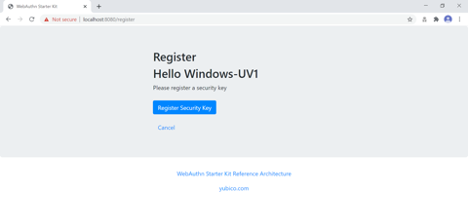
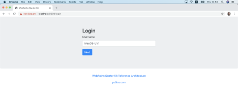
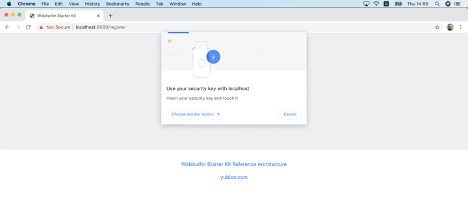
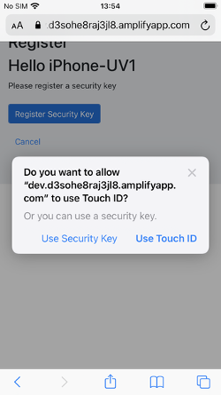
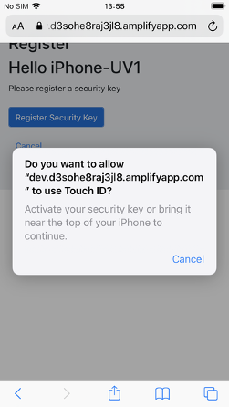
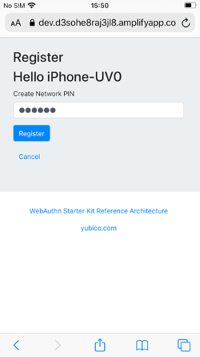

== High Level WebAuthn Registration flow

=== WebAuthn registration process overview

==== Pre-requisities

The WebAuthn registration process described in this section is first and foremost based on the registration specification in the W3C WebAuthn standard. The WebAuthn registration process is equivalent to the WebAuthn Make Credentials procedure. All WebAuthn registration parameters, JSON objects, and generic WebAuthn flows are based on the W3C WebAuthn standard.

In addition to the W3C WebAuthn standard, the specific registration flow described in this section adheres to the New Account Creation section of the Identifier First Flow document. The Identifier First Flow description explains the creation of an account as well as the WebAuthn registration process.

Furthermore, the Custom Registration Flow in the High Level Architecture document describes the technical environment in more depth. This document describes the AWS architecture, Lambda components and the SQL database that need to be deployed for hosting a WebAuthn Relying Party for the WebAuthn Starter Kit.

It is recommended to study the documents mentioned above as a pre-requisite before continuing reading this section.

==== Purpose of this section

Now, this section describes how to perform the WebAuthn registration process by using Microsoft Windows, an Apple iOS smartphone with the Safari browser, and an Apple iOS smartphone with an app that implements WebAuthn.

As described in the Identifier First Flow page, there are a number of routes the registration flow can take, depending of what clients, parameters and selections that are used during the registration process. For each section, the client’s configuration is described, as well as the registration scenario.

=== WebAuthn registration using Microsoft Windows

==== Client configuration for Microsoft Windows

The client configuration used in this section is the following:

* *Operating system:* Microsoft Windows 10 Pro (edition 2004)

* *Web browser:* Google Chrome (version 84.0.4147.105)

* *FIDO2 implementation:* Microsoft’s
link:https://docs.microsoft.com/en-us/microsoft-edge/dev-guide/windows-integration/web-authentication[Web Authentication API], which is a Win32 API that exposes the W3C
link:https://www.w3.org/TR/webauthn/[WebAuthn] functions to Windows 10 applications (including Google Chrome), and Microsoft’s CTAP2 stack

==== Registration with UV=1 on Windows

===== Registration selections for UV=1 on Windows

The FIDO authenticator used in this section is the following:

* A YubiKey 5 NFC (version 5.2.6) is used as FIDO authenticator. The FIDO2 application on the YubiKey is *activated*. The YubiKey 5 is reset, so there are no FIDO2 credentials or PIN-codes set.

The registration route described in this section is derived from the following parameters and selections according to the Identifier First Flow page:

* The WebAuthn MakeCredentials parameter UserVerification is set to 'Preferred', which resolves to the CTAP2 parameter UV=1 for a FIDO2 enabled YubiKey used with Google Chrome on Windows 10. This behaviour is equivalent to setting the WebAuthn MakeCredentials parameter UserVerification to 'Required'.

* A “network PIN” is not set for this account as part of the registration process (since the CTAP2 parameter UV=1 is set).

* Backup codes are not generated.

===== Registration flow and UX design for UV=1 on Windows

The selections for the registration process result in the registration flow and UX described in this section.

*Step 1.1:* The YubiKey 5 with the FIDO2 application is selected as authenticator. (In other words, a platform authenticator is not used.)

*Step 1.2:* The user visits the landing page https://localhost:8080/. The site redirects the user to the Login page. Since a new user account shall be created, the user enters a new username.

image::reg1-login-win-webauth-registration.png[]
*Figure 1 - Login page on Windows for WebAuthn registration*

*Step 1.3:* The user presses “Next” in the window above, and a new account is created for the user.

*Step 1.4:* Next, the registration page is shown below. The WebAuthn parameter UserVerification is set to 'Preferred' (CTAP2 UV=1) for this registration process. The user inserts the YubiKey 5 into the computer and presses the button “Register Security Key”.

*Figure 2 - Registration page for security key*

*Step 1.5:* Windows displays a security dialog box, in which the user enters a new PIN-code for the YubiKey. (If a YubiKey is used with PIN-code already set for the FIDO application, there will be a dialog box with a field for the user to a enter the PIN-code.)

image::reg3-enter-win-pin-yubikey-fido2-app.png[]
*Figure 3 - Enter PIN for the YubiKey’s FIDO2 application*

*Step 1.6:* Windows displays a security dialog box with instructions for the user to touch the security key. The user touches the sensor on the YubiKey.

image::reg4-touch-win-yubikey-fido2-registration.png[]
*Figure 4 - Touch the YubiKey for FIDO2 registration*

*Step 1.7:* The profile is created and an OpenID Connect token is returned to the browser.

image::reg5-win-yubikey-registration-complete.png[]
*Figure 5 - The YubiKey registration is complete*

==== Registration with UV=0 on Windows

===== Registration selections for UV=0 on Windows

The FIDO authenticator used in this section is the following:

* A YubiKey 5 NFC (version 5.2.6) is used as FIDO authenticator. The FIDO2 application on the YubiKey is *deactivated*. The YubiKey 5 is reset, so there are no FIDO2 credentials or PIN-codes set.

The registration route described in this section is derived from the following parameters and selections according to the Identifier First Flow page:

* The WebAuthn MakeCredentials parameter UserVerification is set to 'Preferred', which resolves to the CTAP2 parameter UV=0 for a FIDO2 disabled YubiKey used with Google Chrome on Windows 10. The backward compatible FIDO U2F flow of  WebAuthn is therefore used. This behaviour is equivalent to setting the WebAuthn MakeCredentials parameter UserVerification to 'Discouraged'.

* A “network PIN” is set for this account as part of the registration process (since the CTAP2 parameter UV=0 is set).

* Backup codes are not generated.

===== Registration flow and UX design for UV=0 on Windows

The registration process for UV=0 is identical to the registration process for UV=1 with one notable exception:

The FIDO authenticator will not require a PIN-code (as shown in figure 1.3); the FIDO authenticator will only require the user to touch the FIDO authenticator. Instead, a the user must set a Network PIN when creating the account. The Network PIN is used as first factor authentication to protect the account.

An example of how to set a Network PIN is shown in the screenshot below.

image::reg6-user-win-set-network-pin.png[]
*Figure 6 - The user sets a Network PIN*

=== WebAuthn registration using Apple MacOS

==== Client configuration for Apple MacOS

The client configuration used in this section is the following:

* *Operating system:* Apple MacOS Catalina 10.15.6

* *Web browser:* Google Chrome (version 84.0.4147.125)

* *FIDO2 implementation:* Google Chrome’s Web Authentication API, which is an API that exposes the W3C WebAuthn functions to MacOS applications (including Google Chrome), and Google’s CTAP2 stack

==== Registration with UV=1 on MacOS

===== Registration selections for UV=1 on MacOS

The FIDO authenticator used in this section is the following:

* A YubiKey 5 NFC (version 5.1.2) is used as FIDO authenticator. The FIDO2 application on the YubiKey is *activated*. The YubiKey 5 has a PIN-code set, but there are no FIDO2 credentials enrolled.

The registration route described in this section is derived from the following parameters and selections according to the Identifier First Flow page:

* The WebAuthn MakeCredentials parameter UserVerification is set to 'Preferred', which resolves to the CTAP2 parameter UV=1 for a FIDO2 enabled YubiKey with PIN used with Google Chrome on MacOS. This behaviour is equivalent to setting the WebAuthn MakeCredentials parameter UserVerification to 'Required'.

* A “network PIN” is not set for this account as part of the registration process (since the CTAP2 parameter UV=1 is set).

* Backup codes are not generated.

===== Registration flow and UX design for UV=1 on MacOS

The selections for the registration process result in the registration flow and UX described in this section.

*Step 2.1:* The YubiKey 5 with the FIDO2 application is selected as authenticator. (In other words, a platform authenticator is not used.)

*Step 2.2:* The user visits the landing page https://localhost:8080/. The site redirects the user to the Login page. Since a new user account shall be created, the user enters a new username.

*Figure 7 - Login page on MacOS for WebAuthn registration*

*Step 2.3:* The user presses “Next” in the window above, and a new account is created for the user.

*Step 2.4:* Next, the registration page is shown below. The WebAuthn parameter UserVerification is set to 'Preferred' (CTAP2 UV=1) for this registration process. The user inserts the YubiKey 5 into the computer and presses the button “Register Security Key”.

image::reg8-registration-mac-security-key.png[]
*Figure 8 - Registration page for security key*

*Step 2.5:* Google Chrome displays a security dialog box, in which the user can select the authentication mechanism. The user selects “USB security key”.

image::reg9-select-mac-authentication-method.png[]
*Figure 9 - Select authentication mechanism*

*Step 2.6:* Google Chrome displays a security dialog box, which requests the user to insert the security key and touch it. The user inserts the YubiKey and presses the sensor.

*Figure 10 - Insert the FIDO authenticator and touch it*

*Step 2.7:* Google Chrome displays a security dialog box, in which the user enters the PIN-code for the YubiKey.

image:reg11-enter-mac-pin-fido-authenticator.png[]
*Figure 11 - Enter the PIN for the FIDO authenticator*

*Step 2.8:* Google Chrome displays a security dialog box, which requests the user to touch the security key one more time. The user inserts the YubiKey and presses the sensor again.

image::reg12-touch-mac-fido-authenticator-again.png[]
*Figure 12 - Touch the FIDO authenticator one more time*

*Step 2.9:* The profile is created and an OpenID Connect token is returned to the browser.

image::reg13-mac-webauthn-registration-complete.png[]
*Figure 13 - The WebAuthn registration process is complete*

==== Registration with UV=0 on MacOS

===== Registration selections for UV=0 on MacOS

The FIDO authenticator used in this section is the following:

* A YubiKey 5 NFC (version 5.1.2) is used as FIDO authenticator. The FIDO2 application on the YubiKey is *deactivated*, which triggers the UV=0 behaviour on MacOS. Also a YubiKey with the FIDO2 application activated, but with no PIN-code set, will trigger the UV=0 flow on MacOS (which is a significant difference from Windows that will prompt the user for setting a PIN and activate the UV=1 process).

The registration route described in this section is derived from the following parameters and selections according to the Identifier First Flow page:

* The WebAuthn MakeCredentials parameter UserVerification is set to 'Preferred', which resolves to the CTAP2 parameter UV=0 for a FIDO2 disabled YubiKey used with Google Chrome on MacOS. The backward compatible FIDO U2F flow of WebAuthn is therefore used. This behaviour is equivalent to setting the WebAuthn MakeCredentials parameter UserVerification to 'Discouraged'.

* A “network PIN” is set for this account as part of the registration process (since the CTAP2 parameter UV=0 is set).

* Backup codes are not generated.

===== Registration flow and UX design for UV=0 on MacOS

The registration process for UV=0 is identical to the registration process for UV=1 with one notable exception:

The FIDO authenticator will not require a PIN-code (as shown in figure 11); the FIDO authenticator will only require the user to touch the FIDO authenticator. Instead, a the user must set a Network PIN when creating the account. The Network PIN is used as first factor authentication to protect the account.

An example of how to set a Network PIN is shown in the screenshot below.

image::reg14-user-mac-set-network-pin.png[]
*Figure 14 - The user sets a Network PIN*

=== WebAuthn registration using the Apple iOS Safari browser

==== Client configuration for Apple iOS with Safari

The client configuration used in this section is the following:

* *Operating system:* Apple iPhone iOS 14 developer beta 6

* *Web browser:* Apple iPhone Safari 14 developer beta 6

* *FIDO2 implementation:* Apple iPhone iOS 14 developer beta 6, which is an API that exposes the
link:https://www.w3.org/TR/webauthn/[W3C WebAuthn] functions to iOS applications (including Safari)

==== Registration with UV=1 on Apple iOS with Safari

===== Registration selections for UV=1 on Apple iOS with Safari

The FIDO authenticators used in this section is the following:

* A YubiKey 5Ci (version 5.2.7) is used as FIDO authenticator, which is plugged into the iPhone’s lightning port. The FIDO2 application on the YubiKey is *activated*. The YubiKey 5Ci has a PIN-code set, but there are no FIDO2 credentials enrolled.

* A YubiKey 5 NFC (version 5.2.6) is also used as FIDO authenticator, which is tapped to the iPhone’s NFC receiver. The FIDO2 application on the YubiKey is *activated*. The YubiKey 5 has a PIN-code set, but there are no FIDO2 credentials enrolled. The Yubico OTP application over NFC is deactivated, to avoid the NFC tag pop-up window.

The WebAuthn registration results are identical when using both YubiKeys.

The registration route described in this section is derived from the following parameters and selections according to the Identifier First Flow page:

* The WebAuthn MakeCredentials parameter UserVerification is set to 'Preferred', which resolves to the CTAP2 parameter UV=1 for a FIDO2 enabled YubiKey with PIN used with Safari on Apple iOS. This behaviour is equivalent to setting the WebAuthn MakeCredential parameter UserVerification to 'Required'.

* A “network PIN” is not set for this account as part of the registration process (since the CTAP2 parameter UV=1 is set).

* Backup codes are not generated.

===== Registration flow and UX design for UV=1 on Apple iOS with Safari

The selections for the registration process result in the registration flow and UX described in this section.

*Step 3.1:* The YubiKey with the FIDO2 application is selected as authenticator. (In other words, a platform authenticator is not used.)

*Step 3.2:*  The user visits the landing page https://dev.d3sohe8raj3jl8.amplifyapp.com. The site redirects the user to the Login page. Since a new user account shall be created, the user enters a new username.

image::reg15-login-ios-webauthn-registration.png[]
*Figure 15 - Login page on MacOS for WebAuthn registration*

*Step 3.3:* The user presses “Next” in the window above, and a new account is created for the user.

*Step 3.4:* Next, the registration page is shown below. The WebAuthn parameter UserVerification is set to 'Preferred' (CTAP2 UV=1) for this registration process. The user inserts the YubiKey 5Ci into the iPhone or taps the YubiKey 5 NFC and presses the button “Register Security Key”.

image::reg16-ios-registration-security-key.png[]
*Figure 16 - Registration page for security key*

*Step 3.5:* Safari displays a security dialog box, in which the user can select the authentication mechanism. The user selects “USB security key”.

*Figure 17 - Select authentication mechanism*

*Step 3.6:* Safari displays a security dialog box, which requests the user to insert the security key and touch it. The user inserts the YubiKey 5Ci and presses the sensor or taps the YubiKey 5 NFC.

image::reg18-insert-touch-ios-fido-authenticator.png[]
*Figure 18 - Insert the FIDO authenticator and touch it*

*Step 3.7:* Safari displays a security dialog box, in which the user enters the PIN-code for the YubiKey.

image::reg19-enter-ios-pin-fido-authenticator.png[]
*Figure 19 - Enter the PIN for the FIDO authenticator*

*Step 3.8:* Safari displays a security dialog box, which requests the user to touch the security key one more time. The user inserts the YubiKey and presses the sensor again.

*Figure 20 - Touch the FIDO authenticator one more time*

*Step 3.9:* The profile is created and an OpenID Connect token is returned to the browser.

image::reg21-ios-webauthn-registration-complete.png[]
*Figure 21 - The WebAuthn registration process is complete*

==== Registration with UV=0 on Apple iOS with Safari

===== Registration selections for UV=0 on Apple iOS with Safari

The FIDO authenticators used in this section are the following:

* A YubiKey 5Ci (version 5.2.7) is used as FIDO authenticator, which is plugged into the iPhone’s lightning port. The FIDO2 application on the YubiKey is *deactivated*, which triggers the UV=0 behaviour on Apple iOS. Also a YubiKey with the FIDO2 application activated, but with no PIN-code set, will trigger the UV=0 flow on Apple iOS (which is a significant difference from Windows that will prompt the user for setting a PIN and activate the UV=1 process).

* A YubiKey 5 NFC (version 5.2.6) is also used as FIDO authenticator, which is tapped to the iPhone’s NFC receiver. The FIDO2 application on the YubiKey is *deactivated*, which triggers the UV=0 behaviour on Apple iOS. Also a YubiKey with the FIDO2 application activated, but with no PIN-code set, will trigger the UV=0 flow on Apple iOS (which is a significant difference from Windows that will prompt the user for setting a PIN and activate the UV=1 process). The Yubico OTP application over NFC is deactivated, to avoid the NFC tag pop-up window.

The registration route described in this section is derived from the following parameters and selections according to the Identifier First Flow page:

* The WebAuthn MakeCredentials parameter UserVerification is set to 'Preferred', which resolves to the CTAP2 parameter UV=0 for a FIDO2 disabled YubiKey used with Safari on Apple iOS. The backward compatible FIDO U2F flow of WebAuthn is therefore used. This behaviour is equivalent to setting the WebAuthn MakeCredentials parameter UserVerification to 'Discouraged'.

* A “network PIN” is set for this account as part of the registration process (since the CTAP2 parameter UV=0 is set).

* Backup codes are not generated.

===== Registration flow and UX design for UV=0 on Apple iOS with Safari

The registration process for UV=0 is identical to the registration process for UV=1 with one notable exception:

The FIDO authenticator will not require a PIN-code (as shown in figure 19); the FIDO authenticator will only require the user to touch the FIDO authenticator. Instead, the user must set a Network PIN when creating the account. The Network PIN is used as first factor authentication to protect the account.

An example of how to set a Network PIN is shown in the screenshot below.

*Figure 22 - The user sets a Network PIN*

=== WebAuthn registration using an Apple iOS app

##Notes for this section:##

##Describe the WebAuthn registration process by using Apple iOS and the app as client, in conjunction with an account in the AWS demo application.##

##Describe the UV=0 scenario.##

##Describe how to add a FIDO authenticator for an existing AWS account.##

##Do not describe how to generate the backup codes.##

##Describe Apple iOS 14 (beta) with Yubico iOS SDK, which supports PIN-codes and resident credentials.##

##Take screenshots of the WebAuthn registration process, by using the Apple iOS app, with the AWS Relying Party as the end-point##
