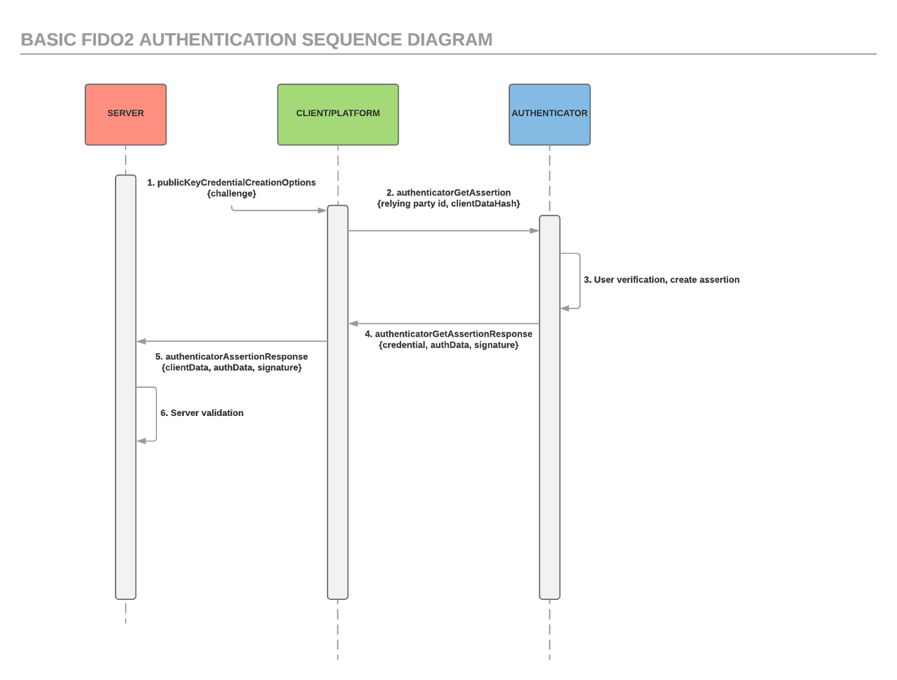

== What is FIDO2?
FIDO2 marks an evolution of the link:https://developers.yubico.com/U2F/[U2F] open authentication standard and enables strong passwordless authentication built on public key cryptography using hardware devices like security keys, mobile phones, and other built-in devices.

FIDO2 is an open authentication standard that consists of the W3C link:http://w3c.github.io/webauthn/[Web Authentication] specification, WebAuthn API (Application Programming Interface), and the Client to Authentication Protocol (CTAP). CTAP is an application layer protocol used for communication between a client (browser) or a platform (operating system) and an external authenticator (Security Key by Yubico). Yubico and Microsoft are core contributors to the CTAP protocol and the link:https://fidoalliance.org/specs/fido-v2.0-ps-20170927/fido-client-to-authenticator-protocol-v2.0-ps-20170927.html[specification] is hosted by the FIDO Alliance.

Like link:https://developers.yubico.com/U2F/[FIDO U2F], the FIDO2 standard offers the same high level of security, as it is based on public key cryptography and is intended to solve additional user scenarios including first factor (passwordless) and multi-factor authentication. With these new capabilities, the hardware security key can entirely replace weak static username/password credentials with strong hardware-backed public/private-key credentials.  These credentials can not be reused, replayed or shared across services, and are not subject to phishing and MiTM attacks or server breaches.

=== FIDO2 Advantages

[horizontal]
Strong security:: Replaces weak passwords with strong hardware-based authentication using public key crypto to protect against phishing, session hijacking, man-in-the-middle, and malware attacks.
Privacy Protection:: A FIDO2 device generates a new pair of keys for every service, and only the service stores the public key. With this approach, no secrets are shared between service providers.
Multiple choices:: Open standards provide flexibility and product choice. Designed for existing phones and computers, for many authentication modalities, and with different communication methods (USB and NFC).
Cost-efficient:: Hardware authenticators are affordable and available for link:https://www.yubico.com/store/[purchase online]. Yubico offers free and open source server software for back-end integration.
Layered approach:: For organizations requiring a higher level of authentication security, FIDO2 supports use of a hardware authentication device with a PIN, biometric or gesture for additional protection.

=== How it works
These diagrams explain the basic process flow of FIDO2 (registration, authentication):

== Implementing

The link:https://www.yubico.com/why-yubico/for-developers/developer-program[Yubico Developer Program] provides resources to enable rapid implementation of strong authentication. Resources include workshops, documentation, implementation guides, APIs, and SDKs.  Sign up to receive updates for our early access to the resources for implementing the FIDO2 and Web Authentication specifications.

link:https://www.yubico.com/why-yubico/for-developers/developer-program[Sign up now] for the Yubico Developer Program.

== Useful Links

 - https://fidoalliance.org/specs/fido-v2.0-ps-20170927/fido-client-to-authenticator-protocol-v2.0-ps-20170927.html[FIDO2 Client to Authentication Protocol]
 - https://groups.google.com/a/fidoalliance.org/d/forum/fido-dev[FIDO-Dev Discussion List]
 - http://w3c.github.io/webauthn/[W3C Web Authentication specification]
 - https://www.w3.org/Webauthn/[W3C Web Authentication working group]
