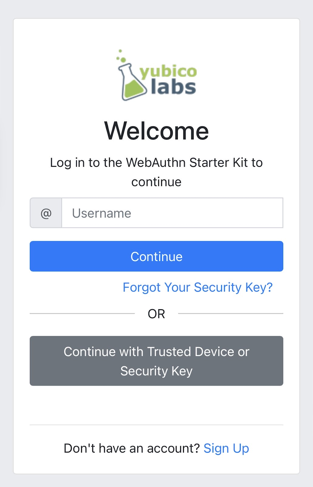

= Authenticate with Username on IOS Safari

== Authenticate by providing a username
In this section we are going to explore a standard way of authenticating users using WebAuthn. This approach is commonly referred to as an identifier first flow. The user provides their username, and the relying party will send an authentication challenge with a list of valid credentials belonging to a user. The user will only be able to provide a challenge response if they use one of the credentials with an ID included in the list from the relying party. This flow allows for flexibility allowing it to be leveraged in many link:/Developer_Program/WebAuthn_Starter_Kit/Adaptive_Multi-Factor_Authentication.html[adaptive multi-factor authentication] flows. In this instance it helps when users do not have a discoverable credential registered on their device.

=== Application demo
Before we dive into the implementation guide, let’s first view an example of what we will be creating. The gif below demonstrates this scenario using our demo application.

video::videos/auth_username_1.mp4[height=600]

=== Invoking the WebAuthn registration ceremony
To get started let's begin by refreshing ourselves on how to authenticate with WebAuthn. Let's start with this basic login screen. Here a user is given a text box to enter their username, and a button that will begin the WebAuthn ceremony, allowing a user to authenticate.

Take a look at Figure 1 to see an example of a login screen for authenticating a user.

**Figure 1**

Once the user enters their username, they click “Continue”, and the initial call to the relying party for a challenge 
Behind the scenes, the button is triggering a call to your relying party in order to retrieve the `PublicKeyCreationOptions` that are used to create the new credential.

Figure 2 demonstrates an example of the `PublicKeyRequestOptions` that were used in the ceremony above. 

[role="dark"]
--
[source,json]
----
{
  "publicKey": {
      "challenge": "XXXXXXXXXXXXXXXXXXXXXXXXXXXXXXXXXXXXXXXXXXX",
      "rpId": "example.com",
      "allowCredentials": [
          {
              "type": "public-key",
              "id": "XXXXXXXXXXXXXXXXXXXXXXXXXXXXX-XXXXXXXXXXXXXXXXXXXXX-XXXXXXXXXXXX"
          }
      ],
      "userVerification": "preferred",
      "extensions": {}
  }
}
----
--
**Figure 2**

You will then pass the `PublicKeyRequestOptions` above into the WebAuthn `get()` method to trigger the Safari WebAuthn modals. Depending on the types of credentials registered by the user, they may be presented with different modal options:

* If the user has registered with Face ID on the used device, they will be asked if they wish to use their passkey saved for the device
* If the user has not registered using Face ID on the used device, the user will immediately be prompted for a cross-platform (security key) authenticator

Once the challenge has been signed, you must send it back to the relying party for verification. 

Figure 3 demonstrates sample Javascript code used by your client application to ask the RP to begin an authentication ceremony, using the `PublicKeyRequestOptions` to invoke the `get()` API, and if successful send the response back to the RP.

[role="dark"]
--
[source, javascript]
----
async function signIn() {
  try {
    // Call to your relying party to receive an authentication challenge
    const authChallenge = await axios.get("/users/credentials/fido2/authenticate'")

    const request = JSON.parse(
      authChallenge.publicKeyCredentialRequestOptions
    );

    const publicKey = { publicKey: request.publicKeyCredentialRequestOptions };

    const assertionResponse = await get(publicKey);

    // Send the assertion response back to the relying party
    await sendChallengeAnswer(assertionResponse);
    return challengeResponse;
  } catch (error) {
    throw error;
  }
}
----
--
**Figure 3**

This flow will allow any of your users to successfully authenticate into their account using any of their registered credentials. Click below to return to the iOS and Safari development guide for additional implementation guidance.

link:/Mobile_Dev/WebAuthn/IOS[Return to the WebAuthn using iOS and Safari guide]
