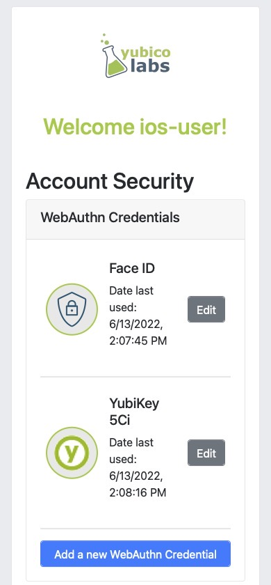
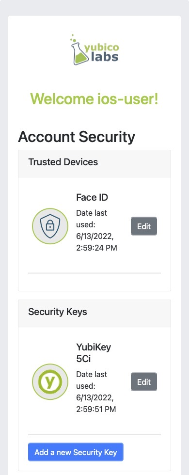
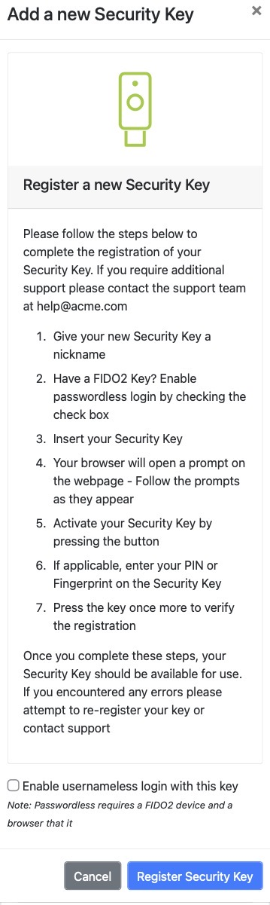
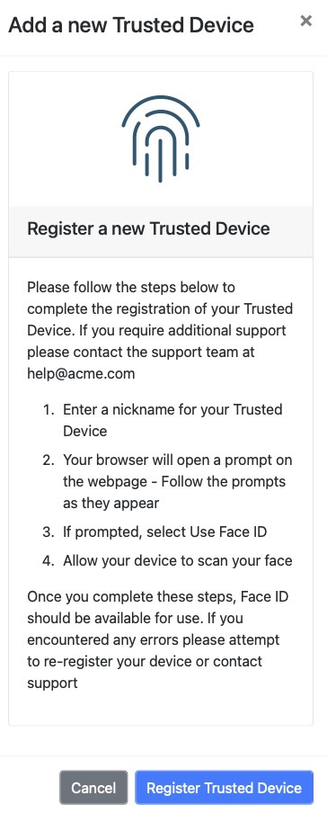

= Improve Mobile User Experience on IOS Safari

== User experience improvements for mobile
Other sections of this guide noted how to invoke specific authenticator types for your mobile registration process. This included specifically invoking Face ID, security keys, or for allowing a user to select them both. Now that we know how to use the WebAuthn API to invoke specific authenticators, let’s use that knowledge to improve our user experience. This section wil outline some UX best practices for WebAuthn applications. These best practices are taken from Yubico’s experience with consumer and enterprise applications.
This page will include a few tips that you could build into your own applications.

=== Separate your flows for security keys and Face ID

In previous sections of our WebAuthn mobile guide for iOS, we noted ways for you to explicitly invoke either security keys or Face ID. Even if your application allows for your user to register any authenticator type it may help to have two different flows for a user to follow for registering either type.

While this seems more cumbersome for the user, this could actually lead to benefits as your user may not be as overwhelmed with the various options. This becomes even more important in the consumer space where a user may be more familiar with Face ID than concepts like security keys and WebAuthn.

==== Application demo

Before we dive into the implementation guide, let’s first view an example of what we will be creating. The gif below demonstrates this scenario using our demo application.

video::videos/mobile_ux_1.mp4[height=600]

==== Implementing separate flows

Before we begin, let’s start by referencing the sample application that we covered in the previous section: I want to allow my user to register with both Face ID and security keys. 

Figure 1 shows a sample application.

**Figure 1**

While the process above works to enable WebAuthn in your application, there is more that we can do to improve the user experience. Some critiques on the UI shown in Figure 1 are as follows:

* It assumes that a user knows what WebAuthn is
* It offers little distinction between the trusted device (Face ID) and security key
* The add a new credential button immediately triggers the WebAuthn ceremony, relying on the browsers prompts to guide the users

We can improve this experience by separating the above screen into two different flows: one for trusted devices (platform authenticators) and one for security keys. The end result could look something like what is shown in Figure 2.

**Figure 2**

As noted in previous sections, the RP has no inherent way to tell if you’re wanting to invoke a platform or cross-platform authenticator. Each button should trigger a request to the RP indicating the type of request that is needed. The RP will then attach an `authenticatorAttachment` property to the `authenticatorSelection` object in the `PublicKeyCreationOptions`. 

Let’s break the previous paragraph into chunks. First let’s take a look at how the UI reacts to each button click.

Figure 3 includes sample code to demonstrate how each button can invoke a call to the RP, while indicating the preference for platform or cross-platform authenticators.

[role="dark"]
--
[source,javascript]
----
// Triggered when "Add Touch ID now" is clicked
async function onClickPlatform() {
  await registerNewCredential("platform");
}

// Triggered when "Add a new Security Key" is clicked
async function onClickSecurityKey() {
  await registerNewCredential("cross-platform");
}

// The only parameter is meant to represent the authenticatorAttachment
// The default will be cross-platform if one is not provided
async function registerNewCredential( authType = "cross-platform") {
  try {
    // Begin the registration, requesting the RP use a specific authenticatorAttachment
    const startRegistrationResponse = await axios.post(
      "/users/credentials/fido2/register",
      authType
    );
    // Create options sent by the RP
    const publicKey = {
      publicKey:
        startRegistrationResponse.data.publicKeyCredentialCreationOptions,
    };
    const { requestId } = startRegistrationResponse.data;

    await navigator.credentials.create(publicKey.publicKey);

    const challengeResponse = {
      credential: makeCredentialResponse,
      requestId,
    };

    // Send the challenge response back to the RP
    await axios.post(
      "/users/credentials/fido2/register/finish",
      challengeResponse
    );

  } catch(e) {
    console.error("Something went wrong: ", error)
  }
}
----
--
**Figure 3**

For example, if a user clicks on ‘Add Face ID now’, the event handler for the button should call to `onClickPlatform`. `onClickPlatform` will invoke the `registerNewCredential` method, and will pass in `platform` as the desired `authenticatorAttachment`. You will need to modify your RP’s start registration API to accept this new parameter. The RP will send the `PublicKeyCreationOptions` with your chosen `authenticatorAttachment`. The rest of the logic remains consistent regardless of the user's choice. 

=== Provide registration guidance for each flow
One of the most important aspects to consider about WebAuthn is that many users will be unaware of what it is, and how it works. While authenticators like Face ID have done a good job of introducing WebAuthn to the broad consumer market, you shouldn’t assume that all users will know how to use authenticators. 

In this section we extend the application improvements we made above to add guided prompts to help their user in beginning their WebAuthn journey. 

==== Application demo
The video below demonstrates our application which now includes guided prompts. These prompts provide step-by-step instructions for users to follow, greatly assisting users who aren’t familiar with WebAuthn.. We have provided guidance for both security keys, and platform authenticators. It’s also worth noting that for platform authenticators, we are providing guidance based on the assumed authenticator that exists on the device. In the example below we are showing the guidance for Face ID, which is often the authenticator found on iOS devices. 

video::videos/mobile_ux_1.mp4[height=600]

Figure 4 shows a still image of our example guidance for security keys

**Figure 4**

Figure 5 shows a still image of our example guidance for Face ID.

**Figure 5**

==== Implementing registration guidance
This flow could be implemented using a simple pop up modal when the user clicks the ‘Add’ buttons on the security screen, rather than immediately invoking the WebAuthn ceremony. Our focus in this section will be implementing a helper to help you detect the user’s operating system to try and assume the platform authenticator.

Figure 6 shows a code sample that includes a method that when invoked uses the browser’s user agent to determine the operating system. The OS is then mapped to a predefined list which includes the assumed platform authenticator.

[role="dark"]
--
[source,javascript]
----
const platformEnums = {
  ANDROID_BIOMETRICS: {
    id: "ANDROID_BIOMETRICS",
    platName: "Andorid Biometrics",
  },
  WINDOWS_HELLO: {
    id: "WINDOWS_HELLO",
    platName: "Windows Hello",
  },
  TOUCH_ID: {
    id: "TOUCH_ID",
    platName: "Touch ID",
  },
  FACE_ID: {
    id: "FACE_ID",
    platName: "Face ID",
  },
  DEFAULT: {
    id: "DEFAULT",
    platName: "this device",
  },
};

const getPlatform = () => {
  const { userAgent } = navigator;
  if (userAgent.indexOf("Windows") !== -1) {
    return platformEnums.WINDOWS_HELLO;
  }
  if (userAgent.indexOf("Android") !== -1) {
    return platformEnums.ANDROID_BIOMETRICS;
  }
  if (
    userAgent.indexOf("Macintosh") !== -1 ||
    userAgent.indexOf("iPad") !== -1
  ) {
    return platformEnums.TOUCH_ID;
  }
  if (userAgent.indexOf("iPhone") !== -1) {
    return platformEnums.FACE_ID;
  }
  return platformEnums.DEFAULT;
};

const DetectBrowser = { getPlatform, platformEnums };

export default DetectBrowser;
----
--

[NOTE]
====
It should be noted that this method isn’t always perfect. A user could manually change their user agent, leading to the incorrect user agent being assumed. This will not affect the usability, or ability for users to register with WebAuthn - Though there may be some confusion. 
====

Click below to return to the iOS and Safari development guide for additional implementation guidance.

link:/Mobile_Dev/WebAuthn/IOS[Return to the WebAuthn using iOS and Safari guide]