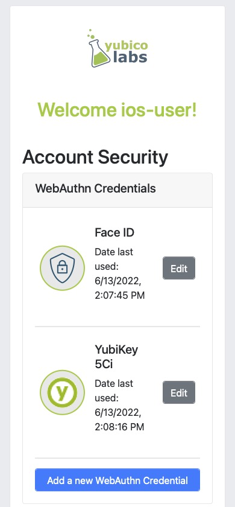
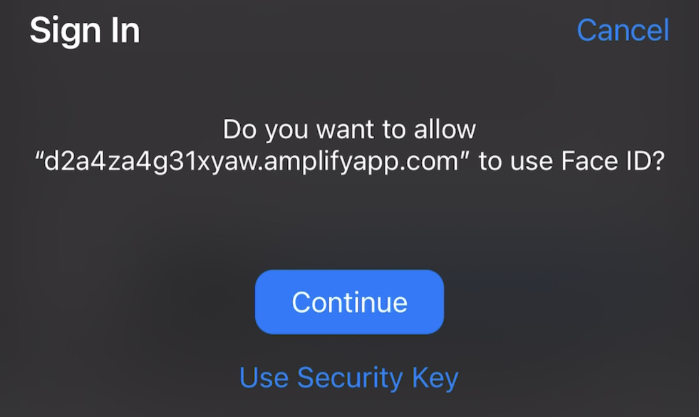
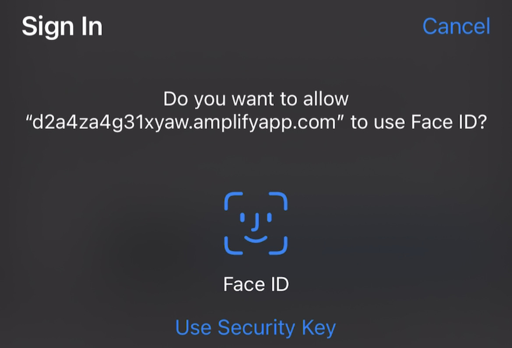
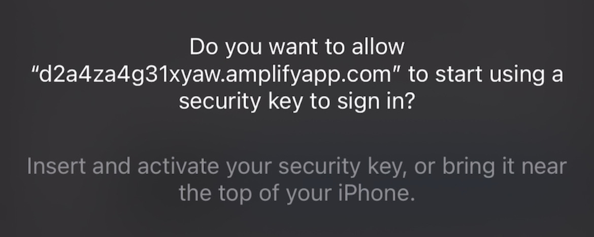

= Register Face ID and Security Key on IOS Safari

== Register using both Face ID and a security key
In this section we are going to walk through implementing an experience where a user is able to register a WebAuthn credential to their account using either Face ID or a security key. This will typically be the default experience in most applications as explicitly invoking Face ID or a security key requires the RP to explicitly note the option for creating the credential.

If your user is using iOS 16, Face ID will create a copyable passkey. This credential will be synced across all of the users devices. While this has usability advantages for moving across devices, and is more secure than passwords, it does not have the high assurance as a device bound credential such as a security key.

Security keys registered on iOS 16 will NOT create a credential that syncs across the users devices, and is bound to the hardware of the security key.

=== Application demo
Before we dive into the implementation guide, let’s first view an example of what we will be creating. The gif below demonstrates this scenario using our demo application.

video::videos/reg_faceid_seckey_1.mp4[height=600]

=== Invoking the WebAuthn registration ceremony
To get started let's begin by refreshing ourselves on how to register a new credential with WebAuthn. Let's start with this basic account security screen. Here a user is given a list of their credentials, and a button that will begin the WebAuthn ceremony, allowing a user to add a new credential.

Take a look at Figure 1 to see an example of an account security screen for adding a credential 

**Figure 1**

Once the user is ready to register a new credential, the “Add a new WebAuthn credential” button is clicked.

Figure 2 shows the modal that appears on the user's screen asking if they wish to use Face ID or their security key. 

**Figure 2**

Figure 3 shows what happens when a user selects Face ID. A modal appears indicating that Face Id has been activated, and will attempt to scan your face. 

**Figure 3**

Figure 4 shows what happens when a user selects Use Security Key. A modal appears asking the user to insert and activate their key. Subsequent prompts may include user verification, and a subsequent activation of the key to complete the registration process.

**Figure 4**

Behind the scenes, the button is triggering a call to your relying party in order to retrieve the `PublicKeyCreationOptions` that are used to create the new credential. This flow allows you to use both security keys and Face ID because the `authenticatorAttachment` property was not set in the `authenticatorSelection` object. More information on the `authenticatorAttachment` can be found in the link:https://www.w3.org/TR/webauthn-2/#enum-attachment[authenticator attachment enumeration section] of the WebAuthn specification.

Figure 5 demonstrates an example of the `PublicKeyCreationOptions` that were used in the ceremony above. 

[role="dark"]
--
[source, json]
----
{
  "publicKey": {
      "rp": {
          "name": "WebAuthn Starter Kit",
          "id": "d2a4za4g31xyaw.amplifyapp.com/"
      },
      "user": {
          "name": "ios-demo",
          "displayName": "ios-demo",
          "id": "xxxxxxxx-xxxx-xxxx-xxxx-xxxxxxxxxxxx"
      },
      "challenge": "XXXXXXXXXXXXXXXXXXXXXXXXXXXXXXXXXXXXXXXXXXX",
      "pubKeyCredParams": [***],
      "excludeCredentials": [
          {
              "type": "public-key",
              "id": "XXXXXXXXXXXXXXXXXXXXXXXXXXXXX-XXXXXXXXXXXXXXXXXXXXX-XXXXXXXXXXXX"
          }
      ],
      "authenticatorSelection": {
          "residentKey": "preferred",
          "userVerification": "preferred"
      },
      "attestation": "direct",
      "extensions": {
          "credProps": true
      }
  }
}
----
--
**Figure 5**

Once the `PublicKeyCreationOptions` are sent back to your application, your application will pass the options into the `navigator.credentials.create()` method to begin the registration process.

Figure 6 demonstrates sample Javascript code used by your client application to ask the RP to begin a registration ceremony, using the `PublicKeyCreationOptions` to invoke the `create()` API, and if successful send the response back to the RP.

[role="dark"]
--
[source,javascript]
----
async function registerNewCredential() {
  try {
    // Begin the registration, requesting the RP use a specific authenticatorAttachment
    const startRegistrationResponse = await axios.post(
      "/users/credentials/fido2/register"
    );
    // Create options sent by the RP
    const publicKey = {
      publicKey:
        startRegistrationResponse.data.publicKeyCredentialCreationOptions,
    };
    const { requestId } = startRegistrationResponse.data;

    const makeCredentialResponse = await navigator.credentials.create(publicKey.publicKey);

    const challengeResponse = {
      credential: makeCredentialResponse,
      requestId,
    };

    // Send the challenge response back to the RP
    await axios.post(
      "/users/credentials/fido2/register/finish",
      challengeResponse
    );

  } catch(e) {
    console.error("Something went wrong: ", error)
  }
}
----
--
**Figure 6**

This flow will allow your user to register to your application using both Face ID and their security keys. Click below to return to the iOS and Safari development guide for additional implementation guidance.

link:/Mobile_Dev/WebAuthn/IOS[Return to the WebAuthn using iOS and Safari guide]
