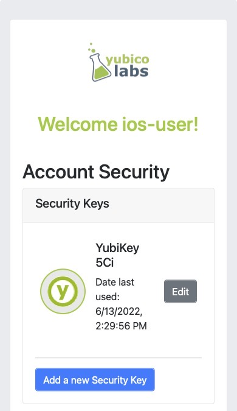
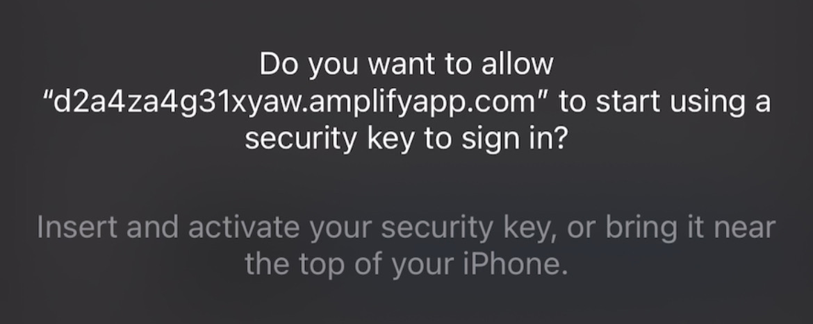

= Register Only Security Key on IOS Safari

== Register using only a security key
In this section we are going to walk through implementing an experience where a user is required to use a security key to register a WebAuthn credential to their account. While it is best practice to be highly permissive in the types of authenticators you allow in your application, there may be instances where you want to only permit the use of a cross-platform authenticator, especially in the space of enterprise applications. 

This type of experience works best when:

* You don't want your users to utilize copyable passkeys that are created when a credential is created with Face ID
* You want users to utilize a high assurance device that can be used across multiple devices (perfect for account recovery)

=== Application demo
Before we dive into the implementation guide, let’s first view an example of what we will be creating. The gif below demonstrates this scenario using our demo application.

video::videos/reg_seckey_1.mp4[height=600]

=== Invoking the WebAuthn registration ceremony
Let's begin by refreshing ourselves on how to register a new credential with WebAuthn. Let's start with this basic account security screen. Here a user is given a list of their credentials, and a button that will begin the WebAuthn ceremony, allowing a user to add a new credential. In this sample the titles reflect that our application is only allowing for security keys.

Figure 1 provides an example of an account security screen for adding a credential.

**Figure 1**

Once the user is ready to register a new credential, the “Add a new security key” button is clicked.

Figure 2 shows the modal that appears on the user's screen asking if they wish to use a security key.

**Figure 2**

This is different from the standard modal pop-ups. Previously the user would have been asked if they wanted to use Face ID. Instead they are now only given the option to register a security key (an example of the default flow can be seen on link:/Mobile_Dev/WebAuthn/IOS/Register_Face_ID_and_Security_Keys.html[this page]).

Behind the scenes, the button is triggering a call to your relying party in order to retrieve the `PublicKeyCreationOptions` that are used to create the new credential.

Figure 3 demonstrates an example of the `PublicKeyCreationOptions` that were used in the ceremony above. 

[role="dark"]
--
[source, json]
----
{
  "publicKey": {
      "rp": {
          "name": "WebAuthn Starter Kit",
          "id": "d2a4za4g31xyaw.amplifyapp.com/"
      },
      "user": {
          "name": "ios-demo",
          "displayName": "ios-demo",
          "id": "xxxxxxxx-xxxx-xxxx-xxxx-xxxxxxxxxxxx"
      },
      "challenge": "XXXXXXXXXXXXXXXXXXXXXXXXXXXXXXXXXXXXXXXXXXX",
      "pubKeyCredParams": [***],
      "excludeCredentials": [
          {
              "type": "public-key",
              "id": "XXXXXXXXXXXXXXXXXXXXXXXXXXXXX-XXXXXXXXXXXXXXXXXXXXX-XXXXXXXXXXXX"
          }
      ],
      "authenticatorSelection": {
          "authenticatorAttachment": "cross-platform",
          "residentKey": "preferred",
          "userVerification": "preferred"
      },
      "attestation": "direct",
      "extensions": {
          "credProps": true
      }
  }
}
----
--
**Figure 3**

While this sample looks very similar to the options that allow for both Face ID and security keys, the primary difference can be noted in line 25. The `authenticatorSelection` object in the `PublicKeyCreationOptions` contains a property titled `authenticatorAttachment`. 

Setting `authenticatorAttachment` to `cross-platform` will force the user to register a security key. This behavior will remove the initial prompt for Face ID. Instead Safari's WebAuthn prompt will immediately ask a user to insert and activate their security key, as seen in Figure 2.

More information on the `authenticatorAttachment` can be found in the link:https://www.w3.org/TR/webauthn-2/#enum-attachment[authenticator attachment enumeration section] of the WebAuthn specification.

Once the `PublicKeyCreationOptions` are sent back to your application, your application will pass the options into the `navigator.credentials.create()` method to begin the registration process.

Figure 4 demonstrates sample Javascript code used by your client application to ask the RP to begin a registration ceremony, using the `PublicKeyCreationOptions` to invoke the `create()` API, and if successful send the response back to the RP.

[role="dark"]
--
[source,javascript]
----
async function registerNewCredential() {
  try {
    // Begin the registration, requesting the RP use a specific authenticatorAttachment
    const startRegistrationResponse = await axios.post(
      "/users/credentials/fido2/register"
    );
    // Create options sent by the RP
    const publicKey = {
      publicKey:
        startRegistrationResponse.data.publicKeyCredentialCreationOptions,
    };
    const { requestId } = startRegistrationResponse.data;

    const makeCredentialResponse = await navigator.credentials.create(publicKey.publicKey);

    const challengeResponse = {
      credential: makeCredentialResponse,
      requestId,
    };

    // Send the challenge response back to the RP
    await axios.post(
      "/users/credentials/fido2/register/finish",
      challengeResponse
    );

  } catch(e) {
    console.error("Something went wrong: ", error)
  }
}
----
--
**Figure 4**

This flow will allow your user to register to your application using only security keys. Click below to return to the iOS and Safari development guide for additional implementation guidance.

link:/Mobile_Dev/WebAuthn/IOS[Return to the WebAuthn using iOS and Safari guide]
