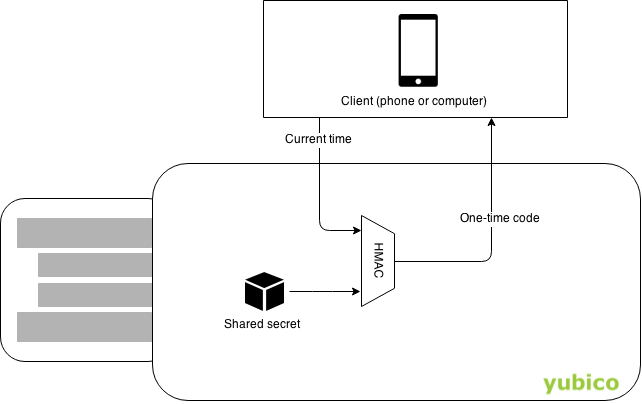

== What is OATH? ==
abbr:OATH[Initiative for Open Authentication] is an organization that specifies two open authentication standards: abbr:TOTP[Time-based One-time Password Algorithm] and abbr:HOTP[HMAC-based One-time Password Algorithm].

== TOTP
To authenticate using TOTP, the user enters a 6-8 digit code that changes every 30 seconds. It can look like this:

image::totp.png[]

The code is generated using `HMAC(sharedSecret, timestamp)`, where timestamp changes every 30 seconds. The shared secret is often provisioned as a QR-code or preprogrammed into a hardware token.

=== Websites with TOTP support
The website https://twofactorauth.org[twofactorauth.org] lists common websites that supports TOTP.

== HOTP
HOTP works just like TOTP, except that an authentication counter is used instead of a timestamp. The advantage of this is that HOTP devices requires no clock.

HOTP is susceptible to losing counter sync. That is, if the user generates an OTP without authenticating with it, the device counter will no longer match the server counter. This can be mitigated on the server by testing several subequent counter values. This can not happen with link:/OTP[Yubico OTP] since its counter is encrypted (as opposed to hashed).

== Use OATH with the YubiKey
When using OATH with a YubiKey, the shared secrets are stored and processed in the YubiKey's secure element.
This has two advantages over storing secrets on a phone:

Security:: The secrets always stay within the YubiKey. A phone can get stolen, sold, infected by malware, have its storage read by a connected computer, etc.

Accessibility:: You can display OATH codes on more than one phone or computer. If your phone runs out of battery, you can get a code using a friend's phone or your computer.

A YubiKey can emit a HOTP code when its button is pressed. This is configured using link:/yubikey-personalization-gui[Yubikey Personalization GUI]. For TOTP you need an link:YubiKey_OATH_software.html[application that can read OATH codes from YubiKeys], since YubiKeys does not have an internal clock.

