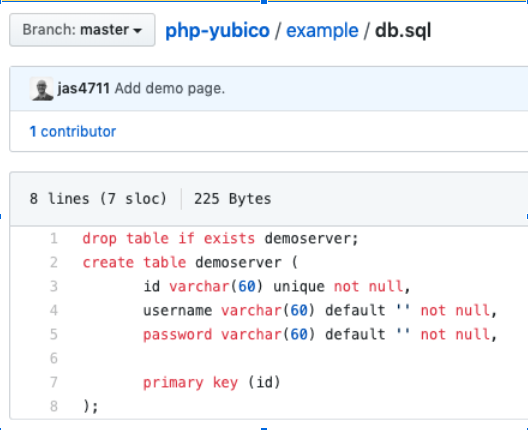

== OTP Walk-through

=== Overview: YubiKeywith OTP

Build an app that enables your users to register and authenticate with Yubico OTP (One-Time Password). This walk-through describes how to integrate the Yubico OTP protocol with your application or framework. This content is based on the https://www.yubico.com/wp-content/uploads/2012/10/YubiKey-Authentication-Module-Design-Guideline-v1.0.pdf[YubiKey Authentication Module Design Guideline].

All YubiKeys support Yubico OTP, which can be used as single-factor authentication or as the second factor in a two-factor authentication scheme. Typically Yubico OTP is used in combination with a username and password.

For OTP verification, you can host a verification server yourself, or use Yubico’s web service for this purpose, the YubiCloud. For this, you need to get an API key from https://upgrade.yubico.com/getapikey/[here] — it is quick, free and helps us prevent misuse of the YubiCloud.

Yubico OTP requires no client software. The YubiKey ID is embedded in OTP, which allows for self-provisioning, as well as authenticating without a username.

If you use the YubiCloud, supporting Yubico OTP is not much harder than supporting regular passwords.
We have integration plugins for software such as Wordpress, phpBB and PAM as well as libraries for programming languages you can use to create your own integration.

=== Create your Authentication Module

Your authentication module defines the communications and actions between three components:

* YubiKey – The user’s client device
* Validation server – This can be either the YubiCloud or your own self-hosted validation service with the Internal YubiKey OTP Validation Service integrated.
* Authentication Business Logic module – When one YubiKey provides access to multiple applications on a framework.

**Figure 1 - Interaction between components**

For additional considerations and best practices, see OTP Getting Started.

=== Define Client Module Tasks

The purpose of the client module is to:

* Implement OTP transport protocol
* Parse response from validation server (server-side)

See https://developers.yubico.com/OTP/Libraries/Using_a_library.html[Using a Yubico OTP Library].

*Step 1*: Create YubiCloud client, enable sending requests:

....
# clientId and secretKey is retrieved from https://upgrade.yubico.com/getapikey
client = Yubico(clientId, secretKey)
....

*Step 2*: Verify OTPs submitted:
....
# otp is the OTP from the Yubikey
otp_is_valid = client.verify(otp)
....
*Step 3*: Verify user login:
....
assert otp[:12] == user.yubikey_id
....

=== Define YubiKey Provisioning Method

Provisioning is assigning a YubiKey ID to a User ID. At a minimum, administrators must be able to do this. Configure your database to store the provisioning information: `YubiKey ID:User ID pairs.`

Optionally, enable users to provision their own YubiKeys. Provide a website interface for two actions:

1. User register, submit and verify OTP to validate YubiKey.
2. User prompt for YubiKey touch, when YubiKey is validated.

See https://developers.yubico.com/OTP/Libraries/Using_a_library.html[Using a Yubico OTP Library].

Provision YubiKeys:
....
# Associate a user with a YubiKey ID
user.yubikey_id = otp[:12]
....

=== Plug-ins for Creating your YubiKey OTP Module

View and download the relevant plug-in component, which includes the Yubico Java client https://github.com/Yubico/yubico-java-client/tree/master/jaas[JAAS] and the https://github.com/Yubico/yubico-java-client/tree/master/demo-server[demo server].

https://developers.yubico.com/yubico-pam/[Yubico PAM module] – Pluggable Authentication Modules (PAM) for GNU/Linux, Solaris and Mac OS X for user authentication.

This requires the Yubico C client, https://developers.yubico.com/yubico-c-client/[libykclient], https://github.com/Yubico/yubico-pam[libpam-dev], cURL, https://developers.yubico.com/yubico-c/[libyubiky], and the YubiKey Personalization Tool, https://developers.yubico.com/yubikey-personalization/[yubikey-personalization]

=== Libraries for Creating your YubiKey OTP Module

View and download the relevant Yubico library component, https://developers.yubico.com/php-yubico/[PHP], which includes the PHP classes for Yubico authentication:

* https://github.com/Yubico/php-yubico/blob/master/demo.php[demo.php]
* https://github.com/Yubico/php-yubico/blob/master/example/db.sql[example/db.sql].

**Figure 2 - php-yubico / example / db.sql**

* https://github.com/Yubico/php-yubico/blob/master/example/config.php[example/config.php]
* https://github.com/Yubico/php-yubico/blob/master/example/Modhex_Calculator.php[Modhex_Calculator.php]
* https://developers.yubico.com/OTP/Modhex_Converter.html[Modhex Converter]
* the Yubico C client, https://developers.yubico.com/yubico-c-client/[C]
* the Yubico Java client, https://developers.yubico.com/yubico-c-client/[Java], which itself includes https://github.com/Yubico/yubico-java-client/tree/master/jaas[JAAS], the JAAS-plugins for authentication using one time password tokens (YubiKeys primarily) - and https://github.com/Yubico/yubico-java-client/tree/master/demo-server[demo server], a simple self-contained demo server supporting multiple YubiKeys per user.
* DotNet, which uses `clientId` and `apiKey` from https://upgrade.yubico.com/getapikey/[Yubico API key signup]
* https://developers.yubico.com/yubico-perl-client/[Perl]
* https://developers.yubico.com/windows-apis/[the Windows APIs]
