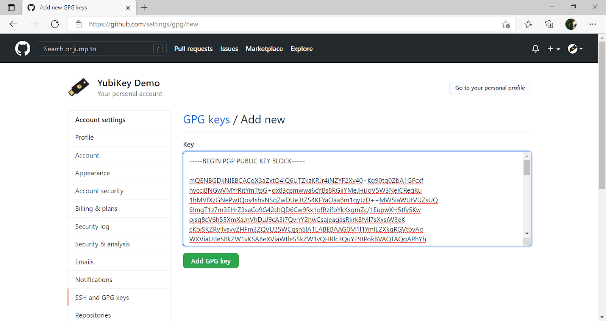
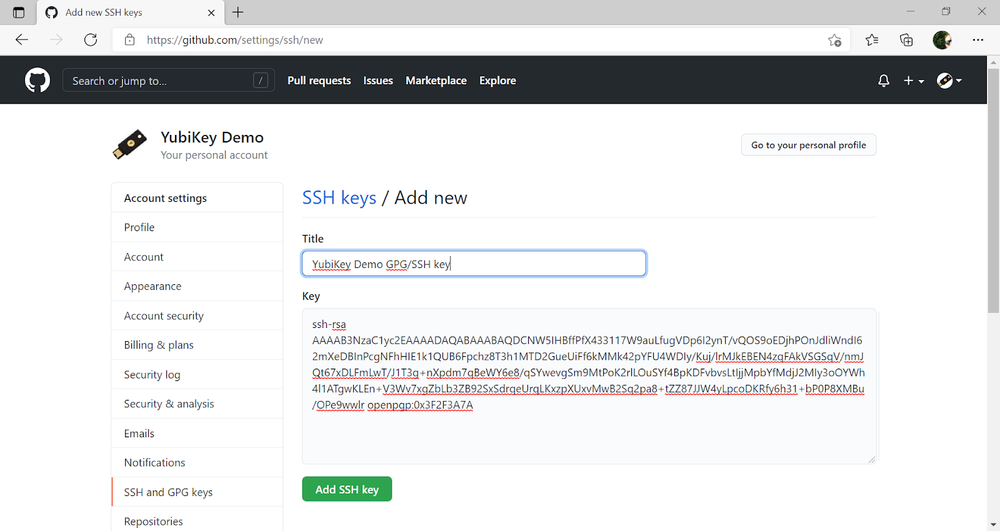
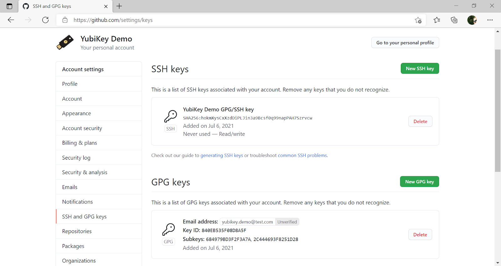

== SSH Authentication to GitHub Using a YubiKey on Windows
This guide explains how to set up accessing GitHub over SSH on Windows with the YubiKey’s OpenPGP application. 

The YubiKey 5, YubiKey 4, and YubiKey NEO all support the OpenPGP interface for smart cards. This can be used with GPG4Win for encryption and signing, as well as for SSH authentication. These in turn can be used by several other useful tools, like Git and Cygwin, etc. This document guides you through setting up the required software for getting SSH to work on Windows with the YubiKey OpenPGP application.

=== Install an SSH Client

You can choose to install either PuTTY, the native windows client or both.

==== Install PuTTY
Putty is an open source SSH client for connecting via SSH from a Windows system. PuTTY includes support for the Pageant protocol, which is used by other applications in this solution. Download link:https://www.chiark.greenend.org.uk/~sgtatham/putty/download.html[PuTTY] and install it.

==== Install OpenSSH Client feature

The recent builds of Windows 10 and Windows 11 contain a native build of the OpenSSH binaries.
The client can be installed using the `Optional Features` ( Windows Settings > Apps > Optional features, then search for "SSH")

== Setting up Access to the YubiKey’s OpenPGP Application
Pageant.exe, the key-agent from the PuTTY-package, does not support smart cards, which is why further software is required. GPG4Win can act as a drop-in replacement for Pageant. GPG4Win is an OpenPGP client for Windows that enables Windows to access the OpenPGP application on the YubiKey. The Pageant executable in the Smartcard Authentication open source project is an alternative to GPG4Win that also enables Windows to access the OpenPGP application on the YubiKey.

To access the YubiKey’s OpenPGP application from Windows, first decide whether to use GPG4Win or Smartcard Authentication, then choose the corresponding installation instructions, **Accessing via GPG4Win** or **Accessing via Smartcard Authentication** in the current document.

WARNING: Do **not** install GPG4Win if Smartcard Authentication is used, and vice versa. GPG4Win and Smartcard Authentication both open the OpenPGP smart card in exclusive mode, each thereby blocking the other's access. 

=== Accessing via GPG4Win
GPG4Win has built-in support for SSH authentication.

**Step 1** Download and install link:https://www.gpg4win.org/[GPG4Win].

**Step 2** Start the `gpg-connect-agent.exe` by running the following command in a PowerShell terminal or Command Prompt:

 gpg-connect-agent /bye

**Step 3** Enable SSH support by editing the `gpg-agent.conf` file located in the `gnupg` directory `%APPDATA%\.gnupg\` on Windows, where the typical path is `C:\Users\<username>\AppData\Roaming\`. Add the following lines to it:

....
enable-ssh-support
# To Enable support for PuTTY
enable-putty-support
# To Enable support for the native Microsoft OpenSSH binaries (requires gpg 2.4.0 / Gpg4win 4.1.0 or higher)
enable-win32-openssh-support
use-standard-socket
default-cache-ttl 600
max-cache-ttl 7200
....

**Step 4** To apply this change, restart the `gpg-agent` by running the following command in a PowerShell terminal or Command Prompt:

....
gpg-connect-agent killagent /bye
gpg-connect-agent /bye
....

**Step 5** The SSH public key must be imported to the authorized key file on the server; instructions for doing this configuration for GitHub are provided in **Configuring Git** below.

If you need to generate or import a GPG key to the YubiKey, you can now use GPG4Win by following the steps in the
link:https://support.yubico.com/hc/en-us/articles/360013790259-Using-Your-YubiKey-with-OpenPGP[Using Your YubiKey with OpenPGP guide].

Once SSH support is enabled, any application that supports SSH authentication using Pageant should work out-of-the-box. More information on how to connect to a server with PuTTY is available in the
link:https://www.ssh.com/academy/ssh/putty/windows[SSH documentation].

=== Accessing via Smartcard Authentication (alternative to GPG4Win)
As an alternative to using GPG4Win, the Pageant executable in the
link:https://www.smartcard-auth.de/index-en.html[Smartcard Authentication] open source project can be downloaded and used.

Instructions on configuring Smartcard Authentication with PuTTY are available in this
link:https://github.com/Yubico/developers.yubico.com/issues/388[issue in the GitHub repository for developers.yubico.com].

== Configuring Git

**Step 1** To use Git with SSH on Windows, link:https://git-scm.com/downloads[download and install the Git client] on your machine. 

**Step 2** Check the `general-key-id` and `authentication-key-id` of the PGP keys at the YubiKey by running the command:

 gpg --card-status

Example response where the authentication-key-id in this example is `B28F B5D2 9E6C 37FD 7E84  3CA4 6849 79BD 3F2F 3A7A`. The general-key-id in this example is `840EB535F08D8A5F`.

image::gpg-card-status-response.png[]

**Step 3** Export the GPG/SSH public key to a file by running the command

 gpg --export-ssh-key <authentication-key-id> > ssh_auth_key.pub

Example command where the `ssh_auth_key.pub` in this example is:

....
ssh-rsa 
AAAAB3NzaC1yc2E... 
openpgp:0x3F2F3A7A
....

image::gpg-export-ssh-key-cmd.png[]

**Step 4** If the GPG public key is not yet configured in GitHub, export the GPG key from the YubiKey by running the command

 gpg -o <GPG-public-key-file> --armor --export <general-key-id>

Example command where the `gpg-key.pub` in this example is:

....
-----BEGIN PGP PUBLIC KEY BLOCK-----
mQENBGDkNIEBCACqX3aZxtO4lQ6U...
-----END PGP PUBLIC KEY BLOCK-----
....

**Step 5** Log in to your link:https://github.com/[GitHub account], select **Settings** and the option **SSH and GPG keys**.

**Step 6** If the GPG key has not been added to your GitHub account, use GitHub's instructions, link:https://docs.github.com/en/github/authenticating-to-github/managing-commit-signature-verification/adding-a-new-gpg-key-to-your-github-account[Adding a New GPG Key to Your GitHub Account], to upload it.

**Step 7** Upload the SSH/GPG key to GitHub as described in GitHub's instructions,
link:https://docs.github.com/en/github/authenticating-to-github/connecting-to-github-with-ssh/adding-a-new-ssh-key-to-your-github-account[Adding a New SSH Key to Your GitHub Account].

A successful configuration of GPG and SSH at GitHub should look like this:

**Step 8** Access GitHub by using the Git client over SSH with the YubiKey. All commands supported by the Git client can be used for managing your GitHub account. For example, you can use the `git clone` command to clone a repository:

 git clone <URL to GitHub repository>

To get additional features for the Git GUI using the command line tools, you can also
link:https://6xgate.github.io/TortoisePlink/[download and install Tortoise Plink].

== Using Cygwin with GPG4Win
link:https://cygwin.com/install.html[Cygwin] provides a Unix-like terminal with several useful tools, such as SSH.  During installation, you will be asked which packages to install. 

*	Do not install `gpg`, as you will use the already installed `GPG4Win`. 


*	Make sure to install `ssh-pageant` to enable the SSH client that is included to use the YubiKey for authentication. 


After installation, open a Cygwin shell and edit the `~/.bashrc` file by adding the following at the bottom:

....
# ssh-pageant #
eval $(/usr/bin/ssh-pageant -r -a "/tmp/.ssh-pageant-$USERNAME")
....

