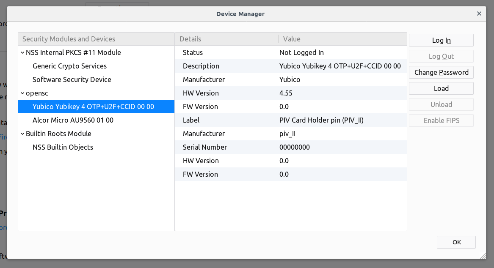

== EJBCA Login with PIV Keys

Logging into the _EJBCA Adminweb_ is only allowed with certificate authentication. Here is a set of instructions on how to store a certificate on a YubiKey and use it to login to _EJBCA Adminweb_.

=== Prerequisites

* Linux operating system. Tested on Ubuntu 18.04 but should work with earlier versions as well.
* FireFox web browser. Tested with FireFox 63 64-bit but should work with earlier versions as well.

=== Quick Instructions

1. Generate a key pair, either by EJBCA or on the YubiKey.
2. EJBCA issues a certificate for the public key.
3. Import the EJBCA issued certificate into the YubiKey (if the key pair was generated by EJBCA, the private key too needs to be imported into the YubiKey).
4. Add the certificate serial number as a member of an _Administrator Role_ on EJBCA.
5. Add `opensc-pkcs11.so` module to FireFox as a security device.

See bellow for detailed instructions of each action.

=== Detailed Instructions

==== Key Pair Generated by EJBCA

1. On _EJBCA Adminweb_, create an end entity. Set *Token = P12 file*.
2. From _EJBCA Public Web_ or _EJBCA RA Web_, download the p12 file. You will need the end entity username and password.
3. Using the link:../../../htdocs/dist/yubikey-manager-qt/[YubiKey Manager] or the link:../../yubico-piv-tool/Releases/[Yubico PIV Tool], import the p12 file into the YubiKey PIV slot `9a`.

    * With the link:../../../htdocs/dist/yubikey-manager-qt/[YubiKey Manager]

        a. Go to *Applications -> PIV*
        b. Click *Configure Certificates*
        c. Click *Import*
        d. Choose the p12 file. You will be required to enter the password to the p12 file and then the YubiKey PIV _Management Key_. The certificate details should then be displayed in the _Authentication_ tab.

    * With link:../../yubico-piv-tool/Releases/[Yubico PIV Tool]

    	$ yubico-piv-tool -s 9a -i path/to/file.p12 -K PKCS12 -a import-key -a import-certificate

      You will be prompted for the p12 file password.

==== Key Pair Generated on the YubiKey

1. On _EJBCA Adminweb_ create an end entity. Set *Token = User Generated*.
2. Using the link:../../../yubikey-manager-qt/[YubiKey Manager] or the link:../../yubico-piv-tool/Releases/[Yubico PIV Tool], generate a key pair and a certificate request.

    * With link:../../../yubikey-manager-qt/[YubiKey Manager]

        a. Go to *Applications -> PIV*
        b. Click *Configure Certificates*
        c. Click *Generate*
        d. Choose *Certificate Signing Request (CSR)*. Click *Next*
        e. Choose the desired key algorithm and click *Next*.
        f. Write the desired subject name; this is equivalent to the Common Name (CN) on the SubjectDN. Click *Next*.
        g. Click *Generate* and store the certificate request on the file system. You will be required to enter the YubiKey PIV _Management Key_ and then the YubiKey PIV PIN. A _Success_ message should be displayed afterwards.

    * With link:../../yubico-piv-tool/Releases/[Yubico PIV Tool]

        $ yubico-piv-tool -s 9a -A RSA2048 -a generate
        $ yubico-piv-tool -s 9a -S '/CN=foo/OU=test/O=example.com/' -a verify -a request

        You will be prompted for the YubiKey PIV PIN.

3. On _EJBCA Public Web_ or _EJBCA RA Web_, submit the certificate request generated in the previous step and get a certificate. You will need the username and password of the end entity created in step `1`.
4. Using the link:../../../yubikey-manager-qt/[YubiKey Manager] or the link:../../yubico-piv-tool/Releases/[Yubico PIV Tool], import the certificate file into the YubiKey PIV slot `9a`. Note that the certificate file *_must_* contain only one certificate (aka. not a full certificate chain).

    * With link:../../../yubikey-manager-qt/[YubiKey Manager]

        a. Go to *Applications -> PIV*
        b. Click *Configure Certificates*
        c. Click *Import*
        d. Choose the certificate file. You will be required to enter the YubiKey PIV _Management Key_. A _Success_ message should be displayed afterwards and the certificate details should then be displayed in the _Authentication_ tab.

    * With link:../../yubico-piv-tool/Releases/[Yubico PIV Tool]

        $ yubico-piv-tool -s 9a -a import-certificate -i path/to/certificate.pem

==== Add Administrator on EJBCA

1. Note the certificate serial number of the intended administrator.
2. On _EJBCA Adminweb_, go to *Administrator Roles*.
3. Choose the role to add the administrator to or create a new role. Click on *Members* of that role.
4. Set the parameters:

    * Match with: *X509: Certificate serial number (Recommended)*
    * CA: The name of the CA that issued the administrator certificate.
    * Match Value: The certificate serial number.
    * Description: Free text describing the administrator

5. Click "Add".

==== Add OpenSC Security Device in FireFox

1. Install OpenSC packages

        $ apt-get install libpcsclite1 pcscd pcsc-tools opensc-pkcs11

2. Start FireFox

3. Add `opensc-pkcs11.so` module to FireFox as a security device. See https://github.com/OpenSC/OpenSC/wiki/Installing-OpenSC-PKCS%2311-Module-in-Firefox,-Step-by-Step[OpenSC] for instructions. When the module is added, the YubiKey should be displayed as shown

4. Go to _EJBCA Adminweb_. A popup window will prompt for the PIN to the YubiKey PIV slot. After entering the pin, a new popup window will be displayed containing a drop-down menu listing the certificates that can be used to login to EJBCA. Choose the certificate that was imported into the YubiKey and click `OK`.

5. Login complete.

=== Possible Errors

==== PIV Application on YubiKey Manager Shows Error

On the link:../../../htdocs/dist/yubikey-manager-qt/[YubiKey Manager], if clicking *Applications -> PIV* causes an error, it is most likely because the CCID interface of the YubiKey is not enabled. By default, all interfaces, including the CCID interface, are enabled.

To enable the CCID interface, on the YubiKey Manager:

1. Go to *Interfaces*
2. Check *CCID (Smart Card)* and click *Save Interfaces*. You will be required to remove and re-insert the YubiKey.

==== `opensc-pkcs11.so` Module Would not Load

If the `opensc-pkcs11.so` module would not load, make sure that the library is in the `LD_LIBRARY_PATH`. Assuming that OpenSC was installed in the default location (`/usr/lib/`), the environment variable can be set to `LD_LIBRARY_PATH=$LD_LIBRARY_PATH:/usr/lib`. Relaunch FireFox afterwards.

==== YubiKey is not Recognized as a Smartcard

If the YubiKey does not show as a smartcard recognized by OpenSC in FireFox Security Devices as shown in the picture above, it is most likely because the YubiKey is not accessible by OpenSC. To see if the YubiKey is accessible by OpenSC, run the following command in a terminal

    $ pcsc_scan

The output should be something like

+
....
$ pcsc_scan
PC/SC device scanner
V 1.5.2 (c) 2001-2017, Ludovic Rousseau <ludovic.rousseau@free.fr>
Using reader plug'n play mechanism
Scanning present readers...
0: Yubico Yubikey 4 OTP+U2F+CCID 00 00

Thu Dec 13 15:58:00 2018
 Reader 0: Yubico Yubikey 4 OTP+U2F+CCID 00 00
  Card state: Card inserted,
  ATR: 3B F8 13 00 00 81 31 FE 15 59 75 62 69 6B 65 79 34 D4

ATR: 3B F8 13 00 00 81 31 FE 15 59 75 62 69 6B 65 79 34 D4
+ TS = 3B --> Direct Convention
+ T0 = F8, Y(1): 1111, K: 8 (historical bytes)
  TA(1) = 13 --> Fi=372, Di=4, 93 cycles/ETU
    43010 bits/s at 4 MHz, fMax for Fi = 5 MHz => 53763 bits/s
  TB(1) = 00 --> VPP is not electrically connected
  TC(1) = 00 --> Extra guard time: 0
  TD(1) = 81 --> Y(i+1) = 1000, Protocol T = 1
-----
  TD(2) = 31 --> Y(i+1) = 0011, Protocol T = 1
-----
  TA(3) = FE --> IFSC: 254
  TB(3) = 15 --> Block Waiting Integer: 1 - Character Waiting Integer: 5
+ Historical bytes: 59 75 62 69 6B 65 79 34
  Category indicator byte: 59 (proprietary format)
+ TCK = D4 (correct checksum)

Possibly identified card (using /usr/share/pcsc/smartcard_list.txt):
3B F8 13 00 00 81 31 FE 15 59 75 62 69 6B 65 79 34 D4
    Yubico Yubikey 4 OTP+CCID
....
+

If you get something like the following instead

+
....
Cannot find a smart card reader. (0x8010002E)
Waiting for the first reader...
....
+

Then something is wrong.

[NOTE]
For debugging OpenSC, set the environment variable `OPENSC_DEBUG=9`

==== EJBCA Adminweb not Accessible Anyway

If everything was completed without errors but the _EJBCA Adminweb_ is still not accessible, check that:

    * The issuer CA is trusted by FireFox. See bellow for details.
    * The issuer CA is trusted by the application server of EJBCA. If the application server used is JBoss, there should be a `trustedCertEntry` of that CA in the `JBOSS_HOME/standalone/configuration/keystore/truststore.jks` file (default password is `changeit`)

===== Issuer CA not Trusted by FireFox

The certificate of the CA that issued the administrator certificate needs to be listed as a trusted CA by FireFox. To see whether the CA is trusted by FireFox or not, go to *FireFox Preferences -> Privacy & Security -> View Certificates... -> Authorities* and look for the issuer CA name. If it is there and there is no "untrusted" label next to it, then the CA is trusted.

If the issuer CA is not in the list of trusted authorities by FireFox, do the following:

    1. Go to *EJBCA Public Web -> Fetch CA Certificates* or *EJBCA RA Web -> CA Certificates and CRLs*.
    2. Find the name of the issuer CA and click to download it to FireFox.
    3. In the popup window, check "Trust this CA to identify websites." and click *OK*.

==== "Authorization Denied" Error Message on EJBCA Adminweb

If an "Authorization Denied" error message is displayed on the browser, then the login in fact had succeeded, but the certificate in the YubiKey is not a member of any Administrator Roles. See above for instructions on how to add an administrator to an Administrator Role on EJBCA.
