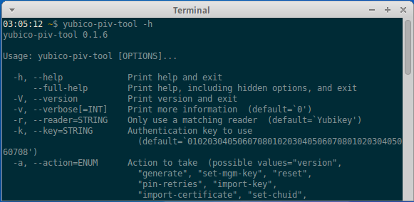

== Yubico PIV Tool
The link:/yubico-piv-tool[Yubico PIV Tool] allows you to configure a
PIV-enabled YubiKey through a command line interface. With it you may generate
keys on the device, import keys and certificates, create certificate requests,
and other operations. A shared library and a command-line tool is included.

=== Features
 * Powerful command line tool for administering a PIV-enabled YubiKey.
 * C-library for programmatically interfacing with a PIV-enabled YubiKey.

link:/yubico-piv-tool[Go to project page].
