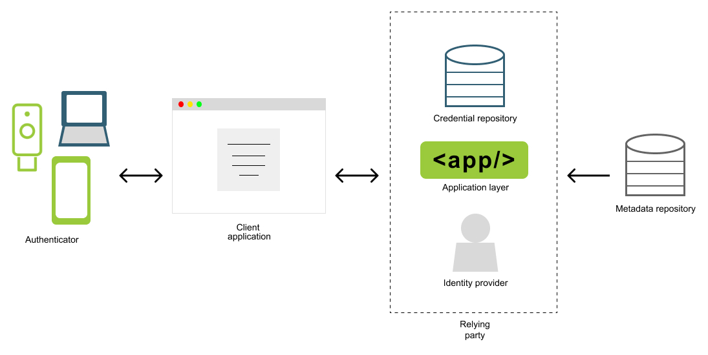

= High level architecture of a passkey application
:description: Outline the key components of a passkey application
:keywords: passkey, passkeys, developer, high assurance, FIDO2, CTAP, WebAuthn

Outline the key components of a passkey application

In this section we are going to walk through a high level architecture of an application that utilizes passkeys. Our goal is to outline the key components that are required of a passkey application, and how they work in concert to create a seamless and secure authentication experience. 

== Architecture at a glance
Figure 1 demonstrates an architecture diagram for a passkey application.

**Figure 1**

== Components

Below is a summary of the primary components of a passkey application.

=== Authenticator

Device or software that will be used as a token to prove the user’s identity. WebAuthn relies on public key encryption - the authenticator will issue public keys to applications during registration, and will then use the corresponding private key to sign challenges issued during authentication. 

Authenticators can come in the form of hardware and software. Examples of hardware based authenticators could include security keys where the private key is bound to the device, and cannot be extracted. Software based authenticators can be a combination of a device's TPM module and an application that allows the user to store their credentials in the cloud, to be used across their devices.

=== Client application 

The client application is the front end application that your users use to interact with your app. The primary use in passkey applications will be for users to complete their authentication and registration ceremonies. 

The experience offered by the client will have some variety depending on the user's use of the operating system and browser, but should ultimately still provide the same degree of security and usability, assuming the ecosystem supports passkeys. 

=== Relying party

The relying party is the backend application that will facilitate the authentication and registration ceremonies in order to determine if the user should be allowed to access their requested resources. The relying party can be broken down into smaller sub-components that all play a part in managing users. 

==== Application layer 

The application layer will be responsible for the core business logic required to complete registration, authentication, and user/credential management operations. This component will primarily be invoked by API’s for specific actions. The primary goal will be to issue registration and authentication ceremonies, using inputs from the identity provider, and by referencing credentials stored in the credential repository. 

==== Identity provider

This is the service that will allow your application to manage users, and issue authorization tokens (such as OAuth2) to access its resources. This can be an in-house built solution, or a solution purchased from a technology vendor. 

Regardless of the type of solution, it will either need to support passkeys (WebAuthn) or allow you to create a custom flow that can interact with your application layer to facilitate the registration, and authentication ceremonies.

==== Credential repository

This is the repository of user credentials (public keys) that were sent to the relying party during registration, and leveraged during the authentication ceremony. An advantage of using passkeys rather than passwords is the severity of this repository being compromised is mitigated. This repository can operate by only storing the public key, credential IDs, and associated user handle. If this repository is leaked, an attacker cannot leverage the public keys, without access to the authenticator with the private key. 

==== Metadata repository
This is an optional component of your relying party, but should be included as a best practice. A metadata repository will allow your application to identify the make and model of a registered authenticator, if permission was granted by the user during registration. 

On the surface level this data can help the user experience by helping users and administrators understand more details about their authenticator. Digging deeper, this repository can help you impose different degrees of authenticator management, in high assurance scenarios that require some control over what can and cannot register in your environment. More will be covered on this when we discuss link:/Passkeys/Passkey_relying_party_implementation_guidance/Attestation[attestation].

Next let’s explore the ecosystems (operating systems and browsers) where passkeys can be leveraged. 

link:/Passkeys/Passkey_ecosystem_support.html[Continue to passkey ecosystem support (Browsers / OS)]