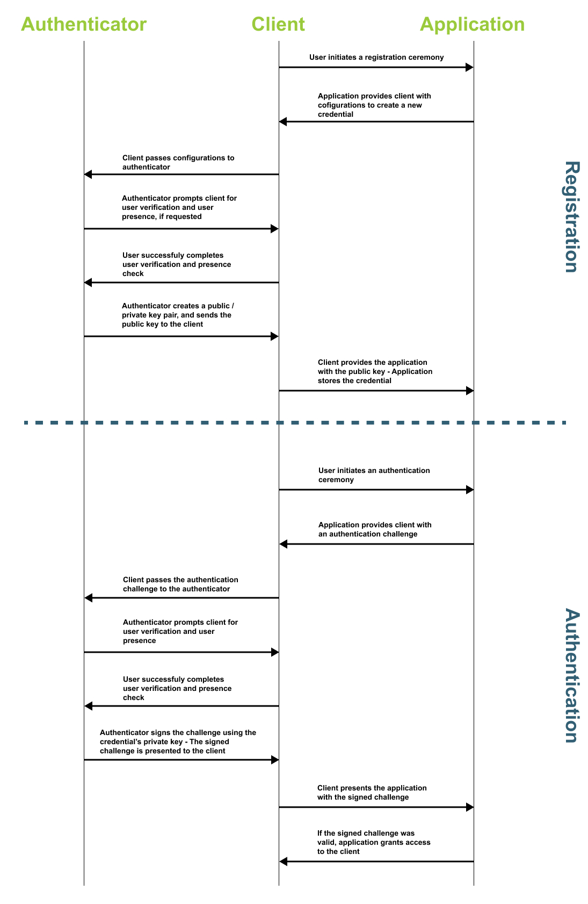

= How passkeys work
:description: Explanation on how passkeys allow for phishing resistant multi factor authentication
:keywords: passkey, passkeys, developer, high assurance, FIDO2, CTAP, WebAuthn

Explanation on how passkeys allow for seamless phishing resistant multi-factor authentication

Before we dive into the core passkey concepts, and implementation guides, let’s first take a step back to understand how passkeys work, what makes them secure, and the benefits over traditional authentication mechanisms.

== Multi-factor authentication

The first concept to explore is multi-factor authentication, which refers to authentication that requires multiple secure elements to authenticate into an application. 

The three primary authentication factors include: 

* Something you know
* Something you have
* Something you are

**Something you know** will relate to something like a password. This is a secret that only you should know, and that’s used to prove your identity. In the context of passkeys, something you know could come in the form of a PIN used to unlock the device.

**Something you have** is a unique item in your possession. Within the concept of passkeys, this will refer to the authenticator; whether that be a security key, or an authenticator embedded in a personal device.

**Something you are** refers to an element unique to your person. This primarily deals in the space of biometrics. This could include a fingerprint, scan of your face, voice detection, or you can go as far as a DNA test. 

Most passkey authenticators will include at least two of the factors mentioned above. A user will present something they have (the authenticator), and something they either know or are (PIN, biometric), to complete any registration or authentication ceremony.

== Public key based authentication
As noted in the previous section, passkeys rely on public key based authentication. During a registration ceremony, your authenticator will provide a public key to an application that will have a corresponding private key that exists on the authenticator. An application can then issue challenges, encrypted by the public key to a user. If the user is successfully able to use their private key to decrypt the challenge, then they will be authenticated into your application.
Figure 1 demonstrates a sequence diagram showing the flow of data that occurs during registration and authentication ceremonies.

**Figure 1**

Now that we understand at a high level how a passkey application keeps users secure, let’s dive into the architecture of a passkey application.

link:/Passkeys/High_level_architecture_of_a_passkey_application.html[Continue to high level architecture of a passkey application]
