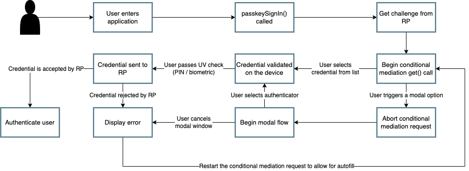

= Passkey client application authentication implementation guidance
:description: Add authentication flows to your passkey application
:keywords: passkey, passkeys, developer, high assurance, FIDO2, CTAP, WebAuthn, client application, registration

Add authentication flows to your passkey application

In this section we are going to outline implementation guidance in order to authenticate using a user's passkey. We will go over feature detection to see what authentication options are available for the user, as well as implementation guidance for both modal and autofill authentication flows.

It is assumed that you have the link:/Passkeys/Passkey_client_application_implementation_guidance/Passkey_client_application_prerequisites.html[prerequisites] in place that were outlined in the previous page.

== Autofill feature detection
First we will determine which authentication methods are available in the user's ecosystem. While browsers support the traditional "modal" method of authentication, not all of them will support the "passkey autofill" one that has featured heavily in passkey documentation.

**It's important to only provide authentication options that are relevant for your users**

Figure 1 demonstrates a flow an application should take once it has determined if autofill is available on the platform.

image::../../WebAuthn/Concepts/Passkey_Autofill/Images/autofill_2.png[]
**Figure 1**

In short, if an application detects that autofill is available, then it should allow the user to attempt to discover any passkeys that exist on the device. If the feature is not available, then the user should be taken to a login flow that will allow them to leverage the modal WebAuthn experience, or to register an account if they do not have one. 

Even if autofill is available, you should always provide your user an option to leverage the modal experience. This will be important for users who are leveraging security keys, or need to utilize a non-discoverable credential flow due to limitations in their authenticator. 

=== Using the isConditionalMediationAvailable() method
This method will allow your application to determine if autofill is available in the browser currently being used. The method returns true if the feature is available, and false otherwise. 

In the base case, your application should be able to leverage this method simply by invoking the method.

Figure 2 demonstrates sample code that can be used to call `isConditionalMediationAvailable()`.

[role="dark"]
--
[source,javascript]
----
PublicKeyCredential.isConditionalMediationAvailable();
----
--
**Figure 2**

It’s important to note that the code above works in an ideal use case where the browser supports the method. As this is a new feature, it has not yet been widely adopted by all browsers. This means that invoking this method may result in an error as the method may not be defined for the `PublicKeyCredential` object in a specific browser. 

In order to ensure that no errors disrupt the usage of `isConditionalMediationAvailable()`, you could extend the single line in Figure 2 to invoke a check if the function exists in the `PublicKeyCredential` browser object.

Figure 3 demonstrates sample code that can be used to safely check if a browser supports the `isConditionalMediationAvailable()` method, and if the feature is available.

[role="dark"]
--
[source,javascript]
----
const mediationAvailable = () => {
  const pubKeyCred = PublicKeyCredential;
  // Check if the function exists on the browser - Not safe to assume as the page will crash if the function is not available
  //typeof check is used as browsers that do not support mediation will not have the 'isConditionalMediationAvailable' method available
  if (
    typeof pubKeyCred.isConditionalMediationAvailable === "function" &&
    pubKeyCred.isConditionalMediationAvailable()
  ) {
    console.log("Conditional Mediation is available");
    return true;
  }
  console.log("Conditional Mediation is not available");
  return false;
};
----
--
**Figure 3**

In our example above you can assume that a browser does not support autofill if it does not support the `isConditionalMediationAvailable()` method

It is our hope that the method will become standard in all browsers soon, but for the time being ensure that you check for the method's availability before you invoke the method. 

== Modal and autofill login
In this section we are going to explore how to create an authentication flow that can leverage both the modal and autofill login experiences. There are a variety of considerations that need to be taken into account, due to behaviors specified by the WebAuthn methods. Before we proceed to the implementation guidance, let’s first take a look at what will be created. The example below will demonstrate a login page that is capable of using:

* Autofill passkey credentials
* Modal passkey credentials
* Modal with a non-empty allowCredentials list

Figure 3 will walk through the three flows mentioned above, all leveraged from the same logic page. 

[role="videoConst"]
--
video::../videos/passkey_modal_auto.mp4[]
--
**Figure 3**

== Autofill flow
The first step will be to introduce an input tag on your page for the user to enter in their username, that also supports autofill for WebAuthn. This step is as straightforward as creating an input tag and adding the autocomplete attribute with the value of `username webauthn`.

Figure 4 shows sample code on how to enable WebAuthn autofill in your username input field 

[role="dark"]
--
[source,html]
----
<input type="text" id="username-field" autocomplete="username webauthn" />
----
--
**Figure 4**

This will prompt the user with a credential if one is discovered on the device that matches the current origin of the webpage. 

== Modal flow
You may have noticed in the video in Figure 3 that when a user opts to use autofill, they don’t enter anything, or press any buttons other than the username in the drop down list.

But in the second and third flow we have two other options that a user can leverage, both centered around the modal WebAuthn experience.

The first flow is is the discoverable credentials flow. This is similar to the autofill flow as it also leverages passkeys on a device. While this flow acts similar to the autofill flow, you should still include it in the case that a user's browser doesn’t support autofill, or the OS doesn’t support passkeys. 

The second flow is to use a user identifier to ask the relying party to send a `PublicKeyCredentialsRequestOptions` with an allow credentials list containing the IDs of the user's registered credentials.

To accommodate both flows above, we will add two different buttons - One for login using a username, and one for discoverable credentials.

Figure 5 includes the first button used to trigger a non-discoverable credential modal flow

[role="dark"]
--
[source,html]
----
<Button
  type="submit"
  onClick={signIn}>
  Continue
</Button>
----
--
**Figure 5**

Figure 6 includes the second button used to trigger a discoverable credential flow

[role="dark"]
--
[source,html]
----
<Button
  type="submit"
  onClick={usernamelessLogin}>
  Continue with passkey
</Button>

----
--
**Figure 6**

== Initiate the authentication ceremony
As noted before there are three different flows that a user can take when they visit this page. In this section we are going to highlight how each of these different flows can be triggered, and the nuanced differences between them. 

Before we begin let’s take a look at how this page will flow through the different paths that a user may take.

Figure 7 demonstrates a sample flow for a page that leverages both modal and autofill options.

**Figure 7**

=== Aborting autofill requests
One of the major things to note above is the need to abort a conditional mediation request that is active. Unlike the modal experience, the autofill menus do not include a button to cancel a request.

From a specification standpoint, the intended behavior is for only ONE active credential request to be active at a time. This issue can be viewed link:https://github.com/w3c/webappsec-credential-management/issues/206[here, at the WebAuthn GitHub page].

The WebAuthn specification does note that an AbortController can be used to trigger the cancellation of a WebAuthn ceremony. This can be used by both the modal and autofill flows. More information can be found in the link:https://w3c.github.io/webauthn/#sctn-sample-aborting[WebAuthn specification at this link].

Keep the information above in mind, as we will demonstrate its use in the following sections.

== Trigger the autofill flow
We’ll begin by implementing the autofill flow. We are starting with autofill as it is the first step in the sequence shown in Figure 5. This flow will be immediately triggered whenever a user loads into this page.

The first thing you want to do is to create an `AbortController` object that is global in scope. This will be used as a signal by your client application to end the autofill request if it needs to make room for a modal request. 

Ensure that the `AbortController` exists in a scope where it can be triggered by other methods, and reinitialized if the autofill flow needs to be reenabled. 

Figure 8 demonstrates sample code that can be used to initialize an AbortController

[role="dark"]
--
[source,javascript]
----
let authAbortController = new AbortController();
----
--
**Figure 8**

Next we will trigger the autofill request. We will do this by calling the method `passkeySignIn()` whenever the user navigates to the page. 

Figure 9 demonstrates the method `passkeySignIn()`. This is the method that will handle authentication, if a user selects one of their passkeys.

[role="dark"]
--
[source,javascript]
----
async function passkeySignIn() {
  try {
    authAbortController = new AbortController();
    // Reaching out to Cognito for auth challenge
    let requestOptions = await getPublicKeyRequestOptions();

    const credential = await navigator.credentials.get({
      publicKey: requestOptions,
      mediation: "conditional",
      signal: authAbortController.signal
    });

    const userData = await WebAuthnClient.sendChallengeAnswer(credential);
  } catch (error) {
    console.log(error);
  }
};
----
--
**Figure 9**

Note the use of the `signal` property in the `get()` request. You will add your `AbortController` signal as the value to new property. This notes to the WebAuthn method that the request should be canceled if the signal has been aborted. 

Also ensure that a new `AbortController` is created whenever autofill is re-invoked. If you attempt to use an `AbortController` that has already been aborted, then the WebAuthn method will be immediately canceled.

The rest of the method will remain standard in terms of a WebAuthn request. In this example assume that `WebAuthnClient` is a set of methods used to communicate with your RP. `getPublicKeyRequestOptions()` will be used to get the authentication challenge, while `sendChallengeAnswer()` will pass your credential to your relying party.

As with any WebAuthn authentication request your first step will be to call out to the relying party for a challenge to be signed by your credential. 

Here is where the primary deviation occurs in relation to the modal flow. Instead of directly passing in an object that contains the `publicKey` property, you will add a new field to the object. This field is named `mediation`. You will attach the value `conditional` to the `mediation` property. This configuration will trigger the conditional mediation WebAuthn flow.

[NOTE]
======
Removing the `mediation` property will trigger the modal experience
======

You will pass the object that contains the `publicKey` property into the WebAuthn `get()` method. If successful then you will send your assertion to the relying party. 

== Trigger the modal flow
Next we will learn how to trigger the modal flow from a button click. Below you will find sample code that can be used by either button to trigger a non-autofill flow.

Figure 10 demonstrates sample code that can be used to trigger a modal request

[role="dark"]
--
[source,javascript]
----
async function signIn() {
  try {
    // Reaching out to Cognito for auth challenge
    let requestOptions = await getPublicKeyRequestOptions();

    const credential = await get({
      publicKey: requestOptions
    });

    const userData = await WebAuthnClient.sendChallengeAnswer(credential);
  } catch (error) {
    passkeySignIn();
    console.log(error);
  }
};
----
--
**Figure 10**

Notice how it is extremely similar to the method used for autofill, all that’s missing are the `mediation` and `signal` properties.

Another thing to note is in the method’s catch statement. You will notice that  if the `signIn()` method fails, then the `passkeySignIn()` flow will be re-triggered, allowing for the use of autofill. If this is not done, then no authentication ceremony will take place if the user attempts to select an autofill option. 

In the example in Figure 10, the method `getPublicKeyRequestOptions()` will need variations or behaviors to be able to invoke discoverable and non-discoverable credential flows. The same logic will be used for both modal flows, but the behavior of the modal flow will change depending on if the `PublicKeyCredentialRequestOptions` includes an allowCredentials list. 

You should now be able to use the autofill and modal flow in concert with each other to perform a variety of authentication ceremonies. Stay tuned for more passkey related material to help guide your passwordless implementation strategy. 
