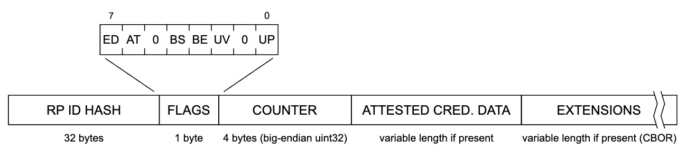

= Guidance for high assurance passkey relying party
:description: Learn how to adapt your relying party to be compatible with high assurance scenarios
:keywords: passkey, passkeys, developer, high assurance, FIDO2, CTAP, WebAuthn, relying party, high assurance

Learn how to adapt your relying party to be compatible with high assurance scenarios

In this section we will focus on concepts related to high assurance applications that may need to enforce limitations on the authenticators that can be registered. Let’s begin by understanding why a high assurance application may need to utilize an authenticator management strategy.

== Reasons for imposing authenticator limitations
The standard guidance for your passkey application is to err towards being more permissive with the authenticators it allows, because any form of passkey is still more secure than not using a passkey. With that being said there are scenarios where you should choose not to trust an authenticator due to your business requirements, or risk profile of your application. In this section we are going to outline some scenarios.

=== High assurance vs low assurance credentials
Regulatory or business requirements may require you to use high assurance security devices. Our use of assurance levels are defined by the link:https://nvlpubs.nist.gov/nistpubs/SpecialPublications/NIST.SP.800-63-3.pdf[NIST Digital Identity Guidelines]. 

High assurance provides very high confidence that the user attempting to make the authentication claim is the owner of the authenticator registered to the desired account. This is done by providing proof of an authenticator with at least two different authentication factors, and that the credential is hardware bound to the device as a means of impersonation resistance.

Low assurance has less strict requirements, where the authenticator only needs to provide a single authentication factor, and the hardware bound aka single device credential aspect is not necessary.

Low assurance passkey authenticators may include multi-device passkeys where the credential can be moved across multiple devices, or account holders. This is in contrast to a high assurance device, like a security key, where the root of trust of the credential is bound to the single device that it was generated on, ensuring that the credential can’t be exported.

=== Only specific authenticators exist in your ecosystem
You may be an enterprise who purchased and deployed a specific set of authenticators into your ecosystem. This means that any registration or authentication requests should be coming from that set of authenticators, and you should deny any authenticators that your application does not deem as trusted.

=== Vulnerabilities in authenticators
There are cases where vulnerabilities are identified in authenticators. You may want to conduct mitigating efforts to protect not only user accounts, but also your ecosystem. Mitigation could be as simple as alerting an account holder who is utilizing a vulnerable authenticator, or completely restricting that authenticator from being used in your environment.

== Passkey types and assurance levels
Let’s quickly recap the differences between link:/passkeys/passkey_concepts/Single_device_vs_multi_device_credentials.html[single (SDC) and multi device (MDC) credentials].

Low assurance use cases can allow for any type of passkey. Many consumer facing applications can be categorized as low assurance use cases. You don’t want to require that your consumer users purchase specialty hardware to use your application. Instead you will want to opt into allowing them to use the authenticator built directly into one of their everyday devices, like a mobile authenticator.

High assurance use cases will require the use of an SDC. The device bound nature of SDCs allow for the requirement of a “hard” authenticator where the credential’s private key cannot be exported, synced, or backed up across different devices. While both passkey types are driven by WebAuthn, the fact that an MDC’s private key can be exported and imported across devices and can allow for impersonation by sharing disqualifies their use in high assurance scenarios.

What does this mean for a high assurance relying party?

This means that your backend application may need to utilize different authenticator signals and flags to determine if it should be allowed to register in your relying party. The next section will outline the different signals that can be used to identify a device’s security posture.

== Authenticator device signals

=== Attestation
Attestation will be the strongest signal that can be used by a relying party for determining if a passkey should be allowed to register. Within the context of passkeys, attestation refers to the ability of a security device to prove its own identity and for a relying party to attain details about the security device it was created on, and which manufacturer actually created said device.

During a registration ceremony, your relying party can indicate the desire of attestation to be sent once a credential has been created. When an authenticator sends an attestation to the relying party, the backend application can perform some operations to determine if the new passkey should be trusted. Some of these operations include:

* Rejecting any passkey that does not include attestation
* Rejecting any passkey where the attestation statement’s root of trust cannot be validated by the manufacturer’s public key
* Rejecting any passkey that is not included in an allow/deny list set in the relying party

Note that a relying party does not need to perform, or is limited, by every action noted above. The next page in this guide will provide implementation details around attestation.

=== Backup flags
The next signal that can be utilized are flags sent by an authenticator during registration and authentication that denote the ability for the credential to be backed up. When a new passkey is created, the response will include a property named `attestation object`. This `attestation object` contains an `authenticator data` object. The `authenticator data` object contains information related to the authenticator that it was created on, including a set of `flags` used to denote contextual information about the authenticator. 

Figure 1 demonstrates the structure of the `authenticator data` object, please note the section on `Flags`.

**Figure 1**

Within the `Flags` section are bits that can be used to determine certain characteristics of the authenticator when the passkey was created. Two of these flags can be used to determine if the passkey is an MDC. 

The **BE** bit indicates “backup eligibility”. In other words, if the bit is 1 it indicates that this passkey **could** be backed up to another authenticator, and 0 if otherwise. 

The **BS** bit indicates “backup state”. In other words, if the bit is 1 it indicates that the passkey **has** been backed up and usable by another authenticator, and 0 if otherwise. 

Your relying party can utilize these bits, and observe their state to determine if it should be allowed for use in your application. It’s important to note that the BS bit could change from registration to authentication. Meaning a passkey could not be backed up during registration, then be backed up at a later date. 

=== Device public key
The device public key (DPK) is an optional device bound key that can be requested by the relying party for additional analysis. The goal is to provide a mechanism for MDCs to provide an identifier for the device that is attempting to leverage a passkey. If a user has three devices, each device can hold a DPK that can be used to identify the specific device that was being used during a ceremony. For instance, during a registration ceremony device A will pass its DPK to the backend service. Even though the passkey can be accessed by devices B and C, the backend application can reject authentication attempts unless it receives a valid passkey credential and a DPK for device A.

**This is a relatively new feature that is planned, but not adopted by any of the major MDC passkey providers.**

The strongest signal that can be used to determine the assurance level of a passkey is attestation. In the next section we'll dive further into the concept.

link:/Passkeys/Passkey_relying_party_implementation_guidance/Attestation[Continue to attestation implementation guidance]
