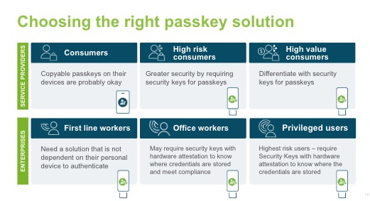

= Passkey use cases
:description: Overview of use cases to help you determine the right passkey for your solution
:keywords: passkey, passkeys, developer, high assurance, FIDO2, CTAP, WebAuthn

Overview of use cases to help you determine the right passkey for your solution

In this section we are going to explore different passkey use cases, the differences between enterprise vs consumer scenarios, and selecting the right passkey solution to handle different scenarios.

== Assurance level
First let’s understand the concept of assurance level. In our context assurance refers to the authenticator assurance level that is defined in the guidance given by NIST in their report link:https://nvlpubs.nist.gov/nistpubs/SpecialPublications/NIST.SP.800-63-3.pdf[Digital Identity Guidelines]. These are the technical requirements for federal agencies implementing digital identity solutions. We are utilizing this guidance as some of the principles should be taken under consideration for applications that operate in high risk scenarios.

For our purpose assurance is broken down into two levels, low and high assurance. 

=== Low assurance

Low assurance authenticators require that a device only requires a single factor. The person attempting to sign in only needs to prove possession and control of the device to authenticate into an account.

It’s important to understand that any WebAuthn is still more secure than a password. So while the experience outlined above seems too seamless to be secure, the authenticator is still phishing resistant, and requires possession and control of an authenticator to gain access to an account.

If an application is lower risk (i.e doesn’t deal with financial data, personal information, or possess personal or safety risks) then it should be free to leverage low assurance authenticators.

=== High assurance
High assurance authenticators require that there are two different authentication factors AND that the device is a hard authenticator; providing impersonation resistance. This means that the private key is only present on one device, and can’t be copied or synced to another authenticator.

High assurance is used for high risk applications that pose critical risk to a variety of areas such as financial risk, personal safety, or exposure of sensitive data.

=== Passkey types and assurance levels
Next let’s go over how assurance fit into the different passkey types.

Before you proceed, ensure that you understand the difference between single device credentials **(SDCs)** and multi device credentials **(MDCs)**. Information on both can be found in our guidance on link:/passkeys/passkey_concepts/Single_device_vs_multi_device_credentials.html[single and multi device credentials].

High assurance use cases will require the use of an SDC. The device bound nature of SDCs adhere to the requirement of a “hard” authenticator where the credential’s private key cannot be exported, synced, or backed up across different devices. 

While both passkey types are driven by WebAuthn, the fact that an MDC’s private key can be exported and imported across devices, and can allow for impersonation by sharing, disqualifies their use in high assurance scenarios.

Low assurance use cases can allow for any type of passkey. Many consumer facing applications can be categorized as low assurance use cases. You don’t want to require that your consumer users purchase specialty hardware to use your application. Instead you will want to allow them to use the authenticator built directly into one of their everyday devices, like a mobile authenticator.

== Choosing the right passkey
For the rest of this article, we are going to explore different use cases to help you determine what type of passkey is best for your scenario. We will dig deep into both consumer and enterprise use cases to highlight how assurance levels are not one-size-fits-all, and can fit into either space. 

Figure 1 provides an informational graphic that highlights the concepts that will be covered in the rest of this article.

**Figure 1**

== Consumer use cases
These are use cases that can be utilized by the broad consumer space. Apps that can be downloaded onto personal devices such as: social media, personal productivity tools, streaming apps, and more. 

What’s important to note about consumer applications are the large number of permutations that could exist in terms of authenticators, operating systems, and browsers. 

Because consumer applications are typically low risk, the use of low assurance authenticators is acceptable. If the goal of implementing passkeys in your consumer application is to reduce the possibility of phishing attacks, and streamlining the user experience, then **any** form of passkey will be acceptable.

You do not want to impose limits on consumer users that will require them to buy specialty hardware to use your application. The big draw of passkeys in the consumer space is that the vendors who develop operating systems and devices have, or are in the process of integrating passkeys into everyday consumer devices like phones and laptops. 

For consumer applications it’s better to err on the side of permissive when it comes to the authenticators that you allow. Any form of WebAuthn is still better than no WebAuthn. With that said, there are examples in the consumer space where a high degree of assurance is required. To validate this claim, let’s evaluate a few consumer user cases to better understand how to determine assurance levels.

=== Determining assurance level for consumer use cases
We are going to explore three use cases and attempt to determine the assurance level. 

==== Use case 1: Streaming services
The first application is a standard streaming service. You come to this application in order to view your favorite movie, TV series, or other forms of content. Generally speaking, there’s not huge repercussions if a streaming account is compromised: changes could be made to an account name, additional users could be authorized, or your recommendation algorithm could be thrown off. With these minimal risks, accounts for streaming services should be allowed to rely on low assurance authenticators. 

Another factor to consider is the concept of account sharing, where multiple members of a household want access to stream from their personal devices. In the current paradigm, a password would be shared between household members, which could be stolen, leading to unwanted access to an account. Some passkey providers will allow MDC’s to be shared and managed to specified members of a users contact list, mitigating the risk of unwanted access through compromised or phished passwords.

==== Use case 2: High risk social media users
Beyond connecting with people you know, social media sites allow users to follow and receive content from high profile accounts. Some examples of these high profile accounts are celebrities, journalists, and politicians. The integrity of these high profile accounts should be maintained, as they often have large follower numbers, who may place a lot of weight on the words and content coming from these accounts. 

A recent example of this is the 2020 Twitter hack, where an attacker was able to share Bitcoin scams through accounts from politicians, CEOs, and celebrities. 

If an account falls within the realm of high profile, then these users should consider the use of high assurance devices. High assurance devices will ensure the utmost security, to prevent an account takeover that leads to malicious content being shared to the profile’s followers.

This doesn’t necessarily mean that every social media account should be forced to leverage high assurance devices; instead the guidance is to be interpreted as allowing for certain accounts to specify their desire to only utilize high assurance authenticators for access to their accounts. Normal users of a social media site should be free to continue to utilize low assurance authenticators for use in their accounts.

==== Use case 3: Financial services customer applications

This application allows customers of a financial service to view their account and execute financial transactions. This application can still be considered high risk due to the possibility of financial loss to a user who has their account compromised.

If an account in this application was compromised then it’s possible that:

* A user loses a large sum of their finances in their accounts
* The financial service company risks loss in reputation if multiple accounts are compromised
* The financial service company may be held liable if they are found at fault for compromising the accounts

Due to the risk, it makes sense to mark this application as high assurance, but there is another consideration. The financial service company doesn’t want to require that all of their users purchase speciality hardware in order to use their accounts nor do they want to provide users with such hardware from a cost perspective. The financial services company wants to ensure that the use of their application is seamless and available to all of their customers.

You may want to consider allowing for the use of low assurance authenticators but prompt the user for additional authentication factors such as a password, or a custom authenticator app to execute transactions over a certain threshold. It’s important to note that the password is not the leading factor, and a leaked password will not lead to a compromised account. An attacker will still need control and possession of an authenticator to gain access to an account.

Now that we have a firm understanding of consumer passkey use cases, let’s explore enterprise scenarios.

== Enterprise use cases

These are use cases that can be found in non-consumer applications. This could be an application that is only internal to a company, an application used by a government agency, an application offered to partners/customers of an enterprise, and other similar use cases. The sensitive, or confidential nature of these applications will typically land them with the requirement to leverage high assurance authenticators. 

In these scenarios it’s recommended to leverage SDCs. This would reduce the ability for a credential to be utilized outside of the device that it was originally created on. 

You may want to consider leveraging link:/Passkeys/Passkey_relying_party_implementation_guidance/Attestation[attestation] and an link:/WebAuthn/Concepts/Authenticator_Management/[authenticator management strategy] in order to tighten controls on the devices allowed to register in your application. 

There may be some enterprise use cases that don’t require high assurance devices. To validate this claim, let’s evaluate a few enterprise use cases to better understand how to determine assurance levels.

=== Determining assurance level for enterprise use cases
The link:https://nvlpubs.nist.gov/nistpubs/SpecialPublications/NIST.SP.800-63-3.pdf[NIST Digital Identity Guidelines] offers a decision map to help you determine the authenticator assurance level that you should leverage in your application. This decision map can be found in Figure 6-2 in the aforementioned document.

We are going to explore three use cases and attempt to determine the assurance level.

==== Use case 1: Financial advisor application
The first application that we are going to explore is the tool that allows financial advisors to view accounts, and execute transactions on behalf of their clients. This application is only usable by certain internal employees at a financial services company, and is not publicly facing.

If an account to this application was compromised then it’s possible that:

* Unauthorized financial transactions are executed
* Unauthorized transactions could lead to a loss of company reputation
* The financial services company could be held liable for improperly securing this high risk system

Because this application is highly sensitive, we’ll note that the application requires high assurance authenticators. The intent is that financial advisors are only able to login to this application using SDCs, in the form of security keys that their employer will distribute.

==== Use case 2: Employee benefits summary application
The next application is one that allows employees to view their benefits from personal devices. It’s useful in situations where an employee is curious about company holidays, their number of vacation days remaining, or information related to their health insurance. The application doesn’t allow for the employee to make any changes, and contains no sensitive health related information.

There is not much inherent risk if one of these accounts were compromised. No confidential company data, or personal information is disclosed in this application.

Because the potential risk associated with this application is low, it may be fine to consider the use of low assurance authenticators. This means that the enterprise may not need to distribute security keys to all of their employees, and will allow them to use the authenticator in their personal devices.

==== Use case 3: External software developers with privileged access
The last use case revolves around securing an enterprise's software supply chain. An enterprise may be producing software where not all of the code is being produced in-house. In these instances the enterprise might contract out to a development shop to create custom code. In order to integrate this code into the enterprise’s final product, the contracting service will require some level of privilege to push code changes into an internal repository, or into a deployment slot on some enterprise controlled infrastructure. 

An attacker could target the code, or the deployment pipeline in order to compromise the product. To ensure that nothing malicious is added into the enterprise environment, a company may require the use of high assurance authenticators that are provided to the contracted services company, which will be required to access the enterprise environment. This will ensure a greater degree of assurance that any request or change is coming from a valid user. 

== Additional passkey concepts
At this stage you should be familiar with use cases, and how to select the right passkey for your consumer or enterprise scenario. Before we proceed to implementation guidance, we are going to go over some essential passkey concepts to help provide you a stronger foundation on the concepts required to build a passkey application.

link:/passkeys/passkey_concepts[Continue to passkey concepts]
