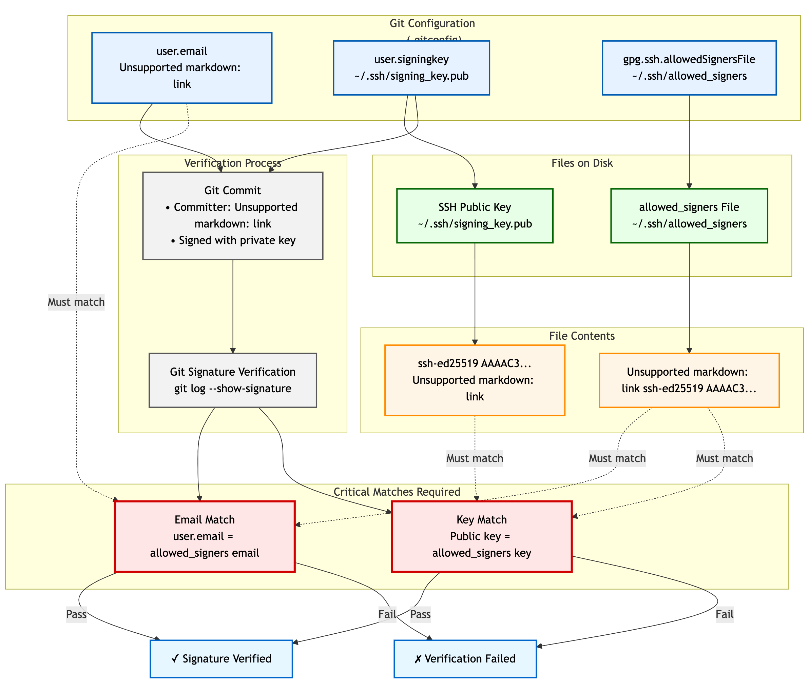

== Secure Your Code Integrity: Git Commit Signing with YubiKey and SSH/FIDO2
:doctype: article
:toc: left
:toclevels: 3
:sectnums:
:icons: font
:source-highlighter: rouge
:experimental:
:revdate: {docdate}
:description: A comprehensive guide for developers on using YubiKeys with FIDO2-backed SSH keys to sign Git commits and tags, ensuring code authenticity, integrity, and achieving verified status on platforms like GitHub.
:keywords: YubiKey, FIDO2, Git, SSH, Commit Signing, Tag Signing, ed25519-sk, ecdsa-sk, Secure Development, Code Integrity, Developer Security, OpenSSH, Allowed Signers, GitHub Verified, GitLab

[[introduction]]
=== Introduction: Why Sign Your Git Commits with YubiKey?

In modern software development, ensuring the integrity and authenticity of your codebase is paramount. Git's commit signing feature provides a robust way to verify that commits and tags originate from a trusted source and haven't been tampered with. By leveraging your YubiKey with its FIDO2 capabilities to manage SSH keys used for signing, you elevate this security significantly.

When you sign Git commits using an SSH key protected by your YubiKey:

* **Non-Repudiation:** There's strong cryptographic proof that you (or at least, someone with access to your YubiKey and its PIN, requiring your physical presence for a touch) authored the changes.
* **Enhanced Security:** Your private signing key never leaves the YubiKey, protecting it from malware or disk compromise on your development machine.
* **Hardware-Backed Verification:** Each signature requires a physical touch on your YubiKey, preventing unauthorized signing.
* **Simplified Key Management:** For developers already using SSH keys with FIDO2 support, this extends their use without needing separate GPG key management for Git signing.
* **Platform Trust:** Achieve "Verified" status for your commits on platforms like GitHub and GitLab, visually assuring collaborators of your commit's authenticity.

This guide will walk you through configuring Git to use your YubiKey-backed SSH keys for signing commits and tags, and how to ensure these signatures are recognized by popular Git hosting platforms.

[[prerequisites]]
=== Prerequisites

Before you begin, ensure you have the following:

* **A YubiKey with FIDO2 Support:** Any YubiKey from the 5 Series, YubiKey Bio Series, or Security Key Series by Yubico.
* **Git Version:** Git 2.34 or newer. Check with `git --version`.
* **OpenSSH Client Version:**
** OpenSSH 8.2 or newer for basic FIDO2 SSH key support.
** OpenSSH 8.3 or newer is highly recommended for the `-O verify-required` option.
** OpenSSH 8.9 or newer is recommended if using non-resident keys with the `-O credProtect` option.
** Check with `ssh -V`. (See our guide on link:/SSH/Securing_SSH_with_FIDO2.html[Securing SSH with FIDO2] for platform-specific OpenSSH setup if needed).
* **FIDO2 PIN Set (Recommended):** For resident keys, a FIDO2 PIN must be set on your YubiKey using link:https://www.yubico.com/support/download/yubikey-manager/[YubiKey Manager].

[[choosing-generating-signing-key]]
== Step 1: Choose or Generate Your SSH Signing Key

You'll need an `ed25519-sk` or `ecdsa-sk` type SSH key. If you already use such a key stored on your YubiKey for SSH authentication, you *can* reuse it, but for best practice, consider generating a dedicated key for signing.

=== Generating a New Dedicated Signing Key (Recommended)

We recommend an `ed25519-sk` resident key, which requires YubiKey firmware 5.2.3+. The command differs slightly between Unix-like systems (Linux, macOS) and Windows.

==== For Linux and macOS

[source,bash]
----
ssh-keygen -t ed25519-sk -O resident -O verify-required -C "Git signing key $(git config user.email)" -f ~/.ssh/id_ed25519_sk_git_signing
----

* `-t ed25519-sk`: Specifies the modern, secure EdDSA key type for FIDO2.
* `-O resident`: **Highly Recommended.** Stores the key handle on the YubiKey itself, making it portable across different machines. Requires a FIDO2 PIN.
* `-O verify-required`: **Highly Recommended.** Ensures every signature operation requires a physical touch on your YubiKey.
* `-C "Git signing key $(git config user.email)"`: Sets a comment. Using your Git `user.email` helps identify the key's purpose.
* `-f ~/.ssh/id_ed25519_sk_git_signing`: Specifies the filename. Using a distinct name like `id_ed25519_sk_git_signing` helps differentiate it from SSH authentication keys.

You will be prompted for your YubiKey FIDO2 PIN (if `-O resident` is used) and to touch your YubiKey.

==== For Windows (PowerShell)

**PowerShell Pro Tip:** PowerShell doesn't expand the tilde (`~`), so use the `$env:USERPROFILE` variable for the file path to avoid a `No such file or directory` error.

[source,powershell]
----
ssh-keygen -t ed25519-sk -O resident -O verify-required -C "Git Signing Key" -f "$env:USERPROFILE\.ssh\id_ed25519_sk_git_signing"
----

The options (`-t`, `-O`, `-f`) serve the same purpose as described above. For the comment (`-C`), we use a static string here, but you can replace `"Git Signing Key"` with your email address or another descriptor.

=== Using an Existing FIDO2 SSH Key

If you have an existing `ed25519-sk` or `ecdsa-sk` key (e.g., `~/.ssh/id_ed25519_sk`), ensure it was generated with security in mind (ideally with `-O verify-required` and `-O resident`). Note the path to its *public key file* (e.g., `~/.ssh/id_ed25519_sk.pub`).

[[configuring-git]]
== Step 2: Configure Git for SSH Signing

Next, configure Git to use SSH keys for signing and specify which key to use. These commands are typically run with `--global` to apply to all your repositories.

1.  **Set Git's GPG Format to SSH:**
+
[source,bash]
----
git config --global gpg.format ssh
----
+
2.  **Specify Your Signing Key:**
+
Provide the path to the **public key file** of the SSH key you want to use for signing. Choose the command for your operating system.
+
.For Linux and macOS
[source,bash]
----
# Replace with the actual path to your public key file
git config --global user.signingkey ~/.ssh/id_ed25519_sk_git_signing.pub
----
+
.For Windows (PowerShell)
[source,powershell]
----
# Replace with the actual path to your public key file
git config --global user.signingkey "$env:USERPROFILE\.ssh\id_ed25519_sk_git_signing.pub"
----
+
3.  **Enable Automatic Commit Signing (Recommended):**
+
[source,bash]
----
git config --global commit.gpgSign true
----
+
4.  **Enable Automatic Tag Signing (Recommended for Annotated Tags):**
+
[source,bash]
----
git config --global tag.forceSignAnnotated true
----

[[allowed-signers-file]]
== Step 3: Create and Configure the Allowed Signers File

For Git to verify SSH signatures locally, you need an "allowed signers" file. This file maps email addresses and optional namespaces to trusted SSH public keys.

==== For Linux and macOS

1.  **Create the Allowed Signers File:** (e.g., `~/.ssh/allowed_signers`)
+
[source,bash]
----
mkdir -p ~/.ssh && touch ~/.ssh/allowed_signers
# Then open ~/.ssh/allowed_signers in a text editor
----
+
2.  **Add Your Key to the Allowed Signers File:**
+
The format for each line is: `email [options] ssh_public_key_string`
+
Get your public key string: `cat ~/.ssh/id_ed25519_sk_git_signing.pub`
+
Add an entry like this to `~/.ssh/allowed_signers`:
+
[source,text]
----
your.email@example.com namespaces="git" ssh-ed25519 AAAAC3NzaC1lZDI1NTE5AAAAIBYourPublicKeyData... Git signing key your.email@example.com
----
+
*Ensure `your.email@example.com` exactly matches your `git config user.email`.*
*`namespaces="git"` is crucial for scoping the key's authority.*
+
3.  **Tell Git Where to Find the Allowed Signers File:**
+
[source,bash]
----
git config --global gpg.ssh.allowedSignersFile ~/.ssh/allowed_signers
----

==== For Windows (PowerShell)

On Windows, use PowerShell-idiomatic commands and the `$env:USERPROFILE` variable for paths.

1.  **Create the Allowed Signers File:**
+
[source,powershell]
----
# Define paths
$sshDir = "$env:USERPROFILE\.ssh"
$allowedSignersFile = Join-Path $sshDir "allowed_signers"

# Ensure the .ssh directory and the allowed_signers file exist
if (-not (Test-Path $sshDir)) { New-Item -Path $sshDir -ItemType Directory | Out-Null }
if (-not (Test-Path $allowedSignersFile)) { New-Item -Path $allowedSignersFile -ItemType File | Out-Null }

# Then open the file in a text editor
notepad $allowedSignersFile
----
+
2.  **Add Your Key to the Allowed Signers File:**
+
The format is identical to other platforms. First, get your public key string and copy it to the clipboard:
+
[source,powershell]
----
Get-Content "$env:USERPROFILE\.ssh\id_ed25519_sk_git_signing.pub" | Set-Clipboard
----
+
Then, paste it into your `allowed_signers` file (opened with `notepad` in the previous step). Add your email and the `namespaces` option at the beginning of the line:
+
[source,text]
----
# C:\Users\YourUser\.ssh\allowed_signers
your.email@example.com namespaces="git" ssh-ed25519 AAAAC3NzaC1lZDI1NTE5AAAAIBYourPublicKeyData... Git Signing Key
----
+
*Ensure `your.email@example.com` exactly matches your `git config user.email`.*
*`namespaces="git"` is crucial for scoping the key's authority.*
+
3.  **Tell Git Where to Find the Allowed Signers File:**
+
[source,powershell]
----
git config --global gpg.ssh.allowedSignersFile "$env:USERPROFILE\.ssh\allowed_signers"
----

[[signing-commits-tags]]
== Step 4: Signing Commits and Tags

With the configuration in place, commit or tag as usual (or use `-S` / `-s` if automatic signing is disabled). You'll be prompted for a YubiKey touch (and PIN if applicable).

[[verifying-signatures-locally]]
== Step 5: Verifying Signatures Locally

* **For Commits:** `git log --show-signature`
* **For Tags:** `git tag -v <tagname>`
+
Look for "Good signature from your.email@example.com".

[[achieving-verified-badge]]
== Step 6: Achieving "Verified" Badges on GitHub & GitLab

While local verification is important, seeing a "Verified" badge next to your commits on platforms like GitHub or GitLab provides visual assurance to your team.

=== GitHub

For GitHub to display your SSH-signed commits as "Verified":

1.  **Upload Your Signing Key to GitHub as an SSH Key:** The *same* SSH public key (`~/.ssh/id_ed25519_sk_git_signing.pub` in our example) that you use for signing must also be added to your GitHub account under "SSH and GPG keys" as an **authentication key**.
    * Go to GitHub > Settings > SSH and GPG keys.
    * Click "New SSH key" or "Add SSH key."
    * Paste the contents of your signing *public* key.
    * Give it a descriptive title.

GitHub will then associate signatures made by this key with your account and mark the commits as "Verified" if the committer email also matches an email verified on your GitHub account.

=== GitLab

GitLab also supports displaying verification status for commits signed with SSH keys. Similar to GitHub:

1.  **Add Your Signing Key to GitLab:** Add the public part of your SSH signing key to your GitLab profile under Preferences > SSH Keys.
GitLab uses this list of known SSH keys to verify commit signatures. Ensure the email address used in your commits is also associated with your GitLab account.

[[ssh-agent-considerations]]
== SSH Agent Considerations

You can add your FIDO2 SSH signing key's private key *handle* file to `ssh-agent`. This allows the agent to cache your FIDO2 PIN.

.For Linux and macOS
[source,bash]
----
ssh-add ~/.ssh/id_ed25519_sk_git_signing # (Use the private key handle file here)
----

.For Windows (PowerShell)
[source,powershell]
----
ssh-add "$env:USERPROFILE\.ssh\id_ed25519_sk_git_signing"
----

* **PIN Caching:** If your key is PIN-protected, `ssh-agent` can cache the PIN after the first entry for a limited time or session, reducing repeated PIN prompts.
* **Touch Still Required:** Crucially, even with `ssh-agent`, the `-O verify-required` option on your key (or the inherent nature of FIDO2) will still necessitate a physical touch on your YubiKey for each signing operation.
* **Troubleshooting Agent Issues:**
** **"Agent refused operation" / "sign_and_send_pubkey: signing failed":** Ensure the correct key is added and the YubiKey is accessible. Sometimes `ssh-add -D` (to remove all identities) followed by re-adding the specific key helps.
** **Multiple Agents:** On systems like Linux with GNOME or macOS, be aware of multiple potential SSH agents. Ensure you're interacting with the correct one. `echo $SSH_AUTH_SOCK` can help identify the agent socket.
** **Windows:** If using Windows OpenSSH agent, ensure the service is running. For WSL, agent integration might require additional setup (like `npiperelay` or WSL's built-in SSH agent forwarding).

[[key-management-lifecycle]]
== Key Management Lifecycle Considerations

Proper key management is crucial for long-term security.

* **Backup and Recovery:**
** **YubiKey Backup:** Consider having a backup YubiKey. If you used a *resident key*, you cannot simply "copy" it. You would need to generate a new resident key on the backup YubiKey and add its public key to your `allowed_signers` file and relevant services (like GitHub/GitLab).
** **Revocation List (Self-Managed):** Keep a personal record of which keys are active and where their public parts are deployed.
* **Key Revocation (If YubiKey is Lost/Stolen or Key Compromised):**
    1.  **Remove the Public Key from Services:** Immediately remove the compromised public key from your GitHub/GitLab accounts (from the SSH keys section).
    2.  **Update `allowed_signers` Files:** Remove the compromised public key from your personal `allowed_signers` file and notify any collaborators or teams who might also have it in their verification lists.
    3.  **Generate a New Key:** Generate a new signing key on a new/secure YubiKey.
    4.  **Distribute the New Public Key:** Add the new public key to your services and update relevant `allowed_signers` files.
* **Key Rotation:** Periodically, or if your organization mandates it, rotate your signing keys by generating a new key pair and replacing the old one in your configurations and on services. Follow the revocation steps for the old key.

[[team-workflows]]
== Team Workflows for Signature Verification

In a team environment, ensuring everyone can verify signatures is important.

* **Centralized `allowed_signers` File:**
** Teams can maintain a canonical `allowed_signers` file (or a script to generate it) in a shared, trusted repository.
** Developers would periodically pull updates from this file to their local `~/.ssh/allowed_signers` or configure their Git to point to a shared location if feasible and secure.
* **Distribution of Public Keys:** Establish a secure method for team members to share their signing public keys to be included in the team's `allowed_signers` list. This could be via encrypted email, a trusted internal key server, or by committing them to a dedicated, access-controlled repository.
* **Verification Policies:** Define team policies on whether all commits must be signed and verified.

[[troubleshooting]]
== Troubleshooting Common Issues (Beyond Agent)

* **No "Good signature" or "No GPG TTY":**
** Verify email in `allowed_signers` *exactly* matches `user.email` and committer email.
** Confirm public key in `allowed_signers` is correct and complete.
** For "No GPG TTY" on systems needing a PIN prompt: `export GPG_TTY=$(tty)` or ensure agent handles PIN.
* **YubiKey Not Prompting for Touch/PIN:**
** Check `gpg.format`, `user.signingkey`, `commit.gpgSign` or `-S` usage.
** Ensure YubiKey is securely plugged in and recognized by the OS.
* **"Error: ssh signing failed: no signing key configured":**
** Ensure `user.signingkey` is correctly set in Git config.
* **Platform Issues for "Verified" Badge:**
** **GitHub/GitLab:** If a commit is signed but not showing "Verified," double-check that the *exact* signing public key is added to your SSH keys on the platform and that the committer email is verified on your platform account.

[[security-best-practices-recap]]
== Security Best Practices Recap

* **Use Dedicated Signing Keys:** Enhances separation of concerns.
* **Resident Keys (`-O resident`):** For portability and stronger key-to-hardware binding.
* **Mandatory Verification (`-O verify-required`):** For user presence confirmation.
* **Strong FIDO2 PIN:** Protect your YubiKey's FIDO2 application.
* **Scope with Namespaces:** Use `namespaces="git"` in `allowed_signers`.
* **Physical YubiKey Security:** Treat it as a critical access device.
* **Agent Forwarding Caution:** Avoid for SSH access if possible. Git signing is local.

[[conclusion]]
== Conclusion: Building Trust in Your Development Workflow

By signing your Git commits and tags using SSH keys secured by your YubiKey, you significantly enhance the trust and integrity of your software development lifecycle. This method provides strong, hardware-backed proof of authorship, helps protect your projects from unauthorized changes, and allows visual verification on popular Git platforms.

Embrace this powerful combination of Git, SSH, and YubiKey FIDO2 to foster a more secure and verifiable development environment.