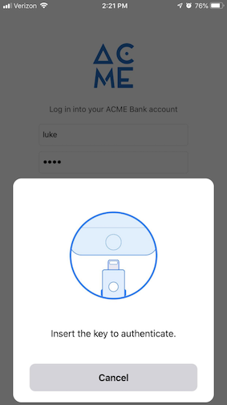
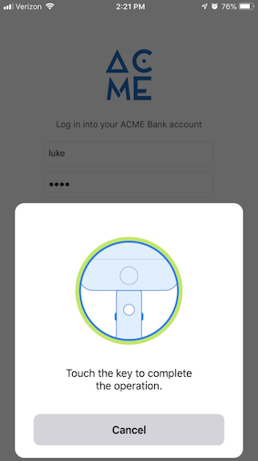
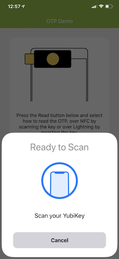

== App Registration Process
All iOS apps must be approved by Yubico and Apple in order to work with the YubiKey 5Ci. Apple requires all iOS apps that communicate with Apple-approved Made for iPhone/iPod/iPad (MFi) devices to be registered with Apple. 

Below you will find the guidelines and process for an Apple application developer to register an iOS app for approval that has completed the Yubico iOS SDK integration.

NOTE: This process is not required for Android applications.

=== Approval Process

The <<Actions Required By You,Actions Required By You>> section provides detailed instructions for each step in the approval process. Submitting an app to the App Store without the Yubico 5Ci MFi PPID will result in rejection from Apple.

=== UI Components for YubiKey iOS Apps
Download the https://github.com/Yubico/yubikit-ios/releases[SDK.zip] file for a list of free-to-use example assets for use in your YubiKey-enabled iOS application. Under the extracted folder: 

- Waiting for NFC scan Swift components can be found under: YubiKitDemo/YubiKitDemo/UI/OTP/Views/.

- Lightning animation Swift components can be found under: YubiKitDemo/YubiKitDemo/UI/SharedUI/Lightning/.

=== App Design and Functional Guidelines
YubiKey-enabled iOS apps must be built using the latest version of the iOS SDK and conform to https://developer.apple.com/app-store/review/guidelines/[Apple’s iOS Developer Program guidelines].

For approval, the app must meet the following guidelines:

 - Stability: The app will not freeze, crash, rapidly drain battery, or put unnecessary strain on device resources. 
 - User Experience: The app must communicate YubiKey status to users in an acceptable fashion determined by Yubico.
   * Insert YubiKey 5Ci Animation Guideline
    ** If a YubiKey has not yet been inserted while the app is in use, display the insert key animation.
  

   * Touch YubiKey 5Ci Animation Guideline
    ** If the YubiKey is inserted when the app requests an operation, display the touch key animation. 
  

   * Waiting for NFC Scan Guideline
    ** If the app is waiting to communicate over NFC, display a “Ready to Scan” animation and image to guide the user to the appropriate location to hold the key near. &nbsp; &nbsp; &nbsp; &nbsp; &nbsp;
  
 
 - Quality: The app will provide a user experience that does not diminish the users’ perceived quality of the YubiKey and its performance.
   * Test all features that interact with the YubiKey functionality before registering an app for review. See features below that may be verified by Yubico for quality if applicable.  
 - Brand: The app must follow the Yubico usage guidelines when presenting the Yubico image or logo.
   * See https://www.yubico.com/press/images/ for usage guidelines.

=== [[Actions Required By You]]Actions Required By You

1. Register App with Yubico - Register your app by filling out our link:/Software_Projects/Mobile_SDK/Register_Your_App/[Yubico App Registration Form]. Include the following:
a. Name of the app as it will appear in the App Store
b. App version
c. Bundle identifier
d. Description of the iOS app, including a general functional overview of the software and its key features
2. Yubico Review - Once you have registered your app information with Yubico, you will need to share the app with Yubico via https://help.apple.com/app-store-connect/#/devdc42b26b8[Apple’s TestFlight]  and add Yubico as an https://help.apple.com/app-store-connect/#/devb8f497c5e[External Tester] for testing and review.
Yubico’s Integration Program will review the app according to the above guidelines and respond with an approval decision or request for changes. If the app is not approved, you will receive a response with the reason and request for modifications (if any) to your app before registering the app for approval again. 
3. Get MFi PPID - No action is required by you in this step. Yubico will follow the Apple MFi process to register your app with the YubiKey 5Ci product plan. The Integration Program will send you the Product Plan ID (PPID) when the process is complete. This process usually takes about one week, but it may take two weeks due to holidays, busy seasons, or other delays beyond our control.
4. App Store Review - Follow the normal registration process for your application to be included in the App Store.  Enter the nine digit YubiKey 5Ci MFI PPID in Review Notes field (Optional) of the App Review Information. 

(For example, YubiKey 5Ci MFI PPID: ######-####) 

Apple will then approve or reject your app submission independently of Yubico. For quick approval, be sure to follow Apple’s guidelines.

a. Apple’s App https://developer.apple.com/app-store/review/[Review Page] and https://developer.apple.com/app-store/review/#common-app-rejections[Common App Rejections Page]

b. https://developer.apple.com/app-store/review/guidelines/[App Store Review Guidelines for iOS Apps]

c. https://developer.apple.com/design/human-interface-guidelines/ios/overview/themes/[Human Interface Guidelines for iOS]

Please note that Yubico reserves the right to remove apps from its whitelist at any time, in our sole discretion, including but not limited to if apps no longer adhere to Yubico’s guidelines.

Contact For questions or comments not covered by this document please open a https://support.yubico.com/support/tickets/new[developer support ticket].

This information may evolve as Apple changes their policies. Please check back frequently before you complete your app to verify adherence to the latest process and guidelines.

=== Tips & Tricks
 - Watch Apple’s https://developer.apple.com/videos/play/app-store-connect/101/[TestFlight video] if you’re new to TestFlight.
 - Submitting an app to the App Store without the Yubico 5Ci MFi PPID will result in rejection from Apple.

All product names, logos, and brands are property of their respective owners. Yubico, YubiKey, and the “Y” logo are trademarks of Yubico AB and its affiliates, registered or used in many jurisdictions worldwide.

