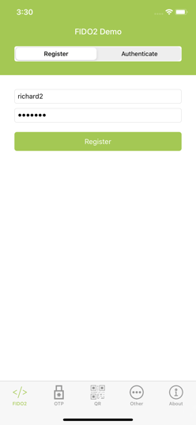
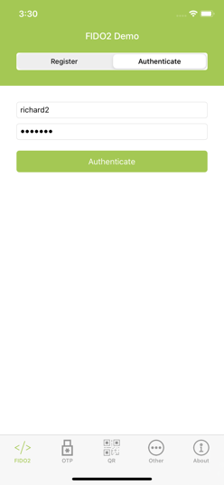

== *WebAuthn Walkthrough for iOS*

This is a walkthrough of the iOS client-side implementation of WebAuthn
using the Yubico https://github.com/Yubico/yubikit-ios/tree/master/YubiKitDemo/YubiKitDemo[YubiKit Demo] included with the https://github.com/Yubico/yubikit-ios[Yubico iOS SDK].

There are really two parts to WebAuthn, *1.* The communication between
the client (native iOS application or web browser) and the server as
described by the https://www.w3.org/TR/webauthn[WebAuthn
specifications] and *2.* The communication between the client (native
iOS application or web browser) and the authenticator (e.g. YubiKey 5Ci)
as described by the
https://fidoalliance.org/specs/fido-v2.0-id-20180227/fido-client-to-authenticator-protocol-v2.0-id-20180227.html[CTAP2 protocol] (Client-To Authenticator Protocol version 2).

This article provides a walkthrough of the communication between a
native iOS app and a YubiKey 5Ci key as our authenticator plugged into
an iPhone via the Apple Lightning connector.

== *WebAuthn*

The Web Authentication API (WebAuthn) enables strong first factor (passwordless)
and multi-factor authentication built on public key cryptography using
hardware devices like security keys, mobile phones, and other devices
with built-in authenticators. Learn more https://developers.com/WebAuthn[here].

== *WebAuthn/FIDO2 Flow*

The WebAuthn (Web Authentication API) flow can be separated into two
main parts, *registration* and *authentication*. I’ll cover each part
and dive into the iOS Swift functions responsible for handling this
flow, which involves talking to the YubiKey and the WebAuthn server.

In a password-based user registration flow, a server will typically
present a form to a user asking for a username and password. The
username/password would be sent to the server for storage and the
password becomes the user credential. In WebAuthn, a server still binds
a user to a credential, but this credential is known as a private-public
keypair.

In the WebAuthn scenario, instead of asking for a username and password,
the registration process involves the server (also known as a “Relying
Party” (RP)) asking the user to create a new keypair as the WebAuthn
credential.

=== *YubiKitManager*

Before we get started with Registration and Authentication, it’s
important to know about the YubiKitManager and Key Sessions within
YubiKit for iOS.

YubiKit (the Yubico SDK for iOS that the demo app is using) provides the
majority of its functionality through a single instance called
YubiKitManager which is retrieved by accessing the
_YubiKitManager.shared_ property. [.underline]#YubiKitManager is a
singleton# structured to provide a list of _sessions_, each one of them
being dedicated to only one type of communication. For example, in the
FIDO2 scenario, we’ll be dealing with *keySession.sessionState* for
tracking the session state of the YubiKey (closed, closing, open, and
opening) and *keySession.fido2Service.keyState* for tracking the state
of FIDO2 implementation (idle, processingRequest, and touchKey). The
property of the fido2Service.keyState should be access based on the
keySession__.__sessionState of the YubiKey.

Your project will be much easier to complete if you add the two class
and .xib file from the

https://github.com/Yubico/yubikit-ios/tree/master/YubiKitDemo/YubiKitDemo/UI/SharedUI/MFIKeyActionSheet[MFIActionSheet
folder] of the demo to your project as these classes handle all the
keySession state and dialog communication (w/ animation) for the user to
take action, like ‘touch’ key during the user presence stage.

Once you add those classes to your project, you can then extend those
classes from the active view controller to monitor the keySession.

== *Registration*

[.underline]#Use Case#: The user wants to create a new account with
_organization X_ via their mobile app.

Remember earlier, we talked about using WebAuthn for *passwordless* or
*multi-factor* authentication? In the demo app, we’ll be sending a
username + password to create a new account and using the WebAuthn API
server (defaults to https://demo.yubico.com) to set up multi-factor
authentication using our security key.

Using the Demo App, YubiKit provides the FIDO2 support through a single
shared instance of _fido2Service_ (of type _YKFKeyFIDO2Service_) which
is a property of _YKFKeySession_. The FIDO2 service will receive
requests and dispatch asynchronous calls to the YubiKey.

All the action starts in the
https://github.com/Yubico/yubikit-ios/blob/master/YubiKitDemo/YubiKitDemo/UI/FIDO2/FIDO2ViewController.swift[FIDO2ViewController.swift]
class and the entire registration phase spans three functions:

*Remember*: Before we interact with the YubiKey, we first need to start
the keySession and monitor the state of the key by extending the
https://github.com/Yubico/yubikit-ios/blob/master/YubiKitDemo/YubiKitDemo/UI/FIDO2/FIDO2ViewController.swift#L17[MFIKeyInteractionViewController]
class and implementing the
https://github.com/Yubico/yubikit-ios/blob/master/YubiKitDemo/YubiKitDemo/UI/FIDO2/FIDO2ViewController.swift#L109[keySessionStateDidChange]
and the
https://github.com/Yubico/yubikit-ios/blob/master/YubiKitDemo/YubiKitDemo/UI/FIDO2/FIDO2ViewController.swift#L133[fido2ServiceStateDidChange]
functions.

=== *#1 Request Registration*

User wants to create (aka “Register”) a new account with organization X
using basic auth (username/password).

Check out
https://github.com/Yubico/yubikit-ios/blob/master/YubiKitDemo/YubiKitDemo/UI/FIDO2/FIDO2ViewController.swift#L144[requestRegistration()]

=== *#2 Handle Registration*

This is the callback function (from \#1 Request Registration) that
handles the response data (as an _WebAuthnRegisterBeginResponse_ object)
received from the authentication WebAuthn RP server. The object contains
a
https://w3c.github.io/webauthn/#dom-publickeycredentialcreationoptions-challenge[challenge],
information about the
https://w3c.github.io/webauthn/#dom-publickeycredentialcreationoptions-user[user],
the Relying Party ID
(https://w3c.github.io/webauthn/#rp-id[RP ID]), desired
https://w3c.github.io/webauthn/#dom-publickeycredentialcreationoptions-pubkeycredparams[type
of credential], the
https://w3c.github.io/webauthn/#dictdef-authenticatorselectioncriteria[authenticator
selection criteria] (cross-platform, user verification, and resident
key requirements) and
https://w3c.github.io/webauthn/#attestation-conveyance[attestation
preference#].

The
https://github.com/Yubico/yubikit-ios/blob/master/YubiKitDemo/YubiKitDemo/UI/FIDO2/FIDO2ViewController.swift#L200[_[.underline]#handleRegistration(...)#_]
function takes the _WebAuthnRegisterBeginResponse_ object and builds a
_makeCredentialRequest_ to be executed by the YubiKey.

Before sending the request, we first need to
https://github.com/Yubico/yubikit-ios/blob/master/YubiKitDemo/YubiKitDemo/UI/FIDO2/FIDO2ViewController.swift#L238[instantiate
the fido2Service] handled by the YubiKitManager. The fido2Service
manages the key state during the registration and authentication FIDO2
ceremony and determines when to prompt the user to touch the key for
user presence and track the request. We can then finally call
https://github.com/Yubico/yubikit-ios/blob/master/YubiKitDemo/YubiKitDemo/UI/FIDO2/FIDO2ViewController.swift#L241[fido2Service.execute(makeCredentialRequest]
requesting the YubiKey to create the public keypair.

Checkout
https://github.com/Yubico/yubikit-ios/blob/master/YubiKitDemo/YubiKitDemo/UI/FIDO2/FIDO2ViewController.swift#L200[
handleRegistration(…)]

=== *#3 Finalize Registration*

In this step, we just send back the YubiKey credential object
_YKFKeyFIDO2MakeCredentialResponse_ as an
https://w3c.github.io/webauthn/#dom-authenticatorattestationresponse-attestationobject[Attestation
Object] to the WebAuthn server for validation. The attestation object
contains both
https://w3c.github.io/webauthn/#authenticator-data[authenticator
data] and an
https://w3c.github.io/webauthn/#attestation-statement[attestation
statement].

Checkout
https://github.com/Yubico/yubikit-ios/blob/master/YubiKitDemo/YubiKitDemo/UI/FIDO2/FIDO2ViewController.swift#L258[finalizeRegistration(…)]

At this point, the iOS user has basic auth (username + password) and
WebAuthn credentials as a form of 2FA and can authenticate with the
authentication server using username + password + FIDO2 as a form of
two-factor authentication.

== *Authentication*

[.underline]#Use Case#: The same user wants to authenticate with basic
auth (username + password) and use their registered YubiKey (we
registered this YubiKey in the previous Registration phase) for
multi-factor authentication.

Again, we’ll follow along with the Demo app provided by the YubiKit for
iOS.

All the action remains in the
https://github.com/Yubico/yubikit-ios/blob/master/YubiKitDemo/YubiKitDemo/UI/FIDO2/FIDO2ViewController.swift[
FIDO2ViewController.swift class] and the entire authentication phase
also spans three functions:

=== *#1 Request Authentication*

This step performs basic authentication (username + password) for the
user to authenticate with organization X via their iOS app. No
keySession state or FIDO2 service for this method as it’s simply doing
basic auth.

Checkout
https://github.com/Yubico/yubikit-ios/blob/master/YubiKitDemo/YubiKitDemo/UI/FIDO2/FIDO2ViewController.swift#L283[
requestAuthentication(...)]

=== *#2 Handle Authentication*

This function handles the challenge response from the WebAuthn server
after the user successfully authenticated with their username +
password.

During FIDO2 authentication, the user now needs to prove that they own
the private key they registered by providing an assertion, which is
retrieved from the YubiKey.

This function is responsible for getting the Assertion request
_WebAuthnAuthenticateBeginResponse (as a PublicKeyCredentialRequestOptions) provided by the WebAuthn server. The WebAuthnAuthenticateBeginResponse contains a [challenge], [allowedCredentials], and a [timeout].

The function then builds a
https://github.com/Yubico/yubikit-ios/blob/master/YubiKitDemo/YubiKitDemo/UI/FIDO2/FIDO2ViewController.swift#L343[getAssertionRequest]
based on the _WebAuthnAuthenticateBeginResponse_ and calls
fido2Service.execute(getAssertionRequest) to retrieve the credential
(from the YubiKey) generated during registration with a signature
included.

Again, before performing any FIDO2 commands, we’ll want to make sure the
https://github.com/Yubico/yubikit-ios/blob/master/YubiKitDemo/YubiKitDemo/UI/FIDO2/FIDO2ViewController.swift#L290[keySession
state] is OPEN and we
https://github.com/Yubico/yubikit-ios/blob/master/YubiKitDemo/YubiKitDemo/UI/FIDO2/FIDO2ViewController.swift#L373[instantiate
the fido2Service] if the keySession is OPEN.

Checkout
https://github.com/Yubico/yubikit-ios/blob/master/YubiKitDemo/YubiKitDemo/UI/FIDO2/FIDO2ViewController.swift#L339[
handleAuthentication(…)]

=== *#3 Finalize Authentication*

This function is the callback from
_fido2Service.execute(getAssertionRequest)_ which is the response from
the YubiKey and passes those results to the WebAuthn server for
validation.

Checkout
https://github.com/Yubico/yubikit-ios/blob/master/YubiKitDemo/YubiKitDemo/UI/FIDO2/FIDO2ViewController.swift#L393[
finalizeAuthentication(…)] 

Once the server responds OK, we are now authenticated.

== *Final Thoughts*

In addition to the *registration* and *authentication* functionality,
the demo also provides examples for handling
https://github.com/Yubico/yubikit-ios/blob/master/YubiKitDemo/YubiKitDemo/UI/FIDO2/FIDO2ViewController.swift#L421[PIN verification] when user verification is required
during
https://github.com/Yubico/yubikit-ios/blob/master/YubiKitDemo/YubiKitDemo/UI/FIDO2/FIDO2ViewController.swift#L457[[.underline]#registration#]
or
https://github.com/Yubico/yubikit-ios/blob/master/YubiKitDemo/YubiKitDemo/UI/FIDO2/FIDO2ViewController.swift#L479[[.underline]#authentication#].

I hope this provides a good starting point for you to implement WebAuthn
on iOS for multi-factor authentication.

== *Resources*

https://github.com/Yubico/yubikit-ios[Yubico iOS SDK]

https://www.w3.org/TR/webauthn/[WebAuthn Specification]
