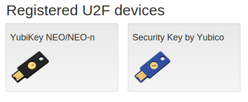

== Attestation and metadata

=== Attestation certificates
In both a U2F and WebAuthn registration, an Authentication device gives the 
server its attestation certificate. This certificate can be (optionally) used 
to verify the authenticity of the device. For example, a banking site might wish 
users to be able to provide their own U2F or WebAuthn devices for two-factor authentication, 
but only wishes to allow devices of certain approved vendors. For other sites it 
might be more about being able to provide some useful device information to the 
user, when listing his or her registered devices.

It's up to each U2F/WebAuthn device vendor to decide what type of information goes into
the attestation certificates, and how the authenticity of a certificate is
validated. In Yubico's case, all our attestation certificates are signed by
link:/u2f/yubico-u2f-ca-certs.txt[our root CA]. The same attestation certificate is used for both U2F and WebAuthn.

NOTE: If you have a YubiKey Preview device, the attestation certificate will
instead be signed by our link:/u2f/fido-preview-ca-cert-2023.pem[2023Yubico FIDO Preview CA] or link:/u2f/fido-preview-ca-cert.pem[Yubico FIDO Preview CA (prior to 2023)].

=== Yubico's metadata format

NOTE: This is not part of the U2F standard.

The attestation certificates are often small, and do not contain much
information about the device model itself. For this reason Yubico has specified a
metadata format which allows mapping attestation certificates to additional
information about the device model and vendor, providing product images, etc.
Yubico provides such metadata about our devices
link:/u2f/yubico-metadata.json[here]. Several of our
link:/Software_Projects/FIDO_U2F/U2F_Server_Libraries/[U2F server libraries]
are capable of reading this format. The same attestation certificate is used for both U2F and WebAuthn.

