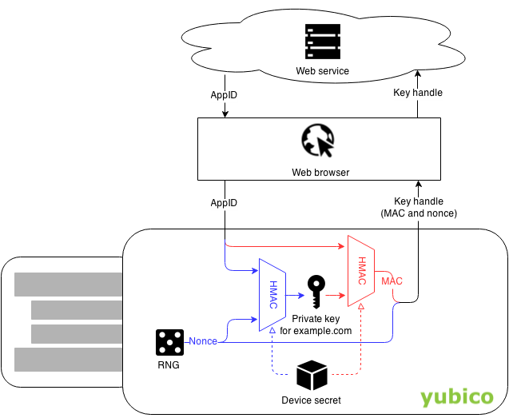

== Key generation

A U2F device should generate a new http://en.wikipedia.org/wiki/Elliptic_curve_cryptography[ECC] key pair for each service it registers with. When authenticating, the device should use the previously generated key for that service. This is trivial, but gets more complex as we add more requirements:

=== Initial requirements
Without any additional requirements, all we need is a key-value store on the device.

[source, php]
----
example.org => [Key for example.org]

acme.com => [Key for acme.com]

----

=== Multiple keys per service
We want to allow devices to store multiple keys per service. For example, a user might have more than one GMail accounts.
To solve this, we associate each key with a _key handle_ instead of with a service. During registration, the device sends a key handle which is kept by the service. When authenticating, the service sends the key handle back to the device.

[source, php]
----
KeyHandle[0x21AE9B] => [Key 1 for example.org]

KeyHandle[0xFBD308] => [Key 2 for example.org]

KeyHandle[0x18C77B] => [Key 1 for acme.com]
----

=== Limited storage on device
For a U2F device with lots of (tamper-resistant) storage, the above implementation would work. Unfortunately, this would make devices more expensive. However, since U2F does not specify how to store keys, we are free to come up with another solution -- so we did:

.Key generation scheme used by Yubico U2F devices

When a user registers one of our U2F devices with a new service, the service provides an AppID (this is tied to the URL of the site and prevents phishing). The U2F device generates a nonce, N. We then take the AppID and the Nonce and run them through http://en.wikipedia.org/wiki/Hash-based_message_authentication_code[HMAC-SHA256] (a one-way keyed function), using a device-specific secret as the key. This device-specific key is generated on-chip at the time of manufacturing (just like the master key would be, if we were using regular key wrapping). The output of the hash function becomes the private key, and the http://en.wikipedia.org/wiki/Cryptographic_nonce[nonce], together with a abbr:MAC[Message Authentication Code], becomes our key handle. During authentication, the MAC helps to ensure that a key handle is only valid for the particular combination of device and AppID that it was created for during registration.
