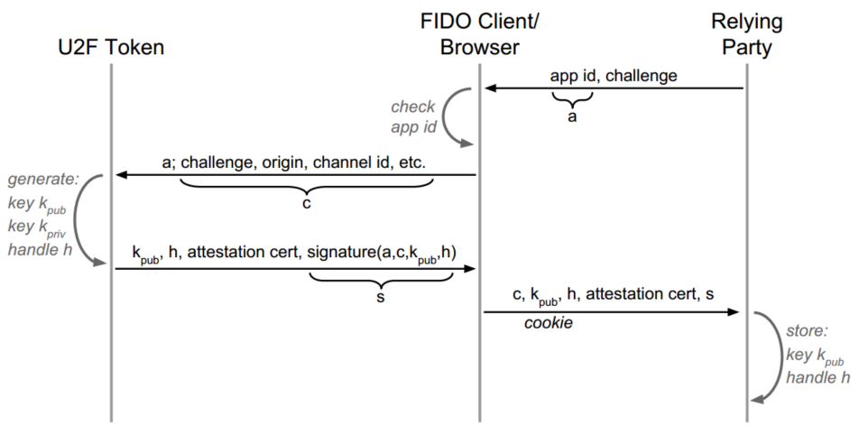

== U2F Technical Overview
U2F is based on simple challenge-response, but adds some things on top:

Attestation::
	For relying parties to be able to verify token properties, such as token model. This adds:
	* Attestation certificate
	* Attestation certificate signatures

Application isolation::
	To make phishing and man-in-the-middle attacks impossible. This adds:
	* App ID
	* TLS Channel ID (optional)
	
Privacy::
	To make it impossible for relying parties to track tokens between different user accounts. This adds:
	* Key generation
	* Key handle
	

=== Registration

. The relying party sends a challenge and an link:/U2F/App_ID.html[App ID] to the client. 
. The client verifies that the App ID matches the HTTPS URL of the currently visited web page.
. The client sends the App ID and _c_, the Client Data, to the token.
.. To make the data sets more manageable for the device, the two data sets are actually hashed before being sent.
. The token link:/U2F/Protocol_details/Key_generation.html[generates a key pair] and a key handle, specifically for this App ID.
. The token sends the following back to the client:
.. The public key, along with its key handle.
.. The link:/U2F/Libraries/Advanced_topics.html[attestation certificate] of the device.
.. A signature, using the attestation certificate's private key, of:
... The App ID
... The Client Data
... The public key and the key handle
. The forwards what it got from the token, along with the Client Data, to the relying party.
. The relying party stores the public key and its key handle, associated with the user that made the U2F registration.
.. It may also optionally examine the attestation certificate, if attestation is of interest.

=== Authentication

