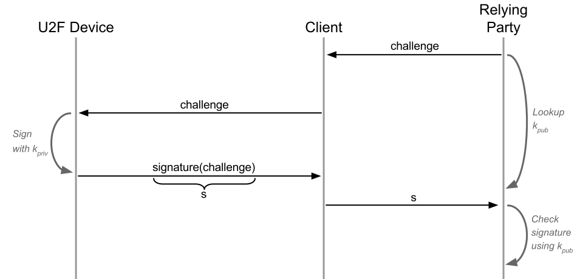
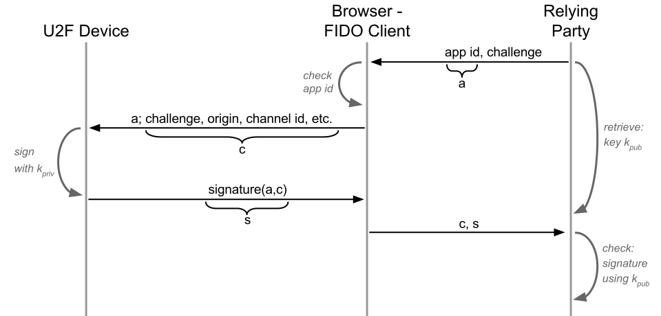
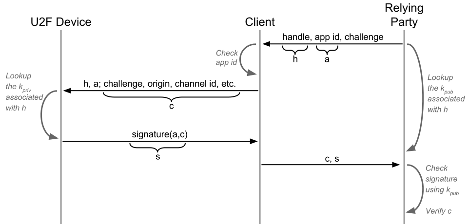
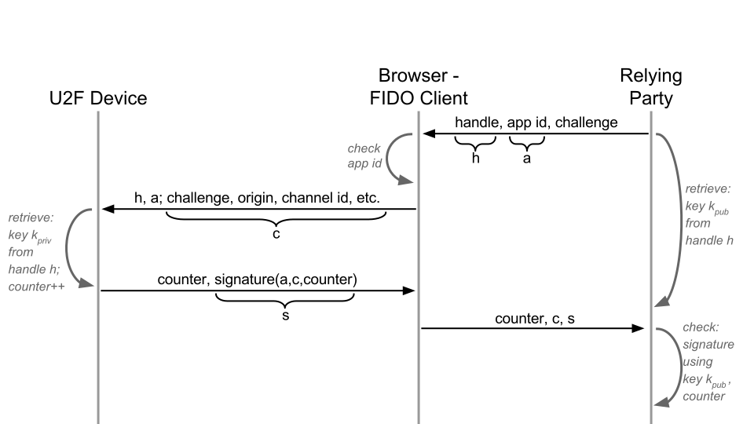
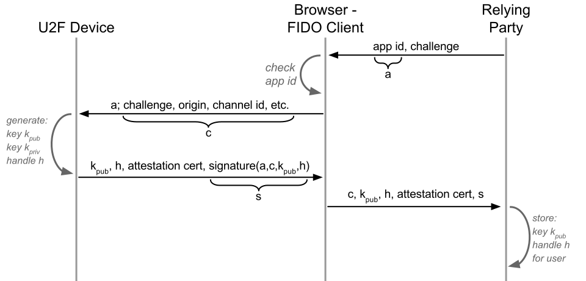

== U2F Technical Overview
U2F is a challenge-response protocol extended with _application isolation_, _application-specific keys_, _device cloning detection_ and _device attestation_. There are two flows: _registration_ and _authentication_.

=== 1. Challenge-response
We start out with a simple http://en.wikipedia.org/wiki/Challenge%E2%80%93response_authentication[challenge-response] authentication flow, based on http://en.wikipedia.org/wiki/Public-key_cryptography[public-key cryptography].
The U2F device has a private key _k~priv~_ and the abbr:RP[Relying Party] is given the corresponding private key _k~pub~_.
The key pair is generated in the device's 
http://en.wikipedia.org/wiki/Tamper_resistance#Chips[tamper-resistant]
execution environment, from where _k~priv~_ cannot leave.

=== 2. Application isolation
Application isolation is added to make phishing and man-in-the-middle attacks impossible.
The key concept is that web browser verifies the identity of the web site.

Additions to the authentication flow:

 * link:/U2F/App_ID.html[App ID] and origin
 * http://en.wikipedia.org/wiki/Transport_Layer_Security_Channel_ID[TLS Channel ID] (optional)
 

=== 3. Application-specific keys
Application-specific keys makes it impossible for relying parties to track devices between different user accounts.
This means that Example.com cannot know whether _User1_ and _User2_ shares the same device.

The U2F device generates a new key pair and key handle for each registration.
The handle is stored by the RP and sent back to the device upon authentication. This way, the device knows which key to authenticate with (e.g. _User1_'s key or _User2_'s key).

Additions to the authentication flow:

 * link:/U2F/Protocol_details/Key_generation.html[Key generation] on the device
 * Key handle, stored by the server together with _k~pub~_.
	

=== 4. Device cloning detection
As already mentioned, Yubico's U2F devices are tamper-resistant and _k~priv~_ cannot be read externally (at the very least not undetected). However, one can http://en.wikipedia.org/wiki/Tamper_resistance#Chips[never completely exclude the possibility of key compromise]. For this reason, an authentication counter is used to detect cloned devices.
The concept is simple: The device increments the counter when authenticating, and the RP verifies that the counter is higher than last time.

Additions to the authentication flow:

 * A counter, sent from the device to the RP.

=== 5. Device attestation
Attestation gives relying parties _the possibility_ to verify token properties, such as token model.
It is implemented via an attestation certificate, signed by the device vendor, that the device sends to the RP upon registration.
Attestation does not affect the authentication flow.

Additions to the registration flow:

 * link:/U2F/Libraries/Advanced_topics.html[Attestation certificate]

