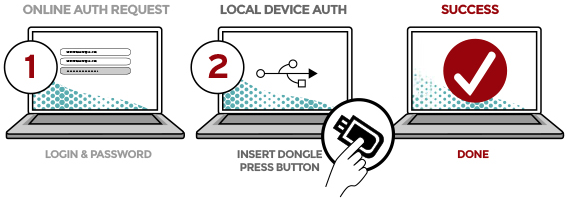

== What is U2F? ==
+++<abbr title="Universal 2nd Factor">U2F</abbr>+++ is an open 2-factor 
authentication standard that enables keychain devices, mobile phones and other 
devices to securely access any
number of web-based services – instantly and with no drivers or client software
needed. The U2F specifications were initially developed by Google, with
contribution from Yubico and NXP, and are today hosted by the
link:https://fidoalliance.org[FIDO Alliance].

Apart from the general advantages of 2-factor authentication, U2F has the following characteristics:

 - *No shared secrets*. Unlike for example OATH, U2F uses public key cryptography and uses no shared secrets.
 - *Anonymous*. New public keys are minted for each site. 
 - *Enhanced security*. Designed to protect against phishing and man-in-the-middle attacks.
 - *User experience*. There are no codes to enter and no drivers to install.
 - *Universal*. Devices can be of different types (hardware token, fingerprint reader, software token, etc.),
   communicate using different transports (USB,
   link:http://en.wikipedia.org/wiki/Near_field_communication[NFC],
   link:http://en.wikipedia.org/wiki/Bluetooth_low_energy[BLE])
   and can be registered to any number of sites.
 - *Open standard*.
 - *Backed by industry leaders* such as Google, Paypal, Microsoft, Bank of America, MasterCard and VISA.

This diagram explains the basic process flow of U2F:

++++

participant Token
participant Browser
Browser->Server: username and\npassword
Note over Server: verify username\nand password
Note over Server: generate U2F\nchallenge
Server->Browser: challenge (e.g. embedded\nin a HTML page)
Browser->Token: challenge
Note over Token: user touches\nbutton
Token-->Browser: response
Browser-->Server: response
Note over Server: verify response

++++

== Implementing ==
We provide three alternatives:

 * *Plugins for Content Management Systems* (CMS), such as Wordpress
   and Joomla. This should be the easiest alternative if you are using a supported CMS.
 * *link:/u2fval[Standalone validation server]* that your server can query using a simple REST API.
   This is ideal if you want to make as few changes as possible to your existing code and database.
 * *link:Libraries[Libraries for programming languages]*. With these, you have the 
   flexibility/burden to store and access U2F artifacts yourself.
   This is ideal if you don't want to deploy a standalone validation server.

pass::[]

== Useful Links ==

 - https://fidoalliance.org/specifications[U2F Specification]
 - http://demo.yubico.com/u2f[Yubico's U2F demo site]
