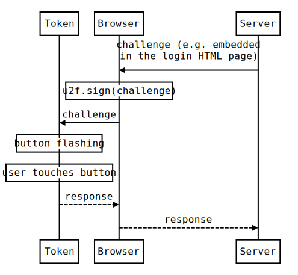

== U2F ==
=== What is U2F? ===
+++<abbr title="Universal 2nd Factor">U2F</abbr>+++ is a new, open 2-factor 
authentication standard that enables keychain tokens, mobile phones and other 
devices to securely access any
number of web-based services – instantly and with no drivers or client software
needed. The U2F specifications were initially developed by Google, with
contribution from Yubico and NXP, and are today hosted by the
link:https://fidoalliance.org[FIDO Alliance].

image:u2f_workflow.png[]

=== Adding client support ===
As shown in the diagram below, the main part of the client (web browser) is to
be a middle-man between the server and the hardware token.

////
Image generated using http://bramp.github.io/js-sequence-diagrams with input:

participant Token
participant Browser
Server->Browser: challenge (e.g. embedded\nin the login HTML page)
Note over Browser: u2f.sign(challenge)
Browser->Token: challenge
Note over Token: button flashing
Note over Token: user touches button
Token-->Browser: response
Browser-->Server: response
////

Below is an example snippet using JQuery. The `u2f` object is provided by browsers that supports U2F.

[source, javascript]
/* u2f-login.html */
var challenge = // From the server (e.g. this row could be dynamically generated by the server)
$("#u2f-modal-dialog").show(); // Prompt user to touch token button
u2f.sign([challenge], [], // Forward challenge to token
  function(tokenResponse) {
	$('#u2f-form-data').val(JSON.stringify(tokenResponse));
	$('#u2f-form').submit(); // Send token response back to server
  }
);

When registering a new token `u2f.register` is used instead of `u2f.sign`.

=== Adding server support ===
We provide three alternatives:

 * *link:foo[Plugins for Content Management Systems]* (CMS), such as Wordpress
   and Joomla. This should be the easiest alternative if you are using a supported CMS.
 * *Standalone validation server* that your server queries using a simple REST API.
   You can either use link:foo[Yubico's validation server cloud] or 
   link:foo[host a validation server yourself].
 * *link:foo[Libraries for programming languages]*. With these, you have the 
   flexibility/burden to setup HTTP endpoints for U2F and implement storage of U2F
   yourself.
