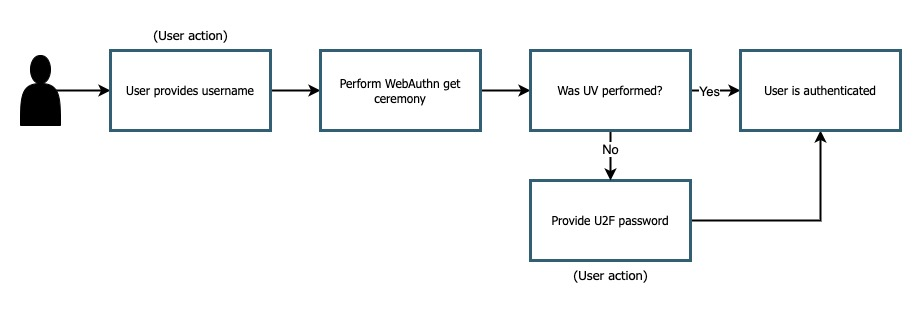

== Adding an additional authentication factor implementation guidance

Most FIDO2 authenticators come packaged as two authentication factors: something you have (which is typically the authenticator), and either a something you know (like a device PIN), or something you are (like a biometric scanner). There are some legacy CTAP/U2F authenticators that are backwards compatible with WebAuthn, but are typically missing the something you know or something you are factor, often referred to as ‘user verification’ (UV).  The guidance given on this page will teach you how to implement an additional factor through your application for users missing UV on their authenticators.

This scenario works best when:

* You want to give your users a passwordless experience and also support legacy CTAP/U2F authenticators

=== User Experience

Figure 1 demonstrates a sample user experience for a registration process that implements an additional factor for users who did not perform UV.

**Figure 1**

In this article we will refer to this not just as a password, but as a U2F password. This is because it is acting as a stand-in for the missing UV functionality on legacy U2F devices. 

The ideal happy path will be from a user who performs UV, no additional action will be needed from them. A user who attempts to register with a device that lacks UV means that they will have an additional step.

One crucial note is that the user's account is not phishable by a compromised U2F password. The authenticator still acts as the primary authentication mechanism, so their accounts are not compromised unless an attacker holds both the authenticator and U2F password.

It’s worth noting again that even though there are pain points for specific classes of users, they still get to benefit from the security of a WebAuthn protected account, at the cost of performing an action (typing a password) that they are already familiar with.

=== Implementation guidance

==== Front end implementation

In order to implement this on your client application you will need to add some components to your existing registration flow. These components will:

* Detect if UV was performed
* Deploy a modal to prompt for U2F password creation if UV was not performed

==== Registration method

Figure 2 demonstrates a standard registration method for registering a new credential in your client application

[role="dark"]
--
[source,javascript]
----
function createCredential(){
 // Ask RP for PublicKeyCreationOptions
 const startRegistrationResponse = await axios.post(
   "/users/credentials/fido2/register"
 );
 
 const publicKey = {
   publicKey:
     startRegistrationResponse.data.publicKeyCredentialCreationOptions,
 };
 
 // create method using @webauthn-json
 const makeCredentialResponse = await create(publicKey);
 
 // Detect if UV was performed
 const uv = getUVFromAttestation(
   makeCredentialResponse.response.attestationObject
 );
 
 const challengeResponse = {
   credential: makeCredentialResponse,
   requestId,
   u2fPasswordCode: defaultInvalidU2FPassword,
 };
 
 if (uv === true) {
   await credentialService.registerFinish(challengeResponse);
 } else {
   const uvPin = await requestUV(challengeResponse);
   challengeResponse.pinCode = uvPin;
   await credentialService.registerFinish(challengeResponse);
 }
}
----
--
**Figure 2**

There are two important parts to note in this method. The first is the `getUVFromAttestation()` method. This method will be covered in the following section. The next point of interest to note is the conditional section at the bottom of the code sample. If it’s determined that UV was performed, then you may call the `registerFinish()` method which will send the new credential to the relying party.

If UV was not performed, you will need to implement another step. The `requestUV()` method should invoke a UI modal (or any kind of user prompt) where the user will provide a U2F password. Once complete the U2F password should be returned back to the `createCredential()` method. It should be sent to the `registerFinish` method, along with the credential created during the WebAuthn ceremony.

==== Detecting UV

In this section we are going to detail the `getUVFromAttestation()` method above. Note that this method can be used for both registration and authentication ceremonies, this example will focus on the registration use case. 

Figure 3 demonstrates the logic of `getUVFromAttestation` in order to determine if UV was given during the WebAuthn ceremony. 

[role="dark"]
--
[source,javascript]
----
function getUVFromAttestation(attestationObject) {
 const attestationBuffer = base64url.toBuffer(attestationObject);
 const attestationStruct = cbor.decodeAllSync(attestationBuffer)[0];
 const buffer = attestationStruct.authData;
 
 return getUV(buffer);
}
 
function getUV(buffer) {
 const flagsBuf = buffer.slice(32, 33);
 const flagsInt = flagsBuf[0];
 const flags = {
   up: !!(flagsInt & 0x01),
   uv: !!(flagsInt & 0x04),
   at: !!(flagsInt & 0x40),
   ed: !!(flagsInt & 0x80),
   flagsInt,
 };
 return flags.uv;
}

----
--
**Figure 3**

Below are the steps that are occurring above in detail.

The first step is to decode the `attestationObject` that was created during the registration ceremony. The `attestationObject` contains the authenticator data object, which includes a flag that indicates if UV was performed on the device. 

You will pass in the attestation statement to a second method, `getUV()`. This method will perform a bitwise operation in order to evaluate the specific UV flag, which is found on bit 2. If the value is 1 then UV was performed, a value of 0 indicates otherwise. 

You can also use this method to identify if other flags were present such as user presence (ex. When you tap a YubiKey), if the authenticator added attested credential data, and if the authenticator data has extensions.

Figure 4 gives an overview of how the flags are arranged in the Authenticator Data objects

image::../images/addfact2.jpg[]
**Figure 4**

An in depth explication of the flags used to detect UV can be found in the link:https://www.w3.org/TR/webauthn-2/#sctn-authenticator-data[Authenticator Data section of the WebAuth spec] 

==== Backend Implementation

This implementation will be specific to whichever ecosystem, and identity provider that you leverage in your environment. Below we will provide an example of logic that you can leverage in order to validate user supplied U2F passwords in your application.

The example below is leveraging Node.JS running on AWS Lambda, and verifying against an RDS database of U2F password.

Figure 5 demonstrates example logic to verify if a PIN provided during registration was correct.

[role="dark"]
--
[source,javascript]
----
//Verify if U2F password if UV = false
// getUV should leverage the same logic used above to determine if UV was performed
if(!getUV(jsonBody.credential.response.attestationObject)) {
	// Check your database of user U2F passwords to see if a user has a password registered
  let u2fPasswordHash = await dbUtil.getU2FPassword(userName);
  if(u2fPasswordHash) {
    // A U2F password was found, attempt to verify if it is correct
    var isU2fPasswordVerified = false;
        
    // Check to see if client provided the U2F passwords along with assertionResponse
    let u2fPasswordAnswer = parseInt(jsonBody.u2fPassword) || defaultInvalidU2FPassword;
        
    // Ensure that the U2F password follows your applications requirements
    const u2fPasswordResult = validate({u2fPassword: u2fPasswordAnswer.toString()}, constraints);
    if(!u2fPasswordResult){
      // Ensure that the provided U2F passwords matches the one registered to the user
      isU2fPasswordVerified = await verifyU2FPasswordCode(userName, u2fPasswordAnswer.toString());
    }
        
    if(!isU2fPasswordVerified){
        let err = "The provided U2F Password was incorrect. Please attempt again.";
        return error(err);
    }          
  } else {
    // No U2F password was found, attempt to register a new PIN for the user
    let u2fPasswordAnswer = parseInt(jsonBody.u2fPassword) || defaultInvalidU2FPassword;

    // Ensure that the U2F password follows your applications requirements
    const u2fPasswordResult = validate({pin: u2fPasswordAnswer.toString()}, constraints);
    if(u2fPasswordResult){
        let err = "U2F Password does not meet validation requirements. ";
        return error(err);
    }
  
    let userId = await dbUtil.getUserIdFromUserName(userName);
    let hash = await bcrypt.hash(u2fPasswordAnswer.toString(), saltRounds);
    let result = await dbUtil.insertU2fPassword(userId, hash);
  }  
}
----
--
**Figure 5**

[NOTE]
====
You should leverage the same patterns above for authentication ceremonies. The same rules will continue to apply such as:

* Detecting if UV was performed
* Deploying a modal for U2F password authentication
* Verifying the U2F password once you send it back to your RP
====

This flow will allow you to add additional authentication factors in your application. Click below to return to the authenticator management guidance. 

link:/WebAuthn/Concepts/Authenticator_Management/Use_Cases_and_Scenarios.html[Return to the WebAuthn Authenticator Management guide]