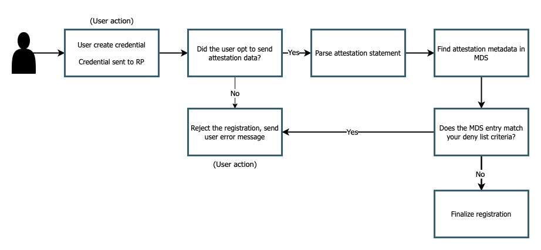

== Deny list implementation guidance

A deny list is a curated list of authenticators that should **not** be allowed to register and authenticate to your application. Any authenticator that is not part of your curated list should be allowed to register. This scenario works well for applications that want a degree of control to prevent vulnerable authenticators from being used in the application. The guidance given on this page will teach you how to implement a deny list in your application, that will limit certain authenticators from registering.

This scenario works best when:

* You want to prevent users from registering authenticators with certain properties, e.g. authenticators that can create copyable aka multi-device passkeys
* Your organization has decided not to trust certain authenticator manufacturers
* You want your application to automatically remediate rather than send user alerts for authenticators with vulnerabilities

=== User experience

Figure 1 demonstrates a sample user experience for a registration process that implements an deny list

**Figure 1**

In this flow the happy path comes from a user who immediately opts into sending attestation data, and ensuring that they are using an authenticator that is not part of your curated deny list.

It’s worth noting that in this experience most of the logic/decision points are left up to the application, with little intervention from the user, aside from creating the initial registration, and reacting to any request rejections.

[NOTE]
====
One major decision point you need to make is whether or not to accept untrusted attestation. The flow above assumes that a user is sending an attestation statement along with their registration, and that it belongs to a trusted authenticator. If your application is aiming to be highly permissive then it may not always be beneficial to require your user to send an attestation statement. If you don’t require attestation it’s possible that a user registers with a vulnerable device, but it’s not detected due to the attestation statement not being sent.

If the deny list is for a consumer facing/low assurance application then it might be fine to allow users to opt out of the need to send attestation.

If the deny list is for an application that requires a high level of authentication assurance then you should always require the user to send attestation in order to establish the make/model of the device. This will also work well for scenarios where you want to prevent copyable passkeys from being used in your application
====

Here are some considerations for this flow:

* Ensure that your users know to allow for attestation data to be sent during the registration ceremony, this can be done by modals, tipboxes, or instructions on your client application
* Ensure that users know which of their authenticators to use for the application
* Ensure error messages accurately reflect the issue at hand so that user has a better chance to self remediate

=== Prerequisites
Before you attempt to follow this implementation guidance, ensure that you have added the MDS to your application. Guidance for adding MDS to your application can be found on our page, link:/WebAuthn/Concepts/FIDO_Metadata_Service_(MDS).html[FIDO Metadata Service (MDS)]

Our examples also leverage Yubico’s java-webauthn-server; a server side library for Java that provides features to help you implement a WebAuthn relying party. Some of the methods used below will come directly from this library.

link:https://github.com/Yubico/java-webauthn-server[Link to the java-webauthn-server]

=== Implementation guidance

==== Allow only trusted attestation

One immediate modification will be needed from the code introduced in the MDS guidance linked above. In this flow you should opt to **only** accept registrations from trusted attestation sources. This means that any registration sent to your application must include an attestation statement. If a user opts not to send an attestation statement, then their registration must be rejected. A user request may also be rejected if the authenticator they are using is not included in the MDS.

To achieve this using the java-webauthn-server, ensure that you set `allowUntrustedAttestation()` to `false`. This will ensure that any registration sent without an attestation statement, or an attestation statement not found in the MDS is rejected. 

Figure 2 demonstrates how you should initialize your `RelyingParty` object in your application, using `false` for `allowUntrustedAttestation()`

[role="dark"]
--
[source,java]
----
RelyingParty rp =RelyingParty.builder()
  .identity(/*... */)
  .credentialRepository(/*... */)
  .attestationTrustSource(mds)
  .allowUntrustedAttestation(false);
  .build();
----
--
**Figure 2**

Rejecting untrusted attestation will also help when attempting to block copyable passkeys. This is due to the fact that the copyable passkey implementations announced from Microsoft, Apple, and Google will not send attestation data during registration. By this logic, if you block any credential missing attestation data, then there’s a good chance that you’re blocking a copyable passkey.

==== Deny specific authenticators

Next up is to create a list of the authenticators that you want to deny from registering in your application. There are a few different identifiers that you can use from a metadata statement, but your two safest bets will be by AAGUID or the attestation root certificate. In this example we are going to leverage the AAGUID as the device identifier. An AAGUID is the unique identifier given to every authenticator in the MDS.

link:https://support.yubico.com/hc/en-us/articles/360016648959-YubiKey-Hardware-FIDO2-AAGUIDs[AAGUID mappings for Yubikeys can be found in this support article]. For non YubiKey AAGUIDs you can search the MDS manually or work with your authenticator manufacturer to find your specific AAGUIDs. 

For this example we are going to be leveraging the AAGUID for the YubiKey 5Ci, and YubiKey 5NFC.

You can declare this list in a variety of different ways, in this example we will declare it as an `ArrayList` of strings.

Figure 3 demonstrates how to declare a new array with your curated list of AAGUIDs.

[role="dark"]
--
[source,java]
----
private final ArrayList<String> aaguids = 
  new ArrayList<String>(
    Arrays.asList("c5ef55ff-ad9a-4b9f-b580-adebafe026d0", 
      "2fc0579f-8113-47ea-b116-bb5a8db9202a"
  ));
----
--
**Figure 3**

Now that you have a list of AAGUIDs that you want to be rejected, let’s ensure that our instance of the MDS only contains entries for our curated list.

We will accomplish this by attaching a filter operation when we initialize the MDS in our application. 

Figure 4 demonstrates the statement needed to filter your instance of MDS to only allow your curated authenticator list.

[role="dark"]
--
[source,java]
----
FidoMetadataService mds = FidoMetadataService.builder()
  .useBlob(downloader)
  .filter(blobEntry -> !aaguids.contains(blobEntry.getAaguid().get().asGuidString()))
  .build();
----
--
**Figure 4**

In the code sample above you are iterating through the entire MDS. You will retain each metadata statement for each entry that has an AAGUID that is **not** contained in your curated list. Your final list will only contain metadata statements that are items that **do not** match entries in your AAGUID list.

The reason this filtering technique works is because the scope of your MDS is reduced to your desired authenticators. This means that your application will not deem authenticators out of this scope as trusted as there are no metadata entries to compare the AAGUID and trust root of an attestation statement sent during registration.

It should be noted that it’s not as simple as an attacker spoofing the AAGUID to gain access to your environment. Your curated AAGUID list is only meant to act as a filtering mechanism. The actual trust operation done by the java-webauthn-server will compare both the AAGUID and trust root certificate sent by the device, which gives a higher degree of assurance that your authenticator is the make and model it says it is. 

This flow will allow you to limit registration to your application by rejecting untrusted authenticators. Click below to return to the authenticator management guidance.

link:/WebAuthn/Concepts/Authenticator_Management/Use_Cases_and_Scenarios.html[Return to the WebAuthn Authenticator Management guide]
