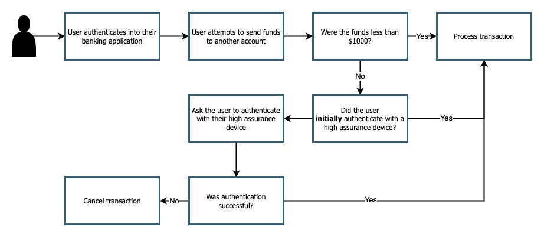
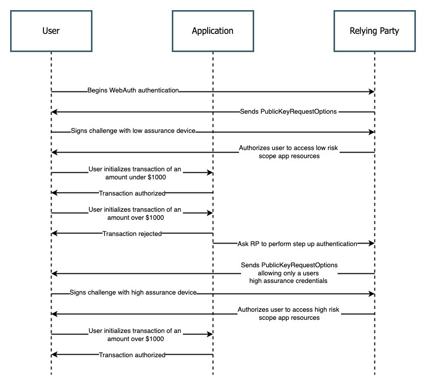

== Step up authentication implementation guidance

This method is good for adding additional restrictions to sensitive or critical actions or information in an application. Step up authentication works well for situations where your user is authenticated with a low assurance device, but needs to perform a sensitive action. In this case you would require your user to reauthenticate with a higher assurance device. Once re-authenticated your user should be able to perform an action. The guidance given on this page will guide you on approaches to implement step-up authentication in your application.

=== User experience

Figure 1 demonstrates a sample user experience for a user who needs to utilize step-up authentication to perform a sensitive action

**Figure 1**

In the example above we are going through a scenario where a user is attempting to send a large amount of funds through a banking application. This application allows users to sign in with a variety of authenticators, but also enforces a policy where a high assurance device is needed to process transactions over $1000. 

Our happy path here is a user who always utilizes a high assurance device. In the scenario above if a user initially authenticates with a high assurance device, then no further action is required on their behalf. 

If a user is initially authenticated with a low assurance device, like a copyable passkey, then they will be required to perform another authentication ceremony using a high assurance device.

=== Prerequisites
Before you attempt to follow this implementation guidance, ensure that you have added the MDS to your application. Guidance for adding MDS to your application can be found on our page, link:​​/WebAuthn/Concepts/FIDO_Metadata_Service_(MDS).html[FIDO Metadata Service (MDS)]

Our examples also leverage Yubico’s java-webauthn-server; a server side library for Java that provides features to help you implement a WebAuthn relying party. Some of the methods used below will come directly from this library.

link:https://github.com/Yubico/java-webauthn-server[Link to the java-webauthn-server]

=== Implementation guidance

==== Determine make/model of a device

You can leverage the tools linked in the the prerequisites section above to use the attestation statement given during a registration to determine the make/model of the authenticator that is being used. With this information you’re able to determine if you want to consider the device as high assurance or low assurance. 

A strong indicator that a device is low assurance is a registration that was sent that does not contain an attestation statement. This usually means that the credential is not bound by a single piece of hardware, so there is no way to indicate the specific device that it came from. This will commonly be true for copyable passkeys, or authenticators that are software based such as the WebAuthn feature in the Chromium developer console. 

Remember to consult the NIST guidance for authenticator assurance levels, which can be found here in their document link:https://nvlpubs.nist.gov/nistpubs/SpecialPublications/NIST.SP.800-63-3.pdf[Guidelines for Digital Identity]. 

==== Referencing assurance level in the credential repository

Next you will want to have some sort of mechanism to help you quickly identify assurance levels of credentials in your credential repository. This will become important as the flow presented in the next section will rely on a mechanism to prompt users with an allowList in the PublicKeyRequestOptions that only has the credential IDs of their high assurance devices. You could calculate assurance on the fly, or you can store a flag in your credential repository that indicates if a credential is high assurance.

Figure 2 demonstrates the structure of a credential registration for your database

[role="dark"]
--
[source,java]
----
public class CredentialRegistration {
 
   long signatureCount;
 
   UserIdentity userIdentity;
 
   Optional<String> credentialNickname;
 
   Instant registrationTime;
 
   Instant lastUsedTime;
 
   Instant lastUpdatedTime;
 
   RegisteredCredential credential;
 
   Optional<AttestationRegistration> attestationMetadata;
 
   RegistrationRequest registrationRequest;
 
   Boolean isHighAssurance; 
}
----
--
**Figure 2**

You should calculate the `isHighAssurance` value when the credential is being registered. Ensure that you leverage the guidance in the previous section to help determine the assurance level of the credential.

==== Authentication flow

Implementation for step-up authentication will look completely different based on the identity provider that you are leveraging. In this section we will provide a sequence diagram that will outline the different steps that you should follow in order to invoke step up authentication for a user. 

Figure 3 demonstrates a sequence diagram for implementing step up authentication

**Figure 2**

This flow will allow you to add step up authentication in your application. Click below to return to the authenticator limit guidance : link here. 

link:/WebAuthn/Concepts/Authenticator_Management[Return to the WebAuthn Authenticator Management guide]