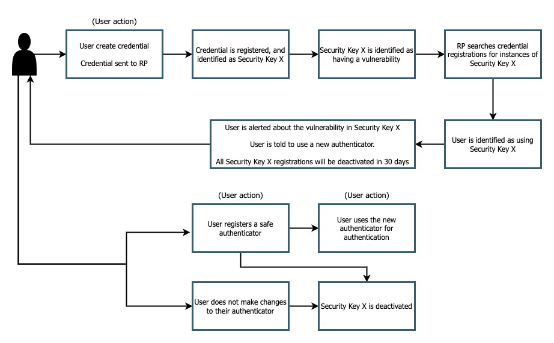

== Vulnerability remediation implementation guidance

When your application allows for a wide variety of authenticators you may run into the issue that one of them is found to have some sort of a vulnerability. When a vulnerability is discovered it’s easy enough to block that authenticator from continuing to register, but what do you do if users have already begun to leverage that authenticator in your environment? The guidance given on this page will teach you how to identify if a vulnerable authenticator is being used in your environment, and some options for remediation. 

=== User experience

Figure 1 demonstrates a sample user experience for a user who has registered an authenticator that was later identified as having a vulnerability

**Figure 1**

In this flow a user has registered using an authenticator. Some time later it is identified that the authenticator used has a vulnerability. In the background your security team should identify all of your application users who have registered using the vulnerable authenticator. Once a user is identified, they should be alerted with instructions on **what the issue is** and **how can they remediate the issue**. 

In our example above we are opting to tell the user that their credential registered with the vulnerable authenticator will be inactivated in 30 days. This may not always be a necessary case; You will need to analyze the risk profile of your application, and your types of users to determine if it’s appropriate to inactive these credentials. If you are a high risk application like banking, or health you may want to inactivate the credential to ensure that no financial or privacy risk is introduced to your user base. If you are a low risk application, with a wide reaching audience it might not be worth the pressure on your customer support teams to answer “why can’t I access my account” type questions. 

=== Prerequisites
Before you attempt to follow this implementation guidance, ensure that you have added the MDS to your application. Guidance for adding MDS to your application can be found on our page, link:​​/WebAuthn/Concepts/FIDO_Metadata_Service_(MDS).html[FIDO Metadata Service (MDS)]

Our examples also leverage Yubico’s java-webauthn-server; a server side library for Java that provides features to help you implement a WebAuthn relying party. Some of the methods used below will come directly from this library.

link:https://github.com/Yubico/java-webauthn-server[Link to the java-webauthn-server]

=== Implementation guidance

==== Understanding your credential repository

The first step in creating vulnerability remediation for FIDO2 authenticators is to understand how you have structured your credential repository. The credential repository is your collections of **all** user credentials in your application. For our example our credential repository is built of objects with the following structure.

Figure 2 demonstrates a credential registration that exists in your credential repository

[role="dark"]
--
[source,java]
----
public class CredentialRegistration {
 
   long signatureCount;
 
   UserIdentity userIdentity;
 
   Optional<String> credentialNickname;
 
   Instant registrationTime;
 
   Instant lastUsedTime;
 
   Instant lastUpdatedTime;
 
   RegisteredCredential credential;
 
   Optional<AttestationRegistration> attestationMetadata;
 
   RegistrationRequest registrationRequest;
}
----
--
**Figure 2**

Most of the fields above can be ignored, for the sake of this example we are only interested in the `attestationMetadata` property.

The attestationMetadata property could include the **entire** attestation metadata statement that is found in the MDS entry that is correlated with the attestation statement sent during the registration ceremony. 

In our example let’s assume that `attestationMetadata` has a field named `aaguid` which denotes the AAGUID of the authenticator used to create the registration. 

==== Iterating through the credential repository

Now that we have an understanding of how our credentials are stored and organized, let’s iterate through it to identify authenticators with vulnerabilities. 

First, let’s begin by creating a list of AAGUIDs that have been marked as having a vulnerability.

Figure 3 demonstrates how to declare a new array with your curated list of AAGUIDs.

[role="dark"]
--
[source,java]
----
private final ArrayList<String> aaguids = 
  new ArrayList<String>(
    Arrays.asList("c5ef55ff-ad9a-4b9f-b580-adebafe026d0 ", 
      "2fc0579f-8113-47ea-b116-bb5a8db9202a"
  ));
----
--
**Figure 3**

Next let’s iterate through our credential repository to identify authenticators with an AAGUID that matches an entry in the list above. For this example we will state that our credential repository is a collection of type `CredentialRegistration` that was declared above. Your specific implementation will probably leverage an actual datasource, but the logic should remain the same.

Figure 4 demonstrates how to iterate through a collection of credentials, then performing an action on each item.

[role="dark"]
--
[source,java]
----
Collection<CredentialRegistration> credList = initializeCredentialRepo();
 
credList.stream().filter(
  credential -> aaguids.contains(credential.getAttestationMetadata().get().aaguid))
        .forEach((vulnCredential) -> { sendUserAlert(vulnCredential)});
----
--
**Figure 4**

You can assume that `initializeCredentialRepo` is calling to your database to get a copy of all of the credential entries, and that `sendUserAlerts` a method that will use the information found in the stored credential to send a custom alert to the user. 

==== Guidance for invaliding credentials

You have a few options when it comes time to inactivate the credential that was created with a vulnerable authenticator. These options include:

* Marking the credential as inactive with a flag in the DB (our recommended options)
* Removing the credential entirely from the DB

We recommend the first option as a way to keep a record of the authenticators that were registered within your account. This might also act a deterrent by including the inactive credential in your link:https://www.w3.org/TR/webauthn-2/#dom-publickeycredentialcreationoptions-excludecredentials[`PublicKeyCreationOptions` excludeCredential option], preventing the user from attempting to re-register their compromised credential. 

==== Blocking registrations from vulnerable authenticators

In order to block registrations from specific authenticators (in our case those with vulnerabilities) you will need to implement some form of a deny list. Guidance for implementing a deny list can be found in the link below.

link:/WebAuthn/Concepts/Authenticator_Management/Implementation_Guidance/Deny_List.html[Deny list implementation guidance]

[NOTE]
====
Failure to implement a deny list in the case of vulnerability remediation will result in your users being able to re-register, or continue to register, authenticators that were marked as inactive due to a vulnerability.
====

This flow will allow you to remediate vulnerabilities in your application. Click below to return to the authenticator management guidance.

link:/WebAuthn/Concepts/Authenticator_Management/Use_Cases_and_Scenarios.html[Return to the WebAuthn Authenticator Management guide]
