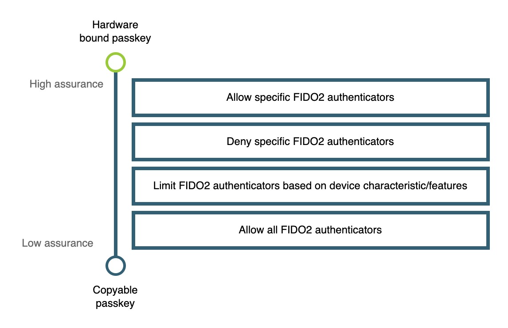

== Authenticator management use cases and scenarios

In this section we are going to dive deeper into common use cases and scenarios to help you better understand what approach you should take when determining the need to limit certain FIDO2 authenticators in your application. By the end of this section you should understand if your application needs to provide limitations on certain authenticators, and where you can go to learn how to implement those limitations. 

=== Revisiting the authenticator spectrum diagram

Before we proceed let’s revisit the diagram shown in the previous section of this series.

Figure 1 demonstrates a diagram to help you determine what limitation strategy you should employ based on the needed assurance level of your application.

**Figure 1**

From this diagram we are going to dive into each box and relate them to common use cases and user scenarios. The goal is to test which experience resonates the most with your target user base, and allow you to determine which implementation guide is right for you. 

=== Identifying make and model of an authenticator at runtime

All of the guidance in this series relies on the concept of attestation. Within the context of WebAuthn, it refers to the ability of a security device to prove its own identity and for a Relying Party (RP) to attain details about the security device it was created on, and which manufacturer actually created said device. You can learn more about attestation on our page, link:/Developer_Program/WebAuthn_Starter_Kit/Attestation.html[WebAuthn Attestation and Authenticator Metadata].

Another concept to be familiar with is the FIDO Metadata Service (MDS). The MDS is a collection of metadata statements that can be used by a relying party to validate authenticator attestation. In short, you can correlate device information with the attestation data sent during a registration ceremony. Please visit our link:/WebAuthn/Concepts/FIDO_Metadata_Service_(MDS).html[guidance on MDS] to learn how to integrate it into your own application, as it will be needed for the examples linked in this series. 

Attestation is important to note in the context of this series as any limitation, denial, or allowing of an authenticator can only happen if you are able to identify the device that is attempting to register. 

=== Allow all FIDO2 authenticators

This is the most direct scenario for your application. In this instance your relying party is going to accept **any** FIDO2 authenticator that attempts to register in your application. 

This scenario works best when:

* You have a wide consumer audience
* You don’t want a barrier of entry to use your application
* You want your users to utilize anything from FIDO2 security keys, to copyable aka multi-device passkeys, to U2F authenticators.

==== Implementation Guidance

Below is a link to the Yubico WebAuthn Starter Kit. This will provide a full reference architecture where you will deploy a live WebAuthn application using AWS. The Starter Kit aims to teach you how to:

* Develop a sample end-to-end WebAuthn application
* Integrate a WebAuthn application with a common identity provider
* Understand UX and UI best practices and considerations
* Manage WebAuthn credentials through an account lifecycle

link:https://developers.yubico.com/Developer_Program/WebAuthn_Starter_Kit/[Yubico WebAuthn Starter Kit]

==== Vulnerability remediation

There is another scenario when allowing all FIDO2 authenticators to be used in your environment; what do you do if an authenticator is found as vulnerable? In a high risk controlled environment you may opt to reject the authenticator entirely, but you may want to take a different approach for a consumer facing application. 

In this scenario we recommend to send alerts to account holders who may have a credential registered that was created with an authenticator with a vulnerability. The guidance linked below will give examples on how to identify vulnerable authenticators in your environment, and how to alert users on how they can self remediate, if they choose to do so.

link:/WebAuthn/Concepts/Authenticator_Management/Implementation_Guidance/Vulnerability_Remediation.html[Vulnerability remediation implementation guidance] 

=== Limit authenticators based on device characteristics/features

This scenario is where you begin to add controls to make your application dynamically respond to different authenticators. This will allow you to add a higher degree of security to user accounts, while not constraining account holders to specific authenticators. Understanding this section will be critical for implementing link:https://developers.yubico.com/Developer_Program/WebAuthn_Starter_Kit/Adaptive_Multi-Factor_Authentication.html[adaptive multi factor authentication] into your application; your relying party will be able to adapt and route users across different flows based on the risk profile of the authenticator used, and the action being attempted by the user. 

It’s worth noting that this category is where you will begin to introduce friction for users who are not leveraging high assurance devices. A user who is leveraging a high assurance device will be able to seamlessly authenticate due to the very high degree of confidence that their request is legitimate. Authentication ceremonies performed with lower assurance devices may require another factor to authenticate, or step-up authentication to perform certain actions. 

This scenario works best when:

* A user's authenticator is missing user verification
* A user has previously authenticated with a lower assurance credential (e.g. copyable passkey) and has requested a high assurance action (e.g. to access or modify sensitive data).

==== Implementation guidance

Below is implementation guidance for two separate user scenarios: adding an additional factor to a WebAuthn authentication ceremony, and performing step-up authentication for low assurance devices.

link:/WebAuthn/Concepts/Authenticator_Management/Implementation_Guidance/Adding_Additional_Authentication_Factors.html[Adding an additional authentication factor implementation guidance]

link:/WebAuthn/Concepts/Authenticator_Management/Implementation_Guidance/Step_Up_Authentication.html[Step up authentication implementation guidance]

=== Deny specific FIDO2 authenticators

In the previous sections we were highly permissive in the authenticators allowed in our environment, and even if a device wasn’t completely trusted we supplied options to allow them to be used. As we transition into this section we will begin to entirely block certain authenticators from an environment. This means that any attempt to register one of these authenticators in our application will be rejected, forcing the user to use a valid authenticator before proceeding. 

Within your environment you will create a curated list of authenticators that will be rejected by your application. This list could be based off of an external repository such as the FIDO MDS that tracks authenticators with known issues, or a manually curated list of authenticators deemed untrustworthy by your organization. 

This scenario works best when:

* You want to prevent users from registering authenticators with certain properties, e.g. authenticators that can create copyable passkeys
* Your organization has decided not to trust certain authenticator manufacturers
* You want your application to automatically remediate rather than send user alerts for authenticators with vulnerabilities

==== Implementation guidance

Below is implementation guidance for two different scenarios: Blocking specific FIDO2 authenticators from registering in your application, and how to deactivate authenticators that have been identified as compromised. 

link:/WebAuthn/Concepts/Authenticator_Management/Implementation_Guidance/Deny_List.html[Deny list implementation guidance]

link:/WebAuthn/Concepts/Authenticator_Management/Implementation_Guidance/Vulnerability_Remediation.html[Vulnerability remediation implementation guidance] 

=== Allow specific FIDO2 authenticators

In this scenario you will exercise the highest degree of control in your high risk environment by restricting registration to only a select list of curated authenticators. In a high risk environment you want to ensure that you are limiting authorized authenticators to high assurance devices to ensure that you have a very high degree of confidence that the authenticator used in the authentication ceremony is in the possession of the real account holder. 

This scenario works best when:

* Your organization requires the use of a set of approved authenticators
* You want to prevent users from registering low assurance authenticators, like copyable passkeys
* You are required to limit registrations from high assurance devices

==== Implementation guidance

Below is implementation guidance for creating a relying party that utilizes an allow list that only allows the curated authenticators to be used in your application.

link:/WebAuthn/Concepts/Authenticator_Management/Implementation_Guidance/Allow_List.html[Allow list implementation guidance]

=== Summary of implementation guides

Below is a summarized list of all the implementation guides mentioned above.

* link:/WebAuthn/Concepts/Authenticator_Management/Implementation_Guidance/Allow_List.html[Allow list implementation guidance]
* link:/WebAuthn/Concepts/Authenticator_Management/Implementation_Guidance/Deny_List.html[Deny list implementation guidance]
* link:/WebAuthn/Concepts/Authenticator_Management/Implementation_Guidance/Vulnerability_Remediation.html[Vulnerability remediation implementation guidance] 
* link:/WebAuthn/Concepts/Authenticator_Management/Implementation_Guidance/Adding_Additional_Authentication_Factors.html[Adding an additional authentication factor implementation guidance]
* link:/WebAuthn/Concepts/Authenticator_Management/Implementation_Guidance/Step_Up_Authentication.html[Step up authentication implementation guidance]

