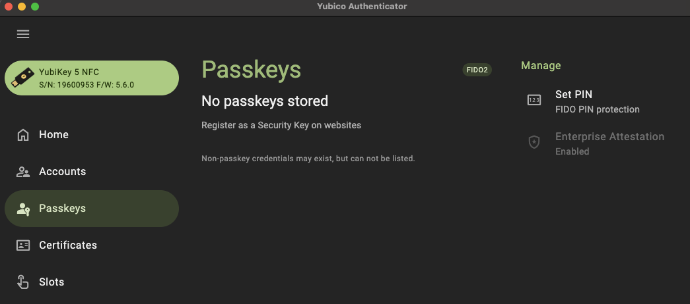
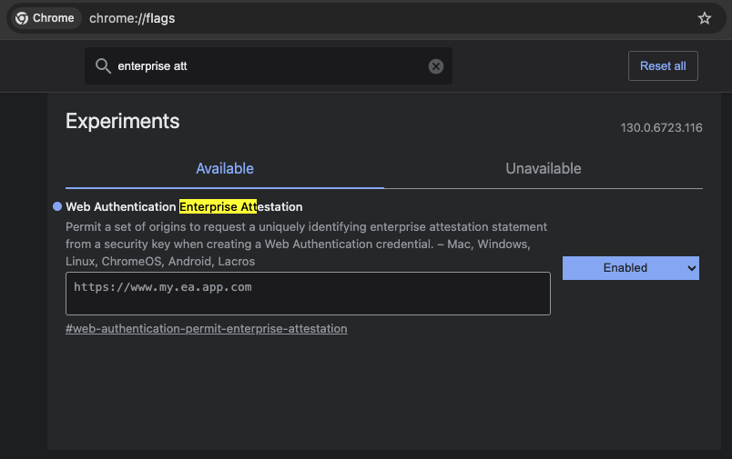

= Getting started with enterprise Attestation
:description: Learn how to get started with enterprise attestation, including procuring EA enabled security keys, needs for a relying party, and how to quickly test using a custom client application 
:keywords: passkey, passkeys, developer, high assurance, FIDO2, CTAP, WebAuthn, attestation, enterprise attestation, code sample, relying party

Learn how to get started with enterprise attestation, including procuring EA enabled security keys, needs for a relying party, and how to quickly test using a custom client application

In this section we are going to dive into what is required in order to enable enterprise attestation **(EA)** in your environment. There are a few different aspects that need to be understood, and enabled as there are inherent differences from a traditional WebAuthn ecosystem. We will cover authenticators, clients/browsers, and relying parties.

[Note]
======
A demo of the concepts presented below can be found link:https://github.com/YubicoLabs/enterprise-attestation-demo[here in our GitHub repository].
======

== Authenticators that support enterprise attestation

The first step in the process will be to work directly with your device manufacturer to configure new authenticators with EA, if the vendor supports the feature.

Yubico now offers Enterprise Attestation on YubiKeys. If you are a current customer who would like to utilize EA then please consult with your Yubico account representative for consideration.

Your relying party also needs to support EA. If you are leveraging a vendor bought solution you will need to work with the vendor to begin to enable EA from their platform. If you are leveraging an in-house built solution, or an IdP looking to adopt EA, then you will need to implement support in your application which will be covered in the implementation guidance below.

== Vendor facilitated and platform managed strategies
The next step is to determine whether to leverage vendor facilitated, or platform managed EA.

Both forms will require some coordination with your vendor / device manufacturer. 

Both forms will require that your authenticator can leverage enterprise attestation.

If you select vendor facilitated, then you will need to work with your vendor to curate a list of origins/domains which will be added to your authenticator. This means that once the keys are distributed then EA will only be directly available when requesting attestation for those domains.

If you select platform managed, then you will need work with your platform vendor to ensure that it has the ability to manage your security policy, and can be configured and rolled out to users within your enterprise. This includes your platforms ability to support EA, and to allow for the configuration of the curated origin/domain list that can request EA. 

== Enable Enterprise Attestation on your YubiKey

YubiKeys with Enterprise Attestation come with the feature enabled, but a reset on the key will turn the feature off. If you are unsure if your YubiKey has EA enabled, you can verify this from the link:https://www.yubico.com/products/yubico-authenticator/[Yubico Authenticator App] by following the steps below:

1. Open the Yubico Authenticator App
2. Navigate to **Passkeys**
3. Under **Manage** you should see a badge indicating that Enterprise Attestation is Enabled (as demonstrated in the image below)

If Enterprise Attestation is shown as **Disabled** you can reenable it from the Yubico Authenticator, or from the link:https://docs.yubico.com/software/yubikey/tools/ykman/index.html[YubiKey Manager CLI].

Or, use the following steps to reenable EA from the Yubico Authenticator App

1. Open the Yubico Authenticator App
2. Navigate to **Passkeys**
3. Under **Manage** you should see a badge indicating that Enterprise Attestation is Disabled
4. Click the Enterprise Attestation badge
5. When the pop-up window appears, click **Enable**. EA will now be enabled on your YubiKey

Use the following command the reenable EA from the YubiKey Manager CLI

[role="dark"]
--
[source,bash]
----
ykman fido config enable-ep-attestation
----
--

== Browser/Client ecosystems
The next step is to ensure that your client application is being utilized in an ecosystem that supports EA. EA is not inherently available on all ecosystems. 

As of writing this material, Google Chrome is the only browser that supports EA **in the form on an experimental feature**.

Follow the steps below to enable Enterprise Attestation from Google Chrome. An example image is provided below the steps

1. Navigate to `chrome://flags`
2. Search for `enterprise attestation`, an item with the title **Web Authentication Enterprise Attestation** should appear
3. Set the feature to `Enabled`
4. For vendor managed EA (or to request EA from origins/sites not pre-configured on your YubiKey), add your domain to the text box. Note, this needs to be the full domain name, including the HTTPS prefix, as seen in the image below below

== Relying party support
Your relying party (backend application) will need to be modified to support EA. This will include two different aspects.
The first is around the attestation conveyance of your relying party. To register a new credential, your relying party will issue a `PublicKeyCredentialCreationOptions` to your client application. This object contains an option to request a specific type of attestation - in most cases this is `direct`. To support enterprise attestation, the `PublicKeyCredentialCreationOptions` needs to issue an attestation type of `enterprise`. 

The JSON payload below demonstrates a sample `PublicKeyCredentialCreationOptions` object that can be used to invoke EA.

[role="dark"]
--
[source,json]
----
{
  "rp": {
    "name": "App that supports EA",
    "id": "my.enterprise.app.com"
  },
  "user": {/** */},
  "challenge": "5cdN-d6jIHShmRCeYjPHe5990bg9USk_Z7jfV0h7aQI",
  "pubKeyCredParams": {/** */},
  "excludeCredentials": {/** */},
  "authenticatorSelection": {/** */},
  "attestation": "enterprise",
  "extensions": {/** */}
}
----
--

It’s important to note a few things in the payload. The first is the property `rp` and `id`, This will be the RP ID that will either need to be 

* Included in your vendor managed RP ID list
* Included in your policy managed by your platform

First we'll begin by setting the `attestation` property to `enterprise`. In most cases, this value will be set to `direct`, which will provide you with the standard form of attestation. 

The implementation for this will look different depending on the language and framework being utilized by your relying party. 

The code sample below provides an example of how to set this option when leveraging link:https://github.com/Yubico/java-webauthn-server[Yubico’s java-webauthn-server library].

[role="dark"]
--
[source,java]
----
import com.yubico.webauthn.RelyingParty;

private final RelyingParty rp = RelyingParty.builder()
    .identity(RelyingPartyIdentity.builder()
      .id("my.ea.app")
      .name("My app")
      .build())
    .credentialRepository(this.userStorage)
    .origins(Config.getOrigins())
    .attestationConveyancePreference(Optional.of(AttestationConveyancePreference.ENTERPRISE))
    .build();
----
--

Note how the method `attestationConveyancePreference` is set to a property noting the use of `enterprise`. This will ensure that any registration request coming from this relying party will ask for enterprise attestation.

Next we will develop a method to provide attestation options (PublicKeyCredentialCreationOptions) to the client application. The method below can be used to provide attestation options (assume that there is some sort of API controller invoking this method).

[role="dark"]
--
[source,java]
----
import com.yubico.webauthn.data.UserIdentity;
import com.yubico.webauthn.data.PublicKeyCredentialCreationOptions;

public String attestationOptions() throws Exception {

    /*
     * Create a generic/random user for the example
     */
    UserIdentity userIdentity = UserIdentity.builder()
      .name("Default User")
      .displayName("Default User")
      .id(generateRandom(32))
      .build();

    /*
     * Create PublicKeyCredentialCreationOptions 
     * Note, the attestation preference was set in the RP configs in the previous code example
     */
    PublicKeyCredentialCreationOptions assertionOptions = this.rp.startRegistration(
        StartRegistrationOptions.builder()
          .user(userIdentity)
          .timeout(180000)
          .build());

    /*
     * Return the JSON object to the client
     */
    return assertionOptions.toCredentialsCreateJson();
  }
----
--

From here your client will invoke the Java app's API to receive the attestation options. Other than the Chrome settings mentioned above, your client will not need any special functionality in order to invoke a WebAuthn request that includes EA. 

The code below will act as a generic example of calling an RP's API, and invoking the WebAuthn ceremony.

[role="dark"]
--
[source,javascript]
----
import {
  create,
  parseCreationOptionsFromJSON,
} from "@github/webauthn-json/browser-ponyfill";

const invokeWebAuthn = async() => {
    // Call Java app for attestation options
    const startOptions = { method: "GET" };
    const response = await fetch("https://api.my.ea.app/v1/attestation/options", startOptions);
    const response_json = await response.json();

    // Invoke WebAuthn request with attestation options
    const attestationResult = await create(
      parseCreationOptionsFromJSON(response_json)
    );

    // Call Java app to send credential response
    // Note, the implementation for this method is the upcoming guidance
    const resultOptions = { method: "POST", body: JSON.stringify(attestationResult) }
    const response2 = await fetch(
      "https://api.my.ea.app/v1/attestation/result",
      resultOptions);
  }
----
--

Once the client has been used to create a credential on an EA enabled YubiKey, the credential response will be sent back the relying party in the form of an assertion result (the second API call in the code example above).

To finalize things we will develop a method that will process the attestation result. For simplicity, we will not demonstrate the validating and storing of the credential; we will only be focused on the mechanism to read the serial number from the credential response, which is demonstrated in the Java code below.

[role="dark"]
--
[source,java]
----
/*
   * Request structure 
   * { 
   *   type: "public-key", 
   *   id: "base64url credential ID", 
   *   clientExtensionResults: {}, 
   *   response: { 
   *      clientDataJSON: "base64url string", 
   *      attestationObject: "CBOR encoded object"
   *   }
   * }
   */
  public void attestationResult(String request) throws Exception {
    // Parse the JSON request
    PublicKeyCredential<AuthenticatorAttestationResponse, ClientRegistrationExtensionOutputs> 
      parsedRequest = PublicKeyCredential.parseRegistrationResponseJson(request);

    // Read the attestationObject
    AttestationObject attestationObject =
        new AttestationObject(parsedRequest.getResponse().getAttestationObject());

    // Parse the attestation statement for the x5c cert
    ObjectNode attestationStatement = attestationObject.getAttestationStatement();
    JsonNode x5cNode = attestationStatement.get("x5c");
    // Encode the x5c value to a String array (this is how the entry is represented)
    String[] x5cArray = mapper.readValue(x5cNode.toString(), String[].class);

    // Assume the first entry (it's the only entry)
    String firstX5c = x5cArray[0];
    byte[] bytes = ByteArray.fromBase64(firstX5c).getBytes();
    X509Certificate cert = X509CertUtils.parse(bytes);

    System.out.println("\nPrinting entire cert for analysis");
    System.out.println(cert.toString());

    /*
     * Options for reading the serial number:
     * 1) Read and parse the serial number from the cert subject name
     * 2) Read the serial number from the cert extension (1.3.6.1.4.1.45724.1.1.2)
     * 3) Optional, read both and compare to ensure that they're similar
     */

    // 1) Read serial from cert subject name
    String subjectName = cert.getSubjectX500Principal().getName();
    System.out.println("\nValue from cert subject name:");
    System.out.println(subjectName);

    // 2) Read the serial from the cert extension
    byte[] extensionValuBytes = cert.getExtensionValue("1.3.6.1.4.1.45724.1.1.2");
    // Convert extension value to int
    if (extensionValuBytes == null) {
      String errorMessage = "Serial number extension not present";
      System.out.println("\n" + errorMessage + "\nEnterprise Attestation not found");
      throw new NullPointerException(errorMessage);
    }
    int extensionValueInts = new BigInteger(1, extensionValuBytes).intValue();
    String serialNumber = String.valueOf(extensionValueInts);
    System.out.println("\nValue from cert extension value:");
    System.out.println(serialNumber);

    // 3) Compare both values to see if they match
    boolean doesEqual = subjectName.contains(serialNumber);
    System.out.println("\nDo serial numbers match: " + doesEqual);

    AttestationResponse response = new AttestationResponse(serialNumber);
    return mapper.writeValueAsString(response);
  }
----
--

The system logs from the code above will output the full `x5c` cert expressed by the attestation statement in the credential response. 

Below the cert, the cert subject name will be printed which will include the serial number. An example of this log can be found below 

[role="dark"]
--
[source,bash]
----
CN=Yubico Fido EE (Serial\=19600953),OU=Enterprise Attestation,O=Yubico AB,C=SE
----
--