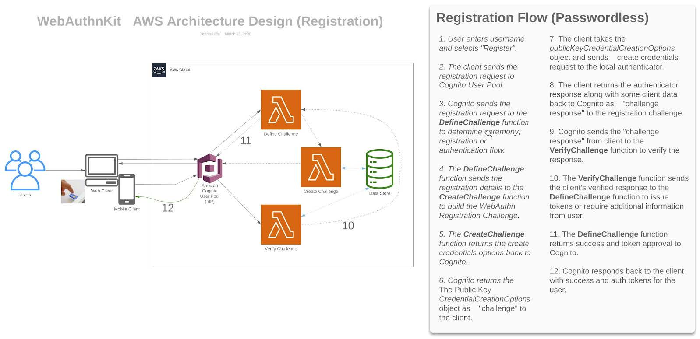
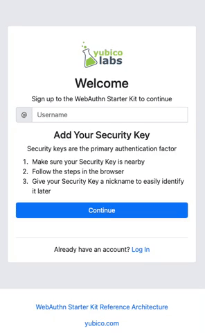
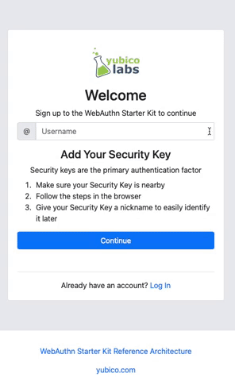

= Handling WebAuthn registrations for FaceID and TouchID when using WebKit

Learn how to overcome WebKits guardrails requiring the creation of new WebAuthn credentials to be triggered by user gestures

== Overview
The technical aspects of WebAuthn are standardized by the specification, but aspects of the User Experience are left up to not only the Developers of Web Applications, but by those developing Operating Systems, Platforms, Devices, and Browsers. This means that while developing your application, you need to take into account the behaviros of the system(s) that your user will be using to access your Web Application. Part of this could include prompts, menus, pop-ups that are displayed to the user, but there can exist constraints on how WebAuthn methods are triggered.

One occurrence of this is Apple’s implementation in WebKit. WebKit will only allow a user to register a new credential with TouchID or FaceID if the request is triggered by a User Gesture. link:https://webkit.org/blog/11312/meet-face-id-and-touch-id-for-the-web/[Apple’s reasoning behind this design choice can be found here]. In this document we will explore the concept of User Gestures, the potential impacts to the design of an application, and how to incorporate the required gesture into an existing application.

== What happens when registering a new credential?
First let’s start by understanding how WebAuthn allows a user to register a WebAuthn credential to their account. This flow shows what happens during the registration of a new credential - 

Below is a sample of code that demonstrates how a component in your web application, WebAuthnClient, could handle WebAuthn related actions. In our example this is a component that would allow different components of the application to perform Authentication actions which could include: signing in, listing credentials, and deleting credentials. To keep things simple we only include a sample of how a user signs up to your application.

  //WebAuthnClient.ts
  async function signUp(){
    await Auth.signUp(); //Create a new user
    const user = await Auth.signIn(); //Attempt to login as new user, user object should have parameters that are used to register a new credential
    const challengeResponse = await createCredential(user.challengeParam); //Call to a method specifically made to create a credential
    const userData = await sendChallengeAnswer(user, challengeResponse); //Respond to server with newly create credential to associate to the user
    return userData; //Data to be used by the user
  }
  async function createCredential(challengeParam){
    const publicKey = { publicKey: challengeParam.publicKeyCredentialCreationOptions}; //Get parameters needed to register a new credential
    const attestationResponse = await create(publicKey); //Use the WebAuthn API to create a new credential using the authenticator device
    const challengeResponse = {
      credential: attestationResponse,
      requestId: challengeParam.publicKeyCredentialCreationOptions.requestId,
      PIN: -1
    } 
    return challengeResponse; //Return the data of the created credential
  }

It is recommended to place this logic in a component separate from any UI implementation just in case you need to reuse the logic elsewhere. 

In this example you have a React component named Register. Register has a form for a user to enter their username, and a Button that when clicked, will call to your WebAuthnKit component to begin your registration process, outlined above.

  //register.tsx
  import WebAuthnKit from "../_components"
  cont Register = function() {
    const SignUp = async(event) => {
      try{
        await WebAuthnClient.signUp(username);
      } catch(err){
        console.error("Something went wrong");
      }
    }  
    return(
      <>
        {/*
        * In this space add a form handler to allow the user to enter their choosen username
        */}
        <button
          onClick={SignUp}
        >
          Click me to register!
        </button>
      </>
    )
  }
  export default Register

Now if you attempt to use this logic in Chrome, a Windows device, or on an Android device your user would be able to create an account, and register a new credential.

But, if the user attempts to register on a browser that is using WebKit (Mac or iPhone using Safari) they will get an error indicating that the registration request was canceled by the user. 

So what is happening here?

== What is a user gesture, and why is it needed?
Apple has defined a user gesture as user activated events such as: 
  
  * Touch 
  * Click
  * Double Click
  * Keydown
  * Etc..

The example above shows that it's required for a user to press the “Registration” button to begin the credential creation process. But if you attmempt to register with WebKit you'll still receive an error. While the button click is a user activated event, the moment you begin to call out to the WebAuthn component’s signUp method, you have left the current “context” of the event/button click. The event is not sent to the signUp() method, and subsequently also not be sent to the create() method when attempting to create the credential - meaning that WebKit will NOT allow the create() method to execute.

The easy fix would be to change the button event handler to call directly to your Authentication service to get the challenge, and within the same context trigger the create() method. While this solution works, it goes against the principle of not creating duplicate logic across the code of the application. If you were to make a change in the WebAuthn component, you would then need to make the change in the other event handlers that call the create() method.

This also doesn’t account for the non-WebKit users who don’t require a user gesture. We don't want to complicate their experience with an additional need for input.

== How do I detect if WebKit is present
The first thing to do is to determine if the browser that is being used by the user is one that will rely on WebKit’s guidelines. 

Below is sample code that will help your application determine what platform + browser your user is attempting to use. In short this function will return true if WebKit needs to be considered in this session, and false otherwise.

  /*
  * Leverage the Navigator API to determine the userAgent being used to run this application
  * userAgent may sometimes report incorrect data, but for demo purposes it should suffice
  * More information can be found here https://developer.mozilla.org/en-US/docs/Web/API/Navigator/userAgent
  */
  /*
  * Example of userAgent on mac + safari: 
  *"Mozilla/5.0 (Macintosh; Intel Mac OS X 10_15_7) AppleWebKit/605.1.15 (KHTML, like Gecko) Version/15.1 Safari/605.1.15" = $1
  *This is not enough to determine if a device is Mac + Safari
  *Example of userAgent on mac + chrome
  *'Mozilla/5.0 (Macintosh; Intel Mac OS X 10_15_7) AppleWebKit/537.36 (KHTML, like Gecko) Chrome/97.0.4692.99 Safari/537.36'
  *There is a similar occurance on mac + Edge
  *What we want to do is establish that the browser is an Apple devie, and not running Chrome or Edge, but is running Safari
  */
  function isWebKitDevice(){
    const { userAgent } = navigator;
    if(userAgent.indexOf("Macintosh") !== -1 || userAgent.indexOf("iPhone") !== -1){
      if (
        userAgent.indexOf("Edg") === -1 &&
        userAgent.indexOf("Chrome") === -1 &&
        userAgent.indexOf("Safari") !== -1){
        return true;
      }
    }
    return false
  }

This sample can be extended to make a separate case for Mac and iPhone, just in case different visual indicators for TouchID vs FaceID are needed.

== How do I implement the User Gesture to trigger credential creation?

Lastly let’s use the method above to alter our code to account for WebKit. What we need to implement is a way to account for WebKit without disrupting the interface that our users are already familiar with, and without rewriting the core registration logic that is already proven to work.

=== Step 1
Implement a new React Component to generate the user gesture 

  import { Modal } from "react-bootstrap";
  const HandleWebKit = function( { publicKey, resolveCallback, rejectCallback }) {
    const [show, setShow] = useState(false);
    const handleRegistration = async(event) => {
      try{
        const attestationResponse = await create(props.publicKey);
        props.saveCallback( { ...attestationResponse } );
        setShow(false);
      } catch(err){
        console.error("Something went wrong");
        handleClose();
      }
    }
    const handleShow = () => {
      setShow(true);
    }
    const handleClose = () => {
      props.closeCallback(
        new Error(
          "Request Cancelled bu the User"
        )
      );
      setShow(false);
    }
    useEffect(() => {
      handleShow();
    }, []);
    return(
      <Modal show={show} onHide={handleClose}>
        <h1>Click the button below to finish your registration</h1>
        <button
          onClick={handleRegistration}
        >
          Click me to register a security device
        </button>
      <Modal/>
    )
  }
  export default HandleWebKit

This component should act as a Promise. Meaning that in the properties you need to pass in callback methods to resolve and reject the promise. Your properties should also accept the publicKey that is generated from the challenge sent by the server.

Now, when this button is clicked, the call to the create() method will resolve correctly within the handleRegistration method.

=== Step 2
Now that you have a component to handle WebKit, you need a way for it to appear in the UI on the Register Component. We are going to alter the Registration component with three things:

* We are going to set a variable to hold the component, allowing it to appear/disappear whenever a method is triggered
* Configure two methods
  - One that will trigger the appearance of the component, as well as receive a publicKey from the WebAuthn client
  - A method that is called to configure the props of the HandleWebKit component, and to remain on standby until the Promise from the component resolves
* We are going to pass in one of the methods as a callback to the WebAuthnClient, allowing for the component to trigger the HandleWebKit modal to appear, and to take in the user input, while simultaneously allowing the attestation response to be used by the WebAuthnClient.

  import WebAuthnKit from "../_components"
  import HandleWebKit from "../_components"
  cont Register = function() {
    const [handleWebKit, setHandleWebKit] = useState<ReactElement>();
    const SignUp = async(event) => {
      try{
        await WebAuthnClient.signUp(username, webKitMethod);
      } catch(err){
        console.error("Something went wrong");
      }
    }  
    const WebKitPromise = (publicKey): Promise<{ attestationResponse: any }> => {
      return new Promise((resolve, reject) => {
        const handleWebKitProps = {
          publicKey,
          saveCallback: resolve,
          closeCallback: reject,
        };
        console.log("SignUpStep WebKitPromise(): ", handleWebKitProps);
        setHandleWebKit(<HandleWebKit {...handleWebKitProps} />);
      });
    };
    async function webKitMethod(type, publicKey) {
      const attestationResponse = await WebKitPromise(publicKey);
      console.log("SignUpStep webKitMethod Result: ", attestationResponse);
      return attestationResponse;
    }
    return(
      <>
        {/*
        * In this space add a form handler to allow the user to enter their choosen username
        */}
        <button
          onClick={SignUp}
        >
          Click me to register!
        </button>
        {handleWebKit}
      </>
    )
  }
  export default Register

=== Step 3
Now, return to your WebAuthn client. The first action that is required is to change the parameters to accept a callback method called HandleWebKit.

Next we are going to use the logic created earlier in the lesson to detect WebKit. If the logic returns false, proceed to call directly to the create() method and finalize the registration. Otherwise, trigger the modal, allowing the user to click the ‘Finalize Registration’ button to trigger the create() method, and finalize the registration.

  async function signUp(HandleWebKit){
    await Auth.signUp(); //Create a new user
    //Attempt to login as new user, user object should have parameters that are used to register a new credential
    const user = await Auth.signIn();
    //Call to a method specifically made to create a credential
    const challengeResponse = await createCredential(user.challengeParam, HandleWebKit);
    //Respond to server with newly create credential to associate to the user
    const userData = await sendChallengeAnswer(user, challengeResponse);
     //Data to be used by the user
    return userData;
  }
  async function createCredential(challengeParam, HandleWebKit){
    //Get parameters needed to register a new credential
    const publicKey = { publicKey: challengeParam.publicKeyCredentialCreationOptions};
    let attestationResponse;
    if(isWebKitDevice()){
      HandleWebKit(publicKey);
    } else {
       //Use the WebAuthn API to create a new credential using the authenticator device
      attestationResponse = await create(publicKey);
    }
    const challengeResponse = {
      credential: attestationResponse,
      requestId: challengeParam.publicKeyCredentialCreationOptions.requestId,
      PIN: -1
    }
    //Return the data of the created credential
    return challengeResponse;
  }

This fundamental idea will work for both registering new users along with their initial credentials, and for registering new credentials on existing users. 

Your application should now allow users using WebKit to register their WebAuthn credentials, without changing the experience for your other users. 

== References

* link:https://webkit.org/blog/11312/meet-face-id-and-touch-id-for-the-web/[Meet FaceID and TouchID for the Web]
* link:https://github.com/YubicoLabs/WebAuthnKit[Yubico WebAuthn Starter Kit]