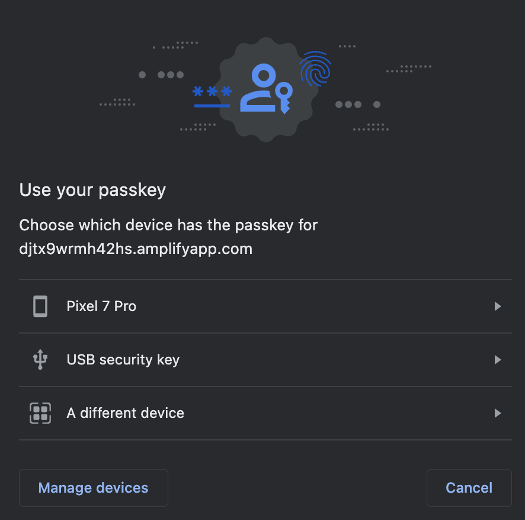

= Implementation guidance for hybrid high assurance scenarios
:description: Learn how to implement a flow for security keys and platform authenticators to allow for seamless hybrid authentication 
:keywords: hybrid, android, high assurance, FIDO2, CTAP, WebAuthn

Learn how to implement a flow for security keys and platform authenticators to allow for seamless hybrid authentication

== Getting started

This section will highlight the prerequisites that are needed before you attempt to create a hybrid flow. 

=== Prerequisites

* FIDO2 supported security key, like the link:https://www.yubico.com/products/yubikey-5-overview/[Yubikey]
* Smartphone running Android(v7+), with an updated version of Google Chrome (v106+ preferred)
* Laptop/desktop running the latest version of Windows(v10+) or macOS (v13+), with an updated version of Google Chrome (v106+ preferred)
* link:/Mobile_Dev/WebAuthn/WebAuthn_Primer.html#:~:text=How%20do%20I%20deploy%20a%20WebAuthn%20relying%20party%3F[WebAuthn relying party]
* link:/Mobile_Dev/WebAuthn/WebAuthn_Primer.html#:~:text=How%20do%20I%20deploy%20an%20example%20WebAuthn%20application%3F[WebAuthn client application]

=== Device settings
* Ensure that your laptop, and smartphone are configured to allow for Bluetooth communication
* Ensure that the device privacy settings allow for the Chrome browser to use Bluetooth communication

== Trusted attestation

The first step for any high assurance use case is to ensure that your application is set to **only** accept trusted attestation. This means that any new registration will be required to present an attestation statement that can be traced back to a verified authenticator.

Typically, low assurance credentials, such as multi-device credentials, will be unable to send an attestation statement.

Follow the steps on the link below to configure your application to utilize attestation, and a repository of verified authenticators (in the form of the FIDO MDS).

link:/Passkeys/Passkey_relying_party_implementation_guidance/Attestation/Adding_the_FIDO_MDS_to_your_passkey_relying_party.html[Adding the FIDO MDS to your WebAuthn application]

Before we proceed, you will need to modify one of the values set in the previous step.

In the section of the code example where you define the `RelyingParty` object, you will set the parameter of `allowUntrustedAttestation` to `false`.

See below for the full code sample

[role="dark"]
--
[source,java]
----
private final RelyingParty rp = RelyingParty.builder()
    .identity(rpID)
    .credentialRepository(this.userStorage)
    .origins(allowedOrigins)   .attestationConveyancePreference(Optional.of(AttestationConveyancePreference.DIRECT))
    .attestationTrustSource(mds)
    .allowUntrustedAttestation(false)
    .validateSignatureCounter(true)
    .build();
----
--

You can further secure your application using an allow/deny list to moderate which authenticators can register in your application. More information about authenticator management can be found on link:/WebAuthn/Concepts/Authenticator_Management[this page]

== Registration options

The next step is going to be in the registration of your credentials. Regardless of scenario, all WebAuthn credential registrations occur by passing `PublicKeyCredentialCreateOptions` to the browser's `navigator.credentials.create()` method. 

The main difference between both scenarios occurs in the configuration of the `PublicKeyCredentialCreateOptions` object. 

=== Security key registration options

You can invoke the creation of a credential on a security key in a variety of different ways. The code sample below demonstrates a generic `PublicKeyCredentialRequestOptions` object that can be used to register your security key.

[role="dark"]
--
[source,json]
----
{
  "publicKey": {
      "rp": {
          "name": "WebAuthn Starter Kit",
          "id": "d2a4za4g31xyaw.amplifyapp.com/"
      },
      "user": {
          "name": "example user",
          "displayName": "example-user",
          "id": "xxxxxxxx-xxxx-xxxx-xxxx-xxxxxxxxxxxx"
      },
      "challenge": "XXXXXXXXXXXXXXXXXXXXXXXXXXXXXXXXXXXXXXXXXXX",
      "pubKeyCredParams": [***],
      "excludeCredentials": [],
      "authenticatorSelection": {
          "residentKey": "preferred",
          "userVerification": "preferred"
      },
      "attestation": "direct",
      "extensions": {
          "credProps": true
      }
  }
}
----
--

Note, that it is not the responsibility of the client application to determine if the user has already registered their security key. Once the new credential is created, you must pass it to the backend application where the applicable checks (such as trusted attestation) are completed before finalizing a credential registration. 

=== Android registration options

With our security key registered, let’s move on to registering a credential using the platform authenticator on our Android device.

Why are we only using Android? To recap; The first reason is that it is the only mainstream mobile operating system that can generate single device credentials. The next is that registrations on an Android device can include attestation statements with a root of trust that can be verified. Both of these aspects are required for high assurance scenarios, which we are covering in this guide.

The code sample below can be used to generate a single device credential.

[role="dark"]
--
[source,json]
----
{
  "publicKey": {
      "rp": {
          "name": "WebAuthn Starter Kit",
          "id": "d2a4za4g31xyaw.amplifyapp.com/"
      },
      "user": {
          "name": "ios-demo",
          "displayName": "ios-demo",
          "id": "xxxxxxxx-xxxx-xxxx-xxxx-xxxxxxxxxxxx"
      },
      "challenge": "XXXXXXXXXXXXXXXXXXXXXXXXXXXXXXXXXXXXXXXXXXX",
      "pubKeyCredParams": [***],
      "excludeCredentials": [
          {
              "type": "public-key",
              "id": "XXXXXXXXXXXXXXXXXXXXXXXXXXXXX-XXXXXXXXXXXXXXXXXXXXX-XXXXXXXXXXXX"
          }
      ],
      "authenticatorSelection": {
          "authenticatorAttachment": "platform",
          "residentKey": "discouraged",
          "userVerification": "preferred"
      },
      "attestation": "direct",
      "extensions": {
          "credProps": true
      }
  }
}
----
--

It’s important to call out the differences between this code sample, and the generic one shown before. Both changes occur in the “authenticatorSelection” property in the object.

* `authenticatorAttachment` is included, and set to **platform**. This ensures that any registration that is made must occur using a platform authenticator
* `residentKey` must be set to **discouraged** indicating that we do not want a discoverable credential. Android requires this setting, otherwise it will attempt to create a multi-device credential
** Remember that this setting is only relevant for Android use cases. Other mobile operating systems, such as iOS, will create a MDC regardless of this setting when utilizing the platform authenticator

== Android authentication options

Once a credential is created on your Android device, you can now use it to perform hybrid authentication across different devices. 

Similar to registration requests, authentication requests require a set of options to invoke the ceremony. In this case your application will pass `PublicKeyCredentialRequestOptions` into the browser's `navigator.credentials.get()` method.

Below is an example of a `PublicKeyCredentialRequestOptions` object that can be used to invoke an authentication ceremony.

[role="dark"]
--
[source,json]
----
{
  "publicKey": {
      "challenge": "XXXXXXXXXXXXXXXXXXXXXXXXXXXXXXXXXXXXXXXXXXX",
      "rpId": "example.com",
      "allowCredentials": [
          {
              "type": "public-key",
              "id": "XXXXXXXXXXXXXXXXXXXXXXXXXXXXX-XXXXXXXXXXXXXXXXXXXXX-XXXXXXXXXXXX"
          }
      ],
      "userVerification": "preferred",
      "extensions": {}
  }
}
----
--

In this object, it is important that you include an allowCredentials list, that includes an item that denotes the credential that was created on your Android device. When a credential is created, it is given a credential ID. You will append that credential ID into the `allowCredentials` list.

Overall, this list should contain the IDs of all of the credentials that belong to the user who is trying to authenticate into the application. So in our use case the list should hold two credentials: the one created by the security key, and the one created on the Android device.

Once invoked, the `navigator.credentials.get()` method will display a list of options to the user (shown in the image below). The user will select “Another device”, and they will be presented with a QR code.

The user will scan the QR code with their phone, and complete the necessary user verification checks (PIN/Biometric/Pattern) on their phone. If completed successfully, then the credential will be passed to application, and the user will be authenticated. 

[NOTE]
======
There is an option for a Pixel 7 Pro, the device used to generate the original credential. If the user has used this laptop before, they can prompt the previously used device, rather than invoking the QR code, as trust has already been established between the two devices.
======

== Privacy considerations

The WebAuthn specification includes the section
link:https://w3c.github.io/webauthn/#sctn-privacy-considerations[§14. Privacy Considerations]. This section describes in depth the privacy aspects of WebAuthn.

For this use case that is leveraging an identifier-first flow in particular, the privacy concerns addressed in section
link:https://w3c.github.io/webauthn/#sctn-username-enumeration[§14.6.2. Username Enumeration] in conjunction with
link:https://w3c.github.io/webauthn/#sctn-credential-id-privacy-leak[§14.6.3. Privacy leak via credential IDs] need to be considered.

=== Username Enumeration

Below is an excerpt from the section on the Username Enumeration consideration.

=====
While initiating a registration or authentication ceremony, there is a risk that the WebAuthn Relying Party might leak sensitive information about its registered users. For example, if a Relying Party uses e-mail addresses as usernames and an attacker attempts to initiate an authentication ceremony for `alex.p.mueller@example.com` and the Relying Party responds with a failure, but then successfully initiates an authentication ceremony for `j.doe@example.com`, then the attacker can conclude that `j.doe@example.com` is registered and `alex.p.mueller@example.com` is not.
=====

For authentication ceremonies:

 * If, when initiating an authentication ceremony, there is no account matching the provided username, continue the ceremony by invoking `navigator.credentials.get()` using a syntactically valid `PublicKeyCredentialRequestOptions` object that is populated with plausible imaginary values.
 * This approach could also be used to mitigate information leakage via `allowCredentials`; see link:https://w3c.github.io/webauthn/#sctn-unprotected-account-detection[§13.5.6 Unprotected account detection] and link:https://w3c.github.io/webauthn/#sctn-credential-id-privacy-leak[§14.6.3 Privacy leak via credential IDs]."

=== Privacy leak via credential IDs

Below is an excerpt from the section on the Privacy leak via credential IDs consideration.

=====
This privacy consideration applies to Relying Parties that support authentication ceremonies with a non- empty `allowCredentials` argument as the first authentication step. For example, if using authentication with server-side credentials as the first authentication step.
=====

In order to prevent such information leakage, the Relying Party could for example:

 * Perform a separate authentication step, such as username and password authentication or session cookie authentication, before initiating the WebAuthn authentication ceremony and exposing the user's credential IDs.
 * Use client-side discoverable credentials, so the `allowCredentials` argument is not needed.

If the above prevention measures are not available, i.e., if `allowCredentials` needs to be exposed given only a username, the  Relying Party could mitigate the privacy leak using the same approach of returning imaginary credential IDs as discussed in link:https://w3c.github.io/webauthn/#sctn-username-enumeration[§14.6.2 Username Enumeration]."