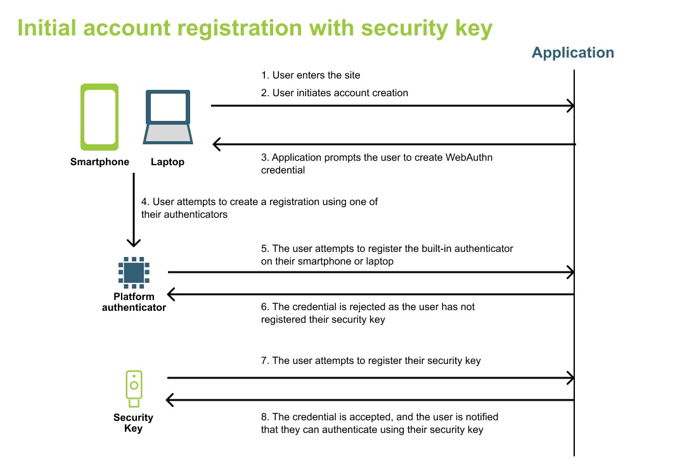
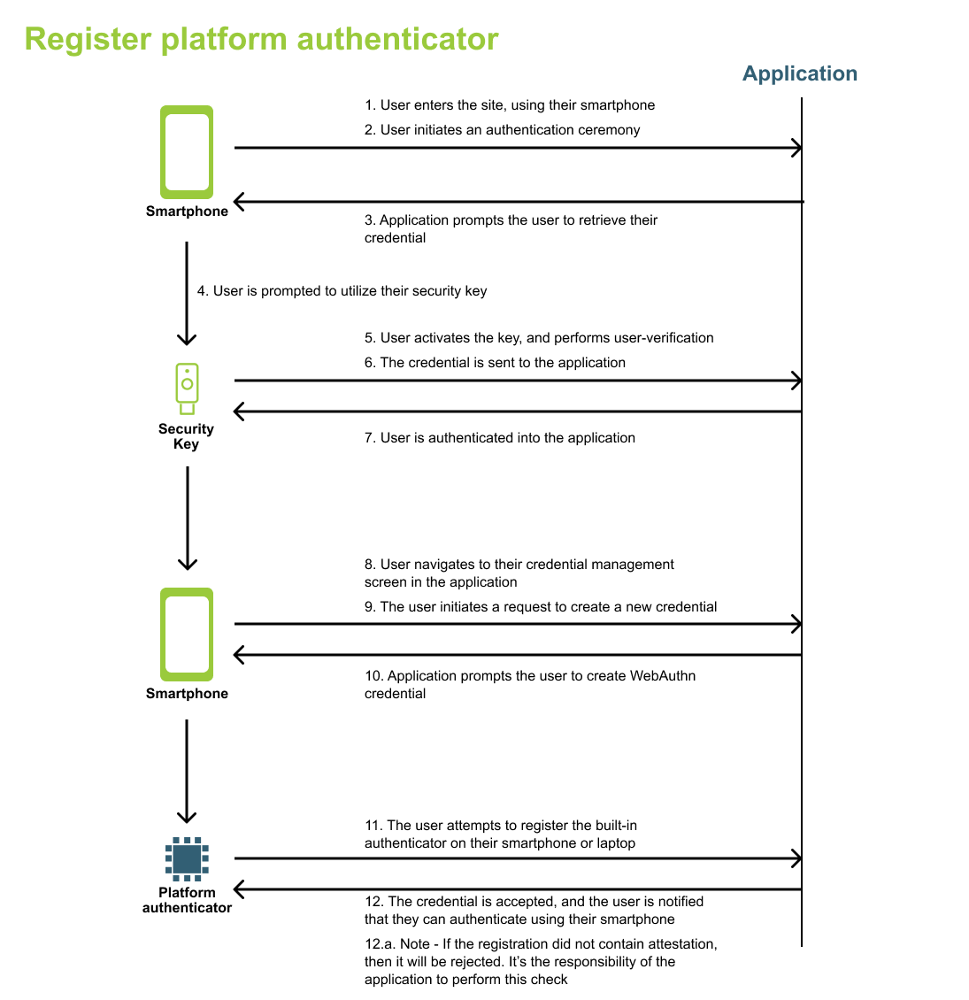
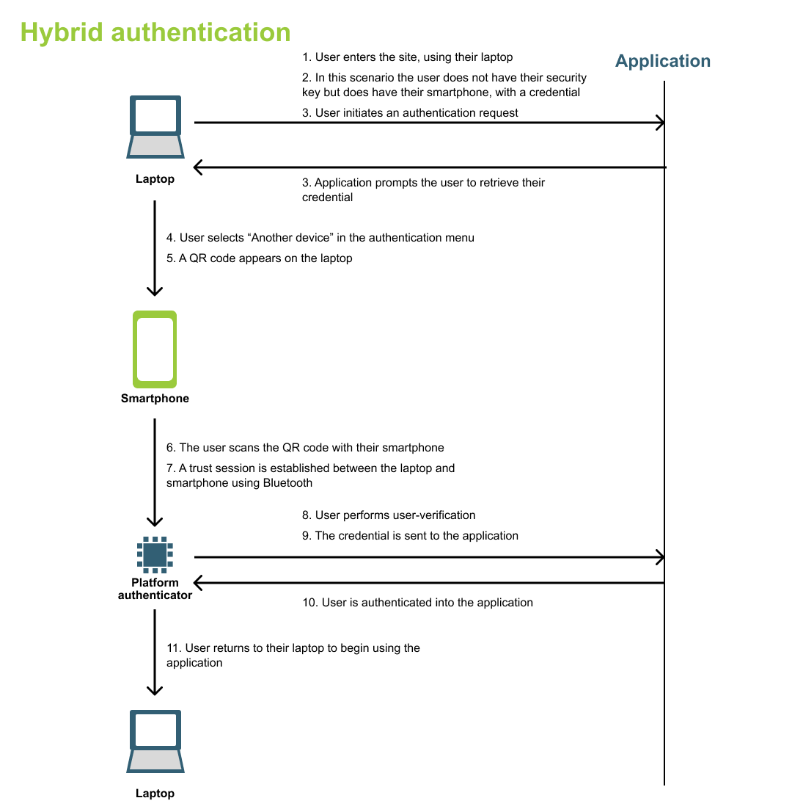

= High assurance hybrid authentication flow example
:description: Overview on a high level user flow that demonstrates how a security key and platform authenticator can work together to facilitate a high assurance flow. 
:keywords: hybrid, android, high assurance, FIDO2, CTAP, WebAuthn

Overview on a high level user flow that demonstrates how a security key and platform authenticator can work together to facilitate a high assurance flow. 

The following figure demonstrates an example flow that leverages hybrid authentication for high assurance flows. The requirements for the flow are as follows:

* All credentials are required to contain trusted attestation
* The security key must be the first credential registered 

[NOTE]
======
It should be noted that it is not a requirement to begin registration on the non-smartphone device. Your initial registration could be done on a smartphone utilizing the security key, followed immediately by the registration of the platform authenticator.
======

== Initial registration flow with security key

This first flow will demonstrate how the application will behave on the initial registration of the user account. The application will ensure that the first credential registered came from the security key, and not the platform authenticator on their device. 

== Creating a credential using a smartphone (Android)

This next flow demonstrates how a user can authenticate into their account on their smartphone, using their security key. This step is done to ensure that the user registers their second credential directly on their smartphone device.

Note, that this step is required on the smartphone, as the smartphone's credential will not contain attestation if it was created through a hybrid registration flow.

== Hybrid authentication flow

This final flow demonstrates how a hybrid authentication flow would occur between a laptop, and a smartphone that contains the user's credential.

In the next section we will outline implementation guidance needed to enable a hybrid flow.

link:/WebAuthn/Concepts/Hybrid_Flows/High_assurance_hybrid_flows/Implementation_guidance.html[Click continue for implementation guidance for high assurance hybrid WebAuthn flows]
