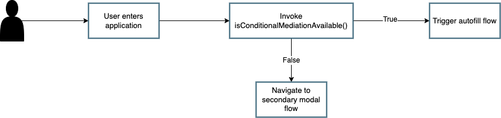

== Autofill - Conditional UI browser feature detection for passkeys

In this section we are going to cover how to determine if the browser being currently utilized by a user supports autofill / conditional UI. This is critical because if an ecosystem does not support autofill, then it may prevent a user from authenticating into your application.

=== User flow
We will start this article by going over the basic flow for how your application should handle the determination if autofill is available. 

Figure 1 demonstrates a flow an application should take once it has determined if autofill is available on the platform.

**Figure 1**

In short, if an application detects that autofill is available, then it should allow the user to attempt to discover any passkeys that exist on the device. If the feature is not available, then the user should be taken to a login flow that will allow them to leverage the modal WebAuthn experience, or to register an account if they do not have one. 

Even if autofill is available, you should always provide your user an option to leverage the modal experience. This will be important for users who are leveraging security keys, or need to utilize a non-discoverable credential flow due to limitations in their authenticator. 

=== Using the isConditionalMediationAvailable() method
As part of the WebAuthn Conditional UI explainer, a new browser method was introduced; `isConditionalMediationAvailable()`. This method will allow your application to determine if autofill is available in the browser currently being used. The method returns true if the feature is available, and false otherwise. 

In the base case, your application should be able to leverage this method simply by invoking the method.

Figure 2 demonstrates sample code that can be used to call `isConditionalMediationAvailable()`.

[role="dark"]
--
[source,javascript]
----
PublicKeyCredential.isConditionalMediationAvailable();
----
--
**Figure 2**

It’s important to note that the code above works in an ideal use case where the browser supports the method. As this is a new feature, it has not yet been widely adopted by all browsers. This means that invoking this method may result in an error as the method may not be defined for the `PublicKeyCredential` object in a specific browser. 

In order to ensure that no errors disrupt the usage of `isConditionalMediationAvailable()`, you could extend the single line in Figure 2 to invoke a check if the function exists in the `PublicKeyCredential` browser object.

Figure 3 demonstrates sample code that can be used to safely check if a browser supports the `isConditionalMediationAvailable()` method, and if the feature is available.

[role="dark"]
--
[source,javascript]
----
const mediationAvailable = () => {
  const pubKeyCred = PublicKeyCredential;
  // Check if the function exists on the browser - Not safe to assume as the page will crash if the function is not available
  //typeof check is used as browsers that do not support mediation will not have the 'isConditionalMediationAvailable' method available
  if (
    typeof pubKeyCred.isConditionalMediationAvailable === "function" &&
    pubKeyCred.isConditionalMediationAvailable()
  ) {
    console.log("Conditional Mediation is available");
    return true;
  }
  console.log("Conditional Mediation is not available");
  return false;
};
----
--
**Figure 3**

In our example above you can assume that a browser does not support autofill if it does not support the `isConditionalMediationAvailable()` method

It is our hope that the method will become standard in all browsers soon, but for the time being ensure that you check for the method's availability before you invoke the method. 

Now that you have an understanding on how to check if autofill is available, let’s explore how to create a sample autofill experience. Click the link below to learn how to implement a simple autofill UI and flow

link:/WebAuthn/Concepts/Passkey_Autofill/Implementation_Guidance/Simple_Autofill_Flow.html[Implementing a simple autofill - conditional UI flow for passkeys]