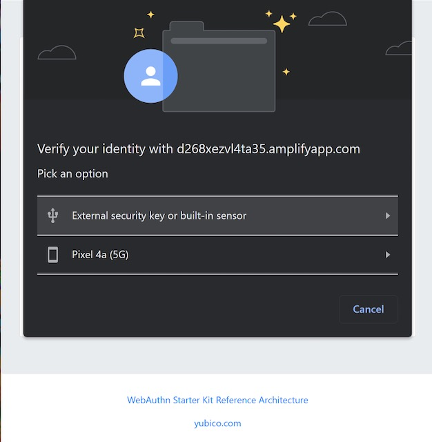

== Passkey autofill
Many of you are familiar with the traditional notion of autofill when it comes to passwords. You enter a website, and see a login form (username + password). You click into the username field, and a dropdown is presented to you with a list of accounts. You select the account and your username and password are automatically populated in the login form. 

For most consumer use cases this flow works great. Many devices/browsers have password managers built into them, and there are 3rd party password managers that can be leveraged as well. With the introduction of passkeys the need to autofill your username and password has become less relevant. 

As passkeys were being introduced at link:https://developer.apple.com/videos/play/wwdc2022/10092/[WWDC22] and link:https://www.youtube.com/watch?v=6vnQDn3AUbo[IO], a new WebAuthn feature was highlighted. This feature was referred to by a few different names:

* Conditional UI
* Conditional mediation
* Browser Autofill UI
* Passkey autofill
* Autofill

For simplicity sake for the rest of the article we will refer to this feature as `autofill`. 

This feature is meant to provide an experience for passkey credentials similar to traditional autofill to ease the user experience, and transition users to a passwordless future.

In this series we are going to explore autofill, what it is, how it fits into the context of WebAuthn, and technical implementations.

=== Traditional vs autofill passkey experiences
In the original paradigm, WebAuthn ceremonies are invoked by prompts displayed by the browser. These prompts are specific to each browser, and while they accomplish the same operation, there are variations in the messages displayed to the user. These prompts have begun to be referred to as the “modal” experience. 

Figure 1 demonstrates an example of one of these modals from Google Chrome. 

**Figure 1**

Before we dive into autofill, let’s see how the experience differs from the modal prompt experience. The videos below will provide a side by side demonstration of both the modal and autofill user experiences.

Figure 2 will represent the traditional modal experience, and Figure 3 will demonstrate the new autofill flow. 

video::./Videos/modal_1.mp4[height=600]
**Figure 2 - Modal authentication**

video::./Videos/autofill_1.mp4[height=600] 
**Figure 3 - Autofill authentication**

Now that we’ve seen an example of autofill, let’s dive into why this feature fits into the concept of passkeys.

=== The need for passkeys to have autofill  
The first question that may be going through your mind is why do passkeys need autofill when there is no password? While that is true, WebAuthn credentials introduce a new point of friction in the user experience; determining if your device has a passkey for a specific website. In the current paradigm most clients will only attempt to identify discoverable credentials if prompted by the relying party. The relying party won’t prompt the client unless the client prompts the RP to begin an authentication ceremony. The client won’t prompt the RP if the user doesn’t ask the client to begin an authentication ceremony because they are unsure if they have a credential. 

In short, the authentication ceremony to find discoverable credentials won’t happen unless prompted by the user, but a prompt may not occur if the user is unsure if they have a passkey. 

Autofill aims to close this usability gap by allowing the client to non-intrusively prompt the RP for `PublicKeyCredentialRequestOptions`. One of the primary reasons why traditional WebAuthn implementations don’t allow for this non-invasive prompt is due to the timeout of the WebAuthn ceremony. Typically a `get()` call will remain active for a short duration of time before timing out and requesting the user to trigger a new auth ceremony. Autofill has a longer timeout period, allowing a user to leisurely select their credential if one is available, without the need to reinvoke the authentication ceremony. 

=== Browsers that support autofill
Autofill is a new feature that is being rolled out by the major platform vendors as they get closer to their passkey release dates. Each vendor's release of passkey/autofill is segmented so this feature will not be available to all users at the same time. Before you attempt to enable an autofill experience for your users, please consult this material to see if it’s right for your users. 

==== Public releases
Autofill is currently available for use in Safari in iOS 16.

==== Beta releases
The macOS 13 Beta supports autofill on Safari, along with the current Google Chrome Canary builds. Note that the Chrome implementation will only work if your OS supports passkeys. 

The WebAuthn Community Adoption Group maintains this link:https://passkeydeveloper.github.io/passkeys.dev/device-support/[Device Support Matrix] where you can see what platforms currently support passkey features. 

=== Considerations
Now that we understand what autofill is, the problem it aims to solve, and where it’s available,  let’s review some considerations. Some of these items will evolve as the autofill feature begins to be adopted, but for now ensure that you understand these implications before you commit to adding autofill into your applications

==== Browser support
While most of the major browsers have committed to supporting autofill, there will be a period where not all of the platforms will support it. Ensure that developers implement mechanisms into their applications to determine if autofill is available. The primary mechanism to determine if the feature is available will be  link:/WebAuthn/Concepts/Passkey_Autofill/Implementation_Guidance/Autofill_-_Conditional_UI_Browser_Feature_Detection.html[discussed in the implementation guidance in the next section]

Applications should allow platforms that support the feature to utilize autofill. If a platform does not support the feature, then ensure that the application routes the user to a secondary login screen or flow where they are able to use the modal experience. 

The WebAuthn Community Adoption Group maintains this link:https://passkeydeveloper.github.io/passkeys.dev/device-support/[Device Support Matrix] where you can see what platforms currently support passkey features 

==== Security keys not always supported
During testing it was discovered that the autofill feature does not allow for the use of a passkey on a security key. Additional options are given to the user, but it only allows the use of the hybrid (QR) code experience.

We expect this behavior to change as adoption of autofill grows, but exercise caution if your users utilize security keys. 

It also needs to be understood that this is not purely a limitation of the browsers/clients. There are privacy implications that prevent a client from querying a security key. The lowest level of credProtect may allow for passkeys to be queried from a security key. With that said, this may still present privacy concerns, and will exclude WebAuthn implementations that use a credProtect level that requires a PIN to query passkeys. 

In order to overcome this limitation, ensure that your application still provides users with an option to use the modal experience that supports the use of security keys. 

==== Always include a modal option
This has been mentioned in the considerations above, but will be repeated as it’s important. Ensure that if your implementation uses autofill that you also allow for a secondary flow that allows the use of the modal experience. This will be necessary for users who either rely on security keys, or are not using an ecosystem that supports the feature.  

=== Implementation guidance
Now that we have an understanding of autofill, and some of the development considerations, let’s dive into implementation guidance where we will learn how to: determine if autofill is available, a simple autofill only flow, and combining autofill and modal into a single experience. Click the link below to continue to the next section to learn how to implement autofill.

link:/WebAuthn/Concepts/Passkey_Autofill/Implementation_Guidance[Autofill / Conditional UI implementation guidance]