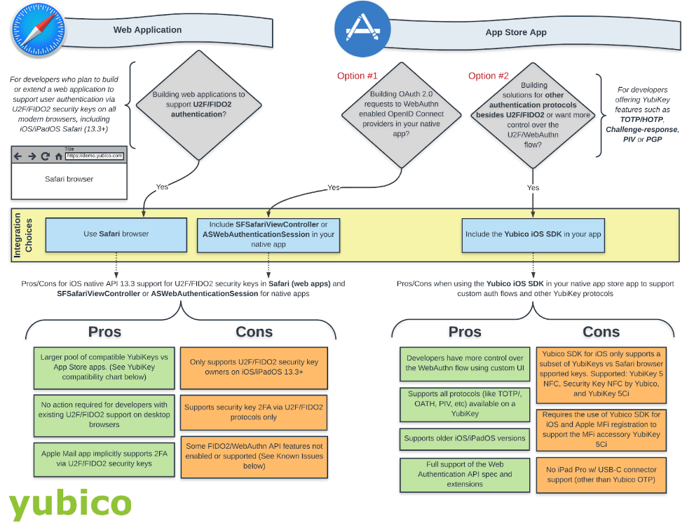

== Paths for Supporting U2F/FIDO2 Security Keys

The rest of this article offers general guidance on which path to take for supporting U2F/FIDO2 security keys in the Apple ecosystem.

=== Development Flow: Choices to be Made

Below, at the bottom of this section, is a flow diagram to help decision-making in the development effort.

==== Web Application

The Web Application route utilizes the Safari browser to register and authenticate users with U2F/FIDO2 security keys.

*Get Started*: Verify that your service allows 2FA via Safari browser and take a look at the pros and cons in the flow diagram to determine if this path works for you.

==== App Store App

The App Store App route offers two paths to follow:

*Path #1*: Using either *ASWebAuthenticationSession* or *SFSafariViewController* to provide OAuth 2.0 flow inside a native app to WebAuthn-enabled OpenID Connect providers. To get started, check out link:https://github.com/openid/AppAuth-iOS[AppAuth for iOS on Github].

*Path #2*. Use the Yubico iOS SDK to support YubiKey protocols other than U2F/FIDO2. This path is also for developers who want more control over the WebAuthn flow. To get started, check out link:https://github.com/Yubico/yubikit-ios[the Yubico SDK for iOS].

[NOTE]
======
Both paths can be combined into a single app store app and each integration choice can be used for a specific use case. For example, if your app provided multiple authentication flows, such as a WebAuthn flow to your own backend service as well as social sign-in via Facebook or Google through an OAuth 2.0 flow, you would use the Yubico iOS SDK for the first party integration of the WebAuthn flow but use the ASWebAuthenticationSession to authenticate users via Facebook and Google.
======

link:Security_Key_Compatibility.adoc[Next: Security Key Compatibility]
